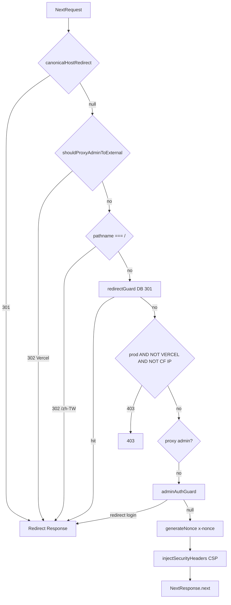
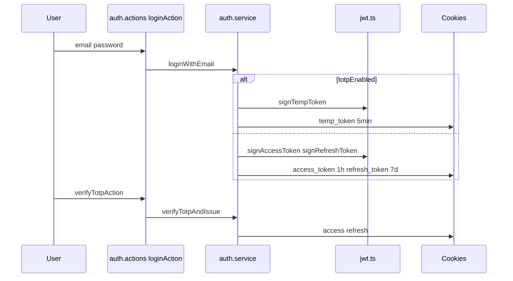
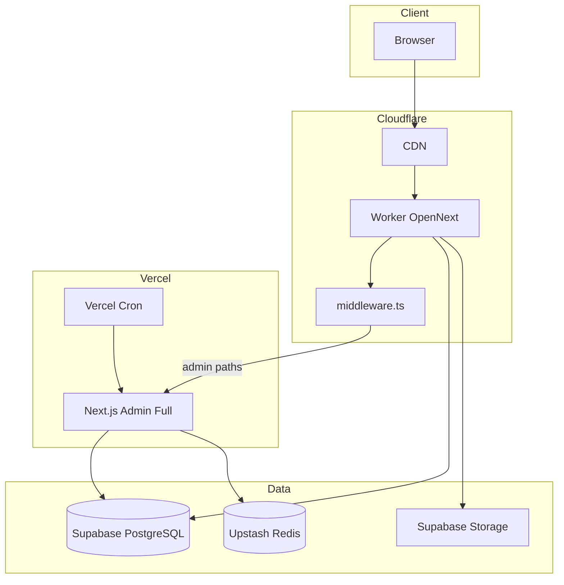

# Zenith Mind — CODEBASE AUDIT REPORT（FULL STATIC ANALYSIS）

| 產生方式 | `scripts/audit-inventory.mjs` 掃描 491 個原始檔 |
| 掃描時間 | 2026-05-19 |
| 規則 | 逐檔案、禁止摘要合併；內容來自檔案前 12KB 與 export 解析 |

---

# 第一部分：逐檔案系統分析（FILE INVENTORY）

## 1. 完整檔案樹（REAL FILE TREE）

```
.browserslistrc
.dev.vars.example
.github/
  workflows/
    ci.yml
.gitignore
.node-version
.vercel/
  README.txt
  repo.json
README.md
actions/
  __tests__/
    affiliate.actions.test.ts
    media.actions.test.ts
    newsletter.actions.test.ts
    totp-activate.actions.test.ts
  affiliate.actions.ts
  agent-queue.actions.ts
  analytics.actions.ts
  auth.actions.ts
  media.actions.ts
  newsletter.actions.ts
  post-access.actions.ts
  post.actions.ts
  post.create.actions.ts
  site.actions.ts
  totp-activate.actions.ts
  user.actions.ts
app/
  (public)/
    [locale]/
      about/
        page.tsx
      blog/
        [slug]/
          page.tsx
        page.tsx
      layout.tsx
      page.tsx
    error.tsx
    go/
      [slug]/
        __tests__/
          route.test.ts
        route.ts
  admin/
    affiliate/
      page.tsx
    analytics/
      page.tsx
    audit-log/
      page.tsx
    dashboard/
      aeo/
        page.tsx
      agents/
        page.tsx
      business/
        page.tsx
      content/
        page.tsx
      errors/
        page.tsx
      forecast/
        page.tsx
      geo/
        page.tsx
      integrations/
        page.tsx
      layout.tsx
      page.tsx
      realtime/
        page.tsx
      security/
        page.tsx
      seo/
        page.tsx
      traffic/
        page.tsx
    layout.tsx
    login/
      page.tsx
    media/
      page.tsx
    page.tsx
    posts/
      [id]/
        edit/
          page.tsx
      new/
        page.tsx
      page.tsx
    settings/
      page.tsx
      totp-setup/
        page.tsx
    site/
      page.tsx
    totp/
      page.tsx
    users/
      page.tsx
  api/
    admin/
      audit-log/
        export/
          route.ts
      env-check/
        route.ts
      integrations/
        probe/
          route.ts
        refresh-health/
          route.ts
      realtime/
        stream/
          route.ts
    ai/
      jobs/
        [id]/
          __tests__/
            route.test.ts
          route.ts
        __tests__/
          route.test.ts
        route.ts
      worker/
        route.ts
    auth/
      ping/
        route.ts
      refresh/
        __tests__/
          route.test.ts
        route.ts
    cron/
      aggregate-views/
        route.ts
      cleanup/
        __tests__/
          route.test.ts
        route.ts
      publish-scheduled/
        route.ts
    health/
      public-data/
        route.ts
    public/
      page-view/
        route.ts
    redirect/
      __tests__/
        route.test.ts
      route.ts
    revalidate/
      __tests__/
        route.test.ts
      route.ts
    search/
      route.ts
    webhook/
      __tests__/
        route.test.ts
      route.ts
  globals.css
  google0276434467af2dd0.html/
    route.ts
  layout.tsx
  robots.ts
  sitemap.ts
cloudflare/
  DASHBOARD_STEPS.txt
components/
  admin/
    AdminHeader.tsx
    AdminMainFrame.tsx
    AdminPostsNotice.tsx
    AdminSidebar.tsx
    AffiliateManager.tsx
    AiAssistant/
      AiJobTrigger.tsx
    BlurHashField.tsx
    ChangePasswordForm.tsx
    CmsAccordionSection.tsx
    Dashboard/
      IntegrationHealthPanel.tsx
      StatCard.tsx
      TrafficChart.tsx
    Editor/
      FaqEditor.tsx
      NewPostForm.tsx
      PostEditor.tsx
      RichTextEditor.tsx
      SeoPanel.tsx
    ExternalImageUrlField.tsx
    GuestReadOnlyBanner.tsx
    IntegrationStatusBadge.tsx
    LoginForm.tsx
    MediaDeleteButton.tsx
    MediaLibraryManager.tsx
    PostDeleteButton.tsx
    SiteCmsManager.tsx
    SortableList.tsx
    TotpForm.tsx
    TotpSetupForm.tsx
    UsersManager.tsx
    affiliate/
      AdminToast.tsx
      AffiliateClickSparkline.tsx
      ConfirmDeleteModal.tsx
      ToggleSwitch.tsx
    audit-log/
      AuditActionBadge.tsx
      AuditLogDetailModal.tsx
      AuditLogManager.tsx
    posts/
      AdminPostsList.tsx
      CopyPathButton.tsx
      PostStatusBadge.tsx
  analytics/
    ConsentBanner.tsx
    ConsentGatedAnalytics.tsx
    DeferredAnalytics.tsx
    Ga4Events.tsx
    HomePageViewTracker.tsx
    PageViewTracker.tsx
    SilentRefresh.tsx
  blog/
    ArticleContent.tsx
    BlockRenderer.tsx
    BlogSearchFilters.tsx
    PostArticleBody.tsx
    PostPasswordGate.tsx
    RecommendedPosts.tsx
    RecommendedPostsSection.tsx
    TableOfContents.tsx
  home/
    AdSlotBanner.tsx
    AffiliateLinksSection.tsx
    FeaturedPostsSection.tsx
    HeroLcpPreload.tsx
    HeroSection.tsx
    HeroSlider.tsx
    HomeConversionBanner.tsx
    ImageCarousel.tsx
    MonetizationSection.tsx
    ProgrammaticSeoSection.tsx
    SocialProofSection.tsx
    SocialProofViewCount.tsx
    TopicClusterSection.tsx
  layout/
    BackToTop.tsx
    Footer.tsx
    Header.tsx
    SkipToMain.tsx
    SocialSidebar.tsx
  marketing/
    NewsletterSignup.tsx
  public/
    PublicDataDegradedBanner.tsx
  seo/
    Breadcrumb.tsx
    JsonLd.tsx
    PerformanceResourceHints.tsx
  ui/
    ResponsiveImage.tsx
    tooltip.tsx
docs/
  COMMAND-CENTER-INTEGRATIONS.md
  DEPLOY-CLOUDFLARE.md
  TECHNICAL-HANDBOOK.md
domain/
  ai/
    ai.job-manager.ts
    ai.orchestrator.ts
    ai.port.ts
    ai.validator.ts
    queue.port.ts
  auth/
    auth.service.ts
    bootstrap.ts
    user.service.ts
  shared/
    core.types.ts
env.ts
eslint.config.mjs
features/
  aeo-intelligence/
    components/
      aeo-page-view.tsx
  agent-center/
    components/
      agents-page-view.tsx
  ai-insights/
    services/
      collectors.ts
      gemini-generator.ts
      pipeline.ts
      signal-detectors.ts
  business-analytics/
    components/
      business-page-view.tsx
  content-intelligence/
    components/
      content-page-view.tsx
  error-intelligence/
    components/
      errors-page-view.tsx
  forecast-center/
    components/
      forecast-page-view.tsx
      forecast-trajectory-chart.tsx
  geo-intelligence/
    components/
      geo-page-view.tsx
  integrations-hub/
    actions/
      integration-actions.ts
    components/
      integrations-hub-view.tsx
  realtime-monitoring/
    components/
      realtime-page-view.tsx
  security-center/
    components/
      security-page-view.tsx
  seo-intelligence/
    components/
      seo-page-view.tsx
  traffic-intelligence/
    components/
      traffic-page-view.tsx
  war-room/
    components/
      war-room-view.tsx
hooks/
  use-debounced-value.ts
  use-realtime-stream.ts
infrastructure/
  ai/
    openai.adapter.ts
  db/
    adapters/
      audit.prisma-adapter.ts
    prisma.ts
  ga4/
    dashboard-bundle.ts
    reporting.client.ts
    top-pages.ts
  health/
    probes.ts
  http/
    fetch.client.ts
  redis/
    ai-queue.redis-adapter.ts
    client.ts
    token-blacklist.ts
    webhook-nonce.ts
  storage/
    supabase-storage.ts
jest.config.ts
jest.setup.ts
lib/
  admin/
    __tests__/
      format-api-error.test.ts
      ga4-env-check.test.ts
      integration-health.test.ts
    agent-queue-labels.ts
    audit-log-params.ts
    dashboard-data.ts
    format-api-error.ts
    ga4-env-check.ts
    integration-groups.ts
    integration-health.ts
    integration-health.types.ts
    load-audit-logs.ts
    load-posts-list.ts
    media-library.ts
    posts-list-params.ts
    war-room-data-alerts.ts
  aeo/
    post-faq-stats.ts
  affiliate/
    __tests__/
      click-stats.test.ts
    click-stats.ts
    load-affiliate-admin.ts
    platform-tags.ts
    record-click.ts
  alert/
    resolve-alert-email.ts
  analytics/
    consent.ts
    ga4-events.ts
    homepage-view-event.ts
    post-view-totals.ts
    record-page-view-client.ts
    record-page-view-core.ts
  audit/
    field-changes.ts
  auth/
    __tests__/
      jwt.test.ts
      permissions.test.ts
    admin-session.ts
    client-session.ts
    constants.ts
    jwt.ts
    password.ts
    permissions.ts
    resolve-admin-action.ts
    totp.ts
  blog/
    blog-list-types.ts
    blog-post-types.ts
    load-blog-list-data-prisma.ts
    load-blog-list-data.ts
    load-blog-post-data-prisma.ts
    load-blog-post-data.ts
    post-access-cookie.ts
    public-blog-neon.ts
    public-blog-post-supabase.ts
    public-blog-supabase.ts
  build/
    runtime-env.ts
  categories/
    defaults.ts
    topic-icons.ts
  content-blocks/
    schema.ts
  db/
    cf-public-runtime.ts
    neon-http.ts
    prisma-cf-edge.ts
    prisma-errors.ts
    public-data-health.ts
    safe-query.ts
    supabase-rest-tables.ts
    supabase-rest.ts
  deploy/
    admin-origin.ts
  dto/
    post-public.dto.ts
  forecast/
    forecast-model.ts
  geoip/
    country-for-ip.ts
  google/
    __tests__/
      integration-status.test.ts
    gsc-site-url.ts
    integration-status.ts
  homepage/
    load-homepage-data.ts
  i18n/
    api-locale-contract.ts
    request.ts
    routing.ts
  images/
    delivery.ts
    hero-presets.ts
    next-image-host.ts
    supabase-render.ts
  integrations/
    crypto.ts
    providers.ts
  logger/
    index.ts
  markdown/
    images.ts
  middleware/
    __tests__/
      auth-guard.test.ts
      canonical-host-redirect.test.ts
    apply-baseline-security-headers.ts
    auth-guard.ts
    canonical-host-redirect.ts
    ip-guard.ts
    redirect-guard.ts
    security-headers.ts
  redirects/
    __tests__/
      cycle.test.ts
      matcher.test.ts
      normalize.test.ts
      paths.test.ts
    cycle.ts
    edge-lookup.ts
    log.ts
    matcher.ts
    normalize.ts
    paths.ts
    queries.ts
    redirect-write-guard.ts
    redis-cache.ts
    resolve.ts
    shared.ts
  request/
    client-ip.ts
    request-meta.ts
  revalidate/
    purge-public-site.ts
  sanitize/
    html.ts
  security/
    __tests__/
      allowed-media-url.test.ts
      revalidate-target.test.ts
    allowed-media-url.ts
    revalidate-target.ts
  seo/
    crawler.ts
    json-ld.ts
    schema-coverage.ts
    schemas/
      article.schema.ts
  site/
    ad-slots-prisma.ts
    ad-slots.ts
    brand.ts
    default-quick-links.ts
    external-link.ts
    hero-carousel-queries-prisma.ts
    hero-carousel-queries.ts
    homepage-data-cache.ts
    prisma-compat.ts
    public-site-supabase.ts
    queries.ts
    safe-site-settings.ts
    site-settings-cache.ts
    types.ts
    url.ts
  sitemap/
    load-sitemap-posts.ts
  validation/
    __tests__/
      blurhash.test.ts
      external-image-url.test.ts
    blurhash.ts
    external-image-url.ts
messages/
  en.json
  zh-TW.json
middleware.ts
next-env.d.ts
next.config.ts
open-next.config.ts
package-lock.json
package.json
playwright.config.ts
postcss.config.mjs
prisma/
  migrations/
    20260214103000_post_cover_blocks_ad_slots/
      migration.sql
    20260215140000_hero_image_href_carousel_timing/
      migration.sql
    20260515120000_page_view_daily_rollup/
      migration.sql
    20260516120000_integration_credentials/
      migration.sql
    20260518150000_guest_role_post_password/
      migration.sql
    20260520130000_seo_focus_keyword_en/
      migration.sql
    20260520140000_affiliate_click_daily/
      migration.sql
    migration_lock.toml
  schema.prisma
public/
  _headers
  google0276434467af2dd0.html
scripts/
  GA4-授權服務帳號-備用方案.txt
  backfill-page-view-aggregates.mjs
  backfill-site-views-rest.mjs
  cf-public-build.mjs
  check-db-state.mjs
  check-deployment-readiness.mjs
  check-env-keys.mjs
  check-integrations.mjs
  check-migration-state.mjs
  check-three-env-integrations.mjs
  compute-site-view-total.mjs
  diagnose-supabase-keys.mjs
  ensure-admin.mjs
  ga4-diagnose.mjs
  ga4-grant-playground-curl.ps1
  ga4-oauth-grant.mjs
  generate-cc-views.mjs
  generate-command-center.mjs
  generate-vercel-env.mjs
  git-untrack-local-only.mjs
  import-ga4-key-from-json.mjs
  import-initial-posts.mjs
  merge-local-env.mjs
  prisma-with-env.mjs
  prisma-with-local-env.mjs
  probe-supabase-views.mjs
  prod-fix-ad-slots.sql
  push-wrangler-secrets.mjs
  scan-secrets.mjs
  seed-cms-defaults.mjs
  sync-default-categories.mjs
  sync-ga4-env.mjs
  test-admin-env-check.ps1
  test-blog-post-detail.mjs
  test-blog-supabase.mjs
  test-dashboard-ga4.mjs
  test-geo-aeo-payloads.mjs
  test-homepage-tables.mjs
  test-search-console.mjs
  verify-homepage-page-views.mjs
  warm-redirect-cache.mjs
  write-dev-vars.mjs
server/
  command-center/
    cached-data.ts
    load-aeo.ts
    load-agents.ts
    load-business.ts
    load-content.ts
    load-errors.ts
    load-forecast.ts
    load-geo.ts
    load-integrations.ts
    load-realtime.ts
    load-security.ts
    load-seo.ts
    load-traffic.ts
    load-war-room.ts
  realtime/
    event-hub.ts
services/
  google/
    ads.ts
    auth.ts
    bigquery.ts
    search-console.ts
  integrations/
    probe-provider.ts
    repository.ts
    runtime-env.ts
shared/
  config/
    admin-sidebar-nav.ts
    command-center-nav.ts
  lib/
    cn.ts
    list-key.ts
  providers/
    command-center-provider.tsx
  ui/
    async-state.tsx
    badge.tsx
    button.tsx
    demo-banner.tsx
    glass-card.tsx
    skeleton.tsx
start-dev.bat
stores/
  command-ui-store.ts
supabase/
  migrations/
    20260515120000_page_view_daily_rollup.sql
    20260515130000_fix_postgrest_grants_and_reload.sql
    20260518150000_post_password_protection.sql
    20260519150000_fix_view_totals_columns.sql
    20260519160000_fix_site_daily_aggregate_rpc_id.sql
test-utils/
  env-mock.ts
  next-mocks.ts
  prisma-mock.ts
tests/
  a11y/
    public.spec.ts
tsconfig.json
types/
  command-center/
    insights.ts
    metrics.ts
    module-payloads.ts
    realtime.ts
vercel.json
widgets/
  chart-panel/
    glow-area-chart.tsx
  command-center/
    cc-ai-insight-block.tsx
    cc-connection-status.tsx
    cc-donut-chart.tsx
    cc-health-badge.tsx
    cc-health.ts
    cc-integration-donut.tsx
    cc-progress-bar.tsx
    cc-radar-chart.tsx
    cc-skeleton.tsx
    cc-warning-alert.tsx
  command-shell/
    grid-background.tsx
    module-header.tsx
    module-shell.tsx
    war-room-hero.tsx
  insight-feed/
    insight-panel.tsx
  kpi-grid/
    kpi-metric-card.tsx
    sparkline-mini.tsx
  terminal-stream/
    terminal-panel.tsx
wrangler.toml
```

## 2. 每個檔案逐一說明

### `.browserslistrc`

功能說明：[binary or non-text asset]
核心邏輯：（無 named export 或為 default-only 模組）
依賴關係：（無 import 或僅 side-effect）
輸入：模組呼叫參數
輸出：模組回傳值
是否關鍵模組（Y/N）：N
### `.dev.vars.example`

功能說明：[binary or non-text asset]
核心邏輯：（無 named export 或為 default-only 模組）
依賴關係：（無 import 或僅 side-effect）
輸入：模組呼叫參數
輸出：模組回傳值
是否關鍵模組（Y/N）：N
### `.github/workflows/ci.yml`

功能說明：[binary or non-text asset]
核心邏輯：（無 named export 或為 default-only 模組）
依賴關係：（無 import 或僅 side-effect）
輸入：模組呼叫參數
輸出：模組回傳值
是否關鍵模組（Y/N）：N
### `.gitignore`

功能說明：[binary or non-text asset]
核心邏輯：（無 named export 或為 default-only 模組）
依賴關係：（無 import 或僅 side-effect）
輸入：模組呼叫參數
輸出：模組回傳值
是否關鍵模組（Y/N）：N
### `.node-version`

功能說明：[binary or non-text asset]
核心邏輯：（無 named export 或為 default-only 模組）
依賴關係：（無 import 或僅 side-effect）
輸入：模組呼叫參數
輸出：模組回傳值
是否關鍵模組（Y/N）：N
### `.vercel/README.txt`

功能說明：> Why do I have a folder named ".vercel" in my project? The ".vercel" folder is created when you link a directory to a Vercel project. > What does the "project.json" file contain?
核心邏輯：（無 named export 或為 default-only 模組）
依賴關係：（無 import 或僅 side-effect）
輸入：模組呼叫參數
輸出：模組回傳值
是否關鍵模組（Y/N）：N
### `.vercel/repo.json`

功能說明：{ "remoteName": "origin", "projects": [ { "id": "prj_mDAxunRQIL56V34vRNIroDoiPAoz", "name": "zenith-mind", "directory": ".", "orgId": "team_N0Io6wiV
核心邏輯：（無 named export 或為 default-only 模組）
依賴關係：（無 import 或僅 side-effect）
輸入：模組呼叫參數
輸出：模組回傳值
是否關鍵模組（Y/N）：N
### `actions/__tests__/affiliate.actions.test.ts`

功能說明：import { createCookieJar, createHeaders } from "@/test-utils/next-mocks"; import { prismaMock, resetPrismaMock } from "@/test-utils/prisma-mock"; jest.mock("next/headers", () => ({ cookies: jest.fn(), headers: jest.fn(),
核心邏輯：（無 named export 或為 default-only 模組）
依賴關係：@/test-utils/next-mocks, @/test-utils/prisma-mock, next/headers, @/lib/auth/jwt, ../affiliate.actions
輸入：Server Action FormData/unknown input
輸出：ActionResult<T>
是否關鍵模組（Y/N）：N
### `actions/__tests__/media.actions.test.ts`

功能說明：import { createCookieJar, createHeaders } from "@/test-utils/next-mocks"; import { prismaMock, resetPrismaMock } from "@/test-utils/prisma-mock"; jest.mock("next/headers", () => ({ cookies: jest.fn(), headers: jest.fn(),
核心邏輯：（無 named export 或為 default-only 模組）
依賴關係：@/test-utils/next-mocks, @/test-utils/prisma-mock, next/headers, @/lib/auth/jwt, @/infrastructure/storage/supabase-storage, ../media.actions
輸入：Server Action FormData/unknown input
輸出：ActionResult<T>
是否關鍵模組（Y/N）：N
### `actions/__tests__/newsletter.actions.test.ts`

功能說明：import { prismaMock, resetPrismaMock } from "@/test-utils/prisma-mock"; jest.mock("@/infrastructure/db/prisma", () => ({ prisma: require("@/test-utils/prisma-mock").prismaMock, })); import { subscribeNewsletterAction } f
核心邏輯：（無 named export 或為 default-only 模組）
依賴關係：@/test-utils/prisma-mock, ../newsletter.actions
輸入：Server Action FormData/unknown input
輸出：ActionResult<T>
是否關鍵模組（Y/N）：N
### `actions/__tests__/totp-activate.actions.test.ts`

功能說明：import { createCookieJar, createHeaders } from "@/test-utils/next-mocks"; import { prismaMock, resetPrismaMock } from "@/test-utils/prisma-mock"; jest.mock("next/headers", () => ({ cookies: jest.fn(), headers: jest.fn(),
核心邏輯：（無 named export 或為 default-only 模組）
依賴關係：@/test-utils/next-mocks, @/test-utils/prisma-mock, next/headers, @/lib/auth/jwt, @/lib/auth/totp, ../totp-activate.actions
輸入：Server Action FormData/unknown input
輸出：ActionResult<T>
是否關鍵模組（Y/N）：N
### `actions/affiliate.actions.ts`

功能說明：// actions/affiliate.actions.ts — Node Runtime // 聯盟連結 CRUD Server Actions "use server"; import { z } from "zod"; import { revalidatePath, revalidateTag } from "next/cache"; import { prisma } from "@/infrastructure/db/pr
核心邏輯：exports: createAffiliateLinkAction, updateAffiliateLinkAction, toggleAffiliateLinkActiveAction, deleteAffiliateLinkAction
依賴關係：zod, next/cache, @/infrastructure/db/prisma, @/lib/auth/resolve-admin-action, @/lib/request/request-meta, @/lib/sanitize/html, @/infrastructure/db/adapters/audit.prisma-adapter, @/domain/shared/core.types
輸入：Server Action FormData/unknown input
輸出：ActionResult<T>
是否關鍵模組（Y/N）：Y
### `actions/agent-queue.actions.ts`

功能說明："use server"; import { revalidatePath } from "next/cache"; import { prisma } from "@/infrastructure/db/prisma"; import { gateAdminWrite } from "@/lib/auth/resolve-admin-action"; import { Errors, type ActionResult } from 
核心邏輯：exports: cancelAgentJobAction, prioritizeAgentJobAction, clearPendingAgentQueueAction, recoverStuckAgentJobsAction
依賴關係：next/cache, @/infrastructure/db/prisma, @/lib/auth/resolve-admin-action, @/domain/shared/core.types, @/server/realtime/event-hub
輸入：Server Action FormData/unknown input
輸出：ActionResult<T>
是否關鍵模組（Y/N）：Y
### `actions/analytics.actions.ts`

功能說明：// actions/analytics.actions.ts — Node Runtime // PageView 記錄 Server Action "use server"; import { headers } from "next/headers"; import { recordPageViewCore } from "@/lib/analytics/record-page-view-core"; import type { 
核心邏輯：exports: recordPageViewAction
依賴關係：next/headers, @/lib/analytics/record-page-view-core, @/domain/shared/core.types
輸入：Server Action FormData/unknown input
輸出：ActionResult<T>
是否關鍵模組（Y/N）：Y
### `actions/auth.actions.ts`

功能說明：// actions/auth.actions.ts — Node Runtime // Server Actions：登入、TOTP、Refresh、登出 // 執行順序：Zod → 清洗（純文字，Zod 已防型別攻擊）→ AuditLog → Business Logic "use server"; import { z } from "zod"; import { cookies } from "next/headers"; im
核心邏輯：exports: loginAction, verifyTotpAction, refreshAction, logoutAction
依賴關係：zod, next/headers, @/lib/request/request-meta, @/domain/shared/core.types, @/domain/auth/auth.service, @/infrastructure/db/adapters/audit.prisma-adapter, @/lib/auth/constants
輸入：Server Action FormData/unknown input
輸出：ActionResult<T>
是否關鍵模組（Y/N）：Y
### `actions/media.actions.ts`

功能說明："use server"; import { revalidatePath } from "next/cache"; import { z } from "zod"; import { getRequestMeta } from "@/lib/request/request-meta"; import { prisma } from "@/infrastructure/db/prisma"; import { writeAuditLog
核心邏輯：exports: deleteMediaItemAction
依賴關係：next/cache, zod, @/lib/request/request-meta, @/infrastructure/db/prisma, @/infrastructure/db/adapters/audit.prisma-adapter, @/infrastructure/storage/supabase-storage, @/lib/auth/resolve-admin-action, @/domain/shared/core.types
輸入：Server Action FormData/unknown input
輸出：ActionResult<T>
是否關鍵模組（Y/N）：Y
### `actions/newsletter.actions.ts`

功能說明："use server"; import { z } from "zod"; import { prisma } from "@/infrastructure/db/prisma"; import type { ActionResult } from "@/domain/shared/core.types"; import { Errors } from "@/domain/shared/core.types"; const subsc
核心邏輯：exports: subscribeNewsletterAction
依賴關係：zod, @/infrastructure/db/prisma, @/domain/shared/core.types
輸入：Server Action FormData/unknown input
輸出：ActionResult<T>
是否關鍵模組（Y/N）：Y
### `actions/post.actions.ts`

功能說明：// actions/post.actions.ts — Node Runtime // 文章 CRUD Server Actions // 執行順序：Zod → 清洗 → AuditLog（非同步）→ Business Logic "use server"; import { z } from "zod"; import { revalidatePath, revalidateTag } from "next/cache"; impo
核心邏輯：exports: updatePostAction, updateSeoAction
依賴關係：zod, next/cache, @/lib/revalidate/purge-public-site, @/infrastructure/db/prisma, @/lib/auth/password, @/lib/auth/resolve-admin-action, @/lib/sanitize/html, @/lib/security/allowed-media-url, @/lib/validation/blurhash, @/lib/markdown/images
輸入：Server Action FormData/unknown input
輸出：ActionResult<T>
是否關鍵模組（Y/N）：Y
### `actions/post.create.actions.ts`

功能說明：// actions/post.create.actions.ts — Node Runtime // 新增文章 Server Action（獨立檔案，避免 post.actions.ts 過長） "use server"; import { z } from "zod"; import { prisma } from "@/infrastructure/db/prisma"; import { getRequestMeta } fro
核心邏輯：exports: createPostAction
依賴關係：zod, @/infrastructure/db/prisma, @/lib/request/request-meta, @/lib/auth/resolve-admin-action, @/lib/sanitize/html, @/infrastructure/db/adapters/audit.prisma-adapter, next/cache, @/lib/revalidate/purge-public-site, @/domain/shared/core.types
輸入：Server Action FormData/unknown input
輸出：ActionResult<T>
是否關鍵模組（Y/N）：Y
### `actions/post-access.actions.ts`

功能說明："use server"; import { z } from "zod"; import { cookies } from "next/headers"; import { prisma } from "@/infrastructure/db/prisma"; import { verifyPassword } from "@/lib/auth/password"; import { hasPostAccess, postUnlock
核心邏輯：exports: verifyPostPasswordAction, checkPostAccessAction
依賴關係：zod, next/headers, @/infrastructure/db/prisma, @/lib/auth/password, @/lib/blog/post-access-cookie, @/domain/shared/core.types
輸入：Server Action FormData/unknown input
輸出：ActionResult<T>
是否關鍵模組（Y/N）：Y
### `actions/site.actions.ts`

功能說明："use server"; import { revalidatePath, revalidateTag } from "next/cache"; import { z } from "zod"; import { getRequestMeta } from "@/lib/request/request-meta"; import { Prisma } from "@prisma/client"; import { prisma } f
核心邏輯：exports: uploadSiteAssetAction
依賴關係：next/cache, zod, @/lib/request/request-meta, @prisma/client, @/infrastructure/db/prisma, @/infrastructure/db/adapters/audit.prisma-adapter, @/infrastructure/storage/supabase-storage, @/lib/auth/resolve-admin-action, @/lib/validation/external-image-url, @/lib/sanitize/html
輸入：Server Action FormData/unknown input
輸出：ActionResult<T>
是否關鍵模組（Y/N）：Y
### `actions/totp-activate.actions.ts`

功能說明：// actions/totp-activate.actions.ts — Node Runtime // TOTP 啟用 Action（驗證後才寫入 DB） "use server"; import { z } from "zod"; import { prisma } from "@/infrastructure/db/prisma"; import { getRequestMeta } from "@/lib/request/re
核心邏輯：exports: activateTotpAction
依賴關係：zod, @/infrastructure/db/prisma, @/lib/request/request-meta, @/lib/auth/totp, @/lib/auth/resolve-admin-action, @/infrastructure/db/adapters/audit.prisma-adapter, @/domain/shared/core.types
輸入：Server Action FormData/unknown input
輸出：ActionResult<T>
是否關鍵模組（Y/N）：Y
### `actions/user.actions.ts`

功能說明："use server"; import { z } from "zod"; import { getRequestMeta } from "@/lib/request/request-meta"; import type { ActionResult } from "@/domain/shared/core.types"; import { Errors } from "@/domain/shared/core.types"; imp
核心邏輯：exports: listUsersAction, createUserAction, changePasswordAction, deleteUserAction
依賴關係：zod, @/lib/request/request-meta, @/domain/shared/core.types, @/domain/auth/user.service, @/lib/auth/resolve-admin-action, @/infrastructure/db/adapters/audit.prisma-adapter
輸入：Server Action FormData/unknown input
輸出：ActionResult<T>
是否關鍵模組（Y/N）：Y
### `app/(public)/[locale]/about/page.tsx`

功能說明：// app/(public)/[locale]/about/page.tsx — 關於頁 // Cache 模式 A：revalidate=86400（每天更新） import type { Metadata } from "next"; import { env } from "@/env"; import { getSafeSiteSettings } from "@/lib/site/safe-site-settings"; e
核心邏輯：exports: revalidate, generateMetadata
依賴關係：next, @/env, @/lib/site/safe-site-settings
輸入：Next.js params/searchParams
輸出：RSC React tree
是否關鍵模組（Y/N）：N
### `app/(public)/[locale]/blog/[slug]/page.tsx`

功能說明：// app/(public)/[locale]/blog/[slug]/page.tsx — 文章詳頁 // Cache 模式 A：revalidate=3600 // CF Worker：Supabase REST（見 lib/blog/load-blog-post-data.ts） import type { Metadata } from "next"; import { notFound } from "next/naviga
核心邏輯：exports: revalidate, generateStaticParams, generateMetadata
依賴關係：next, next/navigation, @/lib/redirects/resolve, next-intl/server, next/headers, next/link, @/components/ui/ResponsiveImage, lucide-react, @/env, @/lib/blog/load-blog-post-data
輸入：Next.js params/searchParams
輸出：RSC React tree
是否關鍵模組（Y/N）：N
### `app/(public)/[locale]/blog/page.tsx`

功能說明：// app/(public)/[locale]/blog/page.tsx — 文章列表 // Cache 模式 A：revalidate=3600 // CF Worker：Supabase REST（見 lib/blog/load-blog-list-data.ts） import type { Metadata } from "next"; import { headers } from "next/headers"; impo
核心邏輯：exports: revalidate, generateMetadata
依賴關係：next, next/headers, next-intl/server, next/link, @/components/ui/ResponsiveImage, lucide-react, @/env, @/lib/blog/load-blog-list-data, @/components/blog/BlogSearchFilters, @/components/public/PublicDataDegradedBanner
輸入：Next.js params/searchParams
輸出：RSC React tree
是否關鍵模組（Y/N）：N
### `app/(public)/[locale]/layout.tsx`

功能說明：// app/(public)/[locale]/layout.tsx — Server Component（禁止 'use client'） // Public locale layout：注入 nonce、GA4、i18n Provider、WCAG 基礎結構 import { NextIntlClientProvider } from "next-intl"; import { getMessages } from "next-i
核心邏輯：exports: revalidate
依賴關係：next-intl, next-intl/server, next/headers, next/navigation, @/components/analytics/ConsentGatedAnalytics, @/components/seo/PerformanceResourceHints, @/lib/i18n/routing, @/env, @/components/analytics/ConsentBanner, @/components/layout/SkipToMain
輸入：模組呼叫參數
輸出：模組回傳值
是否關鍵模組（Y/N）：N
### `app/(public)/[locale]/page.tsx`

功能說明：// app/(public)/[locale]/page.tsx — 首頁 // Cache 模式 A：revalidate=3600（Segment Config） // ✓ generateMetadata + Organization JSON-LD // ✓ 禁止 'use client'、禁止 Prisma 直接操作 import type { Metadata } from "next"; import { headers
核心邏輯：exports: revalidate, generateMetadata
依賴關係：next, next/headers, @/env, @/components/seo/JsonLd, @/lib/seo/schemas/article.schema, @/components/home/HeroSection, @/components/home/HeroSlider, @/components/home/HeroLcpPreload, @/components/home/ImageCarousel, @/components/home/SocialProofSection
輸入：Next.js params/searchParams
輸出：RSC React tree
是否關鍵模組（Y/N）：N
### `app/(public)/error.tsx`

功能說明："use client"; import { useEffect } from "react"; export default function PublicError({ error, reset, }: { error: Error & { digest?: string }; reset: () => void; }) { useEffect(() => { console.error("[public] segment erro
核心邏輯：exports: PublicError
依賴關係：react
輸入：模組呼叫參數
輸出：模組回傳值
是否關鍵模組（Y/N）：N
### `app/(public)/go/[slug]/__tests__/route.test.ts`

功能說明：import { prismaMock, resetPrismaMock } from "@/test-utils/prisma-mock"; jest.mock("@/infrastructure/db/prisma", () => ({ prisma: require("@/test-utils/prisma-mock").prismaMock, })); jest.mock("@/lib/affiliate/record-clic
核心邏輯：（無 named export 或為 default-only 模組）
依賴關係：@/test-utils/prisma-mock, @/lib/affiliate/record-click, ../route
輸入：模組呼叫參數
輸出：模組回傳值
是否關鍵模組（Y/N）：N
### `app/(public)/go/[slug]/route.ts`

功能說明：// app/(public)/go/[slug]/route.ts — Node Runtime // 聯盟連結轉址（301 永久轉址 + 點擊計數非同步） import { NextRequest, NextResponse } from "next/server"; import { prisma } from "@/infrastructure/db/prisma"; import { recordAffiliateClick 
核心邏輯：exports: dynamic, GET
依賴關係：next/server, @/infrastructure/db/prisma, @/lib/affiliate/record-click
輸入：模組呼叫參數
輸出：模組回傳值
是否關鍵模組（Y/N）：N
### `app/admin/affiliate/page.tsx`

功能說明：// app/admin/affiliate/page.tsx — 聯盟連結管理 // Cache 模式 B：force-dynamic import type { Metadata } from "next"; import AffiliateManager from "@/components/admin/AffiliateManager"; import { loadAffiliateLinksForAdmin } from "@
核心邏輯：exports: metadata, dynamic
依賴關係：next, @/components/admin/AffiliateManager, @/lib/affiliate/load-affiliate-admin
輸入：Next.js params/searchParams
輸出：RSC React tree
是否關鍵模組（Y/N）：N
### `app/admin/analytics/page.tsx`

功能說明：import { redirect } from "next/navigation"; export const dynamic = "force-dynamic"; export default async function AnalyticsPage() { redirect("/admin/dashboard"); } 
核心邏輯：exports: dynamic
依賴關係：next/navigation
輸入：Next.js params/searchParams
輸出：RSC React tree
是否關鍵模組（Y/N）：N
### `app/admin/audit-log/page.tsx`

功能說明：// app/admin/audit-log/page.tsx — 操作紀錄查閱 // Cache 模式 B：force-dynamic（即時數據） import type { Metadata } from "next"; import AuditLogManager from "@/components/admin/audit-log/AuditLogManager"; import { loadAuditLogOperators,
核心邏輯：exports: metadata, dynamic
依賴關係：next, @/components/admin/audit-log/AuditLogManager, @/lib/admin/load-audit-logs, @/lib/admin/audit-log-params
輸入：Next.js params/searchParams
輸出：RSC React tree
是否關鍵模組（Y/N）：N
### `app/admin/dashboard/aeo/page.tsx`

功能說明：import { loadAeoPayload } from "@/server/command-center/load-aeo"; import { AeoPageView } from "@/features/aeo-intelligence/components/aeo-page-view"; export const revalidate = 60; export default async function Page() { 
核心邏輯：exports: revalidate
依賴關係：@/server/command-center/load-aeo, @/features/aeo-intelligence/components/aeo-page-view
輸入：Next.js params/searchParams
輸出：RSC React tree
是否關鍵模組（Y/N）：N
### `app/admin/dashboard/agents/page.tsx`

功能說明：import { loadAgentPayload } from "@/server/command-center/load-agents"; import { AgentsPageView } from "@/features/agent-center/components/agents-page-view"; export const dynamic = "force-dynamic"; export default async f
核心邏輯：exports: dynamic
依賴關係：@/server/command-center/load-agents, @/features/agent-center/components/agents-page-view
輸入：Next.js params/searchParams
輸出：RSC React tree
是否關鍵模組（Y/N）：N
### `app/admin/dashboard/business/page.tsx`

功能說明：import { loadBusinessPayload } from "@/server/command-center/load-business"; import { BusinessPageView } from "@/features/business-analytics/components/business-page-view"; export const revalidate = 60; export default as
核心邏輯：exports: revalidate
依賴關係：@/server/command-center/load-business, @/features/business-analytics/components/business-page-view
輸入：Next.js params/searchParams
輸出：RSC React tree
是否關鍵模組（Y/N）：N
### `app/admin/dashboard/content/page.tsx`

功能說明：import { loadContentPayload } from "@/server/command-center/load-content"; import { ContentPageView } from "@/features/content-intelligence/components/content-page-view"; export const revalidate = 60; export default asyn
核心邏輯：exports: revalidate
依賴關係：@/server/command-center/load-content, @/features/content-intelligence/components/content-page-view
輸入：Next.js params/searchParams
輸出：RSC React tree
是否關鍵模組（Y/N）：N
### `app/admin/dashboard/errors/page.tsx`

功能說明：import { loadErrorsPayload } from "@/server/command-center/load-errors"; import { ErrorsPageView } from "@/features/error-intelligence/components/errors-page-view"; export const revalidate = 60; export default async func
核心邏輯：exports: revalidate
依賴關係：@/server/command-center/load-errors, @/features/error-intelligence/components/errors-page-view
輸入：Next.js params/searchParams
輸出：RSC React tree
是否關鍵模組（Y/N）：N
### `app/admin/dashboard/forecast/page.tsx`

功能說明：import { loadForecastPayload } from "@/server/command-center/load-forecast"; import { ForecastPageView } from "@/features/forecast-center/components/forecast-page-view"; export const revalidate = 60; export default async
核心邏輯：exports: revalidate
依賴關係：@/server/command-center/load-forecast, @/features/forecast-center/components/forecast-page-view
輸入：Next.js params/searchParams
輸出：RSC React tree
是否關鍵模組（Y/N）：N
### `app/admin/dashboard/geo/page.tsx`

功能說明：import { loadGeoPayload } from "@/server/command-center/load-geo"; import { GeoPageView } from "@/features/geo-intelligence/components/geo-page-view"; export const revalidate = 60; export default async function Page() { 
核心邏輯：exports: revalidate
依賴關係：@/server/command-center/load-geo, @/features/geo-intelligence/components/geo-page-view
輸入：Next.js params/searchParams
輸出：RSC React tree
是否關鍵模組（Y/N）：N
### `app/admin/dashboard/integrations/page.tsx`

功能說明：import { IntegrationsHubView } from "@/features/integrations-hub/components/integrations-hub-view"; import { loadIntegrationsHubPayload } from "@/server/command-center/load-integrations"; export const revalidate = 60; ex
核心邏輯：exports: revalidate
依賴關係：@/features/integrations-hub/components/integrations-hub-view, @/server/command-center/load-integrations
輸入：Next.js params/searchParams
輸出：RSC React tree
是否關鍵模組（Y/N）：N
### `app/admin/dashboard/layout.tsx`

功能說明：import { CommandCenterProvider } from "@/shared/providers/command-center-provider"; import { GridBackground } from "@/widgets/command-shell/grid-background"; export default function CommandCenterLayout({ children, }: { c
核心邏輯：exports: CommandCenterLayout
依賴關係：@/shared/providers/command-center-provider, @/widgets/command-shell/grid-background
輸入：模組呼叫參數
輸出：模組回傳值
是否關鍵模組（Y/N）：N
### `app/admin/dashboard/page.tsx`

功能說明：import { loadWarRoomPayload } from "@/server/command-center/load-war-room"; import { WarRoomView } from "@/features/war-room/components/war-room-view"; export const revalidate = 60; export default async function WarRoomP
核心邏輯：exports: revalidate
依賴關係：@/server/command-center/load-war-room, @/features/war-room/components/war-room-view
輸入：Next.js params/searchParams
輸出：RSC React tree
是否關鍵模組（Y/N）：N
### `app/admin/dashboard/realtime/page.tsx`

功能說明：import { loadRealtimePayload } from "@/server/command-center/load-realtime"; import { RealtimePageView } from "@/features/realtime-monitoring/components/realtime-page-view"; export const revalidate = 60; export default a
核心邏輯：exports: revalidate
依賴關係：@/server/command-center/load-realtime, @/features/realtime-monitoring/components/realtime-page-view
輸入：Next.js params/searchParams
輸出：RSC React tree
是否關鍵模組（Y/N）：N
### `app/admin/dashboard/security/page.tsx`

功能說明：import { loadSecurityPayload } from "@/server/command-center/load-security"; import { SecurityPageView } from "@/features/security-center/components/security-page-view"; export const revalidate = 60; export default async
核心邏輯：exports: revalidate
依賴關係：@/server/command-center/load-security, @/features/security-center/components/security-page-view
輸入：Next.js params/searchParams
輸出：RSC React tree
是否關鍵模組（Y/N）：N
### `app/admin/dashboard/seo/page.tsx`

功能說明：import { loadSeoPayload } from "@/server/command-center/load-seo"; import { SeoPageView } from "@/features/seo-intelligence/components/seo-page-view"; export const revalidate = 60; export default async function Page() { 
核心邏輯：exports: revalidate
依賴關係：@/server/command-center/load-seo, @/features/seo-intelligence/components/seo-page-view
輸入：Next.js params/searchParams
輸出：RSC React tree
是否關鍵模組（Y/N）：N
### `app/admin/dashboard/traffic/page.tsx`

功能說明：import { loadTrafficPayload } from "@/server/command-center/load-traffic"; import { TrafficPageView } from "@/features/traffic-intelligence/components/traffic-page-view"; export const revalidate = 60; export default asyn
核心邏輯：exports: revalidate
依賴關係：@/server/command-center/load-traffic, @/features/traffic-intelligence/components/traffic-page-view
輸入：Next.js params/searchParams
輸出：RSC React tree
是否關鍵模組（Y/N）：N
### `app/admin/layout.tsx`

功能說明：// app/admin/layout.tsx ? Server Component import { cookies } from "next/headers"; import { verifyAccessToken } from "@/lib/auth/jwt"; import AdminSidebar from "@/components/admin/AdminSidebar"; import AdminHeader from "
核心邏輯：exports: metadata, dynamic
依賴關係：next/headers, @/lib/auth/jwt, @/components/admin/AdminSidebar, @/components/admin/AdminHeader, @/components/admin/GuestReadOnlyBanner, @/components/admin/AdminMainFrame, @/components/analytics/SilentRefresh, next
輸入：模組呼叫參數
輸出：模組回傳值
是否關鍵模組（Y/N）：N
### `app/admin/login/page.tsx`

功能說明：// app/admin/login/page.tsx — 登入頁（無 Admin Layout） // 此頁面不在 admin/layout.tsx 內，獨立存在 import type { Metadata } from "next"; import LoginForm from "@/components/admin/LoginForm"; export const metadata: Metadata = { title: "登
核心邏輯：exports: metadata, LoginPage
依賴關係：next, @/components/admin/LoginForm
輸入：Next.js params/searchParams
輸出：RSC React tree
是否關鍵模組（Y/N）：N
### `app/admin/media/page.tsx`

功能說明：import Link from "next/link"; import type { Metadata } from "next"; import { prisma } from "@/infrastructure/db/prisma"; import { getHeroSlides, getHomeCarouselItems } from "@/lib/site/hero-carousel-queries"; import { ge
核心邏輯：exports: metadata, dynamic
依賴關係：next/link, next, @/infrastructure/db/prisma, @/lib/site/hero-carousel-queries, @/lib/site/queries, @/lib/admin/media-library, @/components/admin/MediaLibraryManager
輸入：Next.js params/searchParams
輸出：RSC React tree
是否關鍵模組（Y/N）：N
### `app/admin/page.tsx`

功能說明：import { redirect } from "next/navigation"; export default function AdminIndexPage() { redirect("/admin/dashboard"); } 
核心邏輯：exports: AdminIndexPage
依賴關係：next/navigation
輸入：Next.js params/searchParams
輸出：RSC React tree
是否關鍵模組（Y/N）：N
### `app/admin/posts/[id]/edit/page.tsx`

功能說明：// app/admin/posts/[id]/edit/page.tsx — 文章編輯頁 // Cache 模式 B：dynamic = force-dynamic（即時） // 組裝 Server Component，Client 互動由子元件負責 import type { Metadata } from "next"; import { notFound } from "next/navigation"; import { co
核心邏輯：exports: metadata, dynamic
依賴關係：next, next/navigation, next/headers, @/infrastructure/db/prisma, @/lib/auth/jwt, @/components/admin/Editor/PostEditor, @/lib/categories/defaults
輸入：Next.js params/searchParams
輸出：RSC React tree
是否關鍵模組（Y/N）：N
### `app/admin/posts/new/page.tsx`

功能說明：// app/admin/posts/new/page.tsx — 新增文章 // Cache 模式 B：force-dynamic import type { Metadata } from "next"; import { prisma } from "@/infrastructure/db/prisma"; import NewPostForm from "@/components/admin/Editor/NewPostForm
核心邏輯：exports: metadata, dynamic
依賴關係：next, @/infrastructure/db/prisma, @/components/admin/Editor/NewPostForm, @/lib/categories/defaults
輸入：Next.js params/searchParams
輸出：RSC React tree
是否關鍵模組（Y/N）：N
### `app/admin/posts/page.tsx`

功能說明：// app/admin/posts/page.tsx — 文章列表 // Cache：no-store（即時），模式 B import type { Metadata } from "next"; import Link from "next/link"; import AdminPostsNotice from "@/components/admin/AdminPostsNotice"; import AdminPostsList 
核心邏輯：exports: metadata, dynamic
依賴關係：next, next/link, @/components/admin/AdminPostsNotice, @/components/admin/posts/AdminPostsList, @/lib/admin/load-posts-list, @/lib/admin/posts-list-params
輸入：Next.js params/searchParams
輸出：RSC React tree
是否關鍵模組（Y/N）：N
### `app/admin/settings/page.tsx`

功能說明：import Link from "next/link"; import type { Metadata } from "next"; import { cookies } from "next/headers"; import { redirect } from "next/navigation"; import { ShieldCheck, SlidersHorizontal, UserCog, Users } from "luci
核心邏輯：exports: metadata, dynamic
依賴關係：next/link, next, next/headers, next/navigation, lucide-react, @/components/admin/ChangePasswordForm, @/lib/auth/jwt, @/infrastructure/db/prisma
輸入：Next.js params/searchParams
輸出：RSC React tree
是否關鍵模組（Y/N）：N
### `app/admin/settings/totp-setup/page.tsx`

功能說明：// app/admin/settings/totp-setup/page.tsx — TOTP 初始設定 // 產生 QR Code，使用者掃描後驗證成功才啟用 import type { Metadata } from "next"; import { cookies } from "next/headers"; import { redirect } from "next/navigation"; import { verifyA
核心邏輯：exports: metadata
依賴關係：next, next/headers, next/navigation, @/lib/auth/jwt, @/lib/auth/totp, @/infrastructure/db/prisma, @/components/admin/TotpSetupForm
輸入：Next.js params/searchParams
輸出：RSC React tree
是否關鍵模組（Y/N）：N
### `app/admin/site/page.tsx`

功能說明：import type { Metadata } from "next"; import SiteCmsManager from "@/components/admin/SiteCmsManager"; import { getHeroSlides, getHomeCarouselItems } from "@/lib/site/hero-carousel-queries"; import { getSiteSettings } fro
核心邏輯：exports: metadata, dynamic
依賴關係：next, @/components/admin/SiteCmsManager, @/lib/site/hero-carousel-queries, @/lib/site/queries
輸入：Next.js params/searchParams
輸出：RSC React tree
是否關鍵模組（Y/N）：N
### `app/admin/totp/page.tsx`

功能說明：// app/admin/totp/page.tsx — TOTP 驗證頁 import type { Metadata } from "next"; import TotpForm from "@/components/admin/TotpForm"; export const metadata: Metadata = { title: "雙因素驗證 | Admin" }; export default function TotpPa
核心邏輯：exports: metadata, TotpPage
依賴關係：next, @/components/admin/TotpForm
輸入：Next.js params/searchParams
輸出：RSC React tree
是否關鍵模組（Y/N）：N
### `app/admin/users/page.tsx`

功能說明：import type { Metadata } from "next"; import { cookies } from "next/headers"; import { redirect } from "next/navigation"; import Link from "next/link"; import { verifyAccessToken } from "@/lib/auth/jwt"; import { listAdm
核心邏輯：exports: metadata, dynamic
依賴關係：next, next/headers, next/navigation, next/link, @/lib/auth/jwt, @/domain/auth/user.service, @/components/admin/UsersManager
輸入：Next.js params/searchParams
輸出：RSC React tree
是否關鍵模組（Y/N）：N
### `app/api/admin/audit-log/export/route.ts`

功能說明：import { NextRequest, NextResponse } from "next/server"; import { gateAdminRead } from "@/lib/auth/resolve-admin-action"; import { parseAuditLogListParams } from "@/lib/admin/audit-log-params"; import { loadAuditLogsForE
核心邏輯：exports: dynamic, GET
依賴關係：next/server, @/lib/auth/resolve-admin-action, @/lib/admin/audit-log-params, @/lib/admin/load-audit-logs
輸入：HTTP GET Request
輸出：HTTP Response JSON/stream
是否關鍵模組（Y/N）：Y
### `app/api/admin/env-check/route.ts`

功能說明：import { NextResponse } from "next/server"; import { gateAdminRead } from "@/lib/auth/resolve-admin-action"; import { deriveGcpProjectId } from "@/lib/google/integration-status"; export const dynamic = "force-dynamic"; e
核心邏輯：exports: dynamic, runtime, GET
依賴關係：next/server, @/lib/auth/resolve-admin-action, @/lib/google/integration-status
輸入：HTTP GET Request
輸出：HTTP Response JSON/stream
是否關鍵模組（Y/N）：Y
### `app/api/admin/integrations/probe/route.ts`

功能說明：import { NextRequest, NextResponse } from "next/server"; import { gateAdminRead } from "@/lib/auth/resolve-admin-action"; import { probeDatabase, probeGa4Reporting, probeGemini, probeGoogleAdsOAuth, probeRedis, probeSupa
核心邏輯：exports: dynamic, POST
依賴關係：next/server, @/lib/auth/resolve-admin-action, @/infrastructure/health/probes, @/services/google/search-console
輸入：HTTP POST Request
輸出：HTTP Response JSON/stream
是否關鍵模組（Y/N）：Y
### `app/api/admin/integrations/refresh-health/route.ts`

功能說明：import { revalidateTag } from "next/cache"; import { NextResponse } from "next/server"; import { gateAdminRead } from "@/lib/auth/resolve-admin-action"; import { runIntegrationHealthChecks } from "@/lib/admin/integration
核心邏輯：exports: dynamic, runtime, POST
依賴關係：next/cache, next/server, @/lib/auth/resolve-admin-action, @/lib/admin/integration-health
輸入：HTTP POST Request
輸出：HTTP Response JSON/stream
是否關鍵模組（Y/N）：Y
### `app/api/admin/realtime/stream/route.ts`

功能說明：import { getRealtimeBuffer } from "@/server/realtime/event-hub"; export const dynamic = "force-dynamic"; export const runtime = "nodejs"; export async function GET(request: Request) { const encoder = new TextEncoder(); c
核心邏輯：exports: dynamic, runtime, GET
依賴關係：@/server/realtime/event-hub
輸入：HTTP GET Request
輸出：HTTP Response JSON/stream
是否關鍵模組（Y/N）：Y
### `app/api/ai/jobs/[id]/__tests__/route.test.ts`

功能說明：import { createCookieJar } from "@/test-utils/next-mocks"; jest.mock("next/headers", () => ({ cookies: jest.fn(), })); jest.mock("@/lib/auth/jwt", () => ({ verifyAccessToken: jest.fn(), })); jest.mock("@/domain/ai/ai.job
核心邏輯：（無 named export 或為 default-only 模組）
依賴關係：@/test-utils/next-mocks, next/headers, @/lib/auth/jwt, @/domain/ai/ai.job-manager, ../route
輸入：模組呼叫參數
輸出：模組回傳值
是否關鍵模組（Y/N）：Y
### `app/api/ai/jobs/[id]/route.ts`

功能說明：// app/api/ai/jobs/[id]/route.ts — Node Runtime // AI Job 狀態查詢（前端 Polling 使用，每 2 秒呼叫一次） import { NextRequest, NextResponse } from "next/server"; import { cookies } from "next/headers"; import { verifyAccessToken } from "
核心邏輯：exports: dynamic, GET
依賴關係：next/server, next/headers, @/lib/auth/jwt, @/domain/ai/ai.job-manager
輸入：HTTP GET Request
輸出：HTTP Response JSON/stream
是否關鍵模組（Y/N）：Y
### `app/api/ai/jobs/__tests__/route.test.ts`

功能說明：import { createCookieJar } from "@/test-utils/next-mocks"; import { prismaMock, resetPrismaMock } from "@/test-utils/prisma-mock"; jest.mock("next/headers", () => ({ cookies: jest.fn(), })); jest.mock("@/infrastructure/d
核心邏輯：（無 named export 或為 default-only 模組）
依賴關係：@/test-utils/next-mocks, @/test-utils/prisma-mock, next/headers, @/lib/auth/jwt, ../route
輸入：模組呼叫參數
輸出：模組回傳值
是否關鍵模組（Y/N）：Y
### `app/api/ai/jobs/route.ts`

功能說明：// app/api/ai/jobs/route.ts — Node Runtime // 建立 AI Job（Admin 後台呼叫，寫入 DB） // idempotencyKey UNIQUE 防止 UI 連點重複送出 import { NextRequest, NextResponse } from "next/server"; import { cookies } from "next/headers"; import type
核心邏輯：exports: dynamic, POST
依賴關係：next/server, next/headers, @prisma/client, @/lib/auth/jwt, @/domain/ai/ai.validator, @/infrastructure/db/prisma
輸入：HTTP POST Request
輸出：HTTP Response JSON/stream
是否關鍵模組（Y/N）：Y
### `app/api/ai/worker/route.ts`

功能說明：// app/api/ai/worker/route.ts — Node Runtime // Vercel Cron Job Worker（每分鐘觸發，見 vercel.json） // 職責：從 Redis Queue 取 Job → DB 狀態機 → Orchestrator 執行 import { NextRequest, NextResponse } from "next/server"; import { timingSaf
核心邏輯：exports: dynamic, maxDuration, GET
依賴關係：next/server, crypto, @/domain/ai/ai.job-manager, @/domain/ai/ai.orchestrator, @/infrastructure/ai/openai.adapter, @/lib/logger, @/domain/ai/ai.validator
輸入：HTTP GET Request
輸出：HTTP Response JSON/stream
是否關鍵模組（Y/N）：Y
### `app/api/auth/ping/route.ts`

功能說明：import { NextResponse } from "next/server"; import { cookies } from "next/headers"; import { getRemainingSeconds, verifyAccessToken } from "@/lib/auth/jwt"; export const dynamic = "force-dynamic"; export async function G
核心邏輯：exports: dynamic, GET
依賴關係：next/server, next/headers, @/lib/auth/jwt
輸入：HTTP GET Request
輸出：HTTP Response JSON/stream
是否關鍵模組（Y/N）：Y
### `app/api/auth/refresh/__tests__/route.test.ts`

功能說明：import { createCookieJar } from "@/test-utils/next-mocks"; jest.mock("next/headers", () => ({ cookies: jest.fn(), })); jest.mock("@/domain/auth/auth.service", () => ({ refreshTokens: jest.fn(), })); import { cookies } fr
核心邏輯：（無 named export 或為 default-only 模組）
依賴關係：@/test-utils/next-mocks, next/headers, @/domain/auth/auth.service, ../route
輸入：模組呼叫參數
輸出：模組回傳值
是否關鍵模組（Y/N）：Y
### `app/api/auth/refresh/route.ts`

功能說明：// app/api/auth/refresh/route.ts — Node Runtime // Silent Refresh API Route（fetch.client.ts 呼叫） // ⚠ export const dynamic = 'force-dynamic'（Route Handler 專用） import { NextResponse } from "next/server"; import { cookies }
核心邏輯：exports: dynamic, POST
依賴關係：next/server, next/headers, @/domain/auth/auth.service, @/lib/auth/constants
輸入：HTTP POST Request
輸出：HTTP Response JSON/stream
是否關鍵模組（Y/N）：Y
### `app/api/cron/aggregate-views/route.ts`

功能說明：// 每日彙總 page_views → daily_aggregates / site_daily_aggregates（Vercel Cron） import { NextRequest, NextResponse } from "next/server"; import { timingSafeEqual } from "crypto"; import { prisma } from "@/infrastructure/db/pr
核心邏輯：exports: dynamic, runtime, GET
依賴關係：next/server, crypto, @/infrastructure/db/prisma, @/lib/logger, next/cache
輸入：HTTP GET Request
輸出：HTTP Response JSON/stream
是否關鍵模組（Y/N）：Y
### `app/api/cron/cleanup/__tests__/route.test.ts`

功能說明：import { prismaMock, resetPrismaMock } from "@/test-utils/prisma-mock"; jest.mock("@/infrastructure/db/prisma", () => ({ prisma: require("@/test-utils/prisma-mock").prismaMock, })); jest.mock("@/infrastructure/db/adapter
核心邏輯：（無 named export 或為 default-only 模組）
依賴關係：@/test-utils/prisma-mock, @/infrastructure/db/adapters/audit.prisma-adapter, ../route
輸入：模組呼叫參數
輸出：模組回傳值
是否關鍵模組（Y/N）：Y
### `app/api/cron/cleanup/route.ts`

功能說明：// app/api/cron/cleanup/route.ts — Node Runtime // 每日清理 Cron（每天凌晨 3 點，見 vercel.json） // 職責：PageView 180 天清理 + AuditLog 90 天清理 + EventOutbox 處理 import { NextRequest, NextResponse } from "next/server"; import { timingSafeE
核心邏輯：exports: dynamic, GET
依賴關係：next/server, crypto, next/cache, @/infrastructure/db/adapters/audit.prisma-adapter, @/infrastructure/db/prisma, @/lib/logger
輸入：HTTP GET Request
輸出：HTTP Response JSON/stream
是否關鍵模組（Y/N）：Y
### `app/api/cron/publish-scheduled/route.ts`

功能說明：// 排程發文：將 scheduledAt 已到期的 SCHEDULED 文章改為 PUBLISHED import { NextRequest, NextResponse } from "next/server"; import { timingSafeEqual } from "crypto"; import { revalidatePath, revalidateTag } from "next/cache"; import { 
核心邏輯：exports: dynamic, GET
依賴關係：next/server, crypto, next/cache, @/infrastructure/db/prisma, @/lib/revalidate/purge-public-site, @/lib/logger
輸入：HTTP GET Request
輸出：HTTP Response JSON/stream
是否關鍵模組（Y/N）：Y
### `app/api/health/public-data/route.ts`

功能說明：import { NextResponse } from "next/server"; import { probePublicPostsHealth, isPublicDataDegraded } from "@/lib/db/public-data-health"; export const dynamic = "force-dynamic"; /** 監控／爬蟲探針：資料源異常時回 503（避免 Soft 404 被索引） */ 
核心邏輯：exports: dynamic, GET
依賴關係：next/server, @/lib/db/public-data-health
輸入：HTTP GET Request
輸出：HTTP Response JSON/stream
是否關鍵模組（Y/N）：Y
### `app/api/public/page-view/route.ts`

功能說明：import { NextRequest, NextResponse } from "next/server"; import { recordPageViewCore } from "@/lib/analytics/record-page-view-core"; export const runtime = "nodejs"; export async function POST(request: NextRequest): Prom
核心邏輯：exports: runtime, POST
依賴關係：next/server, @/lib/analytics/record-page-view-core
輸入：HTTP POST Request
輸出：HTTP Response JSON/stream
是否關鍵模組（Y/N）：Y
### `app/api/redirect/__tests__/route.test.ts`

功能說明：jest.mock("@/lib/redirects/queries", () => ({ findActiveRedirect: jest.fn(), })); import { NextRequest } from "next/server"; import { findActiveRedirect } from "@/lib/redirects/queries"; import { GET } from "../route"; f
核心邏輯：（無 named export 或為 default-only 模組）
依賴關係：next/server, @/lib/redirects/queries, ../route
輸入：模組呼叫參數
輸出：模組回傳值
是否關鍵模組（Y/N）：Y
### `app/api/redirect/route.ts`

功能說明：import { NextRequest, NextResponse } from "next/server"; import { findActiveRedirect } from "@/lib/redirects/queries"; import { logRedirectMiss, logRedirectWarn } from "@/lib/redirects/log"; import { normalizeRedirectPat
核心邏輯：exports: runtime, dynamic, GET
依賴關係：next/server, @/lib/redirects/queries, @/lib/redirects/log, @/lib/redirects/normalize
輸入：HTTP GET Request
輸出：HTTP Response JSON/stream
是否關鍵模組（Y/N）：Y
### `app/api/revalidate/__tests__/route.test.ts`

功能說明：jest.mock("next/cache", () => ({ revalidatePath: jest.fn(), revalidateTag: jest.fn(), })); jest.mock("@/env", () => ({ env: require("@/test-utils/env-mock").env, })); import { revalidatePath, revalidateTag } from "next/c
核心邏輯：（無 named export 或為 default-only 模組）
依賴關係：next/cache, ../route
輸入：模組呼叫參數
輸出：模組回傳值
是否關鍵模組（Y/N）：Y
### `app/api/revalidate/route.ts`

功能說明：// app/api/revalidate/route.ts — Node Runtime // On-demand ISR 觸發（Bearer Token 驗證，防未授權觸發） import { NextRequest, NextResponse } from "next/server"; import { revalidatePath, revalidateTag } from "next/cache"; import { timi
核心邏輯：exports: dynamic, POST
依賴關係：next/server, next/cache, crypto, @/lib/middleware/apply-baseline-security-headers, @/lib/security/revalidate-target
輸入：HTTP POST Request
輸出：HTTP Response JSON/stream
是否關鍵模組（Y/N）：Y
### `app/api/search/route.ts`

功能說明：// app/api/search/route.ts — 公開文章搜尋（PostgreSQL ILIKE MVP） // 未來可改接 Algolia / OpenSearch，維持 DTO 輸出穩定 import { NextResponse } from "next/server"; import { prisma } from "@/infrastructure/db/prisma"; import { toPublicPostLi
核心邏輯：exports: dynamic, GET
依賴關係：next/server, @/infrastructure/db/prisma, @/lib/dto/post-public.dto
輸入：HTTP GET Request
輸出：HTTP Response JSON/stream
是否關鍵模組（Y/N）：Y
### `app/api/webhook/__tests__/route.test.ts`

功能說明：import { createHmac } from "crypto"; import { prismaMock, resetPrismaMock } from "@/test-utils/prisma-mock"; jest.mock("@/infrastructure/db/prisma", () => ({ prisma: require("@/test-utils/prisma-mock").prismaMock, })); j
核心邏輯：（無 named export 或為 default-only 模組）
依賴關係：crypto, @/test-utils/prisma-mock, @/infrastructure/redis/webhook-nonce, ../route
輸入：模組呼叫參數
輸出：模組回傳值
是否關鍵模組（Y/N）：Y
### `app/api/webhook/route.ts`

功能說明：// app/api/webhook/route.ts — Node Runtime // Webhook 接收端：HMAC-SHA256 + Timestamp ±5分鐘 + Nonce Redis NX 防重放 // ⚠ 三重防護缺一不可，漏任一項均可偽造或重放 import { NextRequest, NextResponse } from "next/server"; import { createHmac, timingSa
核心邏輯：exports: dynamic, POST
依賴關係：next/server, crypto, @/infrastructure/redis/webhook-nonce, @/infrastructure/db/prisma
輸入：HTTP POST Request
輸出：HTTP Response JSON/stream
是否關鍵模組（Y/N）：Y
### `app/globals.css`

功能說明：/* app/globals.css */ @import "tailwindcss"; @plugin "@tailwindcss/typography"; /* 自定義 focus 樣式（WCAG 可見性）*/ :focus-visible { outline: 2px solid #3b82f6; outline-offset: 2px; }
核心邏輯：（無 named export 或為 default-only 模組）
依賴關係：（無 import 或僅 side-effect）
輸入：模組呼叫參數
輸出：模組回傳值
是否關鍵模組（Y/N）：N
### `app/google0276434467af2dd0.html/route.ts`

功能說明：// Google Search Console HTML file verification（避免 .html 被 307 剝除） export const dynamic = "force-static"; export function GET(): Response { return new Response("google-site-verification: google0276434467af2dd0.html", { s
核心邏輯：exports: dynamic, GET
依賴關係：（無 import 或僅 side-effect）
輸入：模組呼叫參數
輸出：模組回傳值
是否關鍵模組（Y/N）：N
### `app/layout.tsx`

功能說明：import type { Metadata } from "next"; import { getPublicSiteUrl } from "@/lib/site/url"; import "@/app/globals.css"; export const metadata: Metadata = { metadataBase: new URL(getPublicSiteUrl()), title: { template: "%s |
核心邏輯：exports: metadata, RootLayout
依賴關係：next, @/lib/site/url
輸入：模組呼叫參數
輸出：模組回傳值
是否關鍵模組（Y/N）：N
### `app/robots.ts`

功能說明：// app/robots.ts — 動態 robots（禁止使用靜態 robots.txt） import type { MetadataRoute } from "next"; import { getPublicSiteUrl } from "@/lib/site/url"; export default function robots(): MetadataRoute.Robots { const base = getPubli
核心邏輯：exports: robots
依賴關係：next, @/lib/site/url
輸入：模組呼叫參數
輸出：模組回傳值
是否關鍵模組（Y/N）：N
### `app/sitemap.ts`

功能說明：// app/sitemap.ts — 動態 sitemap import type { MetadataRoute } from "next"; import { getPublicSiteUrl } from "@/lib/site/url"; import { loadSitemapPosts } from "@/lib/sitemap/load-sitemap-posts"; export const revalidate = 
核心邏輯：exports: revalidate
依賴關係：next, @/lib/site/url, @/lib/sitemap/load-sitemap-posts
輸入：模組呼叫參數
輸出：模組回傳值
是否關鍵模組（Y/N）：N
### `cloudflare/DASHBOARD_STEPS.txt`

功能說明：Cloudflare Workers 部署設定（getzenithmind.com / zenith-mind.com） ============================================ 【重要】本專案為 Next.js 15 SSR，請使用 OpenNext 建置（非純靜態 export）。 【A】Pages → Setting
核心邏輯：（無 named export 或為 default-only 模組）
依賴關係：（無 import 或僅 side-effect）
輸入：模組呼叫參數
輸出：模組回傳值
是否關鍵模組（Y/N）：N
### `components/admin/AdminHeader.tsx`

功能說明：// components/admin/AdminHeader.tsx — Server Component interface Props { userEmail: string; } export default function AdminHeader({ userEmail }: Props) { return ( <header className="flex h-14 shrink-0 items-center justif
核心邏輯：exports: AdminHeader
依賴關係：（無 import 或僅 side-effect）
輸入：模組呼叫參數
輸出：模組回傳值
是否關鍵模組（Y/N）：N
### `components/admin/AdminMainFrame.tsx`

功能說明："use client"; import { usePathname } from "next/navigation"; import { cn } from "@/shared/lib/cn"; export function AdminMainFrame({ children }: { children: React.ReactNode }) { const pathname = usePathname(); const isCom
核心邏輯：exports: AdminMainFrame
依賴關係：next/navigation, @/shared/lib/cn
輸入：模組呼叫參數
輸出：模組回傳值
是否關鍵模組（Y/N）：N
### `components/admin/AdminPostsNotice.tsx`

功能說明："use client"; import { useEffect, useState } from "react"; export default function AdminPostsNotice() { const [message, setMessage] = useState(""); useEffect(() => { const stored = sessionStorage.getItem("admin-posts-mes
核心邏輯：exports: AdminPostsNotice
依賴關係：react
輸入：模組呼叫參數
輸出：模組回傳值
是否關鍵模組（Y/N）：N
### `components/admin/AdminSidebar.tsx`

功能說明："use client"; import Link from "next/link"; import { usePathname } from "next/navigation"; import { useEffect, useState, useTransition } from "react"; import { ChevronDown, LogOut } from "lucide-react"; import { logoutAc
核心邏輯：exports: AdminSidebar
依賴關係：next/link, next/navigation, react, lucide-react, @/actions/auth.actions, @/lib/auth/client-session, @/shared/config/admin-sidebar-nav, @/shared/lib/cn
輸入：模組呼叫參數
輸出：模組回傳值
是否關鍵模組（Y/N）：N
### `components/admin/affiliate/AdminToast.tsx`

功能說明："use client"; import { useEffect } from "react"; interface AdminToastProps { message: string | null; onDismiss: () => void; durationMs?: number; } export default function AdminToast({ message, onDismiss, durationMs = 150
核心邏輯：exports: AdminToast
依賴關係：react
輸入：模組呼叫參數
輸出：模組回傳值
是否關鍵模組（Y/N）：N
### `components/admin/affiliate/AffiliateClickSparkline.tsx`

功能說明："use client"; import { Tooltip, TooltipContent, TooltipTrigger, } from "@/components/ui/tooltip"; interface AffiliateClickSparklineProps { series: number[]; todayClicks: number; totalClicks: number; } export default func
核心邏輯：exports: AffiliateClickSparkline
依賴關係：@/components/ui/tooltip
輸入：模組呼叫參數
輸出：模組回傳值
是否關鍵模組（Y/N）：N
### `components/admin/affiliate/ConfirmDeleteModal.tsx`

功能說明："use client"; interface ConfirmDeleteModalProps { open: boolean; name: string; onConfirm: () => void; onCancel: () => void; isPending?: boolean; } export default function ConfirmDeleteModal({ open, name, onConfirm, onCan
核心邏輯：exports: ConfirmDeleteModal
依賴關係：（無 import 或僅 side-effect）
輸入：模組呼叫參數
輸出：模組回傳值
是否關鍵模組（Y/N）：N
### `components/admin/affiliate/ToggleSwitch.tsx`

功能說明："use client"; import { cn } from "@/shared/lib/cn"; interface ToggleSwitchProps { checked: boolean; onChange: (checked: boolean) => void; disabled?: boolean; label: string; } export default function ToggleSwitch({ checke
核心邏輯：exports: ToggleSwitch
依賴關係：@/shared/lib/cn
輸入：模組呼叫參數
輸出：模組回傳值
是否關鍵模組（Y/N）：N
### `components/admin/AffiliateManager.tsx`

功能說明："use client"; import { useMemo, useState, useTransition, useCallback } from "react"; import { useRouter } from "next/navigation"; import { useForm } from "react-hook-form"; import { zodResolver } from "@hookform/resolver
核心邏輯：exports: AffiliateManager
依賴關係：react, next/navigation, react-hook-form, @hookform/resolvers/zod, zod, lucide-react, @/actions/affiliate.actions, @/components/admin/affiliate/AdminToast, @/components/admin/affiliate/AffiliateClickSparkline, @/components/admin/affiliate/ConfirmDeleteModal
輸入：模組呼叫參數
輸出：模組回傳值
是否關鍵模組（Y/N）：N
### `components/admin/AiAssistant/AiJobTrigger.tsx`

功能說明：// components/admin/AiAssistant/AiJobTrigger.tsx — Client Component // AI Job 觸發 + Polling UI（每 2 秒查詢狀態） // 防重複：idempotencyKey = postId + type + timestamp（UI 連點安全） "use client"; import { useState, useEffect, useRef, useT
核心邏輯：exports: AiJobTrigger
依賴關係：react, react-hook-form, @hookform/resolvers/zod, zod, lucide-react, @/infrastructure/http/fetch.client
輸入：模組呼叫參數
輸出：模組回傳值
是否關鍵模組（Y/N）：N
### `components/admin/audit-log/AuditActionBadge.tsx`

功能說明：import { cn } from "@/shared/lib/cn"; const ACTION_CONFIG: Record< string, { label: string; className: string } > = { CREATE: { label: "建立", className: "border-emerald-600 bg-emerald-600 text-white", }, UPDATE: { label: 
核心邏輯：exports: AuditActionBadge
依賴關係：@/shared/lib/cn
輸入：模組呼叫參數
輸出：模組回傳值
是否關鍵模組（Y/N）：N
### `components/admin/audit-log/AuditLogDetailModal.tsx`

功能說明："use client"; import type { AuditLogRow } from "@/lib/admin/load-audit-logs"; interface AuditLogDetailModalProps { log: AuditLogRow | null; onClose: () => void; } function formatValue(value: unknown): string { if (value 
核心邏輯：exports: AuditLogDetailModal
依賴關係：@/lib/admin/load-audit-logs
輸入：模組呼叫參數
輸出：模組回傳值
是否關鍵模組（Y/N）：N
### `components/admin/audit-log/AuditLogManager.tsx`

功能說明："use client"; import { useRouter } from "next/navigation"; import { useCallback, useEffect, useMemo, useState, useTransition } from "react"; import { Download, RefreshCw, Search } from "lucide-react"; import AuditActionB
核心邏輯：exports: AuditLogManager
依賴關係：next/navigation, react, lucide-react, @/components/admin/audit-log/AuditActionBadge, @/components/admin/audit-log/AuditLogDetailModal, @/components/ui/tooltip, @/lib/admin/load-audit-logs, @/lib/admin/audit-log-params, @/shared/lib/cn
輸入：模組呼叫參數
輸出：模組回傳值
是否關鍵模組（Y/N）：N
### `components/admin/BlurHashField.tsx`

功能說明："use client"; import { useMemo } from "react"; import { BLURHASH_FORMAT_ERROR, isValidBlurHash, stripCjkFromBlurHashInput, } from "@/lib/validation/blurhash"; import { cn } from "@/shared/lib/cn"; interface BlurHashField
核心邏輯：exports: BlurHashField
依賴關係：react, @/lib/validation/blurhash, @/shared/lib/cn
輸入：模組呼叫參數
輸出：模組回傳值
是否關鍵模組（Y/N）：N
### `components/admin/ChangePasswordForm.tsx`

功能說明："use client"; import { useState, useTransition } from "react"; import { changePasswordAction } from "@/actions/user.actions"; export function ChangePasswordForm() { const [currentPassword, setCurrentPassword] = useState(
核心邏輯：exports: ChangePasswordForm
依賴關係：react, @/actions/user.actions
輸入：模組呼叫參數
輸出：模組回傳值
是否關鍵模組（Y/N）：N
### `components/admin/CmsAccordionSection.tsx`

功能說明："use client"; import { ChevronDown } from "lucide-react"; import { useState, type ReactNode } from "react"; import { cn } from "@/shared/lib/cn"; interface CmsAccordionSectionProps { id: string; eyebrow?: string; title: 
核心邏輯：exports: CmsAccordionSection
依賴關係：lucide-react, react, @/shared/lib/cn
輸入：模組呼叫參數
輸出：模組回傳值
是否關鍵模組（Y/N）：N
### `components/admin/Dashboard/IntegrationHealthPanel.tsx`

功能說明：import type { IntegrationHealthItem, IntegrationHealthReport, } from "@/lib/admin/integration-health.types"; const STATUS_LABEL = { ok: "正常", missing: "待設定", error: "連線失敗", } as const; const STATUS_CLASS = { ok: "bg-gree
核心邏輯：exports: IntegrationHealthPanel
依賴關係：@/lib/admin/integration-health.types
輸入：模組呼叫參數
輸出：模組回傳值
是否關鍵模組（Y/N）：N
### `components/admin/Dashboard/StatCard.tsx`

功能說明：// components/admin/Dashboard/StatCard.tsx — Server Component import type { LucideIcon } from "lucide-react"; interface Props { label: string; value: number; icon: LucideIcon; color: "blue" | "yellow" | "green" | "purple
核心邏輯：exports: StatCard
依賴關係：lucide-react
輸入：模組呼叫參數
輸出：模組回傳值
是否關鍵模組（Y/N）：N
### `components/admin/Dashboard/TrafficChart.tsx`

功能說明：// components/admin/Dashboard/TrafficChart.tsx — Client Component // Recharts 流量趨勢折線圖（GA4 數據） "use client"; import { LineChart, Line, XAxis, YAxis, CartesianGrid, Tooltip, Legend, ResponsiveContainer, } from "recharts"; 
核心邏輯：exports: TrafficChart
依賴關係：recharts, @/infrastructure/ga4/reporting.client
輸入：模組呼叫參數
輸出：模組回傳值
是否關鍵模組（Y/N）：N
### `components/admin/Editor/FaqEditor.tsx`

功能說明："use client"; export interface FaqItemInput { question: string; answer: string; questionEn?: string; answerEn?: string; } interface Props { value: FaqItemInput[]; onChange: (next: FaqItemInput[]) => void; } export defaul
核心邏輯：exports: FaqItemInput, FaqEditor
依賴關係：（無 import 或僅 side-effect）
輸入：模組呼叫參數
輸出：模組回傳值
是否關鍵模組（Y/N）：N
### `components/admin/Editor/NewPostForm.tsx`

功能說明：// components/admin/Editor/NewPostForm.tsx — Client Component // 新增文章表單（slug 自動生成 + 手動覆蓋） "use client"; import { useState, useTransition } from "react"; import { useRouter } from "next/navigation"; import { useForm } fro
核心邏輯：exports: NewPostForm
依賴關係：react, next/navigation, react-hook-form, @hookform/resolvers/zod, zod, @/actions/post.create.actions
輸入：模組呼叫參數
輸出：模組回傳值
是否關鍵模組（Y/N）：N
### `components/admin/Editor/PostEditor.tsx`

功能說明： // components/admin/Editor/PostEditor.tsx — Client Component // 文章編輯器主體：Tiptap + SEO 分頁 "use client"; import { useState, useTransition, useCallback, useRef } from "react"; import { useRouter } from "next/navigation"; im
核心邏輯：exports: PostEditorData, PostEditor
依賴關係：react, next/navigation, react-hook-form, @hookform/resolvers/zod, zod, lucide-react, ./RichTextEditor, ./SeoPanel, ./FaqEditor, @/actions/post.actions
輸入：模組呼叫參數
輸出：模組回傳值
是否關鍵模組（Y/N）：N
### `components/admin/Editor/RichTextEditor.tsx`

功能說明：// components/admin/Editor/RichTextEditor.tsx — Client Component // Tiptap 富文本編輯器（視覺編輯 / HTML 原始碼雙模式） "use client"; import { useEditor, EditorContent, type JSONContent, } from "@tiptap/react"; import StarterKit from "@ti
核心邏輯：exports: RichTextEditorHandle
依賴關係：@tiptap/react, @tiptap/starter-kit, @tiptap/extension-image, @tiptap/extension-link, @tiptap/extension-placeholder, @tiptap/extension-character-count, lucide-react, react, @/lib/markdown/images
輸入：模組呼叫參數
輸出：模組回傳值
是否關鍵模組（Y/N）：N
### `components/admin/Editor/SeoPanel.tsx`

功能說明：// components/admin/Editor/SeoPanel.tsx — Client Component // SEO 欄位面板（Meta / OG；可從內容分頁帶入） "use client"; import { useState, useTransition } from "react"; import { useForm } from "react-hook-form"; import { zodResolver } 
核心邏輯：exports: SeoData, SeoContentSync, SeoPanel
依賴關係：react, react-hook-form, @hookform/resolvers/zod, zod, @/actions/post.actions
輸入：模組呼叫參數
輸出：模組回傳值
是否關鍵模組（Y/N）：N
### `components/admin/ExternalImageUrlField.tsx`

功能說明："use client"; import Link from "next/link"; import { useMemo, useRef, useState, useTransition } from "react"; import { ImageIcon, Loader2, Upload } from "lucide-react"; import { uploadSiteAssetAction } from "@/actions/si
核心邏輯：exports: ExternalImageUrlField
依賴關係：next/link, react, lucide-react, @/actions/site.actions, @/lib/validation/external-image-url, @/shared/lib/cn
輸入：模組呼叫參數
輸出：模組回傳值
是否關鍵模組（Y/N）：N
### `components/admin/GuestReadOnlyBanner.tsx`

功能說明：export default function GuestReadOnlyBanner() { return ( <div role="status" className="mb-4 rounded-lg border border-amber-500/40 bg-amber-500/10 px-4 py-3 text-sm text-amber-100" > 您目前以<strong className="mx-1 font-semib
核心邏輯：exports: GuestReadOnlyBanner
依賴關係：（無 import 或僅 side-effect）
輸入：模組呼叫參數
輸出：模組回傳值
是否關鍵模組（Y/N）：N
### `components/admin/IntegrationStatusBadge.tsx`

功能說明：import { cn } from "@/shared/lib/cn"; export function IntegrationStatusBadge({ status, }: { status: "ok" | "missing" | "error"; }) { return ( <span className={cn( "inline-flex rounded-full px-2 py-0.5 text-[10px] font-se
核心邏輯：exports: IntegrationStatusBadge
依賴關係：@/shared/lib/cn
輸入：模組呼叫參數
輸出：模組回傳值
是否關鍵模組（Y/N）：N
### `components/admin/LoginForm.tsx`

功能說明：// components/admin/LoginForm.tsx — Client Component "use client"; import { useEffect, useState, useTransition } from "react"; import { useRouter, useSearchParams } from "next/navigation"; import { useForm } from "react-
核心邏輯：exports: LoginForm
依賴關係：react, next/navigation, react-hook-form, @hookform/resolvers/zod, zod, lucide-react, @/actions/auth.actions, @/lib/auth/client-session
輸入：模組呼叫參數
輸出：模組回傳值
是否關鍵模組（Y/N）：N
### `components/admin/MediaDeleteButton.tsx`

功能說明："use client"; import { useRouter } from "next/navigation"; import { useTransition } from "react"; import { Trash2 } from "lucide-react"; import { deleteMediaItemAction } from "@/actions/media.actions"; interface Props { 
核心邏輯：exports: MediaDeleteButton
依賴關係：next/navigation, react, lucide-react, @/actions/media.actions
輸入：模組呼叫參數
輸出：模組回傳值
是否關鍵模組（Y/N）：N
### `components/admin/MediaLibraryManager.tsx`

功能說明："use client"; import Image from "next/image"; import { useMemo, useState } from "react"; import { Copy, Grid3X3, List } from "lucide-react"; import MediaDeleteButton from "@/components/admin/MediaDeleteButton"; import { 
核心邏輯：exports: MediaLibraryManager
依賴關係：next/image, react, lucide-react, @/components/admin/MediaDeleteButton, @/lib/admin/media-library, @/lib/images/next-image-host, @/shared/lib/cn
輸入：模組呼叫參數
輸出：模組回傳值
是否關鍵模組（Y/N）：N
### `components/admin/PostDeleteButton.tsx`

功能說明："use client"; import { useRouter } from "next/navigation"; import { useTransition } from "react"; import { Trash2 } from "lucide-react"; import { deletePostAction } from "@/actions/post.actions"; interface Props { postId
核心邏輯：exports: PostDeleteButton
依賴關係：next/navigation, react, lucide-react, @/actions/post.actions
輸入：模組呼叫參數
輸出：模組回傳值
是否關鍵模組（Y/N）：N
### `components/admin/posts/AdminPostsList.tsx`

功能說明："use client"; import Link from "next/link"; import { useRouter } from "next/navigation"; import { useCallback, useEffect, useMemo, useState, useTransition } from "react"; import { Eye, Search } from "lucide-react"; impor
核心邏輯：exports: AdminPostsList
依賴關係：next/link, next/navigation, react, lucide-react, @/components/admin/PostDeleteButton, @/components/admin/posts/CopyPathButton, @/components/admin/posts/PostStatusBadge, @/components/ui/tooltip, @/lib/admin/load-posts-list, @/lib/admin/posts-list-params
輸入：模組呼叫參數
輸出：模組回傳值
是否關鍵模組（Y/N）：N
### `components/admin/posts/CopyPathButton.tsx`

功能說明："use client"; import { useState } from "react"; import { Check, Copy } from "lucide-react"; interface CopyPathButtonProps { path: string; label?: string; } export default function CopyPathButton({ path, label = "複製文章路徑" 
核心邏輯：exports: CopyPathButton
依賴關係：react, lucide-react
輸入：模組呼叫參數
輸出：模組回傳值
是否關鍵模組（Y/N）：N
### `components/admin/posts/PostStatusBadge.tsx`

功能說明：import { cn } from "@/shared/lib/cn"; const STATUS_STYLES: Record<string, string> = { PUBLISHED: "border-emerald-600 bg-emerald-600 text-white", DRAFT: "border-gray-300 bg-gray-200 text-gray-800", SCHEDULED: "border-blue
核心邏輯：exports: PostStatusBadge
依賴關係：@/shared/lib/cn
輸入：模組呼叫參數
輸出：模組回傳值
是否關鍵模組（Y/N）：N
### `components/admin/SiteCmsManager.tsx`

功能說明："use client"; import { useMemo, useState, useTransition } from "react"; import type { ReactNode } from "react"; import { Eye, Plus, Save, Trash2 } from "lucide-react"; import { saveHeroSlidesAction, saveHomeCarouselItems
核心邏輯：exports: SiteCmsManager
依賴關係：react, lucide-react, @/actions/site.actions, @/components/admin/CmsAccordionSection, @/components/admin/ExternalImageUrlField, @/components/admin/SortableList, @/components/home/HeroSlider, @/lib/site/default-quick-links, @/lib/site/types, @/domain/shared/core.types
輸入：模組呼叫參數
輸出：模組回傳值
是否關鍵模組（Y/N）：N
### `components/admin/SortableList.tsx`

功能說明："use client"; import { GripVertical } from "lucide-react"; import { useState, type ReactNode } from "react"; import { cn } from "@/shared/lib/cn"; export function reorderArray<T>(items: T[], fromIndex: number, toIndex: n
核心邏輯：exports: reorderArray, SortableList
依賴關係：lucide-react, react, @/shared/lib/cn
輸入：模組呼叫參數
輸出：模組回傳值
是否關鍵模組（Y/N）：N
### `components/admin/TotpForm.tsx`

功能說明：// components/admin/TotpForm.tsx — Client Component // 6 位數 TOTP 輸入（每格一個 input，UX 最佳化） "use client"; import { useState, useRef, useTransition } from "react"; import { useRouter } from "next/navigation"; import { ShieldCh
核心邏輯：exports: TotpForm
依賴關係：react, next/navigation, lucide-react, @/actions/auth.actions
輸入：模組呼叫參數
輸出：模組回傳值
是否關鍵模組（Y/N）：N
### `components/admin/TotpSetupForm.tsx`

功能說明：// components/admin/TotpSetupForm.tsx — Client Component // TOTP 初始設定：顯示 QR Code → 使用者掃描 → 輸入驗證碼確認 "use client"; import { useState, useTransition } from "react"; import { useRouter } from "next/navigation"; import Image 
核心邏輯：exports: TotpSetupForm
依賴關係：react, next/navigation, next/image, lucide-react, @/actions/totp-activate.actions
輸入：模組呼叫參數
輸出：模組回傳值
是否關鍵模組（Y/N）：N
### `components/admin/UsersManager.tsx`

功能說明："use client"; import { useState, useTransition } from "react"; import { useRouter } from "next/navigation"; import { changePasswordAction, createUserAction, deleteUserAction, } from "@/actions/user.actions"; export inter
核心邏輯：exports: UserListItem, UsersManager
依賴關係：react, next/navigation, @/actions/user.actions
輸入：模組呼叫參數
輸出：模組回傳值
是否關鍵模組（Y/N）：N
### `components/analytics/ConsentBanner.tsx`

功能說明：// components/analytics/ConsentBanner.tsx — Client Component // GDPR / PDPA Consent Mode：使用者同意後才載入 Clarity "use client"; import { useState, useEffect } from "react"; import { ANALYTICS_CONSENT_EVENT, ANALYTICS_CONSENT_KE
核心邏輯：exports: ConsentBanner
依賴關係：react, @/lib/analytics/consent
輸入：模組呼叫參數
輸出：模組回傳值
是否關鍵模組（Y/N）：N
### `components/analytics/ConsentGatedAnalytics.tsx`

功能說明："use client"; import { useEffect, useState } from "react"; import { LazyGoogleAnalytics, LazyGoogleTagManager, } from "@/components/analytics/DeferredAnalytics"; import Ga4Events from "@/components/analytics/Ga4Events"; 
核心邏輯：exports: ConsentGatedAnalytics
依賴關係：react, @/components/analytics/DeferredAnalytics, @/components/analytics/Ga4Events, @/lib/analytics/consent
輸入：模組呼叫參數
輸出：模組回傳值
是否關鍵模組（Y/N）：N
### `components/analytics/DeferredAnalytics.tsx`

功能說明："use client"; import Script from "next/script"; interface LazyGa4Props { gaId: string; nonce?: string; } /** GA4：lazyOnload，避免阻塞 LCP / TBT */ export function LazyGoogleAnalytics({ gaId, nonce }: LazyGa4Props) { return ( 
核心邏輯：exports: LazyGoogleAnalytics, LazyGoogleTagManager
依賴關係：next/script
輸入：模組呼叫參數
輸出：模組回傳值
是否關鍵模組（Y/N）：N
### `components/analytics/Ga4Events.tsx`

功能說明："use client"; import { useEffect } from "react"; import { sendGa4Event } from "@/lib/analytics/ga4-events"; export default function Ga4Events() { useEffect(() => { let hasSentScroll75 = false; function onScroll() { if (h
核心邏輯：exports: Ga4Events
依賴關係：react, @/lib/analytics/ga4-events
輸入：模組呼叫參數
輸出：模組回傳值
是否關鍵模組（Y/N）：N
### `components/analytics/HomePageViewTracker.tsx`

功能說明："use client"; import { useEffect, useRef } from "react"; import { recordPageViewClient } from "@/lib/analytics/record-page-view-client"; import { HOMEPAGE_VIEW_RECORDED } from "@/lib/analytics/homepage-view-event"; impor
核心邏輯：exports: HomePageViewTracker
依賴關係：react, @/lib/analytics/record-page-view-client, @/lib/analytics/homepage-view-event, @/lib/site/types
輸入：模組呼叫參數
輸出：模組回傳值
是否關鍵模組（Y/N）：N
### `components/analytics/PageViewTracker.tsx`

功能說明："use client"; import { useEffect } from "react"; import { recordPageViewClient } from "@/lib/analytics/record-page-view-client"; import type { SiteLocale } from "@/lib/site/types"; interface Props { postId: string; local
核心邏輯：exports: PageViewTracker
依賴關係：react, @/lib/analytics/record-page-view-client, @/lib/site/types
輸入：模組呼叫參數
輸出：模組回傳值
是否關鍵模組（Y/N）：N
### `components/analytics/SilentRefresh.tsx`

功能說明：// components/analytics/SilentRefresh.tsx — Client Component // 後台：Access 到期前自動 refresh；連續閒置 1 小時則登出 "use client"; import { useEffect, useCallback, useRef } from "react"; import { clearAdminSessionHint } from "@/lib/auth
核心邏輯：exports: SilentRefresh
依賴關係：react, @/lib/auth/client-session, @/lib/auth/constants
輸入：模組呼叫參數
輸出：模組回傳值
是否關鍵模組（Y/N）：N
### `components/blog/ArticleContent.tsx`

功能說明：// components/blog/ArticleContent.tsx — Server Component // 富文本安全渲染（sanitize-html 白名單清洗） // ⚠ dangerouslySetInnerHTML 必須搭配清洗，絕不直接渲染原始 HTML import { sanitizeRichText } from "@/lib/sanitize/html"; import { convertMarkdownI
核心邏輯：exports: ArticleContent
依賴關係：@/lib/sanitize/html, @/lib/markdown/images
輸入：模組呼叫參數
輸出：模組回傳值
是否關鍵模組（Y/N）：N
### `components/blog/BlockRenderer.tsx`

功能說明：// components/blog/BlockRenderer.tsx — Server Component // 依區塊型別渲染；圖片走 next/image + 契約寬高 import type { ContentBlock } from "@/lib/content-blocks/schema"; import ResponsiveImage from "@/components/ui/ResponsiveImage"; imp
核心邏輯：exports: BlockRenderer
依賴關係：@/lib/content-blocks/schema, @/components/ui/ResponsiveImage, @/lib/sanitize/html
輸入：模組呼叫參數
輸出：模組回傳值
是否關鍵模組（Y/N）：N
### `components/blog/BlogSearchFilters.tsx`

功能說明："use client"; import { Search, X } from "lucide-react"; interface TagOption { slug: string; name: string; nameEn: string | null; } interface Props { locale: string; basePath: string; query: string; category?: string; act
核心邏輯：exports: BlogSearchFilters
依賴關係：lucide-react
輸入：模組呼叫參數
輸出：模組回傳值
是否關鍵模組（Y/N）：N
### `components/blog/PostArticleBody.tsx`

功能說明：// components/blog/PostArticleBody.tsx — Server Component // 有通過契約的 contentBlocks 時優先渲染；否則回退 HTML（Tiptap / Markdown 轉 HTML） import { parseContentBlocksForLocale } from "@/lib/content-blocks/schema"; import ArticleContent
核心邏輯：exports: PostArticleBody
依賴關係：@/lib/content-blocks/schema, ./ArticleContent, ./BlockRenderer
輸入：模組呼叫參數
輸出：模組回傳值
是否關鍵模組（Y/N）：N
### `components/blog/PostPasswordGate.tsx`

功能說明："use client"; import { useState, useTransition } from "react"; import { Lock } from "lucide-react"; import { verifyPostPasswordAction } from "@/actions/post-access.actions"; interface Props { slug: string; locale: string
核心邏輯：exports: PostPasswordGate
依賴關係：react, lucide-react, @/actions/post-access.actions
輸入：模組呼叫參數
輸出：模組回傳值
是否關鍵模組（Y/N）：N
### `components/blog/RecommendedPosts.tsx`

功能說明：// components/blog/RecommendedPosts.tsx — Server Component // 相關文章推薦（同分類，排除當前文章） import Link from "next/link"; import { loadRecommendedPosts } from "@/lib/blog/load-blog-post-data"; import ResponsiveImage from "@/compone
核心邏輯：（無 named export 或為 default-only 模組）
依賴關係：next/link, @/lib/blog/load-blog-post-data, @/components/ui/ResponsiveImage
輸入：模組呼叫參數
輸出：模組回傳值
是否關鍵模組（Y/N）：N
### `components/blog/RecommendedPostsSection.tsx`

功能說明：import { Suspense } from "react"; import RecommendedPosts from "@/components/blog/RecommendedPosts"; interface Props { currentPostId: string; categoryId?: string; locale: string; } function RecommendedFallback() { return
核心邏輯：exports: RecommendedPostsSection
依賴關係：react, @/components/blog/RecommendedPosts
輸入：模組呼叫參數
輸出：模組回傳值
是否關鍵模組（Y/N）：N
### `components/blog/TableOfContents.tsx`

功能說明：// components/blog/TableOfContents.tsx — Client Component // 從 HTML 內容提取 H2/H3，產生可點擊目錄 "use client"; import { useMemo } from "react"; interface Heading { level: 2 | 3; id: string; text: string; } interface Props { conten
核心邏輯：exports: TableOfContents
依賴關係：react
輸入：模組呼叫參數
輸出：模組回傳值
是否關鍵模組（Y/N）：N
### `components/home/AdSlotBanner.tsx`

功能說明：// components/home/AdSlotBanner.tsx — Server Component // 廣告位：資料庫帶寬高與 alt，降低 CLS；非 LCP 路徑可 lazy import Image from "next/image"; import Link from "next/link"; import { getActiveAdSlot } from "@/lib/site/ad-slots"; import 
核心邏輯：（無 named export 或為 default-only 模組）
依賴關係：next/image, next/link, @/lib/site/ad-slots, @/lib/site/types
輸入：模組呼叫參數
輸出：模組回傳值
是否關鍵模組（Y/N）：N
### `components/home/AffiliateLinksSection.tsx`

功能說明：import { ExternalLink } from "lucide-react"; import type { HomepageCopy } from "@/lib/site/types"; interface AffiliateLinkItem { name: string; slug: string; platform: string | null; commission: string | null; } interface
核心邏輯：exports: AffiliateLinksSection
依賴關係：lucide-react, @/lib/site/types
輸入：模組呼叫參數
輸出：模組回傳值
是否關鍵模組（Y/N）：N
### `components/home/FeaturedPostsSection.tsx`

功能說明：import Link from "next/link"; import { Clock } from "lucide-react"; import type { HomepageCopy } from "@/lib/site/types"; export interface HomePostCard { id: string; slug: string; title: string; titleEn: string | null; e
核心邏輯：exports: HomePostCard, FeaturedPostsSection
依賴關係：next/link, lucide-react, @/lib/site/types
輸入：模組呼叫參數
輸出：模組回傳值
是否關鍵模組（Y/N）：N
### `components/home/HeroLcpPreload.tsx`

功能說明：import { preload } from "react-dom"; import { buildDeliverySrcSet, shouldUseSupabaseRender } from "@/lib/images/delivery"; import { HERO_FALLBACK_WIDTH, HERO_IMAGE_QUALITY, HERO_IMAGE_SIZES, HERO_IMAGE_WIDTHS, heroRender
核心邏輯：exports: heroLcpPreload
依賴關係：react-dom, @/lib/images/delivery, @/lib/images/hero-presets, next/image
輸入：模組呼叫參數
輸出：模組回傳值
是否關鍵模組（Y/N）：N
### `components/home/HeroSection.tsx`

功能說明：import Link from "next/link"; import NewsletterSignup from "@/components/marketing/NewsletterSignup"; interface Props { locale: string; } export default function HeroSection({ locale }: Props) { const isEn = locale === "
核心邏輯：exports: HeroSection
依賴關係：next/link, @/components/marketing/NewsletterSignup
輸入：模組呼叫參數
輸出：模組回傳值
是否關鍵模組（Y/N）：N
### `components/home/HeroSlider.tsx`

功能說明："use client"; import Link from "next/link"; import ResponsiveImage from "@/components/ui/ResponsiveImage"; import { HERO_FALLBACK_WIDTH, HERO_IMAGE_QUALITY, HERO_IMAGE_SIZES, HERO_IMAGE_WIDTHS, heroRenderHeightForWidth, 
核心邏輯：exports: HeroSlider
依賴關係：next/link, @/components/ui/ResponsiveImage, @/lib/images/hero-presets, lucide-react, react, @/lib/site/types, @/lib/site/external-link
輸入：模組呼叫參數
輸出：模組回傳值
是否關鍵模組（Y/N）：N
### `components/home/HomeConversionBanner.tsx`

功能說明：import Link from "next/link"; import { Sparkles } from "lucide-react"; import type { HomepageCopy } from "@/lib/site/types"; interface Props { locale: string; copy: HomepageCopy["conversionBanner"]; } export default func
核心邏輯：exports: HomeConversionBanner
依賴關係：next/link, lucide-react, @/lib/site/types
輸入：模組呼叫參數
輸出：模組回傳值
是否關鍵模組（Y/N）：N
### `components/home/ImageCarousel.tsx`

功能說明："use client"; import Link from "next/link"; import ResponsiveImage from "@/components/ui/ResponsiveImage"; import { useEffect, useMemo, useRef } from "react"; import type { ReactNode } from "react"; import type { HomeCar
核心邏輯：exports: ImageCarousel
依賴關係：next/link, @/components/ui/ResponsiveImage, react, @/lib/site/types, @/lib/site/external-link
輸入：模組呼叫參數
輸出：模組回傳值
是否關鍵模組（Y/N）：N
### `components/home/MonetizationSection.tsx`

功能說明：import type { HomepageCopy } from "@/lib/site/types"; interface Props { locale: string; copy: HomepageCopy["monetization"]; } export default function MonetizationSection({ locale, copy }: Props) { const isEn = locale ===
核心邏輯：exports: MonetizationSection
依賴關係：@/lib/site/types
輸入：模組呼叫參數
輸出：模組回傳值
是否關鍵模組（Y/N）：N
### `components/home/ProgrammaticSeoSection.tsx`

功能說明：import Link from "next/link"; import type { HomepageCopy } from "@/lib/site/types"; interface Props { locale: string; copy: HomepageCopy["programmaticSeo"]; } export default function ProgrammaticSeoSection({ locale, copy
核心邏輯：exports: ProgrammaticSeoSection
依賴關係：next/link, @/lib/site/types
輸入：模組呼叫參數
輸出：模組回傳值
是否關鍵模組（Y/N）：N
### `components/home/SocialProofSection.tsx`

功能說明：import type { HomepageCopy } from "@/lib/site/types"; import SocialProofViewCount from "@/components/home/SocialProofViewCount"; interface Props { locale: string; publishedPosts: number; categoryCount: number; /** 首頁瀏覽次數
核心邏輯：exports: SocialProofSection
依賴關係：@/lib/site/types, @/components/home/SocialProofViewCount
輸入：模組呼叫參數
輸出：模組回傳值
是否關鍵模組（Y/N）：N
### `components/home/SocialProofViewCount.tsx`

功能說明："use client"; import { useEffect, useState } from "react"; import { HOMEPAGE_VIEW_RECORDED } from "@/lib/analytics/homepage-view-event"; interface Props { initial: number; } export default function SocialProofViewCount({
核心邏輯：exports: SocialProofViewCount
依賴關係：react, @/lib/analytics/homepage-view-event
輸入：模組呼叫參數
輸出：模組回傳值
是否關鍵模組（Y/N）：N
### `components/home/TopicClusterSection.tsx`

功能說明：import Link from "next/link"; import ResponsiveImage from "@/components/ui/ResponsiveImage"; import { topicIconForSlug } from "@/lib/categories/topic-icons"; import { isExternalHttpUrl, EXTERNAL_LINK_REL } from "@/lib/si
核心邏輯：exports: TopicClusterSection
依賴關係：next/link, @/components/ui/ResponsiveImage, @/lib/categories/topic-icons, @/lib/site/external-link, @/lib/validation/external-image-url, @/lib/site/types
輸入：模組呼叫參數
輸出：模組回傳值
是否關鍵模組（Y/N）：N
### `components/layout/BackToTop.tsx`

功能說明："use client"; import { useEffect, useState } from "react"; import { ArrowUp } from "lucide-react"; interface Props { locale: string; } export default function BackToTop({ locale }: Props) { const isEn = locale === "en"; 
核心邏輯：exports: BackToTop
依賴關係：react, lucide-react
輸入：模組呼叫參數
輸出：模組回傳值
是否關鍵模組（Y/N）：N
### `components/layout/Footer.tsx`

功能說明：// components/layout/Footer.tsx — Server Component import type { SiteSettingsData } from "@/lib/site/types"; interface Props { locale: string; settings: SiteSettingsData; } function isHiddenFrontendLink(href: string) { c
核心邏輯：exports: Footer
依賴關係：@/lib/site/types
輸入：模組呼叫參數
輸出：模組回傳值
是否關鍵模組（Y/N）：N
### `components/layout/Header.tsx`

功能說明："use client"; import Link from "next/link"; import ResponsiveImage from "@/components/ui/ResponsiveImage"; import { Menu, X } from "lucide-react"; import { useState } from "react"; import type { SiteSettingsData } from "
核心邏輯：exports: Header
依賴關係：next/link, @/components/ui/ResponsiveImage, lucide-react, react, @/lib/site/types, @/lib/site/brand, @/lib/site/external-link
輸入：模組呼叫參數
輸出：模組回傳值
是否關鍵模組（Y/N）：N
### `components/layout/SkipToMain.tsx`

功能說明：// components/layout/SkipToMain.tsx — WCAG：跳過導覽連結 // 放在 body 最頂端，鍵盤 Tab 第一個 focus 到此連結 export default function SkipToMain() { return ( <a href="#main-content" className={[ "sr-only focus:not-sr-only", "focus:fixed focus:
核心邏輯：exports: SkipToMain
依賴關係：（無 import 或僅 side-effect）
輸入：模組呼叫參數
輸出：模組回傳值
是否關鍵模組（Y/N）：N
### `components/layout/SocialSidebar.tsx`

功能說明："use client"; import Image from "next/image"; import QRCode from "qrcode"; import { useEffect, useState } from "react"; import type { SiteSettingsData } from "@/lib/site/types"; interface Props { settings: SiteSettingsDa
核心邏輯：exports: SocialSidebar
依賴關係：next/image, qrcode, react, @/lib/site/types
輸入：模組呼叫參數
輸出：模組回傳值
是否關鍵模組（Y/N）：N
### `components/marketing/NewsletterSignup.tsx`

功能說明："use client"; import { useState, useTransition } from "react"; import { subscribeNewsletterAction } from "@/actions/newsletter.actions"; interface Props { locale: string; source?: string; compact?: boolean; } export defa
核心邏輯：exports: NewsletterSignup
依賴關係：react, @/actions/newsletter.actions
輸入：模組呼叫參數
輸出：模組回傳值
是否關鍵模組（Y/N）：N
### `components/public/PublicDataDegradedBanner.tsx`

功能說明：interface Props { locale: string; } /** 資料源暫時不可用（非「站內真的沒有文章」） */ export default function PublicDataDegradedBanner({ locale }: Props) { const isEn = locale === "en"; return ( <div role="status" className="mb-8 rounded-lg 
核心邏輯：exports: PublicDataDegradedBanner
依賴關係：（無 import 或僅 side-effect）
輸入：模組呼叫參數
輸出：模組回傳值
是否關鍵模組（Y/N）：N
### `components/seo/Breadcrumb.tsx`

功能說明：// components/seo/Breadcrumb.tsx — Server Component // WCAG：nav aria-label="Breadcrumb" + aria-current="page" import Link from "next/link"; import { ChevronRight } from "lucide-react"; interface BreadcrumbItem { name: st
核心邏輯：exports: Breadcrumb
依賴關係：next/link, lucide-react
輸入：模組呼叫參數
輸出：模組回傳值
是否關鍵模組（Y/N）：N
### `components/seo/JsonLd.tsx`

功能說明：// components/seo/JsonLd.tsx — Server Component // JSON-LD Script 注入（nonce 屬性確保 CSP 相容） import { serializeJsonLd } from "@/lib/seo/json-ld"; interface Props { data: Record<string, unknown>; nonce?: string; } export defau
核心邏輯：exports: JsonLd
依賴關係：@/lib/seo/json-ld
輸入：模組呼叫參數
輸出：模組回傳值
是否關鍵模組（Y/N）：N
### `components/seo/PerformanceResourceHints.tsx`

功能說明：import { env } from "@/env"; /** LCP 圖來自 Supabase Storage 時，提早建立連線 */ export default function PerformanceResourceHints() { const supabase = env.NEXT_PUBLIC_SUPABASE_URL?.replace(/\/$/, ""); if (!supabase) return null; re
核心邏輯：exports: PerformanceResourceHints
依賴關係：@/env
輸入：模組呼叫參數
輸出：模組回傳值
是否關鍵模組（Y/N）：N
### `components/ui/ResponsiveImage.tsx`

功能說明：import Image, { type ImageProps } from "next/image"; import type { BuildSupabaseSrcSetOptions } from "@/lib/images/supabase-render"; import { buildDeliverySrcSet, shouldUseSupabaseRender } from "@/lib/images/delivery"; t
核心邏輯：exports: ResponsiveImage
依賴關係：next/image, @/lib/images/supabase-render, @/lib/images/delivery
輸入：模組呼叫參數
輸出：模組回傳值
是否關鍵模組（Y/N）：N
### `components/ui/tooltip.tsx`

功能說明："use client"; import * as TooltipPrimitive from "@radix-ui/react-tooltip"; import { cn } from "@/shared/lib/cn"; export function TooltipProvider({ delayDuration = 200, ...props }: TooltipPrimitive.TooltipProviderProps) {
核心邏輯：exports: TooltipProvider, Tooltip, TooltipTrigger, TooltipContent
依賴關係：@radix-ui/react-tooltip, @/shared/lib/cn
輸入：模組呼叫參數
輸出：模組回傳值
是否關鍵模組（Y/N）：N
### `docs/COMMAND-CENTER-INTEGRATIONS.md`

功能說明：# 作戰中心整合開通清單 本文件說明如何把「示範 / 待接 API」改為**站內真實數據**或**第三方即時數據**。 --- ## 一、現況對照 | 模組 | 目前狀態 | 要變成真實數據需做 | |------|----------|-------------------| | **AEO：FAQ / SEO Meta** | 已接 Prisma
核心邏輯：（無 named export 或為 default-only 模組）
依賴關係：（無 import 或僅 side-effect）
輸入：模組呼叫參數
輸出：模組回傳值
是否關鍵模組（Y/N）：N
### `docs/DEPLOY-CLOUDFLARE.md`

功能說明：# Cloudflare 前台部署（複製執行） `build:cf` 會執行 `scripts/cf-public-build.mjs`：暫移 admin/API 目錄、隱藏 `.env.local`，再跑 `opennextjs-cloudflare build`。**不會把本機 secret 打包進 Worker。** ## 前置 - 已登入：`n
核心邏輯：（無 named export 或為 default-only 模組）
依賴關係：（無 import 或僅 side-effect）
輸入：模組呼叫參數
輸出：模組回傳值
是否關鍵模組（Y/N）：N
### `docs/TECHNICAL-HANDBOOK.md`

功能說明：# Zenith Mind — 企業級技術交接手冊 | 文件版本 | 1.0.0 | |----------|--------| | 最後掃描基準 | `main` @ `daf9f8c`（2026-05-19） | | 掃描範圍 | 實際程式碼、`package.json`、`prisma/schema.prisma`、`middleware.ts`、C
核心邏輯：（無 named export 或為 default-only 模組）
依賴關係：（無 import 或僅 side-effect）
輸入：模組呼叫參數
輸出：模組回傳值
是否關鍵模組（Y/N）：N
### `domain/ai/ai.job-manager.ts`

功能說明：// domain/ai/ai.job-manager.ts — Node Runtime // AI Job 狀態機：PENDING → PROCESSING → DONE / FAILED / DEAD_LETTER // 含 SLA 追蹤、逾時 Watchdog、DEAD_LETTER 告警 import { prisma } from "@/infrastructure/db/prisma"; import { logger }
核心邏輯：exports: AiJobManager, aiJobManager
依賴關係：@/infrastructure/db/prisma, @/lib/logger, @prisma/client
輸入：模組呼叫參數
輸出：模組回傳值
是否關鍵模組（Y/N）：Y
### `domain/ai/ai.orchestrator.ts`

功能說明：// domain/ai/ai.orchestrator.ts — Node Runtime // Stateful Pipeline：Checkpoint 恢復 + Self-Correction + Token Budget 熔斷 import type { AiPort } from "@/domain/ai/ai.port"; import type { ActionResult } from "@/domain/shared/
核心邏輯：exports: AiOrchestrator
依賴關係：@/domain/ai/ai.port, @/domain/shared/core.types, @/domain/ai/ai.validator, @/infrastructure/db/prisma, @/lib/logger
輸入：模組呼叫參數
輸出：模組回傳值
是否關鍵模組（Y/N）：Y
### `domain/ai/ai.port.ts`

功能說明：// domain/ai/ai.port.ts // AiPort Interface：僅負責通訊與異常處理 // Validation 完全移回 Domain Layer（ai.validator.ts） import type { ActionResult } from "@/domain/shared/core.types"; export interface AiPromptOptions { model?: string; /
核心邏輯：exports: AiPromptOptions, AiResponse, AiPort
依賴關係：@/domain/shared/core.types
輸入：模組呼叫參數
輸出：模組回傳值
是否關鍵模組（Y/N）：Y
### `domain/ai/ai.validator.ts`

功能說明：// domain/ai/ai.validator.ts // 版本化 DTO Schema（z.literal(1) 強制版本控制） // Validation 職責完全在 Domain Layer，AiPort 不負責 import { z } from "zod"; // ── AI Job 建立請求（版本化）──────────────────────────── export const CreateAiJobSchema =
核心邏輯：exports: CreateAiJobSchema, CreateAiJobInput, GenerateDraftPayloadSchema, GenerateDraftPayload, DraftResultSchema, DraftResult, OptimizeTitlePayloadSchema, OptimizeTitlePayload, ExtractFaqPayloadSchema, ExtractFaqPayload, AiJobStatusSchema, AiJobStatus
依賴關係：zod
輸入：模組呼叫參數
輸出：模組回傳值
是否關鍵模組（Y/N）：Y
### `domain/ai/queue.port.ts`

功能說明：// domain/ai/queue.port.ts // QueuePort Interface：Transport + Ack/Fail 模型 // Idempotency 由 DB（idempotencyKey UNIQUE）承擔，Port 不負責 // 底層可無痛從 Redis 換成 AWS SQS 或 BullMQ import type { ActionResult, ActionError } from "@/domain
核心邏輯：exports: QueueJobPayload, EnqueueOptions, QueuePort
依賴關係：@/domain/shared/core.types
輸入：模組呼叫參數
輸出：模組回傳值
是否關鍵模組（Y/N）：Y
### `domain/auth/auth.service.ts`

功能說明：// domain/auth/auth.service.ts — Node Runtime Only // Level 3：Email+Password → Temp Token → TOTP → Access/Refresh Token Pair // Silent Refresh → Redis 黑名單查詢（每次 refresh 1 次） // Logout → Refresh Token 寫入黑名單（1 次寫入） import {
核心邏輯：exports: TokenPair, LoginResult, loginWithEmail, verifyTotpAndIssue, refreshTokens, logout
依賴關係：@/infrastructure/db/prisma, @/lib/auth/password, @/lib/auth/jwt, @/lib/auth/totp, @/infrastructure/redis/token-blacklist, crypto, @/domain/auth/bootstrap
輸入：模組呼叫參數
輸出：模組回傳值
是否關鍵模組（Y/N）：Y
### `domain/auth/bootstrap.ts`

功能說明：import { prisma } from "@/infrastructure/db/prisma"; import { hashPassword } from "@/lib/auth/password"; const DEFAULT_GUEST_EMAIL = "guest@getzenithmind.com"; /** 登入欄位可填 guest，對應參訪帳號信箱 */ export function normalizeLoginE
核心邏輯：exports: normalizeLoginEmail, seedBootstrapAdminIfEmpty, seedGuestUserIfMissing
依賴關係：@/infrastructure/db/prisma, @/lib/auth/password
輸入：模組呼叫參數
輸出：模組回傳值
是否關鍵模組（Y/N）：Y
### `domain/auth/user.service.ts`

功能說明：import { prisma } from "@/infrastructure/db/prisma"; import { hashPassword, verifyPassword } from "@/lib/auth/password"; export interface AdminUserRow { id: string; email: string; role: string; totpEnabled: boolean; crea
核心邏輯：exports: AdminUserRow, listAdminUsers, createAdminUser, changeUserPassword, softDeleteAdminUser
依賴關係：@/infrastructure/db/prisma, @/lib/auth/password
輸入：模組呼叫參數
輸出：模組回傳值
是否關鍵模組（Y/N）：Y
### `domain/shared/core.types.ts`

功能說明：// domain/shared/core.types.ts // 全域通訊協議：ActionResult<T>（語意強化版） // retryable 讓 Queue Worker 自動決定是否重試 // httpStatus 讓 API Layer 直接對應 HTTP 回應碼 export interface ActionError { code: string; // 機器讀取（如 'AUTH_FAILED'） message: 
核心邏輯：exports: ActionError, ActionResult, Errors, ApiResponse
依賴關係：（無 import 或僅 side-effect）
輸入：模組呼叫參數
輸出：模組回傳值
是否關鍵模組（Y/N）：Y
### `env.ts`

功能說明：// env.ts — t3-env 型別安全環境變數（根目錄） // build time 驗證，缺少任一 server 變數即 build 失敗 // ⚠ 任何 secret 禁止使用 NEXT_PUBLIC_ 前綴 import { createEnv } from "@t3-oss/env-nextjs"; import { z } from "zod"; /** 非核心 env：空字串視為未設定，避免占位值阻擋 build *
核心邏輯：exports: env
依賴關係：@t3-oss/env-nextjs, zod
輸入：模組呼叫參數
輸出：模組回傳值
是否關鍵模組（Y/N）：Y
### `eslint.config.mjs`

功能說明：// eslint.config.mjs — ESLint 9 Flat Config import { dirname } from "path"; import { fileURLToPath } from "url"; import { FlatCompat } from "@eslint/eslintrc"; import jsxA11y from "eslint-plugin-jsx-a11y"; const __filena
核心邏輯：（無 named export 或為 default-only 模組）
依賴關係：path, url, @eslint/eslintrc, eslint-plugin-jsx-a11y
輸入：模組呼叫參數
輸出：模組回傳值
是否關鍵模組（Y/N）：N
### `features/aeo-intelligence/components/aeo-page-view.tsx`

功能說明："use client"; import dynamic from "next/dynamic"; import { FileText, HelpCircle, Sparkles, Star, Zap, CheckCircle2, } from "lucide-react"; import { ModuleHeader } from "@/widgets/command-shell/module-header"; import { Kp
核心邏輯：exports: AeoPageView
依賴關係：next/dynamic, lucide-react, @/widgets/command-shell/module-header, @/widgets/kpi-grid/kpi-metric-card, @/shared/ui/glass-card, @/shared/ui/demo-banner, @/shared/ui/badge, @/widgets/command-center/cc-progress-bar, @/widgets/command-center/cc-health-badge, @/server/command-center/load-aeo
輸入：模組呼叫參數
輸出：模組回傳值
是否關鍵模組（Y/N）：N
### `features/agent-center/components/agents-page-view.tsx`

功能說明："use client"; import { useCallback, useEffect, useState, useTransition } from "react"; import Link from "next/link"; import { useRouter } from "next/navigation"; import { AlertTriangle, Loader2, Pause, Play, RefreshCw, R
核心邏輯：exports: AgentsPageView
依賴關係：react, next/link, next/navigation, lucide-react, @/actions/agent-queue.actions, @/widgets/command-shell/module-header, @/widgets/terminal-stream/terminal-panel, @/shared/ui/glass-card, @/shared/ui/badge, @/hooks/use-realtime-stream
輸入：模組呼叫參數
輸出：模組回傳值
是否關鍵模組（Y/N）：N
### `features/ai-insights/services/collectors.ts`

功能說明：import { fetchGa4DashboardBundle } from "@/infrastructure/ga4/dashboard-bundle"; import { fetchDashboardDbSnapshot } from "@/lib/admin/dashboard-data"; import { fetchSearchConsoleSummary } from "@/services/google/search-
核心邏輯：exports: CollectedSignals, collectInsightSignals
依賴關係：@/infrastructure/ga4/dashboard-bundle, @/lib/admin/dashboard-data, @/services/google/search-console
輸入：模組呼叫參數
輸出：模組回傳值
是否關鍵模組（Y/N）：N
### `features/ai-insights/services/gemini-generator.ts`

功能說明：import OpenAI from "openai"; import { z } from "zod"; import type { AiInsight } from "@/types/command-center/insights"; import type { CollectedSignals } from "./collectors"; const GEMINI_COMPAT_BASE_URL = "https://genera
核心邏輯：exports: generateGeminiInsight
依賴關係：openai, zod, @/types/command-center/insights, ./collectors
輸入：模組呼叫參數
輸出：模組回傳值
是否關鍵模組（Y/N）：N
### `features/ai-insights/services/pipeline.ts`

功能說明：import type { AiInsight } from "@/types/command-center/insights"; import { collectInsightSignals } from "./collectors"; import { detectSignals } from "./signal-detectors"; import { generateGeminiInsight } from "./gemini-
核心邏輯：exports: runInsightPipeline
依賴關係：@/types/command-center/insights, ./collectors, ./signal-detectors, ./gemini-generator
輸入：模組呼叫參數
輸出：模組回傳值
是否關鍵模組（Y/N）：N
### `features/ai-insights/services/signal-detectors.ts`

功能說明：import type { CollectedSignals } from "./collectors"; import type { AiInsight } from "@/types/command-center/insights"; export function detectSignals(data: CollectedSignals): AiInsight[] { const insights: AiInsight[] = [
核心邏輯：exports: detectSignals
依賴關係：./collectors, @/types/command-center/insights
輸入：模組呼叫參數
輸出：模組回傳值
是否關鍵模組（Y/N）：N
### `features/business-analytics/components/business-page-view.tsx`

功能說明："use client"; import { ModuleShell } from "@/widgets/command-shell/module-shell"; import type { BusinessPayload } from "@/server/command-center/load-business"; export function BusinessPageView({ data }: { data: BusinessP
核心邏輯：exports: BusinessPageView
依賴關係：@/widgets/command-shell/module-shell, @/server/command-center/load-business
輸入：模組呼叫參數
輸出：模組回傳值
是否關鍵模組（Y/N）：N
### `features/content-intelligence/components/content-page-view.tsx`

功能說明："use client"; import { ModuleShell } from "@/widgets/command-shell/module-shell"; import type { ContentPayload } from "@/server/command-center/load-content"; import { listKey } from "@/shared/lib/list-key"; export functi
核心邏輯：exports: ContentPageView
依賴關係：@/widgets/command-shell/module-shell, @/server/command-center/load-content, @/shared/lib/list-key
輸入：模組呼叫參數
輸出：模組回傳值
是否關鍵模組（Y/N）：N
### `features/error-intelligence/components/errors-page-view.tsx`

功能說明："use client"; import { Fragment } from "react"; import Link from "next/link"; import { useRouter } from "next/navigation"; import { useCallback, useState, useTransition } from "react"; import { ChevronDown, ChevronRight,
核心邏輯：exports: ErrorsPageView
依賴關係：react, next/link, next/navigation, lucide-react, @/widgets/command-shell/module-header, @/shared/ui/glass-card, @/components/admin/IntegrationStatusBadge, @/server/command-center/load-errors, @/shared/lib/cn
輸入：模組呼叫參數
輸出：模組回傳值
是否關鍵模組（Y/N）：N
### `features/forecast-center/components/forecast-page-view.tsx`

功能說明："use client"; import dynamic from "next/dynamic"; import { useMemo, useState } from "react"; import { ArrowDownRight, ArrowUpRight, Info, Minus, Settings2 } from "lucide-react"; import { ModuleHeader } from "@/widgets/co
核心邏輯：exports: ForecastPageView
依賴關係：next/dynamic, react, lucide-react, @/widgets/command-shell/module-header, @/shared/ui/glass-card, @/shared/ui/badge, @/components/ui/tooltip, @/lib/forecast/forecast-model, @/server/command-center/load-forecast, @/shared/lib/cn
輸入：模組呼叫參數
輸出：模組回傳值
是否關鍵模組（Y/N）：N
### `features/forecast-center/components/forecast-trajectory-chart.tsx`

功能說明："use client"; import { memo, useMemo } from "react"; import { Area, CartesianGrid, ComposedChart, Line, ResponsiveContainer, Tooltip, XAxis, YAxis, } from "recharts"; import type { ForecastSeriesPoint } from "@/lib/forec
核心邏輯：exports: ForecastTrajectoryChart
依賴關係：react, recharts, @/lib/forecast/forecast-model
輸入：模組呼叫參數
輸出：模組回傳值
是否關鍵模組（Y/N）：N
### `features/geo-intelligence/components/geo-page-view.tsx`

功能說明："use client"; import dynamic from "next/dynamic"; import { ModuleHeader } from "@/widgets/command-shell/module-header"; import { KpiMetricCard } from "@/widgets/kpi-grid/kpi-metric-card"; import { GlassCard } from "@/sha
核心邏輯：exports: GeoPageView
依賴關係：next/dynamic, @/widgets/command-shell/module-header, @/widgets/kpi-grid/kpi-metric-card, @/shared/ui/glass-card, @/shared/ui/demo-banner, @/shared/ui/badge, @/widgets/command-center/cc-progress-bar, @/widgets/command-center/cc-ai-insight-block, @/types/command-center/module-payloads, @/shared/lib/cn
輸入：模組呼叫參數
輸出：模組回傳值
是否關鍵模組（Y/N）：N
### `features/integrations-hub/actions/integration-actions.ts`

功能說明："use server"; import { revalidatePath, revalidateTag } from "next/cache"; function revalidateCommandCenterCache() { revalidateTag("cc-integrations"); revalidateTag("cc-ga4"); revalidateTag("cc-health"); revalidateTag("cc
核心邏輯：exports: saveIntegrationAction, activateIntegrationAction, disconnectIntegrationAction
依賴關係：next/cache, zod, @/lib/integrations/providers, @/services/integrations/repository, @/services/integrations/probe-provider, @/services/integrations/runtime-env
輸入：模組呼叫參數
輸出：模組回傳值
是否關鍵模組（Y/N）：N
### `features/integrations-hub/components/integrations-hub-view.tsx`

功能說明："use client"; import { useEffect, useState, useTransition } from "react"; import { useRouter } from "next/navigation"; import { ModuleHeader } from "@/widgets/command-shell/module-header"; import { GlassCard } from "@/sh
核心邏輯：exports: IntegrationsHubView
依賴關係：react, next/navigation, @/widgets/command-shell/module-header, @/shared/ui/glass-card, @/shared/ui/button, @/shared/ui/badge, @/lib/integrations/providers, @/features/integrations-hub/actions/integration-actions
輸入：模組呼叫參數
輸出：模組回傳值
是否關鍵模組（Y/N）：N
### `features/realtime-monitoring/components/realtime-page-view.tsx`

功能說明："use client"; import { ModuleShell } from "@/widgets/command-shell/module-shell"; import type { RealtimePagePayload } from "@/server/command-center/load-realtime"; import { TerminalPanel } from "@/widgets/terminal-stream
核心邏輯：exports: RealtimePageView
依賴關係：@/widgets/command-shell/module-shell, @/server/command-center/load-realtime, @/widgets/terminal-stream/terminal-panel
輸入：模組呼叫參數
輸出：模組回傳值
是否關鍵模組（Y/N）：N
### `features/security-center/components/security-page-view.tsx`

功能說明："use client"; import Link from "next/link"; import { useRouter } from "next/navigation"; import { useCallback, useMemo, useState, useTransition } from "react"; import { ArrowUpRight, RefreshCw } from "lucide-react"; impo
核心邏輯：exports: SecurityPageView
依賴關係：next/link, next/navigation, react, lucide-react, @/widgets/command-shell/module-header, @/shared/ui/glass-card, @/components/admin/IntegrationStatusBadge, @/lib/admin/integration-groups, @/server/command-center/load-security, @/shared/lib/cn
輸入：模組呼叫參數
輸出：模組回傳值
是否關鍵模組（Y/N）：N
### `features/seo-intelligence/components/seo-page-view.tsx`

功能說明："use client"; import { useMemo, useState } from "react"; import dynamic from "next/dynamic"; import { ChevronRight, TrendingDown, TrendingUp } from "lucide-react"; import { ModuleHeader } from "@/widgets/command-shell/mo
核心邏輯：exports: SeoPageView
依賴關係：react, next/dynamic, lucide-react, @/widgets/command-shell/module-header, @/widgets/kpi-grid/kpi-metric-card, @/shared/ui/glass-card, @/widgets/command-center/cc-progress-bar, @/widgets/command-center/cc-health-badge, @/widgets/command-center/cc-health, @/widgets/command-center/cc-warning-alert
輸入：模組呼叫參數
輸出：模組回傳值
是否關鍵模組（Y/N）：N
### `features/traffic-intelligence/components/traffic-page-view.tsx`

功能說明："use client"; import { ModuleShell } from "@/widgets/command-shell/module-shell"; import type { TrafficPayload } from "@/server/command-center/load-traffic"; import { GlowAreaChart } from "@/widgets/chart-panel/glow-area
核心邏輯：exports: TrafficPageView
依賴關係：@/widgets/command-shell/module-shell, @/server/command-center/load-traffic, @/widgets/chart-panel/glow-area-chart, @/shared/lib/list-key
輸入：模組呼叫參數
輸出：模組回傳值
是否關鍵模組（Y/N）：N
### `features/war-room/components/war-room-view.tsx`

功能說明："use client"; import dynamic from "next/dynamic"; import { KpiMetricCard } from "@/widgets/kpi-grid/kpi-metric-card"; import { WarRoomHero } from "@/widgets/command-shell/war-room-hero"; import { InsightPanel } from "@/w
核心邏輯：exports: WarRoomView
依賴關係：next/dynamic, @/widgets/kpi-grid/kpi-metric-card, @/widgets/command-shell/war-room-hero, @/widgets/insight-feed/insight-panel, @/widgets/terminal-stream/terminal-panel, @/shared/ui/glass-card, @/widgets/command-center/cc-connection-status, @/types/command-center/module-payloads
輸入：模組呼叫參數
輸出：模組回傳值
是否關鍵模組（Y/N）：N
### `hooks/use-debounced-value.ts`

功能說明："use client"; import { useEffect, useState } from "react"; export function useDebouncedValue<T>(value: T, delayMs = 300): T { const [debounced, setDebounced] = useState(value); useEffect(() => { const timer = setTimeout(
核心邏輯：exports: useDebouncedValue
依賴關係：react
輸入：模組呼叫參數
輸出：模組回傳值
是否關鍵模組（Y/N）：N
### `hooks/use-realtime-stream.ts`

功能說明："use client"; import { useEffect, useRef } from "react"; import { useQuery, useQueryClient } from "@tanstack/react-query"; import { realtimeEventSchema, type RealtimeEvent, } from "@/types/command-center/realtime"; impor
核心邏輯：exports: useRealtimeStream
依賴關係：react, @tanstack/react-query, @/types/command-center/realtime, @/hooks/use-debounced-value, @/stores/command-ui-store
輸入：模組呼叫參數
輸出：模組回傳值
是否關鍵模組（Y/N）：N
### `infrastructure/ai/openai.adapter.ts`

功能說明：// infrastructure/ai/openai.adapter.ts — Node Runtime Only // AiPort 實作：透過 OpenAI SDK 呼叫 Gemini OpenAI 相容端點 // ⚠ GEMINI_API_KEY 絕不可 NEXT_PUBLIC_ import OpenAI from "openai"; import { env } from "@/env"; import type { AiP
核心邏輯：exports: OpenAiAdapter, openAiAdapter
依賴關係：openai, @/env, @/domain/ai/ai.port, @/domain/shared/core.types
輸入：模組呼叫參數
輸出：模組回傳值
是否關鍵模組（Y/N）：N
### `infrastructure/db/adapters/audit.prisma-adapter.ts`

功能說明：// infrastructure/db/adapters/audit.prisma-adapter.ts // Audit Log 非同步寫入（Level 3 必備） // ⚠ 永遠不 await，不阻塞主流程 import { prisma } from "@/infrastructure/db/prisma"; import type { AuditAction, Prisma } from "@prisma/client"; i
核心邏輯：exports: maskIp, normalizeAuditIp, WriteAuditInput, writeAuditLog, cleanupAuditLogs, cleanupPageViews
依賴關係：@/infrastructure/db/prisma, @prisma/client, @/lib/request/client-ip
輸入：模組呼叫參數
輸出：模組回傳值
是否關鍵模組（Y/N）：N
### `infrastructure/db/prisma.ts`

功能說明：// infrastructure/db/prisma.ts // Prisma Client 單例（防止開發環境熱重載產生多個實例） // ⚠ Node Runtime Only — 禁止在 Edge Middleware 引入 // ⚠ Cloudflare 公開站請用 lib/site/public-site-supabase.ts，勿靜態 import 本檔 import { PrismaClient } from "@pris
核心邏輯：exports: prisma
依賴關係：@prisma/client
輸入：模組呼叫參數
輸出：模組回傳值
是否關鍵模組（Y/N）：Y
### `infrastructure/ga4/dashboard-bundle.ts`

功能說明：import { formatApiError } from "@/lib/admin/format-api-error"; import { fetchBasicStatsLast7Days, fetchRealtimeActiveUsers, fetchTopPagesLast7Days, fetchTrafficTrend, type BasicStatsLast7Days, type TopPageMetric, type Tr
核心邏輯：exports: Ga4DashboardBundle, fetchGa4DashboardBundle
依賴關係：@/lib/admin/format-api-error, @/infrastructure/ga4/reporting.client, @/infrastructure/health/probes
輸入：模組呼叫參數
輸出：模組回傳值
是否關鍵模組（Y/N）：N
### `infrastructure/ga4/reporting.client.ts`

功能說明：// infrastructure/ga4/reporting.client.ts — Node Runtime // GA4 Reporting API（fetch revalidate:3600，封裝在 infrastructure/ 層） // ⚠ 獨立 fetch 層 Cache，與頁面 Segment Config 完全隔離，無衝突 // ⚠ GA4_CLIENT_EMAIL / GA4_PRIVATE_KEY 絕不可 NEX
核心邏輯：exports: ga4PropertyResourceName, resetGa4ReportingClient, TrafficDataPoint, BasicStatsLast7Days, TopPageMetric, fetchBasicStatsLast7Days, fetchTrafficTrend, fetchRealtimeActiveUsers, fetchTopPagesLast7Days
依賴關係：@google-analytics/data, @/env
輸入：模組呼叫參數
輸出：模組回傳值
是否關鍵模組（Y/N）：N
### `infrastructure/ga4/top-pages.ts`

功能說明：import type { TopPageMetric } from "@/infrastructure/ga4/reporting.client"; /** GA4 可能回傳重複 path（如 /zh-TW），合併並保留較高瀏覽量 */ export function dedupeTopPages(pages: TopPageMetric[]): TopPageMetric[] { const map = new Map<string
核心邏輯：exports: dedupeTopPages
依賴關係：@/infrastructure/ga4/reporting.client
輸入：模組呼叫參數
輸出：模組回傳值
是否關鍵模組（Y/N）：N
### `infrastructure/health/probes.ts`

功能說明：// infrastructure/health/probes.ts — 管理後台用連線探測（勿回傳 secret） import { createClient } from "@supabase/supabase-js"; import OpenAI from "openai"; import { prisma } from "@/infrastructure/db/prisma"; import { formatApiError }
核心邏輯：exports: ProbeResult, withProbeTimeout, probeDatabase, probeRedis, probeSupabaseStorage, probeGemini, probeGa4Reporting, probeGoogleAdsOAuth
依賴關係：@supabase/supabase-js, openai, @/infrastructure/db/prisma, @/lib/admin/format-api-error, @/infrastructure/ga4/reporting.client, @/infrastructure/redis/client, @/env
輸入：模組呼叫參數
輸出：模組回傳值
是否關鍵模組（Y/N）：N
### `infrastructure/http/fetch.client.ts`

功能說明：// infrastructure/http/fetch.client.ts // 全域 fetch 封裝（Promise Lock 防 Race Condition） // 多個請求同時 401 時，只發一次 /api/auth/refresh，其餘等待 "use client"; let refreshPromise: Promise<boolean> | null = null; async function doRefresh(
核心邏輯：exports: fetchWithAuth
依賴關係：（無 import 或僅 side-effect）
輸入：模組呼叫參數
輸出：模組回傳值
是否關鍵模組（Y/N）：N
### `infrastructure/redis/ai-queue.redis-adapter.ts`

功能說明：// infrastructure/redis/ai-queue.redis-adapter.ts // QueuePort 的 Redis 實作（Upstash Redis List） // ⚠ Node Runtime Only import { redis } from "./client"; import type { QueuePort, QueueJobPayload, EnqueueOptions } from "@/do
核心邏輯：exports: RedisQueueAdapter, aiQueue
依賴關係：./client, @/domain/ai/queue.port, @/domain/shared/core.types
輸入：模組呼叫參數
輸出：模組回傳值
是否關鍵模組（Y/N）：N
### `infrastructure/redis/client.ts`

功能說明：// infrastructure/redis/client.ts // Upstash Redis 客戶端（REST API，Edge + Node 雙相容） import { Redis } from "@upstash/redis"; export const redis = Redis.fromEnv(); 
核心邏輯：exports: redis
依賴關係：@upstash/redis
輸入：模組呼叫參數
輸出：模組回傳值
是否關鍵模組（Y/N）：N
### `infrastructure/redis/token-blacklist.ts`

功能說明：// infrastructure/redis/token-blacklist.ts // Refresh Token 黑名單（Level 3：登出時 1 次寫入，每次 refresh 1 次查詢） // Redis 查詢量：從「每次請求 1 次」→「每次 refresh 1 次」，減少 ~95% import { redis } from "./client"; const PREFIX = "rt:blacklist:"; cons
核心邏輯：exports: blacklistRefreshToken, isRefreshTokenBlacklisted
依賴關係：./client
輸入：模組呼叫參數
輸出：模組回傳值
是否關鍵模組（Y/N）：N
### `infrastructure/redis/webhook-nonce.ts`

功能說明：// infrastructure/redis/webhook-nonce.ts // Webhook Nonce 防重放攻擊 // redis.set NX：同一 Nonce 只能使用一次，300 秒內有效 import { redis } from "./client"; /** * 驗證並消耗 Nonce（原子操作，防競態） * @returns true = 新 Nonce（合法）| false = 已用過（重放攻擊） */ e
核心邏輯：exports: consumeWebhookNonce
依賴關係：./client
輸入：模組呼叫參數
輸出：模組回傳值
是否關鍵模組（Y/N）：N
### `infrastructure/storage/supabase-storage.ts`

功能說明：import { createClient } from "@supabase/supabase-js"; import { env } from "@/env"; const SITE_ASSETS_BUCKET = "site-assets"; const MAX_IMAGE_SIZE = 5 * 1024 * 1024; const ALLOWED_IMAGE_TYPES = new Set([ "image/jpeg", "im
核心邏輯：exports: uploadSiteAsset, getSiteAssetPathFromPublicUrl, deleteSiteAssetByPublicUrl
依賴關係：@supabase/supabase-js, @/env
輸入：模組呼叫參數
輸出：模組回傳值
是否關鍵模組（Y/N）：N
### `jest.config.ts`

功能說明：import nextJest from "next/jest.js"; import type { Config } from "jest"; const createJestConfig = nextJest({ dir: "./" }); const config: Config = { clearMocks: true, coverageProvider: "v8", testEnvironment: "node", setup
核心邏輯：（無 named export 或為 default-only 模組）
依賴關係：next/jest.js, jest
輸入：模組呼叫參數
輸出：模組回傳值
是否關鍵模組（Y/N）：N
### `jest.setup.ts`

功能說明：import "@testing-library/jest-dom"; process.env["SKIP_ENV_VALIDATION"] = "1"; if (!process.env["NODE_ENV"]) { (process.env as Record<string, string>)["NODE_ENV"] = "test"; } process.env["DATABASE_URL"] ??= "postgresql://
核心邏輯：（無 named export 或為 default-only 模組）
依賴關係：（無 import 或僅 side-effect）
輸入：模組呼叫參數
輸出：模組回傳值
是否關鍵模組（Y/N）：N
### `lib/admin/__tests__/format-api-error.test.ts`

功能說明：import { formatApiError } from "@/lib/admin/format-api-error"; describe("formatApiError", () => { it("handles useless gRPC message", () => { const err = new Error("undefined undefined: undefined"); expect(formatApiError(
核心邏輯：（無 named export 或為 default-only 模組）
依賴關係：@/lib/admin/format-api-error
輸入：模組呼叫參數
輸出：模組回傳值
是否關鍵模組（Y/N）：N
### `lib/admin/__tests__/ga4-env-check.test.ts`

功能說明：import { checkGa4Env } from "@/lib/admin/ga4-env-check"; describe("checkGa4Env", () => { const prev = { ...process.env }; afterEach(() => { process.env = { ...prev }; }); it("warns when property id equals account id", ()
核心邏輯：（無 named export 或為 default-only 模組）
依賴關係：@/lib/admin/ga4-env-check
輸入：模組呼叫參數
輸出：模組回傳值
是否關鍵模組（Y/N）：N
### `lib/admin/__tests__/integration-health.test.ts`

功能說明：import { summarizeHealth } from "@/lib/admin/integration-health"; import type { IntegrationHealthItem } from "@/lib/admin/integration-health.types"; jest.mock("@/infrastructure/health/probes", () => ({ probeDatabase: jes
核心邏輯：（無 named export 或為 default-only 模組）
依賴關係：@/lib/admin/integration-health, @/lib/admin/integration-health.types
輸入：模組呼叫參數
輸出：模組回傳值
是否關鍵模組（Y/N）：N
### `lib/admin/agent-queue-labels.ts`

功能說明：import type { AiJobStatus, AiJobType } from "@prisma/client"; const JOB_TYPE_LABELS: Record<AiJobType, string> = { GENERATE_DRAFT: "GEO 情報生成 · 草稿", OPTIMIZE_TITLE: "標題優化", EXTRACT_FAQ: "FAQ 結構化擷取", }; const AGENT_BY_TYPE
核心邏輯：exports: jobTypeLabel, jobAgentLabel, jobStatusLabel, kpiSeverityForQueueCount
依賴關係：@prisma/client
輸入：模組呼叫參數
輸出：模組回傳值
是否關鍵模組（Y/N）：N
### `lib/admin/audit-log-params.ts`

功能說明：import type { AuditAction } from "@prisma/client"; export const AUDIT_LOG_PER_PAGE_OPTIONS = [20, 50, 100] as const; export type AuditLogPerPage = (typeof AUDIT_LOG_PER_PAGE_OPTIONS)[number]; export const AUDIT_FILTER_AC
核心邏輯：exports: AUDIT_LOG_PER_PAGE_OPTIONS, AuditLogPerPage, AUDIT_FILTER_ACTIONS, AuditDatePreset, AuditLogListParams, parseAuditLogListParams, dateRangeFromParams, buildAuditLogListQuery, buildAuditLogExportQuery
依賴關係：@prisma/client
輸入：模組呼叫參數
輸出：模組回傳值
是否關鍵模組（Y/N）：N
### `lib/admin/dashboard-data.ts`

功能說明：import { prisma } from "@/infrastructure/db/prisma"; import type { AiJobStatus, AiJobType } from "@prisma/client"; export interface DashboardAiJobRow { id: string; type: AiJobType; status: AiJobStatus; retryCount: number
核心邏輯：exports: DashboardAiJobRow, DashboardDbSnapshot, fetchDashboardDbSnapshot
依賴關係：@/infrastructure/db/prisma, @prisma/client
輸入：模組呼叫參數
輸出：模組回傳值
是否關鍵模組（Y/N）：N
### `lib/admin/format-api-error.ts`

功能說明：/** 將 Google/gRPC/一般錯誤轉成可顯示字串（避免 undefined undefined: undefined） */ export function formatApiError(error: unknown): string { if (error == null) return "未知錯誤"; if (typeof error === "string") return truncate(error); if (er
核心邏輯：exports: formatApiError
依賴關係：（無 import 或僅 side-effect）
輸入：模組呼叫參數
輸出：模組回傳值
是否關鍵模組（Y/N）：N
### `lib/admin/ga4-env-check.ts`

功能說明：const VALID_PROPERTY_ID = "536903218"; const VALID_ACCOUNT_ID = "394118928"; const VALID_MEASUREMENT_ID = "G-4C955FQCZ2"; export interface Ga4EnvCheck { propertyId: string; accountId: string | undefined; measurementId: s
核心邏輯：exports: Ga4EnvCheck, checkGa4Env
依賴關係：（無 import 或僅 side-effect）
輸入：模組呼叫參數
輸出：模組回傳值
是否關鍵模組（Y/N）：N
### `lib/admin/integration-groups.ts`

功能說明：import type { IntegrationHealthItem } from "@/lib/admin/integration-health.types"; export type IntegrationCategory = | "core" | "security" | "google" | "other"; const CATEGORY_LABELS: Record<IntegrationCategory, string> 
核心邏輯：exports: IntegrationCategory, integrationCategory, categoryLabel, groupIntegrationsByCategory, buildIntegrationDiagnostics
依賴關係：@/lib/admin/integration-health.types
輸入：模組呼叫參數
輸出：模組回傳值
是否關鍵模組（Y/N）：N
### `lib/admin/integration-health.ts`

功能說明：import { probeDatabase, probeGa4Reporting, probeGemini, probeGoogleAdsOAuth, probeRedis, probeSupabaseStorage, withProbeTimeout, } from "@/infrastructure/health/probes"; import { fetchSearchConsoleSummary } from "@/servi
核心邏輯：exports: IntegrationHealthOptions, summarizeHealth, runIntegrationHealthChecks
依賴關係：@/infrastructure/health/probes, @/services/google/search-console, @/lib/google/integration-status, @/lib/admin/integration-health.types
輸入：模組呼叫參數
輸出：模組回傳值
是否關鍵模組（Y/N）：N
### `lib/admin/integration-health.types.ts`

功能說明：export type IntegrationHealthState = "ok" | "missing" | "error"; export interface IntegrationHealthItem { id: string; name: string; description: string; status: IntegrationHealthState; missing: string[]; detail?: string;
核心邏輯：exports: IntegrationHealthState, IntegrationHealthItem, IntegrationHealthReport
依賴關係：（無 import 或僅 side-effect）
輸入：模組呼叫參數
輸出：模組回傳值
是否關鍵模組（Y/N）：N
### `lib/admin/load-audit-logs.ts`

功能說明：import type { Prisma } from "@prisma/client"; import { prisma } from "@/infrastructure/db/prisma"; import { dateRangeFromParams, type AuditLogListParams, } from "@/lib/admin/audit-log-params"; import { batchCountryLabels
核心邏輯：exports: AuditLogRow, AuditLogOperator, loadAuditLogOperators, loadAuditLogs, loadAuditLogsForExport
依賴關係：@prisma/client, @/infrastructure/db/prisma, @/lib/admin/audit-log-params, @/lib/geoip/country-for-ip
輸入：模組呼叫參數
輸出：模組回傳值
是否關鍵模組（Y/N）：N
### `lib/admin/load-posts-list.ts`

功能說明：import type { Prisma } from "@prisma/client"; import { prisma } from "@/infrastructure/db/prisma"; import { ADMIN_TOPIC_SLUG_ORDER, type AdminPostsListParams, topicDisplayName, } from "@/lib/admin/posts-list-params"; exp
核心邏輯：exports: AdminPostListRow, AdminTopicStat, loadAdminPostsList
依賴關係：@prisma/client, @/infrastructure/db/prisma, @/lib/admin/posts-list-params
輸入：模組呼叫參數
輸出：模組回傳值
是否關鍵模組（Y/N）：N
### `lib/admin/media-library.ts`

功能說明：import { isNextImageRemoteUrl } from "@/lib/images/next-image-host"; export type MediaSourceType = "logo" | "hero" | "carousel" | "postCover"; export type MediaStorageKind = "supabase" | "external"; export interface Medi
核心邏輯：exports: MediaSourceType, MediaStorageKind, MediaLibraryItem, classifyMediaStorage, MEDIA_TYPE_LABELS, MEDIA_FILTER_TABS
依賴關係：@/lib/images/next-image-host
輸入：模組呼叫參數
輸出：模組回傳值
是否關鍵模組（Y/N）：N
### `lib/admin/posts-list-params.ts`

功能說明：import type { PostStatus } from "@prisma/client"; import { DEFAULT_CATEGORIES } from "@/lib/categories/defaults"; export const ADMIN_POSTS_PER_PAGE_OPTIONS = [20, 50, 100] as const; export type AdminPostsPerPage = (typeo
核心邏輯：exports: ADMIN_POSTS_PER_PAGE_OPTIONS, AdminPostsPerPage, ADMIN_TOPIC_SLUG_ORDER, ADMIN_POST_STATUS_OPTIONS, AdminPostsListParams, parseAdminPostsListParams, topicDisplayName, buildAdminPostsListQuery
依賴關係：@prisma/client, @/lib/categories/defaults
輸入：模組呼叫參數
輸出：模組回傳值
是否關鍵模組（Y/N）：N
### `lib/admin/war-room-data-alerts.ts`

功能說明：import type { IntegrationHealthItem } from "@/lib/admin/integration-health.types"; import type { AiInsight } from "@/types/command-center/insights"; export interface WarRoomAlertContext { ga4Ok: boolean; ga4Message?: str
核心邏輯：exports: WarRoomAlertContext, buildWarRoomDataAlerts
依賴關係：@/lib/admin/integration-health.types, @/types/command-center/insights
輸入：模組呼叫參數
輸出：模組回傳值
是否關鍵模組（Y/N）：N
### `lib/aeo/post-faq-stats.ts`

功能說明：import { prisma } from "@/infrastructure/db/prisma"; export interface PostFaqStats { publishedTotal: number; withFaqCount: number; faqCoveragePct: number; withSeoMetadataCount: number; seoMetadataCoveragePct: number; } f
核心邏輯：exports: PostFaqStats, getPublishedPostFaqStats
依賴關係：@/infrastructure/db/prisma
輸入：模組呼叫參數
輸出：模組回傳值
是否關鍵模組（Y/N）：N
### `lib/affiliate/__tests__/click-stats.test.ts`

功能說明：import { buildSevenDaySeries, dateKey, lastNDaysUtc } from "../click-stats"; describe("affiliate click-stats", () => { it("builds seven day series with zeros for missing days", () => { const keys = lastNDaysUtc(7).map(da
核心邏輯：（無 named export 或為 default-only 模組）
依賴關係：../click-stats
輸入：模組呼叫參數
輸出：模組回傳值
是否關鍵模組（Y/N）：N
### `lib/affiliate/click-stats.ts`

功能說明：/** UTC 日期（不含時間），對應 DB DATE */ export function utcDateOnly(d: Date): Date { return new Date(Date.UTC(d.getUTCFullYear(), d.getUTCMonth(), d.getUTCDate())); } export function lastNDaysUtc(n: number): Date[] { const today 
核心邏輯：exports: utcDateOnly, lastNDaysUtc, dateKey, buildSevenDaySeries
依賴關係：（無 import 或僅 side-effect）
輸入：模組呼叫參數
輸出：模組回傳值
是否關鍵模組（Y/N）：N
### `lib/affiliate/load-affiliate-admin.ts`

功能說明：import { prisma } from "@/infrastructure/db/prisma"; import { buildSevenDaySeries, dateKey, lastNDaysUtc, utcDateOnly, } from "@/lib/affiliate/click-stats"; export interface AffiliateLinkAdminRow { id: string; name: stri
核心邏輯：exports: AffiliateLinkAdminRow, loadAffiliateLinksForAdmin
依賴關係：@/infrastructure/db/prisma, @/lib/affiliate/click-stats
輸入：模組呼叫參數
輸出：模組回傳值
是否關鍵模組（Y/N）：N
### `lib/affiliate/platform-tags.ts`

功能說明：/** 後台聯盟連結平台／分類標籤（下拉與篩選） */ export const AFFILIATE_PLATFORM_TAGS = [ "AI 工具", "線上課程", "書籍推薦", "旅遊住宿", "金融理財", "其他", ] as const; export type AffiliatePlatformTag = (typeof AFFILIATE_PLATFORM_TAGS)[number]; 
核心邏輯：exports: AFFILIATE_PLATFORM_TAGS, AffiliatePlatformTag
依賴關係：（無 import 或僅 side-effect）
輸入：模組呼叫參數
輸出：模組回傳值
是否關鍵模組（Y/N）：N
### `lib/affiliate/record-click.ts`

功能說明：import { prisma } from "@/infrastructure/db/prisma"; import { utcDateOnly } from "@/lib/affiliate/click-stats"; /** 累計總點擊 + 當日 rollup（/go 轉址時呼叫） */ export async function recordAffiliateClick(linkId: string): Promise<void
核心邏輯：exports: recordAffiliateClick
依賴關係：@/infrastructure/db/prisma, @/lib/affiliate/click-stats
輸入：模組呼叫參數
輸出：模組回傳值
是否關鍵模組（Y/N）：N
### `lib/alert/resolve-alert-email.ts`

功能說明：import { z } from "zod"; const emailSchema = z.string().email(); export interface ResolvedAlertEmail { user: string | undefined; pass: string | undefined; to: string | undefined; warnings: string[]; } function readOption
核心邏輯：exports: ResolvedAlertEmail, resolveAlertEmail
依賴關係：zod
輸入：模組呼叫參數
輸出：模組回傳值
是否關鍵模組（Y/N）：N
### `lib/analytics/consent.ts`

功能說明：export const ANALYTICS_CONSENT_KEY = "analytics_consent"; export const ANALYTICS_CONSENT_EVENT = "analytics-consent-granted"; 
核心邏輯：exports: ANALYTICS_CONSENT_KEY, ANALYTICS_CONSENT_EVENT
依賴關係：（無 import 或僅 side-effect）
輸入：模組呼叫參數
輸出：模組回傳值
是否關鍵模組（Y/N）：N
### `lib/analytics/ga4-events.ts`

功能說明：/** 僅在 gtag 已載入後推送事件，避免 @next/third-parties 提前拉取 gtag.js */ export function sendGa4Event(eventName: string, params: Record<string, unknown>): void { if (typeof window === "undefined") return; const gtag = ( window as Win
核心邏輯：exports: sendGa4Event
依賴關係：（無 import 或僅 side-effect）
輸入：模組呼叫參數
輸出：模組回傳值
是否關鍵模組（Y/N）：N
### `lib/analytics/homepage-view-event.ts`

功能說明：/** 首頁瀏覽寫入成功後觸發，供 Social Proof 數字 +1（避免 router.refresh 造成 CLS） */ export const HOMEPAGE_VIEW_RECORDED = "homepage-view-recorded"; 
核心邏輯：exports: HOMEPAGE_VIEW_RECORDED
依賴關係：（無 import 或僅 side-effect）
輸入：模組呼叫參數
輸出：模組回傳值
是否關鍵模組（Y/N）：N
### `lib/analytics/post-view-totals.ts`

功能說明：/** * 瀏覽量：首頁直接數 page_views；文章可讀彙總 view 或日後再簡化。 */ import { isCfPublicRuntime } from "@/lib/db/cf-public-runtime"; import { supabaseCount, supabaseRestWithFallback, type SupabaseFetchCache, } from "@/lib/db/supabase-rest"
核心邏輯：exports: fetchSiteViewTotal, fetchPostViewTotalsMap, fetchPostViewTotal
依賴關係：@/lib/db/cf-public-runtime, @/lib/db/supabase-rest, @/lib/site/types
輸入：模組呼叫參數
輸出：模組回傳值
是否關鍵模組（Y/N）：N
### `lib/analytics/record-page-view-client.ts`

功能說明：import type { SiteLocale } from "@/lib/site/types"; export type ClientPageViewPayload = { postId?: string; locale: SiteLocale; referer?: string; }; /** 公開站（含 Cloudflare Worker）寫入瀏覽紀錄 */ export async function recordPageVi
核心邏輯：exports: ClientPageViewPayload, recordPageViewClient
依賴關係：@/lib/site/types
輸入：模組呼叫參數
輸出：模組回傳值
是否關鍵模組（Y/N）：N
### `lib/analytics/record-page-view-core.ts`

功能說明：import { createHash, randomUUID } from "crypto"; import { z } from "zod"; import { isCfPublicRuntime } from "@/lib/db/cf-public-runtime"; import { supabaseInsert } from "@/lib/db/supabase-rest"; import type { SiteLocale 
核心邏輯：exports: RecordPageViewInput, recordPageViewCore
依賴關係：crypto, zod, @/lib/db/cf-public-runtime, @/lib/db/supabase-rest, @/lib/site/types
輸入：模組呼叫參數
輸出：模組回傳值
是否關鍵模組（Y/N）：N
### `lib/audit/field-changes.ts`

功能說明：export type FieldChange = { before: unknown; after: unknown }; export function buildFieldChanges<T extends Record<string, unknown>>( before: T, after: T, keys: (keyof T)[] ): Record<string, FieldChange> | null { const ch
核心邏輯：exports: FieldChange, buildFieldChanges
依賴關係：（無 import 或僅 side-effect）
輸入：模組呼叫參數
輸出：模組回傳值
是否關鍵模組（Y/N）：N
### `lib/auth/__tests__/jwt.test.ts`

功能說明：jest.mock("@/env", () => ({ env: require("@/test-utils/env-mock").env, })); import { signAccessToken, signTempToken, verifyAccessToken, verifyTempToken } from "../jwt"; describe("JWT helpers", () => { it("accepts guest a
核心邏輯：（無 named export 或為 default-only 模組）
依賴關係：../jwt
輸入：模組呼叫參數
輸出：模組回傳值
是否關鍵模組（Y/N）：N
### `lib/auth/__tests__/permissions.test.ts`

功能說明：import { canWriteAdminEntity, hasAdminPermission, } from "@/lib/auth/permissions"; describe("admin permissions", () => { it("allows guest read on all entities", () => { expect(hasAdminPermission("GUEST", "post", "read"))
核心邏輯：（無 named export 或為 default-only 模組）
依賴關係：@/lib/auth/permissions
輸入：模組呼叫參數
輸出：模組回傳值
是否關鍵模組（Y/N）：N
### `lib/auth/admin-session.ts`

功能說明：// lib/auth/admin-session.ts — Node Runtime（Server Actions 內呼叫） // JWT 工作階段 + entityId 權限檢查 import { cookies } from "next/headers"; import { verifyAccessToken, type AccessTokenPayload } from "@/lib/auth/jwt"; import { ca
核心邏輯：exports: AdminSession, requireAdminSession, assertCanWrite, requireAdminWrite, sessionFromPayload
依賴關係：next/headers, @/lib/auth/jwt, @/lib/auth/permissions
輸入：模組呼叫參數
輸出：模組回傳值
是否關鍵模組（Y/N）：N
### `lib/auth/client-session.ts`

功能說明：const ADMIN_SESSION_HINT_KEY = "zenith_admin_session_hint"; const ADMIN_EMAIL_HINT_KEY = "zenith_admin_email_hint"; export function persistAdminSessionHint(email: string): void { localStorage.setItem(ADMIN_SESSION_HINT_K
核心邏輯：exports: persistAdminSessionHint, clearAdminSessionHint, getAdminEmailHint
依賴關係：（無 import 或僅 side-effect）
輸入：模組呼叫參數
輸出：模組回傳值
是否關鍵模組（Y/N）：N
### `lib/auth/constants.ts`

功能說明：/** 後台 Access JWT 有效時間（與 cookie maxAge 一致） */ export const ACCESS_TOKEN_JWT_EXPIRES = "1h" as const; /** Access cookie maxAge（秒）— 1 小時 */ export const ACCESS_TOKEN_COOKIE_MAX_AGE_SEC = 60 * 60; /** Refresh cookie maxAge（
核心邏輯：exports: ACCESS_TOKEN_JWT_EXPIRES, ACCESS_TOKEN_COOKIE_MAX_AGE_SEC, REFRESH_TOKEN_COOKIE_MAX_AGE_SEC, REFRESH_BEFORE_EXPIRY_SEC, SESSION_PING_INTERVAL_MS, ADMIN_IDLE_TIMEOUT_MS
依賴關係：（無 import 或僅 side-effect）
輸入：模組呼叫參數
輸出：模組回傳值
是否關鍵模組（Y/N）：N
### `lib/auth/jwt.ts`

功能說明：// lib/auth/jwt.ts — Edge + Node 雙相容（jose） // ⚠ 禁止使用 jsonwebtoken（Node.js crypto，Edge crash） import { SignJWT, jwtVerify, type JWTPayload } from "jose"; import { ACCESS_TOKEN_JWT_EXPIRES } from "@/lib/auth/constants"; co
核心邏輯：exports: AccessTokenRole, AccessTokenPayload, RefreshTokenPayload, TempTokenPayload, signAccessToken, verifyAccessToken, isAccessPayload, signRefreshToken, verifyRefreshToken, signTempToken, verifyTempToken, getRemainingSeconds
依賴關係：jose, @/lib/auth/constants
輸入：模組呼叫參數
輸出：模組回傳值
是否關鍵模組（Y/N）：N
### `lib/auth/password.ts`

功能說明：// lib/auth/password.ts — Node Runtime Only import bcrypt from "bcryptjs"; const ROUNDS = 12; // OWASP 建議最低 10，12 為平衡點 export async function hashPassword(plain: string): Promise<string> { return bcrypt.hash(plain, ROUNDS
核心邏輯：exports: hashPassword, verifyPassword
依賴關係：bcryptjs
輸入：模組呼叫參數
輸出：模組回傳值
是否關鍵模組（Y/N）：N
### `lib/auth/permissions.ts`

功能說明：// lib/auth/permissions.ts — 後台實體 × 角色權限對照（Edge / Node 共用） export type UserRole = "ADMIN" | "GUEST"; /** 後台資源實體（對應 AuditLog entityType 與功能模組） */ export type AdminEntity = | "post" | "user" | "site" | "media" | "affiliate
核心邏輯：exports: UserRole, AdminEntity, AdminPermission, hasAdminPermission, canWriteAdminEntity, isGuestRole
依賴關係：（無 import 或僅 side-effect）
輸入：模組呼叫參數
輸出：模組回傳值
是否關鍵模組（Y/N）：N
### `lib/auth/resolve-admin-action.ts`

功能說明：import { requireAdminSession, requireAdminWrite, type AdminSession } from "@/lib/auth/admin-session"; import type { AdminEntity } from "@/lib/auth/permissions"; import { Errors } from "@/domain/shared/core.types"; import
核心邏輯：exports: AdminActionGate, gateAdminRead, gateAdminWrite, forbiddenResult
依賴關係：@/lib/auth/admin-session, @/lib/auth/permissions, @/domain/shared/core.types
輸入：模組呼叫參數
輸出：模組回傳值
是否關鍵模組（Y/N）：N
### `lib/auth/totp.ts`

功能說明：// lib/auth/totp.ts — Node Runtime Only // speakeasy TOTP + AES-256-CBC 加密儲存 secret // ⚠ speakeasy 使用 Node.js crypto，禁止在 Edge 引入 import speakeasy from "speakeasy"; import qrcode from "qrcode"; import { createCipheriv, cr
核心邏輯：exports: encryptTotpSecret, decryptTotpSecret, generateTotpSecret, verifyTotpToken
依賴關係：speakeasy, qrcode, crypto, @/env
輸入：模組呼叫參數
輸出：模組回傳值
是否關鍵模組（Y/N）：N
### `lib/blog/blog-list-types.ts`

功能說明：/** 部落格列表頁共用型別（無 Prisma 依賴） */ export type BlogListTag = { slug: string; name: string; nameEn: string | null; }; export type BlogListPost = { id: string; slug: string; title: string; titleEn: string | null; excerpt: stri
核心邏輯：exports: BlogListTag, BlogListPost, BlogListCategory, BlogListFilters, BlogListData
依賴關係：（無 import 或僅 side-effect）
輸入：模組呼叫參數
輸出：模組回傳值
是否關鍵模組（Y/N）：N
### `lib/blog/blog-post-types.ts`

功能說明：/** 部落格文章詳頁共用型別（無 Prisma 依賴） */ export type BlogPostFaq = { question: string; questionEn?: string; answer: string; answerEn?: string; }; export type BlogPostSeo = { metaTitle: string | null; metaTitleEn: string | null; m
核心邏輯：exports: BlogPostFaq, BlogPostSeo, BlogPostDetail, RecommendedPostCard
依賴關係：（無 import 或僅 side-effect）
輸入：模組呼叫參數
輸出：模組回傳值
是否關鍵模組（Y/N）：N
### `lib/blog/load-blog-list-data.ts`

功能說明：import { isCfPublicRuntime } from "@/lib/db/cf-public-runtime"; import { getPrismaCfEdge } from "@/lib/db/prisma-cf-edge"; import { safeQuery } from "@/lib/db/safe-query"; import type { BlogListData, BlogListFilters } fr
核心邏輯：exports: loadBlogListData
依賴關係：@/lib/db/cf-public-runtime, @/lib/db/prisma-cf-edge, @/lib/db/safe-query, @/lib/blog/blog-list-types
輸入：模組呼叫參數
輸出：模組回傳值
是否關鍵模組（Y/N）：N
### `lib/blog/load-blog-list-data-prisma.ts`

功能說明：import type { Prisma, PrismaClient } from "@prisma/client"; import { fetchPostViewTotalsMap } from "@/lib/analytics/post-view-totals"; import type { BlogListData, BlogListFilters, } from "@/lib/blog/blog-list-types"; fun
核心邏輯：exports: loadBlogListDataWithPrisma, loadBlogListDataPrisma
依賴關係：@prisma/client, @/lib/analytics/post-view-totals, @/lib/blog/blog-list-types
輸入：模組呼叫參數
輸出：模組回傳值
是否關鍵模組（Y/N）：N
### `lib/blog/load-blog-post-data.ts`

功能說明：import { cache } from "react"; import { isCfPublicRuntime } from "@/lib/db/cf-public-runtime"; import { getPrismaCfEdge } from "@/lib/db/prisma-cf-edge"; import { safeQuery } from "@/lib/db/safe-query"; import { isDataba
核心邏輯：exports: loadBlogPostBySlug, loadRecommendedPosts, loadPublishedPostSlugsForStaticParams
依賴關係：react, @/lib/db/cf-public-runtime, @/lib/db/prisma-cf-edge, @/lib/db/safe-query, @/lib/build/runtime-env, @/lib/blog/blog-post-types
輸入：模組呼叫參數
輸出：模組回傳值
是否關鍵模組（Y/N）：N
### `lib/blog/load-blog-post-data-prisma.ts`

功能說明：import type { PrismaClient } from "@prisma/client"; import { fetchPostViewTotal } from "@/lib/analytics/post-view-totals"; import type { BlogPostDetail, BlogPostFaq, RecommendedPostCard, } from "@/lib/blog/blog-post-type
核心邏輯：exports: loadBlogPostBySlugPrisma, loadRecommendedPostsPrisma, loadPublishedPostSlugsPrisma
依賴關係：@prisma/client, @/lib/analytics/post-view-totals, @/lib/blog/blog-post-types
輸入：模組呼叫參數
輸出：模組回傳值
是否關鍵模組（Y/N）：N
### `lib/blog/post-access-cookie.ts`

功能說明：// lib/blog/post-access-cookie.ts — 文章密碼解鎖 Cookie（HMAC） import { createHmac, timingSafeEqual } from "crypto"; import { cookies } from "next/headers"; const COOKIE_PREFIX = "post_unlock_"; const MAX_AGE_SEC = 60 * 60 * 24
核心邏輯：exports: signPostUnlockToken, hasPostAccess, postUnlockCookieOptions
依賴關係：crypto, next/headers
輸入：模組呼叫參數
輸出：模組回傳值
是否關鍵模組（Y/N）：N
### `lib/blog/public-blog-neon.ts`

功能說明：/** * 部落格列表（Cloudflare Worker）：Neon serverless SQL。 * 禁止 import @/infrastructure/db/prisma。 */ import { getNeonSql } from "@/lib/db/neon-http"; import type { BlogListCategory, BlogListFilters, BlogListPost, BlogListTag, 
核心邏輯：exports: loadBlogListDataViaNeon
依賴關係：@/lib/db/neon-http, @/lib/blog/blog-list-types
輸入：模組呼叫參數
輸出：模組回傳值
是否關鍵模組（Y/N）：N
### `lib/blog/public-blog-post-supabase.ts`

功能說明：/** * 部落格文章詳頁（Cloudflare Worker）：僅 Supabase PostgREST。 * 禁止 import @/infrastructure/db/prisma。 */ import { fetchPostViewTotal } from "@/lib/analytics/post-view-totals"; import { supabaseRestWithFallback } from "@/lib/db/
核心邏輯：exports: fetchBlogPostBySlugViaSupabase, fetchRecommendedPostsViaSupabase, fetchPublishedPostSlugsViaSupabase, fetchSitemapPostsViaSupabase
依賴關係：@/lib/analytics/post-view-totals, @/lib/db/supabase-rest, @/lib/blog/blog-post-types
輸入：模組呼叫參數
輸出：模組回傳值
是否關鍵模組（Y/N）：N
### `lib/blog/public-blog-supabase.ts`

功能說明：/** * 部落格列表（Cloudflare Worker）：僅 Supabase PostgREST。 * 禁止 import @/infrastructure/db/prisma。 */ import { fetchPostViewTotalsMap } from "@/lib/analytics/post-view-totals"; import { supabaseCount, supabaseRestWithFallback 
核心邏輯：exports: fetchBlogListPostsViaSupabase, countBlogListPostsViaSupabase, fetchBlogCategoriesViaSupabase, fetchBlogTagsViaSupabase, loadBlogListDataViaSupabase
依賴關係：@/lib/analytics/post-view-totals, @/lib/db/supabase-rest, @/lib/db/safe-query, @/lib/blog/blog-list-types
輸入：模組呼叫參數
輸出：模組回傳值
是否關鍵模組（Y/N）：N
### `lib/build/runtime-env.ts`

功能說明：/** 建置階段是否可連線資料庫（Cloudflare 未注入 DATABASE_URL 時為 false） */ export function isDatabaseAvailable(): boolean { return Boolean(process.env["DATABASE_URL"]?.trim()); } 
核心邏輯：exports: isDatabaseAvailable
依賴關係：（無 import 或僅 side-effect）
輸入：模組呼叫參數
輸出：模組回傳值
是否關鍵模組（Y/N）：N
### `lib/categories/defaults.ts`

功能說明：export const DEFAULT_CATEGORIES = [ { slug: "international", name: "國際視野", nameEn: "Global Perspectives", oldSlugs: ["real-estate"] }, { slug: "finance", name: "金融世界", nameEn: "Finance World", oldSlugs: ["quant"] }, { sl
核心邏輯：exports: DEFAULT_CATEGORIES, sortDefaultCategories
依賴關係：（無 import 或僅 side-effect）
輸入：模組呼叫參數
輸出：模組回傳值
是否關鍵模組（Y/N）：N
### `lib/categories/topic-icons.ts`

功能說明：import type { LucideIcon } from "lucide-react"; import { Cpu, FolderOpen, Globe2, GraduationCap, LineChart, Sparkles } from "lucide-react"; const TOPIC_ICONS: Record<string, LucideIcon> = { international: Globe2, finance
核心邏輯：exports: topicIconForSlug
依賴關係：lucide-react
輸入：模組呼叫參數
輸出：模組回傳值
是否關鍵模組（Y/N）：N
### `lib/content-blocks/schema.ts`

功能說明：import { z } from "zod"; /** 媒體契約（對齊 next/image 與 CLS） */ export const imageMediaSchema = z.object({ url: z.string().url(), width: z.number().int().positive(), height: z.number().int().positive(), alt: z.string().min(1),
核心邏輯：exports: imageMediaSchema, ImageMedia, contentBlockSchema, ContentBlock, contentBlocksSchema, ContentBlocksDoc, parseContentBlocksForLocale
依賴關係：zod
輸入：模組呼叫參數
輸出：模組回傳值
是否關鍵模組（Y/N）：N
### `lib/db/cf-public-runtime.ts`

功能說明：/** Cloudflare 公開站 Worker（wrangler.toml [vars] CF_WORKER_RUNTIME=1） */ export function isCfPublicRuntime(): boolean { return process.env["CF_WORKER_RUNTIME"] === "1"; } 
核心邏輯：exports: isCfPublicRuntime
依賴關係：（無 import 或僅 side-effect）
輸入：模組呼叫參數
輸出：模組回傳值
是否關鍵模組（Y/N）：N
### `lib/db/neon-http.ts`

功能說明：/** Neon serverless SQL（fetch only，Edge / Worker 安全） */ import { neon } from "@neondatabase/serverless"; export function getNeonSql() { // Session / direct 連線較適合 serverless SQL 複雜查詢；transaction pooler 為後備 const url = pro
核心邏輯：exports: getNeonSql
依賴關係：@neondatabase/serverless
輸入：模組呼叫參數
輸出：模組回傳值
是否關鍵模組（Y/N）：N
### `lib/db/prisma-cf-edge.ts`

功能說明：/** * Cloudflare Worker 專用 Prisma（Driver Adapter + Neon HTTP，不載入本機 Query Engine）。 */ import { getCloudflareContext } from "@opennextjs/cloudflare"; import { PrismaNeon } from "@prisma/adapter-neon"; import { PrismaClient
核心邏輯：exports: getPrismaCfEdge
依賴關係：@opennextjs/cloudflare, @prisma/adapter-neon, @prisma/client
輸入：模組呼叫參數
輸出：模組回傳值
是否關鍵模組（Y/N）：N
### `lib/db/prisma-errors.ts`

功能說明：/** Prisma P2021：資料表尚未建立（遷移未執行） */ export function isMissingTableError(error: unknown): boolean { return ( typeof error === "object" && error !== null && "code" in error && (error as { code: string }).code === "P2021" );
核心邏輯：exports: isMissingTableError
依賴關係：（無 import 或僅 side-effect）
輸入：模組呼叫參數
輸出：模組回傳值
是否關鍵模組（Y/N）：N
### `lib/db/public-data-health.ts`

功能說明：/** * 公開站資料源健康檢查（避免 REST 403 被誤當「無文章」造成 SEO Soft 404） */ import { getSupabaseRestConfig, isSupabaseAuthOrForbidden } from "@/lib/db/supabase-rest"; export type PublicDataHealth = "ok" | "empty" | "forbidden" | "unconfigu
核心邏輯：exports: PublicDataHealth, probePublicPostsHealth, isPublicDataDegraded, healthFromError
依賴關係：@/lib/db/supabase-rest
輸入：模組呼叫參數
輸出：模組回傳值
是否關鍵模組（Y/N）：N
### `lib/db/safe-query.ts`

功能說明：/** 公開頁資料查詢：失敗時回傳 fallback，避免單一模組拖垮整頁 */ export async function safeQuery<T>( label: string, fn: () => Promise<T>, fallback: T ): Promise<T> { try { return await fn(); } catch (error) { if (process.env.NODE_ENV === "devel
核心邏輯：exports: safeQuery
依賴關係：（無 import 或僅 side-effect）
輸入：模組呼叫參數
輸出：模組回傳值
是否關鍵模組（Y/N）：N
### `lib/db/supabase-rest.ts`

功能說明：/** Supabase PostgREST（fetch only，Edge / Worker 安全） */ import { assertAllowedSupabaseTable } from "@/lib/db/supabase-rest-tables"; export type SupabaseFetchCache = /** 公開內容：配合頁面 revalidate=3600，降低重複 egress */ | { kind: "
核心邏輯：exports: SupabaseFetchCache, SUPABASE_PUBLIC_CACHE, SupabaseRestError, isSupabaseRestError, isSupabaseAuthOrForbidden, getSupabaseRestConfig, supabaseRest, supabaseRestWithFallback, supabaseCount, supabaseInsert
依賴關係：@/lib/db/supabase-rest-tables
輸入：模組呼叫參數
輸出：模組回傳值
是否關鍵模組（Y/N）：N
### `lib/db/supabase-rest-tables.ts`

功能說明：// lib/db/supabase-rest-tables.ts — PostgREST 表名白名單（防路徑操縱） const ALLOWED_TABLES = new Set([ "posts", "categories", "tags", "post_tags", "seo_metadata", "hero_slides", "site_settings", "home_carousel_items", "ad_slots", "
核心邏輯：exports: assertAllowedSupabaseTable
依賴關係：（無 import 或僅 side-effect）
輸入：模組呼叫參數
輸出：模組回傳值
是否關鍵模組（Y/N）：N
### `lib/deploy/admin-origin.ts`

功能說明：/** Cloudflare 公開站：後台／後台 API 導向 Vercel（由 ADMIN_DEPLOYMENT_URL 控制） */ const ADMIN_PATH_PREFIXES = [ "/admin", "/api/admin", "/api/ai", "/api/auth", "/api/cron", ] as const; /** 後台／後台 API 路徑（不依賴 env；供 canonical 轉址排除用） */ e
核心邏輯：exports: isAdminDeploymentPath, getAdminDeploymentUrl, isAdminDeploymentSplitEnabled, shouldProxyAdminToExternal, buildAdminExternalUrl
依賴關係：（無 import 或僅 side-effect）
輸入：模組呼叫參數
輸出：模組回傳值
是否關鍵模組（Y/N）：N
### `lib/dto/post-public.dto.ts`

功能說明：import type { Post, Category } from "@prisma/client"; import { toLocalizedStringDto, type LocalizedStringDto } from "@/lib/i18n/api-locale-contract"; /** 前台列表／搜尋 API 穩定輸出（勿直接把 Prisma 物件傳給公開端） */ export interface PublicPo
核心邏輯：exports: PublicPostListItemDto, toPublicPostListItemDto
依賴關係：@prisma/client, @/lib/i18n/api-locale-contract
輸入：模組呼叫參數
輸出：模組回傳值
是否關鍵模組（Y/N）：N
### `lib/forecast/forecast-model.ts`

功能說明：export type ForecastMetric = "sessions" | "pageViews" | "conversions"; export type ForecastHorizon = 7 | 14 | 30; export interface TrafficHistoryPoint { date: string; sessions: number; pageViews: number; } export interfa
核心邏輯：exports: ForecastMetric, ForecastHorizon, TrafficHistoryPoint, ForecastModelOptions, ForecastSeriesPoint, ForecastKpis, buildForecastFromHistory
依賴關係：（無 import 或僅 side-effect）
輸入：模組呼叫參數
輸出：模組回傳值
是否關鍵模組（Y/N）：N
### `lib/geoip/country-for-ip.ts`

功能說明：import { isPrivateOrLocalIp } from "@/lib/request/client-ip"; const cache = new Map<string, string | null>(); export async function countryLabelForIp(ip: string): Promise<string | null> { const normalized = ip.trim(); if
核心邏輯：exports: countryLabelForIp, batchCountryLabels
依賴關係：@/lib/request/client-ip
輸入：模組呼叫參數
輸出：模組回傳值
是否關鍵模組（Y/N）：N
### `lib/google/__tests__/integration-status.test.ts`

功能說明：import { deriveGcpProjectId, getGoogleIntegrationStatuses, } from "@/lib/google/integration-status"; describe("deriveGcpProjectId", () => { const prev = { ...process.env }; afterEach(() => { process.env = { ...prev }; })
核心邏輯：（無 named export 或為 default-only 模組）
依賴關係：@/lib/google/integration-status
輸入：模組呼叫參數
輸出：模組回傳值
是否關鍵模組（Y/N）：N
### `lib/google/gsc-site-url.ts`

功能說明：/** * GSC API 的 siteUrl 必須與 Search Console 資源字串完全一致。 * @see https://developers.google.com/webmaster-tools/v1/sites */ export function normalizeGscSiteUrl(raw: string | undefined): string | null { const trimmed = raw?.tri
核心邏輯：exports: normalizeGscSiteUrl
依賴關係：（無 import 或僅 side-effect）
輸入：模組呼叫參數
輸出：模組回傳值
是否關鍵模組（Y/N）：N
### `lib/google/integration-status.ts`

功能說明：interface GoogleIntegrationStatus { name: string; status: "connected" | "missing"; description: string; missing: string[]; } function hasEnv(name: string) { return Boolean(process.env[name]?.trim()); } function status(na
核心邏輯：exports: deriveGcpProjectId, getGoogleIntegrationStatuses
依賴關係：（無 import 或僅 side-effect）
輸入：模組呼叫參數
輸出：模組回傳值
是否關鍵模組（Y/N）：N
### `lib/homepage/load-homepage-data.ts`

功能說明：import { isCfPublicRuntime } from "@/lib/db/cf-public-runtime"; import { safeQuery } from "@/lib/db/safe-query"; import { getHeroSlidesForHomepage, getHomeCarouselForHomepage, } from "@/lib/site/homepage-data-cache"; imp
核心邏輯：exports: FeaturedPostItem, AffiliateLinkItem, HomepageData, loadHomepageData
依賴關係：@/lib/db/cf-public-runtime, @/lib/db/safe-query, @/lib/site/homepage-data-cache, @/lib/site/safe-site-settings, @/lib/site/public-site-supabase, @/components/home/FeaturedPostsSection, @/lib/site/types
輸入：模組呼叫參數
輸出：模組回傳值
是否關鍵模組（Y/N）：N
### `lib/i18n/api-locale-contract.ts`

功能說明：/** * 多語系 API 輸出契約（平鋪式 DB：title / titleEn） * 對外 JSON 統一帶 current + translations，避免前端直接耦合欄位命名。 */ export interface LocalizedStringDto { current: string; translations: { "zh-TW": string; en: string; }; } export function to
核心邏輯：exports: LocalizedStringDto, toLocalizedStringDto
依賴關係：（無 import 或僅 side-effect）
輸入：模組呼叫參數
輸出：模組回傳值
是否關鍵模組（Y/N）：N
### `lib/i18n/request.ts`

功能說明：// lib/i18n/request.ts import { getRequestConfig } from "next-intl/server"; import { routing } from "./routing"; export default getRequestConfig(async ({ requestLocale }) => { const locale = (await requestLocale) ?? rout
核心邏輯：（無 named export 或為 default-only 模組）
依賴關係：next-intl/server, ./routing
輸入：模組呼叫參數
輸出：模組回傳值
是否關鍵模組（Y/N）：N
### `lib/i18n/routing.ts`

功能說明：// lib/i18n/routing.ts import { defineRouting } from "next-intl/routing"; export const routing = defineRouting({ locales: ["zh-TW", "en"], defaultLocale: "zh-TW", localePrefix: "always", // 與 /zh-TW、middleware、sitemap 一致
核心邏輯：exports: routing
依賴關係：next-intl/routing
輸入：模組呼叫參數
輸出：模組回傳值
是否關鍵模組（Y/N）：N
### `lib/images/delivery.ts`

功能說明：import { buildSupabaseSrcSet, isSupabaseStorageUrl, type BuildSupabaseSrcSetOptions, } from "@/lib/images/supabase-render"; export type ImageDeliveryMode = "next" | "supabase-render"; /** Cloudflare 公開站預設走 Supabase 轉檔（wr
核心邏輯：exports: ImageDeliveryMode, getImageDeliveryMode, shouldUseSupabaseRender, buildDeliverySrcSet
依賴關係：@/lib/images/supabase-render
輸入：模組呼叫參數
輸出：模組回傳值
是否關鍵模組（Y/N）：N
### `lib/images/hero-presets.ts`

功能說明：/** 首頁 Hero LCP：PSI 常見顯示約 643×560，勿在 >1024px 前選 1400w */ export const HERO_IMAGE_SIZES = "(max-width: 640px) min(100vw, 520px), (max-width: 1024px) min(100vw, 680px), 1200px"; export const HERO_IMAGE_WIDTHS = [400, 520, 
核心邏輯：exports: HERO_IMAGE_SIZES, HERO_IMAGE_WIDTHS, HERO_IMAGE_QUALITY, HERO_FALLBACK_WIDTH, heroRenderHeightForWidth
依賴關係：（無 import 或僅 side-effect）
輸入：模組呼叫參數
輸出：模組回傳值
是否關鍵模組（Y/N）：N
### `lib/images/next-image-host.ts`

功能說明：/** 是否允許使用 next/image（需在 next.config remotePatterns 白名單內） */ export function isNextImageRemoteUrl(url: string): boolean { try { const { protocol, hostname } = new URL(url); if (protocol !== "http:" && protocol !== "https
核心邏輯：exports: isNextImageRemoteUrl
依賴關係：（無 import 或僅 side-effect）
輸入：模組呼叫參數
輸出：模組回傳值
是否關鍵模組（Y/N）：N
### `lib/images/supabase-render.ts`

功能說明：/** Supabase Storage 圖片轉換（WebP + 縮放），Cloudflare 公開站優先使用，避免 /_next/image 延遲與無快取 */ export function isSupabaseStorageUrl(src: string): boolean { try { return new URL(src).hostname.endsWith(".supabase.co"); } catch { return
核心邏輯：exports: isSupabaseStorageUrl, SupabaseRenderOptions, BuildSupabaseSrcSetOptions, supabaseRenderImageUrl, buildSupabaseSrcSet
依賴關係：（無 import 或僅 side-effect）
輸入：模組呼叫參數
輸出：模組回傳值
是否關鍵模組（Y/N）：N
### `lib/integrations/crypto.ts`

功能說明：import { createCipheriv, createDecipheriv, createHash, randomBytes } from "crypto"; import { env } from "@/env"; function getKey(): Buffer { const raw = env.TOTP_ENCRYPTION_KEY.trim(); if (/^[a-f0-9]{64}$/i.test(raw)) { 
核心邏輯：exports: encryptSecret, decryptSecret
依賴關係：crypto, @/env
輸入：模組呼叫參數
輸出：模組回傳值
是否關鍵模組（Y/N）：N
### `lib/integrations/providers.ts`

功能說明：import { z } from "zod"; export const integrationProviderIdSchema = z.enum([ "ga4", "gemini", "google_ads", "search_console", "bigquery", "merchant", ]); export type IntegrationProviderId = z.infer<typeof integrationProv
核心邏輯：exports: integrationProviderIdSchema, IntegrationProviderId, IntegrationFieldDef, IntegrationProviderDef, INTEGRATION_PROVIDERS, getProviderDef
依賴關係：zod
輸入：模組呼叫參數
輸出：模組回傳值
是否關鍵模組（Y/N）：N
### `lib/logger/index.ts`

功能說明：// lib/logger/index.ts — Node Runtime // 結構化 JSON Log（Vercel Log Drain 收集） // 含 correlationId / jobId 全鏈路追蹤 type LogLevel = "info" | "warn" | "error"; interface LogEntry { level: LogLevel; timestamp: string; message: str
核心邏輯：exports: logger
依賴關係：（無 import 或僅 side-effect）
輸入：模組呼叫參數
輸出：模組回傳值
是否關鍵模組（Y/N）：N
### `lib/markdown/images.ts`

功能說明：const IMAGE_MARKDOWN_RE = /!\[([^\]\n]*)\]\((https?:\/\/[^\s)"'<]+)(?:\s+"([^"\n]*)")?\)/g; function escapeAttribute(value: string): string { return value .replace(/&/g, "&amp;") .replace(/"/g, "&quot;") .replace(/</g, "
核心邏輯：exports: convertMarkdownImagesToHtml
依賴關係：（無 import 或僅 side-effect）
輸入：模組呼叫參數
輸出：模組回傳值
是否關鍵模組（Y/N）：N
### `lib/middleware/__tests__/auth-guard.test.ts`

功能說明：jest.mock("@/env", () => ({ env: require("@/test-utils/env-mock").env, })); import { NextRequest } from "next/server"; import { signAccessToken, signTempToken } from "@/lib/auth/jwt"; import { adminAuthGuard } from "../a
核心邏輯：（無 named export 或為 default-only 模組）
依賴關係：next/server, @/lib/auth/jwt, ../auth-guard
輸入：模組呼叫參數
輸出：模組回傳值
是否關鍵模組（Y/N）：Y
### `lib/middleware/__tests__/canonical-host-redirect.test.ts`

功能說明：import { NextRequest } from "next/server"; import { canonicalHostRedirect } from "@/lib/middleware/canonical-host-redirect"; describe("canonicalHostRedirect", () => { const envSnapshot = { ...process.env }; beforeEach(()
核心邏輯：（無 named export 或為 default-only 模組）
依賴關係：next/server, @/lib/middleware/canonical-host-redirect
輸入：模組呼叫參數
輸出：模組回傳值
是否關鍵模組（Y/N）：Y
### `lib/middleware/apply-baseline-security-headers.ts`

功能說明：// lib/middleware/apply-baseline-security-headers.ts — Edge Runtime // 單一來源：避免 next.config 與 middleware 重複注入導致掃描器無法解析（nosniff, nosniff） import type { NextResponse } from "next/server"; export function applyBaselineSecuri
核心邏輯：exports: applyBaselineSecurityHeaders, secureEarlyResponse, secureEarlyNextResponse
依賴關係：next/server
輸入：模組呼叫參數
輸出：模組回傳值
是否關鍵模組（Y/N）：Y
### `lib/middleware/auth-guard.ts`

功能說明：// lib/middleware/auth-guard.ts — Edge Runtime // JWT 路由守衛（jose，Edge Web Crypto API） // ⚠ 禁止使用 jsonwebtoken（Node.js crypto，Edge 不相容） import { jwtVerify } from "jose"; import type { NextRequest } from "next/server"; impor
核心邏輯：exports: adminAuthGuard
依賴關係：jose, next/server
輸入：模組呼叫參數
輸出：模組回傳值
是否關鍵模組（Y/N）：Y
### `lib/middleware/canonical-host-redirect.ts`

功能說明：import { NextRequest, NextResponse } from "next/server"; import { isAdminDeploymentPath } from "@/lib/deploy/admin-origin"; import { getPublicSiteUrl } from "@/lib/site/url"; const ALT_HOST_SUFFIXES = [".vercel.app", ".w
核心邏輯：exports: canonicalHostRedirect
依賴關係：next/server, @/lib/deploy/admin-origin, @/lib/site/url
輸入：模組呼叫參數
輸出：模組回傳值
是否關鍵模組（Y/N）：Y
### `lib/middleware/ip-guard.ts`

功能說明：// lib/middleware/ip-guard.ts — Edge Runtime // Cloudflare 源站 IP 保護 // CIDR 清單 build-time 靜態嵌入，禁止 runtime fetch // 完整清單：https://www.cloudflare.com/ips-v4（每季至少更新一次） const CF_CIDRS = [ "173.245.48.0/20", "103.21.244.0/22",
核心邏輯：exports: isCloudflareIP, isCloudflareProxiedRequest
依賴關係：（無 import 或僅 side-effect）
輸入：模組呼叫參數
輸出：模組回傳值
是否關鍵模組（Y/N）：Y
### `lib/middleware/redirect-guard.ts`

功能說明：import type { NextRequest } from "next/server"; import { NextResponse } from "next/server"; import { resolveSafeFirstRedirectHop } from "@/lib/redirects/cycle"; import { shouldSkipRedirectLookup } from "@/lib/redirects/m
核心邏輯：exports: redirectGuard
依賴關係：next/server, @/lib/redirects/cycle, @/lib/redirects/matcher, @/lib/redirects/log, @/lib/redirects/normalize, @/lib/redirects/edge-lookup, @/lib/redirects/redis-cache, @/lib/redirects/queries
輸入：模組呼叫參數
輸出：模組回傳值
是否關鍵模組（Y/N）：Y
### `lib/middleware/security-headers.ts`

功能說明：// lib/middleware/security-headers.ts — Edge Runtime // CSP nonce 產生 + 完整安全標頭注入 import { applyBaselineSecurityHeaders } from "@/lib/middleware/apply-baseline-security-headers"; /** 使用 Edge Web Crypto API 產生 nonce（非 Node.
核心邏輯：exports: generateNonce, injectSecurityHeaders
依賴關係：@/lib/middleware/apply-baseline-security-headers
輸入：模組呼叫參數
輸出：模組回傳值
是否關鍵模組（Y/N）：Y
### `lib/redirects/__tests__/cycle.test.ts`

功能說明：import { MAX_REDIRECT_CHAIN_DEPTH, resolveSafeFirstRedirectHop, wouldCreateRedirectCycle, } from "@/lib/redirects/cycle"; describe("redirect cycle", () => { const rules: Record<string, string> = { "/a": "/b", "/b": "/a",
核心邏輯：（無 named export 或為 default-only 模組）
依賴關係：@/lib/redirects/cycle
輸入：模組呼叫參數
輸出：模組回傳值
是否關鍵模組（Y/N）：N
### `lib/redirects/__tests__/matcher.test.ts`

功能說明：import { shouldSkipRedirectLookup } from "@/lib/redirects/matcher"; describe("redirect matcher", () => { it("skips next, api, static assets", () => { expect(shouldSkipRedirectLookup("/_next/static/chunk.js")).toBe(true);
核心邏輯：（無 named export 或為 default-only 模組）
依賴關係：@/lib/redirects/matcher
輸入：模組呼叫參數
輸出：模組回傳值
是否關鍵模組（Y/N）：N
### `lib/redirects/__tests__/normalize.test.ts`

功能說明：import { isSelfRedirect, mergeRedirectSearch, normalizeRedirectPathname, parseRedirectPath, redirectPathnamesEqual, } from "@/lib/redirects/normalize"; describe("redirect normalize", () => { it("strips trailing slash", (
核心邏輯：（無 named export 或為 default-only 模組）
依賴關係：@/lib/redirects/normalize
輸入：模組呼叫參數
輸出：模組回傳值
是否關鍵模組（Y/N）：N
### `lib/redirects/__tests__/paths.test.ts`

功能說明：import { postArticlePath, postDeleteRedirectTarget, shouldSkipRedirectLookup, } from "@/lib/redirects/paths"; describe("redirect paths", () => { it("builds article paths per locale", () => { expect(postArticlePath("zh-TW
核心邏輯：（無 named export 或為 default-only 模組）
依賴關係：@/lib/redirects/paths
輸入：模組呼叫參數
輸出：模組回傳值
是否關鍵模組（Y/N）：N
### `lib/redirects/cycle.ts`

功能說明：import { isSelfRedirect, normalizeRedirectPathname, parseRedirectPath, } from "@/lib/redirects/normalize"; /** Middleware / DB 寫入共用的最大轉址鏈深度 */ export const MAX_REDIRECT_CHAIN_DEPTH = 3; export type RedirectLookupResult =
核心邏輯：exports: MAX_REDIRECT_CHAIN_DEPTH, RedirectLookupResult, resolveSafeFirstRedirectHop, wouldCreateRedirectCycle
依賴關係：@/lib/redirects/normalize
輸入：模組呼叫參數
輸出：模組回傳值
是否關鍵模組（Y/N）：N
### `lib/redirects/edge-lookup.ts`

功能說明：import type { ActiveRedirect } from "@/lib/redirects/shared"; import { normalizeStoredNewPath, normalizeStoredOldPath, } from "@/lib/redirects/shared"; import { isSelfRedirect } from "@/lib/redirects/normalize"; import {
核心邏輯：exports: findActiveRedirectViaSupabase
依賴關係：@/lib/redirects/shared, @/lib/redirects/normalize, @/lib/redirects/log
輸入：模組呼叫參數
輸出：模組回傳值
是否關鍵模組（Y/N）：N
### `lib/redirects/log.ts`

功能說明：/** 輕量 redirect 日誌（僅 console，方便本機除錯） */ const PREFIX = "[redirect]"; export function logRedirectHit(from: string, to: string, status: number): void { if (process.env["NODE_ENV"] === "development") { console.warn(`${PREFI
核心邏輯：exports: logRedirectHit, logRedirectMiss, logRedirectWarn, logRedirectError
依賴關係：（無 import 或僅 side-effect）
輸入：模組呼叫參數
輸出：模組回傳值
是否關鍵模組（Y/N）：N
### `lib/redirects/matcher.ts`

功能說明：/** * Redirect 查詢略過規則（集中管理） * Middleware 命中時應立即 return null，避免不必要的 DB 查詢。 */ /** 路徑前綴：命中即略過 */ export const REDIRECT_SKIP_PREFIXES = [ "/_next", "/api", "/images", "/assets", ] as const; /** 精確路徑：命中即略過 */ export const RE
核心邏輯：exports: REDIRECT_SKIP_PREFIXES, REDIRECT_SKIP_EXACT, REDIRECT_STATIC_EXTENSIONS, REDIRECT_SKIP_APP_PREFIXES, shouldSkipRedirectLookup
依賴關係：（無 import 或僅 side-effect）
輸入：模組呼叫參數
輸出：模組回傳值
是否關鍵模組（Y/N）：N
### `lib/redirects/normalize.ts`

功能說明：/** * Redirect 路徑正規化：比對僅用 pathname，結尾斜線統一移除（根路徑除外）。 */ export type ParsedRedirectPath = { pathname: string; search: string; }; /** 將 pathname 正規化為比對用格式（不含 query） */ export function normalizeRedirectPathname(pathname: str
核心邏輯：exports: ParsedRedirectPath, normalizeRedirectPathname, parseRedirectPath, redirectPathnamesEqual, isSelfRedirect, mergeRedirectSearch
依賴關係：（無 import 或僅 side-effect）
輸入：模組呼叫參數
輸出：模組回傳值
是否關鍵模組（Y/N）：N
### `lib/redirects/paths.ts`

功能說明：export type PublicLocale = "zh-TW" | "en"; export function postArticlePath(locale: PublicLocale, slug: string): string { return `/${locale}/blog/${slug}`; } /** 刪除文章後 301 目標：優先導向同主題分類列表，否則文章列表 */ export function postDele
核心邏輯：exports: PublicLocale, postArticlePath, postDeleteRedirectTarget
依賴關係：@/lib/redirects/matcher
輸入：模組呼叫參數
輸出：模組回傳值
是否關鍵模組（Y/N）：N
### `lib/redirects/queries.ts`

功能說明：import { prisma } from "@/infrastructure/db/prisma"; import type { PublicLocale } from "@/lib/redirects/paths"; import { postArticlePath, postDeleteRedirectTarget, } from "@/lib/redirects/paths"; import { resolveSafeFirs
核心邏輯：exports: findActiveRedirect, upsertPostDeleteRedirects
依賴關係：@/infrastructure/db/prisma, @/lib/redirects/paths, @/lib/redirects/cycle, @/lib/redirects/log, @/lib/redirects/normalize, @/lib/redirects/redirect-write-guard, @/lib/redirects/redis-cache, @/lib/redirects/shared
輸入：模組呼叫參數
輸出：模組回傳值
是否關鍵模組（Y/N）：N
### `lib/redirects/redirect-write-guard.ts`

功能說明：import { prisma } from "@/infrastructure/db/prisma"; import { wouldCreateRedirectCycle } from "@/lib/redirects/cycle"; import { logRedirectWarn } from "@/lib/redirects/log"; import { isSelfRedirect, parseRedirectPath, } 
核心邏輯：exports: assertRedirectSafeToWrite
依賴關係：@/infrastructure/db/prisma, @/lib/redirects/cycle, @/lib/redirects/log, @/lib/redirects/normalize
輸入：模組呼叫參數
輸出：模組回傳值
是否關鍵模組（Y/N）：N
### `lib/redirects/redis-cache.ts`

功能說明：import { Redis } from "@upstash/redis"; import type { ActiveRedirect } from "@/lib/redirects/queries"; const KEY_PREFIX = "redirect:v1:"; /** 負向快取標記（pathname 無轉址） */ export const REDIRECT_CACHE_MISS = "__MISS__"; const N
核心邏輯：exports: REDIRECT_CACHE_MISS, RedirectCacheLookup, getRedirectFromCache, setRedirectCache, invalidateRedirectCache
依賴關係：@upstash/redis, @/lib/redirects/queries
輸入：模組呼叫參數
輸出：模組回傳值
是否關鍵模組（Y/N）：N
### `lib/redirects/resolve.ts`

功能說明：import { permanentRedirect } from "next/navigation"; import { isCfPublicRuntime } from "@/lib/db/cf-public-runtime"; import { postArticlePath, type PublicLocale } from "@/lib/redirects/paths"; import { findActiveRedirect
核心邏輯：exports: redirectArchivedPostIfNeeded
依賴關係：next/navigation, @/lib/db/cf-public-runtime, @/lib/redirects/paths, @/lib/redirects/edge-lookup, @/lib/redirects/queries
輸入：模組呼叫參數
輸出：模組回傳值
是否關鍵模組（Y/N）：N
### `lib/redirects/shared.ts`

功能說明：/** Edge-safe 共用型別與路徑正規化（不可 import prisma） */ import { parseRedirectPath } from "@/lib/redirects/normalize"; export type ActiveRedirect = { newPath: string; statusCode: number; }; export function normalizeStoredOldPath(p
核心邏輯：exports: ActiveRedirect, normalizeStoredOldPath, normalizeStoredNewPath
依賴關係：@/lib/redirects/normalize
輸入：模組呼叫參數
輸出：模組回傳值
是否關鍵模組（Y/N）：N
### `lib/request/client-ip.ts`

功能說明：/** * 從反向代理 Headers 解析訪客真實 IP（Vercel / Cloudflare / 一般代理） */ export function resolveClientIpFromHeaders( headers: Pick<Headers, "get"> ): string { const candidates = [ headers.get("cf-connecting-ip"), headers.get("CF-Con
核心邏輯：exports: resolveClientIpFromHeaders, isPrivateOrLocalIp
依賴關係：（無 import 或僅 side-effect）
輸入：模組呼叫參數
輸出：模組回傳值
是否關鍵模組（Y/N）：N
### `lib/request/request-meta.ts`

功能說明：import { headers } from "next/headers"; import { resolveClientIpFromHeaders } from "@/lib/request/client-ip"; export interface RequestMeta { ip: string; userAgent: string; requestId: string; } export async function getRe
核心邏輯：exports: RequestMeta, getRequestMeta
依賴關係：next/headers, @/lib/request/client-ip
輸入：模組呼叫參數
輸出：模組回傳值
是否關鍵模組（Y/N）：N
### `lib/revalidate/purge-public-site.ts`

功能說明：/** * Vercel 後台更新內容後，同步觸發公開站（Cloudflare Worker）的 on-demand revalidate。 */ export async function purgePublicSiteCache(input: { type: "path" | "tag"; value: string; }): Promise<void> { const secret = process.env["REVALIDAT
核心邏輯：exports: purgePublicSiteCache, purgePublicSiteAfterPostChange
依賴關係：（無 import 或僅 side-effect）
輸入：模組呼叫參數
輸出：模組回傳值
是否關鍵模組（Y/N）：N
### `lib/sanitize/html.ts`

功能說明：// lib/sanitize/html.ts — Node Runtime // sanitize-html 白名單清洗（取代 DOMPurify+jsdom） // 適合 Tiptap 輸出（結構可控，非任意 HTML） // 無 DOM 環境開銷，Serverless 冷啟動友好 import sanitizeHtml from "sanitize-html"; /** 富文本白名單（Tiptap 允許的標籤）*/ export 
核心邏輯：exports: sanitizeRichText, sanitizeText
依賴關係：sanitize-html
輸入：模組呼叫參數
輸出：模組回傳值
是否關鍵模組（Y/N）：N
### `lib/security/__tests__/allowed-media-url.test.ts`

功能說明：import { isAllowedMediaUrl } from "@/lib/security/allowed-media-url"; describe("isAllowedMediaUrl", () => { it("allows external HTTPS image URLs with allowed extensions", () => { expect(isAllowedMediaUrl("https://cdn.exa
核心邏輯：（無 named export 或為 default-only 模組）
依賴關係：@/lib/security/allowed-media-url
輸入：模組呼叫參數
輸出：模組回傳值
是否關鍵模組（Y/N）：N
### `lib/security/__tests__/revalidate-target.test.ts`

功能說明：import { assertRevalidateTarget } from "@/lib/security/revalidate-target"; describe("assertRevalidateTarget", () => { it("accepts safe paths and tags", () => { expect(assertRevalidateTarget("path", "/zh-TW/blog")).toBe(t
核心邏輯：（無 named export 或為 default-only 模組）
依賴關係：@/lib/security/revalidate-target
輸入：模組呼叫參數
輸出：模組回傳值
是否關鍵模組（Y/N）：N
### `lib/security/allowed-media-url.ts`

功能說明：// lib/security/allowed-media-url.ts — 封面／媒體 URL：外部圖片連結（Hotlink） import { z } from "zod"; import { isValidExternalImageUrl, EXTERNAL_IMAGE_URL_HINT, optionalExternalImageUrlSchema, } from "@/lib/validation/external-image
核心邏輯：exports: isAllowedMediaUrl, optionalTrustedMediaUrl
依賴關係：zod, @/lib/validation/external-image-url
輸入：模組呼叫參數
輸出：模組回傳值
是否關鍵模組（Y/N）：N
### `lib/security/revalidate-target.ts`

功能說明：// lib/security/revalidate-target.ts — 驗證 on-demand ISR 目標，防路徑注入與任意 tag 清除 const SAFE_TAG = /^[a-zA-Z0-9_-]{1,64}$/; const SAFE_PATH = /^\/[a-zA-Z0-9/_\-.]*$/; export function isValidRevalidateTag(value: string): boolean
核心邏輯：exports: isValidRevalidateTag, isValidRevalidatePath, assertRevalidateTarget
依賴關係：（無 import 或僅 side-effect）
輸入：模組呼叫參數
輸出：模組回傳值
是否關鍵模組（Y/N）：N
### `lib/seo/crawler.ts`

功能說明：/** 常見搜尋引擎／預覽 Bot User-Agent（簡易判斷） */ const CRAWLER_RE = /googlebot|bingbot|slurp|duckduckbot|baiduspider|yandexbot|facebookexternalhit|twitterbot|linkedinbot|embedly|slackbot|discordbot|applebot|semrushbot|ahrefsbot|pet
核心邏輯：exports: isSearchEngineCrawler
依賴關係：（無 import 或僅 side-effect）
輸入：模組呼叫參數
輸出：模組回傳值
是否關鍵模組（Y/N）：N
### `lib/seo/json-ld.ts`

功能說明：/** 避免 JSON-LD 內嵌 script 被 `</script>` 截斷 */ export function serializeJsonLd(data: Record<string, unknown>): string { return JSON.stringify(data).replace(/</g, "\\u003c"); } 
核心邏輯：exports: serializeJsonLd
依賴關係：（無 import 或僅 side-effect）
輸入：模組呼叫參數
輸出：模組回傳值
是否關鍵模組（Y/N）：N
### `lib/seo/schema-coverage.ts`

功能說明：import { getPublishedPostFaqStats } from "@/lib/aeo/post-faq-stats"; /** 全站已部署的 Schema.org 類型（layout + 文章頁） */ export const SITE_SCHEMA_TYPES = [ "Organization", "WebSite", "Article", "FAQPage", "BreadcrumbList", ] as co
核心邏輯：exports: SITE_SCHEMA_TYPES, SchemaCoverageStats, getSchemaCoverageStats
依賴關係：@/lib/aeo/post-faq-stats
輸入：模組呼叫參數
輸出：模組回傳值
是否關鍵模組（Y/N）：N
### `lib/seo/schemas/article.schema.ts`

功能說明：// lib/seo/schemas/article.schema.ts // JSON-LD Schema 產生函式（統一管理，page.tsx import 使用） import { absoluteSiteLogoUrl } from "@/lib/site/brand"; import { getPublicSiteUrl } from "@/lib/site/url"; const BRAND_ZH = "巔峰思維"; con
核心邏輯：exports: buildArticleSchema, buildFaqSchema, buildBreadcrumbSchema, buildHomeWebPageSchema, buildBlogCollectionSchema, buildOrganizationSchema
依賴關係：@/lib/site/brand, @/lib/site/url
輸入：模組呼叫參數
輸出：模組回傳值
是否關鍵模組（Y/N）：N
### `lib/site/ad-slots.ts`

功能說明：import { isCfPublicRuntime } from "@/lib/db/cf-public-runtime"; import { getActiveAdSlotViaSupabase } from "@/lib/site/public-site-supabase"; import type { SiteLocale } from "@/lib/site/types"; export interface AdSlotPub
核心邏輯：exports: AdSlotPublic, getActiveAdSlot
依賴關係：@/lib/db/cf-public-runtime, @/lib/site/public-site-supabase, @/lib/site/types
輸入：模組呼叫參數
輸出：模組回傳值
是否關鍵模組（Y/N）：N
### `lib/site/ad-slots-prisma.ts`

功能說明：import { Prisma } from "@prisma/client"; import { prisma } from "@/infrastructure/db/prisma"; import type { AdSlotPublic } from "@/lib/site/ad-slots"; import type { SiteLocale } from "@/lib/site/types"; export async func
核心邏輯：exports: getActiveAdSlotPrisma
依賴關係：@prisma/client, @/infrastructure/db/prisma, @/lib/site/ad-slots, @/lib/site/types
輸入：模組呼叫參數
輸出：模組回傳值
是否關鍵模組（Y/N）：N
### `lib/site/brand.ts`

功能說明：/** 站內靜態品牌資源路徑（public/ 下檔名須全小寫，避免 Linux 404） */ export const DEFAULT_SITE_LOGO_PATH = "/logo.png" as const; export function resolveSiteLogoSrc(logoUrl: string | null | undefined): string { const trimmed = logoUrl?.trim()
核心邏輯：exports: DEFAULT_SITE_LOGO_PATH, resolveSiteLogoSrc, absoluteSiteLogoUrl
依賴關係：（無 import 或僅 side-effect）
輸入：模組呼叫參數
輸出：模組回傳值
是否關鍵模組（Y/N）：N
### `lib/site/default-quick-links.ts`

功能說明：import type { QuickLinkItem } from "@/lib/site/types"; /** 首頁錨點快速導覽預設（順序與文案與 Footer 一致） */ export const DEFAULT_QUICK_LINKS: QuickLinkItem[] = [ { label: "內容動能", labelEn: "Momentum", href: "#social-proof" }, { label: "主題
核心邏輯：exports: DEFAULT_QUICK_LINKS
依賴關係：@/lib/site/types
輸入：模組呼叫參數
輸出：模組回傳值
是否關鍵模組（Y/N）：N
### `lib/site/external-link.ts`

功能說明：export function isExternalHttpUrl(href: string): boolean { return /^https?:\/\//i.test(href.trim()); } /** 外部連結：避免 Next prefetch / 投機載入第三方（如 casino player API） */ export const EXTERNAL_LINK_REL = "noopener noreferrer nof
核心邏輯：exports: isExternalHttpUrl, EXTERNAL_LINK_REL
依賴關係：（無 import 或僅 side-effect）
輸入：模組呼叫參數
輸出：模組回傳值
是否關鍵模組（Y/N）：N
### `lib/site/hero-carousel-queries.ts`

功能說明：import { isCfPublicRuntime } from "@/lib/db/cf-public-runtime"; import { getHeroSlidesViaSupabase, getHomeCarouselItemsViaSupabase, } from "@/lib/site/public-site-supabase"; import type { HeroSlideData, HomeCarouselItemD
核心邏輯：exports: getHeroSlides, getHomeCarouselItems
依賴關係：@/lib/db/cf-public-runtime, @/lib/site/public-site-supabase, @/lib/site/types
輸入：模組呼叫參數
輸出：模組回傳值
是否關鍵模組（Y/N）：N
### `lib/site/hero-carousel-queries-prisma.ts`

功能說明：import { Prisma } from "@prisma/client"; import { prisma } from "@/infrastructure/db/prisma"; import { isPrismaMissingColumnError } from "@/lib/site/prisma-compat"; import type { HeroSlideData, HomeCarouselItemData, Site
核心邏輯：exports: getHeroSlidesPrisma, getHomeCarouselItemsPrisma
依賴關係：@prisma/client, @/infrastructure/db/prisma, @/lib/site/prisma-compat, @/lib/site/types
輸入：模組呼叫參數
輸出：模組回傳值
是否關鍵模組（Y/N）：N
### `lib/site/homepage-data-cache.ts`

功能說明：import { unstable_cache } from "next/cache"; import { getHeroSlides, getHomeCarouselItems } from "@/lib/site/hero-carousel-queries"; import type { HeroSlideData, HomeCarouselItemData, SiteLocale } from "@/lib/site/types"
核心邏輯：exports: getHeroSlidesForHomepage, getHomeCarouselForHomepage
依賴關係：next/cache, @/lib/site/hero-carousel-queries, @/lib/site/types
輸入：模組呼叫參數
輸出：模組回傳值
是否關鍵模組（Y/N）：N
### `lib/site/prisma-compat.ts`

功能說明：import { Prisma } from "@prisma/client"; /** 資料庫尚未跑 migration、Prisma schema 已含新欄位時會出現 P2022 */ export function isPrismaMissingColumnError(e: unknown): boolean { return e instanceof Prisma.PrismaClientKnownRequestError &&
核心邏輯：exports: isPrismaMissingColumnError
依賴關係：@prisma/client
輸入：模組呼叫參數
輸出：模組回傳值
是否關鍵模組（Y/N）：N
### `lib/site/public-site-supabase.ts`

功能說明：/** * 公開站資料（Cloudflare Worker）：僅 Supabase PostgREST + fetch。 * 禁止 import @/infrastructure/db/prisma。 */ import { supabaseCount, supabaseRest, supabaseRestWithFallback, } from "@/lib/db/supabase-rest"; import { DEFAULT_SI
核心邏輯：exports: getSiteSettingsViaSupabase, fetchFeaturedPostsViaSupabase, fetchAffiliateLinksViaSupabase, countPublishedPostsViaSupabase, countCategoriesViaSupabase, countHomePageViewsViaSupabase, getHeroSlidesViaSupabase, getHomeCarouselItemsViaSupabase, getActiveAdSlotViaSupabase
依賴關係：@/lib/db/supabase-rest, @/lib/site/queries, @/lib/site/ad-slots, @/lib/site/types
輸入：模組呼叫參數
輸出：模組回傳值
是否關鍵模組（Y/N）：N
### `lib/site/queries.ts`

功能說明：import { prisma } from "@/infrastructure/db/prisma"; import { DEFAULT_CATEGORIES } from "@/lib/categories/defaults"; import { DEFAULT_SITE_LOGO_PATH } from "@/lib/site/brand"; import { DEFAULT_QUICK_LINKS } from "@/lib/s
核心邏輯：exports: DEFAULT_HOMEPAGE_COPY, DEFAULT_ABOUT_SECTIONS, DEFAULT_SITE_SETTINGS, asHomepageCopy
依賴關係：@/infrastructure/db/prisma, @/lib/categories/defaults, @/lib/site/brand, @/lib/site/default-quick-links, @/lib/site/prisma-compat, @/lib/site/types
輸入：模組呼叫參數
輸出：模組回傳值
是否關鍵模組（Y/N）：N
### `lib/site/safe-site-settings.ts`

功能說明：import { isCfPublicRuntime } from "@/lib/db/cf-public-runtime"; import { getCachedSiteSettings } from "@/lib/site/site-settings-cache"; import { DEFAULT_SITE_SETTINGS, getSiteSettings, } from "@/lib/site/queries"; import
核心邏輯：exports: getSafeSiteSettings
依賴關係：@/lib/db/cf-public-runtime, @/lib/site/site-settings-cache, @/lib/site/queries, @/lib/site/public-site-supabase, @/lib/site/types
輸入：模組呼叫參數
輸出：模組回傳值
是否關鍵模組（Y/N）：N
### `lib/site/site-settings-cache.ts`

功能說明：import { unstable_cache } from "next/cache"; import { getSiteSettings } from "@/lib/site/queries"; import type { SiteSettingsData } from "@/lib/site/types"; /** 全站版型設定：CMS 儲存後以 revalidateTag('site-settings') 更新 */ export
核心邏輯：exports: getCachedSiteSettings
依賴關係：next/cache, @/lib/site/queries, @/lib/site/types
輸入：模組呼叫參數
輸出：模組回傳值
是否關鍵模組（Y/N）：N
### `lib/site/types.ts`

功能說明：export type SiteLocale = "zh-TW" | "en"; export interface QuickLinkItem { label: string; labelEn?: string; href: string; } export interface SocialLinks { facebookPageUrl?: string; youtubeChannelUrl?: string; instagramUrl
核心邏輯：exports: SiteLocale, QuickLinkItem, SocialLinks, LocalizedTextBlock, TopicClusterCardCopy, HomepageCopy, AboutSectionData, SiteSettingsData, HeroSlideData, HomeCarouselItemData
依賴關係：（無 import 或僅 side-effect）
輸入：模組呼叫參數
輸出：模組回傳值
是否關鍵模組（Y/N）：N
### `lib/site/url.ts`

功能說明：/** 正式站預設網址（建置階段未注入 env 時的 fallback，避免 metadataBase Invalid URL） */ export const DEFAULT_PRODUCTION_SITE_URL = "https://www.getzenithmind.com" as const; export function getPublicSiteUrl(): string { const fromEnv = proces
核心邏輯：exports: DEFAULT_PRODUCTION_SITE_URL, getPublicSiteUrl
依賴關係：（無 import 或僅 side-effect）
輸入：模組呼叫參數
輸出：模組回傳值
是否關鍵模組（Y/N）：N
### `lib/sitemap/load-sitemap-posts.ts`

功能說明：import { isCfPublicRuntime } from "@/lib/db/cf-public-runtime"; import { safeQuery } from "@/lib/db/safe-query"; import { isDatabaseAvailable } from "@/lib/build/runtime-env"; export type SitemapPostEntry = { slug: strin
核心邏輯：exports: SitemapPostEntry, loadSitemapPosts
依賴關係：@/lib/db/cf-public-runtime, @/lib/db/safe-query, @/lib/build/runtime-env
輸入：模組呼叫參數
輸出：模組回傳值
是否關鍵模組（Y/N）：N
### `lib/validation/__tests__/blurhash.test.ts`

功能說明：import { containsCjk, isValidBlurHash, stripCjkFromBlurHashInput, } from "../blurhash"; describe("blurhash validation", () => { it("accepts empty optional value", () => { expect(isValidBlurHash("")).toBe(true); expect(is
核心邏輯：（無 named export 或為 default-only 模組）
依賴關係：../blurhash
輸入：模組呼叫參數
輸出：模組回傳值
是否關鍵模組（Y/N）：N
### `lib/validation/__tests__/external-image-url.test.ts`

功能說明：import { isValidExternalImageUrl, optionalExternalImageUrlSchema, requiredExternalImageUrlSchema, } from "@/lib/validation/external-image-url"; describe("isValidExternalImageUrl", () => { it("accepts http(s) URLs ending 
核心邏輯：（無 named export 或為 default-only 模組）
依賴關係：@/lib/validation/external-image-url
輸入：模組呼叫參數
輸出：模組回傳值
是否關鍵模組（Y/N）：N
### `lib/validation/blurhash.ts`

功能說明：/** BlurHash 使用 base83 字元集（不含中文） */ const BLURHASH_CHARSET = /^[\dA-Za-z#$%*+\-.,:;=?@[\]^_{|}~]+$/; const CJK_PATTERN = /[\u3000-\u9FFF\uF900-\uFAFF]/; export const BLURHASH_FORMAT_ERROR = "BlurHash 格式不正確，請貼上標準英數編碼字串（不可
核心邏輯：exports: BLURHASH_FORMAT_ERROR, containsCjk, isValidBlurHash, stripCjkFromBlurHashInput
依賴關係：（無 import 或僅 side-effect）
輸入：模組呼叫參數
輸出：模組回傳值
是否關鍵模組（Y/N）：N
### `lib/validation/external-image-url.ts`

功能說明：import { z } from "zod"; /** 路徑結尾須為常見點陣圖副檔名（不含 query） */ const IMAGE_PATH_EXT = /\.(jpe?g|png|webp)$/i; export const EXTERNAL_IMAGE_URL_HINT = "請輸入以 http:// 或 https:// 開頭，且路徑結尾為 .jpg、.jpeg、.png 或 .webp 的圖片網址"; /** * 外部圖片
核心邏輯：exports: EXTERNAL_IMAGE_URL_HINT, isValidExternalImageUrl, requiredExternalImageUrlSchema, optionalExternalImageUrlSchema
依賴關係：zod
輸入：模組呼叫參數
輸出：模組回傳值
是否關鍵模組（Y/N）：N
### `messages/en.json`

功能說明：{ "nav": { "home": "Home", "blog": "Blog", "about": "About" }, "blog": { "readingTime": "Reading time", "minutes": "min", "tags": "Tags",
核心邏輯：（無 named export 或為 default-only 模組）
依賴關係：（無 import 或僅 side-effect）
輸入：模組呼叫參數
輸出：模組回傳值
是否關鍵模組（Y/N）：N
### `messages/zh-TW.json`

功能說明：{ "nav": { "home": "首頁", "blog": "文章", "about": "關於" }, "blog": { "readingTime": "閱讀時間", "minutes": "分鐘", "tags": "文章標籤", "category":
核心邏輯：（無 named export 或為 default-only 模組）
依賴關係：（無 import 或僅 side-effect）
輸入：模組呼叫參數
輸出：模組回傳值
是否關鍵模組（Y/N）：N
### `middleware.ts`

功能說明：// middleware.ts — Edge Runtime 入口 // 組合 lib/middleware/ 模組 // 執行順序：語系根路徑 → SEO 301 → IP Guard → Auth Guard → Security Headers import { NextRequest, NextResponse } from "next/server"; import { buildAdminExternalUrl, shou
核心邏輯：exports: middleware, config
依賴關係：next/server, @/lib/deploy/admin-origin, @/lib/middleware/ip-guard, @/lib/middleware/auth-guard, @/lib/middleware/redirect-guard, @/lib/i18n/routing, @/lib/middleware/apply-baseline-security-headers, @/lib/middleware/security-headers, @/lib/middleware/canonical-host-redirect
輸入：模組呼叫參數
輸出：模組回傳值
是否關鍵模組（Y/N）：Y
### `next.config.ts`

功能說明：// next.config.ts import type { NextConfig } from "next"; import createNextIntlPlugin from "next-intl/plugin"; const withNextIntl = createNextIntlPlugin("./lib/i18n/request.ts"); const isCfPublicOnly = process.env["CF_PU
核心邏輯：（無 named export 或為 default-only 模組）
依賴關係：next, next-intl/plugin
輸入：模組呼叫參數
輸出：模組回傳值
是否關鍵模組（Y/N）：Y
### `next-env.d.ts`

功能說明：/// <reference types="next" /> /// <reference types="next/image-types/global" /> /// <reference path="./.next/types/routes.d.ts" /> // NOTE: This file should not be edited // see https://nextjs.org/docs/app/api-reference
核心邏輯：（無 named export 或為 default-only 模組）
依賴關係：（無 import 或僅 side-effect）
輸入：模組呼叫參數
輸出：模組回傳值
是否關鍵模組（Y/N）：N
### `open-next.config.ts`

功能說明：import { defineCloudflareConfig } from "@opennextjs/cloudflare"; export default defineCloudflareConfig({}); 
核心邏輯：（無 named export 或為 default-only 模組）
依賴關係：@opennextjs/cloudflare
輸入：模組呼叫參數
輸出：模組回傳值
是否關鍵模組（Y/N）：N
### `package.json`

功能說明：{ "name": "zenith-mind", "version": "1.0.0", "private": true, "scripts": { "dev": "next dev", "build": "next build", "build:cf": "node scripts/cf-public-build.m
核心邏輯：（無 named export 或為 default-only 模組）
依賴關係：（無 import 或僅 side-effect）
輸入：模組呼叫參數
輸出：模組回傳值
是否關鍵模組（Y/N）：N
### `package-lock.json`

功能說明：{ "name": "zenith-mind", "version": "1.0.0", "lockfileVersion": 3, "requires": true, "packages": { "": { "name": "zenith-mind", "version": "1.0.0", 
核心邏輯：（無 named export 或為 default-only 模組）
依賴關係：（無 import 或僅 side-effect）
輸入：模組呼叫參數
輸出：模組回傳值
是否關鍵模組（Y/N）：N
### `playwright.config.ts`

功能說明：import { defineConfig, devices } from "playwright/test"; export default defineConfig({ testDir: "./tests", timeout: 30_000, expect: { timeout: 5_000 }, use: { baseURL: process.env["PLAYWRIGHT_BASE_URL"] ?? "http://localh
核心邏輯：（無 named export 或為 default-only 模組）
依賴關係：playwright/test
輸入：模組呼叫參數
輸出：模組回傳值
是否關鍵模組（Y/N）：N
### `postcss.config.mjs`

功能說明：export default { plugins: { "@tailwindcss/postcss": {}, }, }; 
核心邏輯：（無 named export 或為 default-only 模組）
依賴關係：（無 import 或僅 side-effect）
輸入：模組呼叫參數
輸出：模組回傳值
是否關鍵模組（Y/N）：N
### `prisma/migrations/20260214103000_post_cover_blocks_ad_slots/migration.sql`

功能說明：-- AlterTable: Post 封面契約欄位 + 結構化內容 JSON + Tiptap 文件快照 ALTER TABLE "posts"   ADD COLUMN "coverImageWidth" INTEGER,   ADD COLUMN "coverImageHeight" INTEGER,   ADD COLUMN "coverImageBlurHash" TEXT,   ADD COLUMN "contentBloc
核心邏輯：（無 named export 或為 default-only 模組）
依賴關係：（無 import 或僅 side-effect）
輸入：模組呼叫參數
輸出：模組回傳值
是否關鍵模組（Y/N）：N
### `prisma/migrations/20260215140000_hero_image_href_carousel_timing/migration.sql`

功能說明：-- 補齊 Post 封面與內容欄位（舊庫若未套用先前 migration 時，文章頁 Prisma 會查詢失敗） ALTER TABLE "posts" ADD COLUMN IF NOT EXISTS "coverImageWidth" INTEGER; ALTER TABLE "posts" ADD COLUMN IF NOT EXISTS "coverImageHeight" INTEGER; ALTER TABLE "post
核心邏輯：（無 named export 或為 default-only 模組）
依賴關係：（無 import 或僅 side-effect）
輸入：模組呼叫參數
輸出：模組回傳值
是否關鍵模組（Y/N）：N
### `prisma/migrations/20260515120000_page_view_daily_rollup/migration.sql`

功能說明：-- Mirror of supabase/migrations/20260515120000_page_view_daily_rollup.sql  CREATE TABLE IF NOT EXISTS "site_daily_aggregates" (   "id" TEXT NOT NULL,   "date" DATE NOT NULL,   "locale" TEXT NOT NULL DEFAULT 'zh-TW',
核心邏輯：（無 named export 或為 default-only 模組）
依賴關係：（無 import 或僅 side-effect）
輸入：模組呼叫參數
輸出：模組回傳值
是否關鍵模組（Y/N）：N
### `prisma/migrations/20260516120000_integration_credentials/migration.sql`

功能說明：-- CreateEnum CREATE TYPE "IntegrationConnectionStatus" AS ENUM ('DISCONNECTED', 'CONNECTED', 'ERROR');  -- CreateTable CREATE TABLE "integration_credentials" (     "id" TEXT NOT NULL,
核心邏輯：（無 named export 或為 default-only 模組）
依賴關係：（無 import 或僅 side-effect）
輸入：模組呼叫參數
輸出：模組回傳值
是否關鍵模組（Y/N）：N
### `prisma/migrations/20260518150000_guest_role_post_password/migration.sql`

功能說明：-- GUEST 角色、文章密碼保護 CREATE TYPE "UserRole_new" AS ENUM ('ADMIN', 'GUEST'); ALTER TABLE "users" ALTER COLUMN "role" DROP DEFAULT; ALTER TABLE "users" ALTER COLUMN "role" TYPE "UserRole_new" USING ("role"::text::"UserRole_n
核心邏輯：（無 named export 或為 default-only 模組）
依賴關係：（無 import 或僅 side-effect）
輸入：模組呼叫參數
輸出：模組回傳值
是否關鍵模組（Y/N）：N
### `prisma/migrations/20260520130000_seo_focus_keyword_en/migration.sql`

功能說明：-- AlterTable ALTER TABLE "seo_metadata" ADD COLUMN IF NOT EXISTS "focusKeywordEn" TEXT; 
核心邏輯：（無 named export 或為 default-only 模組）
依賴關係：（無 import 或僅 side-effect）
輸入：模組呼叫參數
輸出：模組回傳值
是否關鍵模組（Y/N）：N
### `prisma/migrations/20260520140000_affiliate_click_daily/migration.sql`

功能說明：CREATE TABLE IF NOT EXISTS "affiliate_link_click_daily" (   "affiliateLinkId" TEXT NOT NULL,   "date" DATE NOT NULL,   "clickCount" INTEGER NOT NULL DEFAULT 0,   CONSTRAINT "affiliate_link_click_daily_pkey" PRIMARY KEY (
核心邏輯：（無 named export 或為 default-only 模組）
依賴關係：（無 import 或僅 side-effect）
輸入：模組呼叫參數
輸出：模組回傳值
是否關鍵模組（Y/N）：N
### `prisma/migrations/migration_lock.toml`

功能說明：# Please do not edit this file manually # It should be checked into version control provider = "postgresql" 
核心邏輯：（無 named export 或為 default-only 模組）
依賴關係：（無 import 或僅 side-effect）
輸入：模組呼叫參數
輸出：模組回傳值
是否關鍵模組（Y/N）：N
### `prisma/schema.prisma`

功能說明：[binary or non-text asset]
核心邏輯：（無 named export 或為 default-only 模組）
依賴關係：（無 import 或僅 side-effect）
輸入：模組呼叫參數
輸出：模組回傳值
是否關鍵模組（Y/N）：Y
### `public/_headers`

功能說明：[binary or non-text asset]
核心邏輯：（無 named export 或為 default-only 模組）
依賴關係：（無 import 或僅 side-effect）
輸入：模組呼叫參數
輸出：模組回傳值
是否關鍵模組（Y/N）：N
### `public/google0276434467af2dd0.html`

功能說明：[binary or non-text asset]
核心邏輯：（無 named export 或為 default-only 模組）
依賴關係：（無 import 或僅 side-effect）
輸入：模組呼叫參數
輸出：模組回傳值
是否關鍵模組（Y/N）：N
### `README.md`

功能說明：# Zenith Mind Marketing site and operations command center for [getzenithmind.com](https://www.getzenithmind.com). The public experience is localized (next-intl), SEO-focused, and
核心邏輯：（無 named export 或為 default-only 模組）
依賴關係：（無 import 或僅 side-effect）
輸入：模組呼叫參數
輸出：模組回傳值
是否關鍵模組（Y/N）：N
### `scripts/backfill-page-view-aggregates.mjs`

功能說明：/** * 回填 site_daily_aggregates / daily_aggregates（呼叫 Supabase RPC） * 用法：npx tsx --env-file=.env.local scripts/backfill-page-view-aggregates.mjs [days] */ import { readFileSync, existsSync } from "node:fs"; if (existsSync
核心邏輯：（無 named export 或為 default-only 模組）
依賴關係：node:fs
輸入：模組呼叫參數
輸出：模組回傳值
是否關鍵模組（Y/N）：N
### `scripts/backfill-site-views-rest.mjs`

功能說明：/** * 不依 RPC：從 page_views 聚合後 upsert site_daily_aggregates（修復 id 缺失前可用） */ import { existsSync } from "node:fs"; import { randomUUID } from "node:crypto"; if (existsSync(".env.local")) process.loadEnvFile(".env.local"); 
核心邏輯：（無 named export 或為 default-only 模組）
依賴關係：node:fs, node:crypto
輸入：模組呼叫參數
輸出：模組回傳值
是否關鍵模組（Y/N）：N
### `scripts/cf-public-build.mjs`

功能說明：/** * Cloudflare Free（3MiB）公開站建置： * 建置前暫移 admin / 後台 API 目錄，完成後還原（不改 repo 結構）。 * 建置期間隱藏 .env / .env.local，避免機密被打進 .open-next 部署包。 */ import { spawnSync } from "node:child_process"; import { cpSync, existsSync, mkdirSync,
核心邏輯：（無 named export 或為 default-only 模組）
依賴關係：node:child_process, node:fs, node:path, node:url
輸入：模組呼叫參數
輸出：模組回傳值
是否關鍵模組（Y/N）：N
### `scripts/check-db-state.mjs`

功能說明：import nextEnv from "@next/env"; import { PrismaClient } from "@prisma/client"; const { loadEnvConfig } = nextEnv; loadEnvConfig(process.cwd()); const prisma = new PrismaClient(); try { const databaseUrl = new URL(proces
核心邏輯：（無 named export 或為 default-only 模組）
依賴關係：@next/env, @prisma/client
輸入：模組呼叫參數
輸出：模組回傳值
是否關鍵模組（Y/N）：N
### `scripts/check-deployment-readiness.mjs`

功能說明：/** * 全面檢查：Supabase REST、金鑰類型、線上首頁/部落格 * 用法：node scripts/check-deployment-readiness.mjs */ import { readFileSync } from "node:fs"; function loadDevVars() { const out = {}; try { for (const line of readFileSync(".dev.vars
核心邏輯：（無 named export 或為 default-only 模組）
依賴關係：node:fs
輸入：模組呼叫參數
輸出：模組回傳值
是否關鍵模組（Y/N）：N
### `scripts/check-env-keys.mjs`

功能說明：/** * 檢查三項常見缺漏 env（不輸出 secret 值） * 用法：node --env-file=.env.local scripts/check-env-keys.mjs */ const KEYS = [ "REVALIDATE_SECRET", "REDIRECT_LOOKUP_SECRET", "BIGQUERY_DATASET_ID", "GOOGLE_CLOUD_PROJECT_ID", ]; function p
核心邏輯：（無 named export 或為 default-only 模組）
依賴關係：（無 import 或僅 side-effect）
輸入：模組呼叫參數
輸出：模組回傳值
是否關鍵模組（Y/N）：N
### `scripts/check-integrations.mjs`

功能說明：/** * 本機連線探測（讀取 .env.local，不輸出 secret 值） * 用法：node --env-file=.env.local scripts/check-integrations.mjs */ import { readFileSync, existsSync } from "node:fs"; if (!existsSync(".env.local")) { console.error("缺少 .env.local
核心邏輯：（無 named export 或為 default-only 模組）
依賴關係：node:fs
輸入：模組呼叫參數
輸出：模組回傳值
是否關鍵模組（Y/N）：N
### `scripts/check-migration-state.mjs`

功能說明：import nextEnv from "@next/env"; import { PrismaClient } from "@prisma/client"; const { loadEnvConfig } = nextEnv; loadEnvConfig(process.cwd()); const prisma = new PrismaClient(); try { const postCols = await prisma.$que
核心邏輯：（無 named export 或為 default-only 模組）
依賴關係：@next/env, @prisma/client
輸入：模組呼叫參數
輸出：模組回傳值
是否關鍵模組（Y/N）：N
### `scripts/check-three-env-integrations.mjs`

功能說明：/** * 僅檢查 Revalidate / Redirect / BigQuery 三項 env 串接狀態 * 用法：node --env-file=.env.local scripts/check-three-env-integrations.mjs */ function hasEnv(name) { return Boolean(process.env[name]?.trim()); } function deriveGcpPr
核心邏輯：（無 named export 或為 default-only 模組）
依賴關係：（無 import 或僅 side-effect）
輸入：模組呼叫參數
輸出：模組回傳值
是否關鍵模組（Y/N）：N
### `scripts/compute-site-view-total.mjs`

功能說明：/** * 首頁累計瀏覽 = page_views 筆數（postId is null） * npx tsx --env-file=.env.local scripts/compute-site-view-total.mjs */ import { existsSync } from "node:fs"; if (existsSync(".env.local")) process.loadEnvFile(".env.local"); c
核心邏輯：（無 named export 或為 default-only 模組）
依賴關係：node:fs
輸入：模組呼叫參數
輸出：模組回傳值
是否關鍵模組（Y/N）：N
### `scripts/diagnose-supabase-keys.mjs`

功能說明：import { readFileSync } from "node:fs"; function loadDevVars() { const out = {}; for (const line of readFileSync(".dev.vars", "utf8").split(/\r?\n/)) { if (!line || line.startsWith("#")) continue; const i = line.indexOf(
核心邏輯：（無 named export 或為 default-only 模組）
依賴關係：node:fs
輸入：模組呼叫參數
輸出：模組回傳值
是否關鍵模組（Y/N）：N
### `scripts/ensure-admin.mjs`

功能說明：import { PrismaClient } from "@prisma/client"; import bcrypt from "bcryptjs"; import pkg from "@next/env"; pkg.loadEnvConfig(process.cwd()); const prisma = new PrismaClient(); const email = process.argv[2]?.trim().toLowe
核心邏輯：（無 named export 或為 default-only 模組）
依賴關係：@prisma/client, bcryptjs, @next/env
輸入：模組呼叫參數
輸出：模組回傳值
是否關鍵模組（Y/N）：N
### `scripts/ga4-diagnose.mjs`

功能說明：/** * GA4 服務帳號診斷（不輸出私鑰） * 用法：npx tsx --env-file=.env.local scripts/ga4-diagnose.mjs */ import { createSign } from "node:crypto"; import { readFileSync } from "node:fs"; const email = process.env.GA4_CLIENT_EMAIL?.trim();
核心邏輯：（無 named export 或為 default-only 模組）
依賴關係：node:crypto, node:fs
輸入：模組呼叫參數
輸出：模組回傳值
是否關鍵模組（Y/N）：N
### `scripts/ga4-grant-playground-curl.ps1`

功能說明：[binary or non-text asset]
核心邏輯：（無 named export 或為 default-only 模組）
依賴關係：（無 import 或僅 side-effect）
輸入：模組呼叫參數
輸出：模組回傳值
是否關鍵模組（Y/N）：N
### `scripts/ga4-oauth-grant.mjs`

功能說明：/** * 用【你自己的】OAuth Client 取得管理員 token，並將服務帳號加入 GA4。 * * GCP → OAuth 用戶端 → 授權重新導向 URI： * http://localhost:8765/callback * * 用法： * npx tsx --env-file=.env.local scripts/ga4-oauth-grant.mjs * npx tsx --env-file=.env.local s
核心邏輯：（無 named export 或為 default-only 模組）
依賴關係：node:http, node:child_process
輸入：模組呼叫參數
輸出：模組回傳值
是否關鍵模組（Y/N）：N
### `scripts/GA4-授權服務帳號-備用方案.txt`

功能說明：GA4 UI 無法新增服務帳號時 — 用 Admin API 繞過（一次性） 前提： - 你登入 GA4 的 Google 帳號必須是 zenith-mind 帳戶的「管理員」 - GCP 專案 my-blog-analytics-495817 已啟用「Google Analytics Admin API」 https://console.cloud.
核心邏輯：（無 named export 或為 default-only 模組）
依賴關係：（無 import 或僅 side-effect）
輸入：模組呼叫參數
輸出：模組回傳值
是否關鍵模組（Y/N）：N
### `scripts/generate-cc-views.mjs`

功能說明：import fs from "node:fs"; import path from "node:path"; const root = process.cwd(); const views = [ { slug: "geo", feature: "geo-intelligence", view: "GeoPageView", type: "GeoPayload", loader: "load-geo", title: "GEO 情報"
核心邏輯：exports: $
依賴關係：node:fs, node:path, @/widgets/terminal-stream/terminal-panel, @/widgets/chart-panel/glow-area-chart, @/widgets/command-shell/module-shell, @/server/command-center/${v.loader}
輸入：模組呼叫參數
輸出：模組回傳值
是否關鍵模組（Y/N）：N
### `scripts/generate-command-center.mjs`

功能說明：import fs from "node:fs"; import path from "node:path"; const root = process.cwd(); const routes = [ { slug: "seo", loader: "loadSeoPayload", view: "SeoPageView", feature: "seo-intelligence" }, { slug: "geo", loader: "lo
核心邏輯：exports: dynamic
依賴關係：node:fs, node:path, @/server/command-center/${r.loader.replace(, @/features/${r.feature}/components/${r.slug}-page-view, @/server/command-center/${loaderFile}
輸入：模組呼叫參數
輸出：模組回傳值
是否關鍵模組（Y/N）：N
### `scripts/generate-vercel-env.mjs`

功能說明：/** * 從 .env.local 產生 Vercel Bulk Import 用檔（勿提交 Git） * 用法：node scripts/generate-vercel-env.mjs */ import { readFileSync, writeFileSync } from "node:fs"; import { join, dirname } from "node:path"; import { fileURLToPath }
核心邏輯：（無 named export 或為 default-only 模組）
依賴關係：node:fs, node:path, node:url
輸入：模組呼叫參數
輸出：模組回傳值
是否關鍵模組（Y/N）：N
### `scripts/git-untrack-local-only.mjs`

功能說明：// 從 Git 索引移除不應上傳的本地檔（檔案仍保留在本機） import { execSync } from "node:child_process"; const tracked = execSync("git ls-files -z", { encoding: "utf8" }) .split("\0") .filter(Boolean); const remove = tracked.filter( (f) => f.ends
核心邏輯：（無 named export 或為 default-only 模組）
依賴關係：node:child_process
輸入：模組呼叫參數
輸出：模組回傳值
是否關鍵模組（Y/N）：N
### `scripts/import-ga4-key-from-json.mjs`

功能說明：/** * 從 GCP 下載的服務帳號 JSON 更新 .env.local（修正 Invalid JWT Signature） * 用法：node scripts/import-ga4-key-from-json.mjs "C:\path\to\ga4-api-reader-xxxxx.json" */ import { readFileSync, writeFileSync, existsSync } from "node:fs";
核心邏輯：（無 named export 或為 default-only 模組）
依賴關係：node:fs
輸入：模組呼叫參數
輸出：模組回傳值
是否關鍵模組（Y/N）：N
### `scripts/import-initial-posts.mjs`

功能說明：import prismaPkg from "@prisma/client"; const { PrismaClient } = prismaPkg; const prisma = new PrismaClient(); const categories = [ { slug: "travel", name: "旅遊", nameEn: "Travel" }, { slug: "quant", name: "量化交易", nameEn:
核心邏輯：（無 named export 或為 default-only 模組）
依賴關係：@prisma/client
輸入：模組呼叫參數
輸出：模組回傳值
是否關鍵模組（Y/N）：N
### `scripts/merge-local-env.mjs`

功能說明：/** * 將 .env.import.tmp 的鍵合併進 .env.local（不輸出值） */ import { readFileSync, writeFileSync, existsSync } from "node:fs"; const importPath = process.argv[2]; const targetPath = process.argv[3] ?? ".env.local"; if (!importPath
核心邏輯：（無 named export 或為 default-only 模組）
依賴關係：node:fs
輸入：模組呼叫參數
輸出：模組回傳值
是否關鍵模組（Y/N）：N
### `scripts/prisma-with-env.mjs`

功能說明：import { spawn } from "node:child_process"; import nextEnv from "@next/env"; const { loadEnvConfig } = nextEnv; loadEnvConfig(process.cwd()); const args = process.argv.slice(2); if (args.length === 0) { console.error("Us
核心邏輯：（無 named export 或為 default-only 模組）
依賴關係：node:child_process, @next/env
輸入：模組呼叫參數
輸出：模組回傳值
是否關鍵模組（Y/N）：N
### `scripts/prisma-with-local-env.mjs`

功能說明：/** * 載入專案根目錄 `.env.local` 後執行 `npx prisma …`。 * Prisma CLI 預設不讀 `.env.local`，與 Next.js 不一致時可用： * node scripts/prisma-with-local-env.mjs migrate deploy */ import { readFileSync, existsSync } from "node:fs"; import { join
核心邏輯：（無 named export 或為 default-only 模組）
依賴關係：node:fs, node:path, node:child_process
輸入：模組呼叫參數
輸出：模組回傳值
是否關鍵模組（Y/N）：N
### `scripts/probe-supabase-views.mjs`

功能說明：import "dotenv/config"; const base = process.env.NEXT_PUBLIC_SUPABASE_URL?.replace(/\/$/, ""); const key = process.env.SUPABASE_SERVICE_ROLE_KEY; const h = { apikey: key, Authorization: `Bearer ${key}`, Accept: "applicat
核心邏輯：（無 named export 或為 default-only 模組）
依賴關係：（無 import 或僅 side-effect）
輸入：模組呼叫參數
輸出：模組回傳值
是否關鍵模組（Y/N）：N
### `scripts/prod-fix-ad-slots.sql`

功能說明：-- Production hotfix: ad_slots only (posts columns already exist) CREATE TABLE IF NOT EXISTS "ad_slots" (     "id" TEXT NOT NULL,     "slotKey" TEXT NOT NULL,     "locale" TEXT NOT NULL DEFAULT 'zh-TW',     "name" TEXT N
核心邏輯：（無 named export 或為 default-only 模組）
依賴關係：（無 import 或僅 side-effect）
輸入：模組呼叫參數
輸出：模組回傳值
是否關鍵模組（Y/N）：N
### `scripts/push-wrangler-secrets.mjs`

功能說明：/** * 一次性：從 .env.import.tmp 讀取並寫入 wrangler secrets（檔案勿提交 Git） * 用法：node scripts/push-wrangler-secrets.mjs .env.import.tmp */ import { readFileSync, unlinkSync } from "node:fs"; import { spawnSync } from "node:child_proce
核心邏輯：（無 named export 或為 default-only 模組）
依賴關係：node:fs, node:child_process
輸入：模組呼叫參數
輸出：模組回傳值
是否關鍵模組（Y/N）：N
### `scripts/scan-secrets.mjs`

功能說明：/** * 掃描 repo 是否殘留疑似 secret（排除 node_modules、.next、.open-next） * 用法：node scripts/scan-secrets.mjs */ import { readFileSync, readdirSync, statSync } from "node:fs"; import { join } from "node:path"; const root = process.cw
核心邏輯：（無 named export 或為 default-only 模組）
依賴關係：node:fs, node:path
輸入：模組呼叫參數
輸出：模組回傳值
是否關鍵模組（Y/N）：N
### `scripts/seed-cms-defaults.mjs`

功能說明：import nextEnv from "@next/env"; import { PrismaClient } from "@prisma/client"; const { loadEnvConfig } = nextEnv; loadEnvConfig(process.cwd()); const prisma = new PrismaClient(); const quickLinks = [ { label: "內容動能", la
核心邏輯：（無 named export 或為 default-only 模組）
依賴關係：@next/env, @prisma/client
輸入：模組呼叫參數
輸出：模組回傳值
是否關鍵模組（Y/N）：N
### `scripts/sync-default-categories.mjs`

功能說明：import prismaPkg from "@prisma/client"; import nextEnv from "@next/env"; const { PrismaClient } = prismaPkg; const { loadEnvConfig } = nextEnv; loadEnvConfig(process.cwd()); const prisma = new PrismaClient(); const categ
核心邏輯：（無 named export 或為 default-only 模組）
依賴關係：@prisma/client, @next/env
輸入：模組呼叫參數
輸出：模組回傳值
是否關鍵模組（Y/N）：N
### `scripts/sync-ga4-env.mjs`

功能說明：/** * 將 .env.local 的 GA4 相關鍵同步到 .env / .dev.vars（避免 .env 殘留舊 Property ID） */ import { readFileSync, writeFileSync, existsSync } from "node:fs"; import { execSync } from "node:child_process"; const KEYS = [ "GA4_CLIENT_EM
核心邏輯：（無 named export 或為 default-only 模組）
依賴關係：node:fs, node:child_process
輸入：模組呼叫參數
輸出：模組回傳值
是否關鍵模組（Y/N）：N
### `scripts/test-admin-env-check.ps1`

功能說明：[binary or non-text asset]
核心邏輯：（無 named export 或為 default-only 模組）
依賴關係：（無 import 或僅 side-effect）
輸入：模組呼叫參數
輸出：模組回傳值
是否關鍵模組（Y/N）：N
### `scripts/test-blog-post-detail.mjs`

功能說明：import { readFileSync } from "node:fs"; function loadDevVars() { const out = {}; for (const line of readFileSync(".dev.vars", "utf8").split(/\r?\n/)) { if (!line || line.startsWith("#")) continue; const i = line.indexOf(
核心邏輯：（無 named export 或為 default-only 模組）
依賴關係：node:fs
輸入：模組呼叫參數
輸出：模組回傳值
是否關鍵模組（Y/N）：N
### `scripts/test-blog-supabase.mjs`

功能說明：import { readFileSync } from "node:fs"; function loadDevVars() { const out = {}; for (const line of readFileSync(".dev.vars", "utf8").split(/\r?\n/)) { if (!line || line.startsWith("#")) continue; const i = line.indexOf(
核心邏輯：（無 named export 或為 default-only 模組）
依賴關係：node:fs
輸入：模組呼叫參數
輸出：模組回傳值
是否關鍵模組（Y/N）：N
### `scripts/test-dashboard-ga4.mjs`

功能說明：/** * 模擬 Next 載入 .env + .env.local 後跑儀表板 GA4 bundle * 用法：node scripts/test-dashboard-ga4.mjs */ import { readFileSync, existsSync } from "node:fs"; if (existsSync(".env.local")) { process.loadEnvFile(".env.local"); } if 
核心邏輯：（無 named export 或為 default-only 模組）
依賴關係：node:fs
輸入：模組呼叫參數
輸出：模組回傳值
是否關鍵模組（Y/N）：N
### `scripts/test-geo-aeo-payloads.mjs`

功能說明：/** * 驗證 GEO / AEO payload（需 .env.local + DB） * npx tsx --env-file=.env.local scripts/test-geo-aeo-payloads.mjs */ import { readFileSync, existsSync } from "node:fs"; if (existsSync(".env.local")) process.loadEnvFile(".e
核心邏輯：（無 named export 或為 default-only 模組）
依賴關係：node:fs
輸入：模組呼叫參數
輸出：模組回傳值
是否關鍵模組（Y/N）：N
### `scripts/test-homepage-tables.mjs`

功能說明：/** 驗證首頁 CMS 表是否可被 REST 讀取（與本機 Prisma 畫面一致所需） */ import { readFileSync } from "node:fs"; function loadDevVars() { const out = {}; for (const line of readFileSync(".dev.vars", "utf8").split(/\r?\n/)) { if (!line || line.s
核心邏輯：（無 named export 或為 default-only 模組）
依賴關係：node:fs
輸入：模組呼叫參數
輸出：模組回傳值
是否關鍵模組（Y/N）：N
### `scripts/test-search-console.mjs`

功能說明：/** * 驗證 Search Console API（需 .env.local） * npx tsx --env-file=.env.local scripts/test-search-console.mjs */ import { config } from "dotenv"; import { resolve, dirname } from "node:path"; import { fileURLToPath } from "n
核心邏輯：（無 named export 或為 default-only 模組）
依賴關係：dotenv, node:path, node:url
輸入：模組呼叫參數
輸出：模組回傳值
是否關鍵模組（Y/N）：N
### `scripts/verify-homepage-page-views.mjs`

功能說明：/** * 驗證首頁累計瀏覽（Supabase page_views + v_site_view_totals） * npx tsx --env-file=.env.local scripts/verify-homepage-page-views.mjs */ import { config } from "dotenv"; import { resolve, dirname } from "node:path"; import { f
核心邏輯：（無 named export 或為 default-only 模組）
依賴關係：dotenv, node:path, node:url
輸入：模組呼叫參數
輸出：模組回傳值
是否關鍵模組（Y/N）：N
### `scripts/warm-redirect-cache.mjs`

功能說明：/** * 將 DB 中所有 active redirects 寫入 Upstash Redis（部署後可執行一次） * 用法：node scripts/warm-redirect-cache.mjs */ import { PrismaClient } from "@prisma/client"; import { Redis } from "@upstash/redis"; import pkg from "@next/env"; 
核心邏輯：（無 named export 或為 default-only 模組）
依賴關係：@prisma/client, @upstash/redis, @next/env
輸入：模組呼叫參數
輸出：模組回傳值
是否關鍵模組（Y/N）：N
### `scripts/write-dev-vars.mjs`

功能說明：/** * 從 .env.import.tmp + 公開變數產生 .dev.vars（勿提交 Git） */ import { readFileSync, writeFileSync } from "node:fs"; const importPath = process.argv[2] ?? ".env.import.tmp"; const content = readFileSync(importPath, "utf8"); con
核心邏輯：（無 named export 或為 default-only 模組）
依賴關係：node:fs
輸入：模組呼叫參數
輸出：模組回傳值
是否關鍵模組（Y/N）：N
### `server/command-center/cached-data.ts`

功能說明：import { unstable_cache } from "next/cache"; import { fetchGa4DashboardBundle } from "@/infrastructure/ga4/dashboard-bundle"; import { fetchDashboardDbSnapshot } from "@/lib/admin/dashboard-data"; import { runInsightPipe
核心邏輯：exports: getCachedGa4Bundle, getCachedDbSnapshot, getCachedInsights, getCachedHealthReport
依賴關係：next/cache, @/infrastructure/ga4/dashboard-bundle, @/lib/admin/dashboard-data, @/features/ai-insights/services/pipeline, @/lib/admin/integration-health, @/services/integrations/runtime-env, @/infrastructure/ga4/top-pages
輸入：模組呼叫參數
輸出：模組回傳值
是否關鍵模組（Y/N）：N
### `server/command-center/load-aeo.ts`

功能說明：import { getPublishedPostFaqStats } from "@/lib/aeo/post-faq-stats"; import { fetchGscAeoAppearanceTotals } from "@/services/google/search-console"; import { kpiMetricSchema, type KpiMetric } from "@/types/command-center
核心邏輯：exports: aeoPayloadSchema, AeoPayload, loadAeoPayload
依賴關係：@/lib/aeo/post-faq-stats, @/services/google/search-console, @/types/command-center/metrics, zod
輸入：模組呼叫參數
輸出：模組回傳值
是否關鍵模組（Y/N）：N
### `server/command-center/load-agents.ts`

功能說明：import { prisma } from "@/infrastructure/db/prisma"; import { jobAgentLabel, jobStatusLabel, jobTypeLabel, kpiSeverityForQueueCount, } from "@/lib/admin/agent-queue-labels"; import type { AgentPayload } from "@/types/com
核心邏輯：exports: loadAgentPayload
依賴關係：@/infrastructure/db/prisma, @/lib/admin/agent-queue-labels, @/types/command-center/module-payloads, @/types/command-center/metrics
輸入：模組呼叫參數
輸出：模組回傳值
是否關鍵模組（Y/N）：N
### `server/command-center/load-business.ts`

功能說明：import { getCachedGa4Bundle } from "@/server/command-center/cached-data"; import { fetchGoogleAdsSummary } from "@/services/google/ads"; import { kpiMetricSchema, type KpiMetric } from "@/types/command-center/metrics"; i
核心邏輯：exports: businessPayloadSchema, BusinessPayload, loadBusinessPayload
依賴關係：@/server/command-center/cached-data, @/services/google/ads, @/types/command-center/metrics, zod
輸入：模組呼叫參數
輸出：模組回傳值
是否關鍵模組（Y/N）：N
### `server/command-center/load-content.ts`

功能說明：import { getCachedDbSnapshot, getCachedGa4Bundle } from "@/server/command-center/cached-data"; import { kpiMetricSchema, type KpiMetric } from "@/types/command-center/metrics"; import { z } from "zod"; export const conte
核心邏輯：exports: contentPayloadSchema, ContentPayload, loadContentPayload
依賴關係：@/server/command-center/cached-data, @/types/command-center/metrics, zod
輸入：模組呼叫參數
輸出：模組回傳值
是否關鍵模組（Y/N）：N
### `server/command-center/load-errors.ts`

功能說明：import { getCachedHealthReport } from "@/server/command-center/cached-data"; import { buildIntegrationDiagnostics } from "@/lib/admin/integration-groups"; import { kpiMetricSchema, type KpiMetric } from "@/types/command-
核心邏輯：exports: errorsPayloadSchema, ErrorsPayload, loadErrorsPayload
依賴關係：@/server/command-center/cached-data, @/lib/admin/integration-groups, @/types/command-center/metrics, zod
輸入：模組呼叫參數
輸出：模組回傳值
是否關鍵模組（Y/N）：N
### `server/command-center/load-forecast.ts`

功能說明：import { getCachedGa4Bundle } from "@/server/command-center/cached-data"; import { z } from "zod"; export const forecastPayloadSchema = z.object({ ga4Ok: z.boolean(), ga4Message: z.string().optional(), history: z.array( 
核心邏輯：exports: forecastPayloadSchema, ForecastPayload, loadForecastPayload
依賴關係：@/server/command-center/cached-data, zod
輸入：模組呼叫參數
輸出：模組回傳值
是否關鍵模組（Y/N）：N
### `server/command-center/load-geo.ts`

功能說明：import { fetchGa4DashboardBundle } from "@/infrastructure/ga4/dashboard-bundle"; import { getPublishedPostFaqStats } from "@/lib/aeo/post-faq-stats"; import { getSchemaCoverageStats } from "@/lib/seo/schema-coverage"; im
核心邏輯：exports: loadGeoPayload
依賴關係：@/infrastructure/ga4/dashboard-bundle, @/lib/aeo/post-faq-stats, @/lib/seo/schema-coverage, @/server/command-center/cached-data, @/services/integrations/runtime-env, @/services/google/search-console, @/types/command-center/module-payloads, @/types/command-center/metrics
輸入：模組呼叫參數
輸出：模組回傳值
是否關鍵模組（Y/N）：N
### `server/command-center/load-integrations.ts`

功能說明：import { INTEGRATION_PROVIDERS, type IntegrationProviderId, } from "@/lib/integrations/providers"; import { listIntegrationCredentials, listIntegrationFormValues, } from "@/services/integrations/repository"; function env
核心邏輯：exports: loadIntegrationsHubPayload
依賴關係：@/lib/integrations/providers, @/services/integrations/repository
輸入：模組呼叫參數
輸出：模組回傳值
是否關鍵模組（Y/N）：N
### `server/command-center/load-realtime.ts`

功能說明：import { getCachedGa4Bundle } from "@/server/command-center/cached-data"; import { redis } from "@/infrastructure/redis/client"; import { getRealtimeBuffer } from "@/server/realtime/event-hub"; import type { RealtimePage
核心邏輯：exports: loadRealtimePayload
依賴關係：@/server/command-center/cached-data, @/infrastructure/redis/client, @/server/realtime/event-hub, @/types/command-center/module-payloads, @/types/command-center/metrics
輸入：模組呼叫參數
輸出：模組回傳值
是否關鍵模組（Y/N）：N
### `server/command-center/load-security.ts`

功能說明：import { getCachedHealthReport } from "@/server/command-center/cached-data"; import { buildIntegrationDiagnostics } from "@/lib/admin/integration-groups"; import { fetchBigQueryHealth } from "@/services/google/bigquery";
核心邏輯：exports: securityPayloadSchema, SecurityPayload, loadSecurityPayload
依賴關係：@/server/command-center/cached-data, @/lib/admin/integration-groups, @/services/google/bigquery, @/types/command-center/metrics, zod
輸入：模組呼叫參數
輸出：模組回傳值
是否關鍵模組（Y/N）：N
### `server/command-center/load-seo.ts`

功能說明：import { getCachedGa4Bundle } from "@/server/command-center/cached-data"; import { fetchSearchConsoleSummary } from "@/services/google/search-console"; import type { SeoPayload } from "@/types/command-center/module-paylo
核心邏輯：exports: loadSeoPayload
依賴關係：@/server/command-center/cached-data, @/services/google/search-console, @/types/command-center/module-payloads, @/types/command-center/metrics
輸入：模組呼叫參數
輸出：模組回傳值
是否關鍵模組（Y/N）：N
### `server/command-center/load-traffic.ts`

功能說明：import { getCachedGa4Bundle } from "@/server/command-center/cached-data"; import { kpiMetricSchema, type KpiMetric } from "@/types/command-center/metrics"; import { z } from "zod"; export const trafficPayloadSchema = z.o
核心邏輯：exports: trafficPayloadSchema, TrafficPayload, loadTrafficPayload
依賴關係：@/server/command-center/cached-data, @/types/command-center/metrics, zod
輸入：模組呼叫參數
輸出：模組回傳值
是否關鍵模組（Y/N）：N
### `server/command-center/load-war-room.ts`

功能說明：import { getCachedDbSnapshot, getCachedGa4Bundle, getCachedHealthReport, getCachedInsights, } from "@/server/command-center/cached-data"; import type { WarRoomPayload } from "@/types/command-center/module-payloads"; impo
核心邏輯：exports: loadWarRoomPayload
依賴關係：@/server/command-center/cached-data, @/types/command-center/module-payloads, @/types/command-center/metrics, @/server/realtime/event-hub, @/lib/admin/war-room-data-alerts, @/lib/admin/integration-health.types
輸入：模組呼叫參數
輸出：模組回傳值
是否關鍵模組（Y/N）：N
### `server/realtime/event-hub.ts`

功能說明：import type { RealtimeEvent } from "@/types/command-center/realtime"; type Listener = (event: RealtimeEvent) => void; const globalHub = globalThis as unknown as { __ccEventHub?: { listeners: Set<Listener>; buffer: Realti
核心邏輯：exports: publishRealtimeEvent, subscribeRealtime, getRealtimeBuffer, createRealtimeEvent
依賴關係：@/types/command-center/realtime
輸入：模組呼叫參數
輸出：模組回傳值
是否關鍵模組（Y/N）：N
### `services/google/ads.ts`

功能說明：export interface GoogleAdsSummary { ok: boolean; message: string; spendToday: number; clicks: number; impressions: number; roas: number; } /** OAuth 探測 + 佔位指標（完整 Ads API 需 google-ads-api 套件與 developer token） */ export as
核心邏輯：exports: GoogleAdsSummary, fetchGoogleAdsSummary
依賴關係：（無 import 或僅 side-effect）
輸入：模組呼叫參數
輸出：模組回傳值
是否關鍵模組（Y/N）：N
### `services/google/auth.ts`

功能說明：import { GoogleAuth, OAuth2Client } from "google-auth-library"; const GSC_SCOPES = ["https://www.googleapis.com/auth/webmasters.readonly"]; export function getServiceAccountCredentials() { const clientEmail = process.env
核心邏輯：exports: getServiceAccountCredentials, createGoogleAuth, SearchConsoleAuthMode, getSearchConsoleAuthMode, createSearchConsoleAuth
依賴關係：google-auth-library
輸入：模組呼叫參數
輸出：模組回傳值
是否關鍵模組（Y/N）：N
### `services/google/bigquery.ts`

功能說明：import { google } from "googleapis"; import { createGoogleAuth } from "./auth"; const SCOPES = ["https://www.googleapis.com/auth/bigquery.readonly"]; export async function fetchBigQueryHealth(): Promise<{ ok: boolean; me
核心邏輯：exports: fetchBigQueryHealth
依賴關係：googleapis, ./auth
輸入：模組呼叫參數
輸出：模組回傳值
是否關鍵模組（Y/N）：N
### `services/google/search-console.ts`

功能說明：import { google } from "googleapis"; import { createSearchConsoleAuth, getSearchConsoleAuthMode } from "./auth"; import { normalizeGscSiteUrl } from "@/lib/google/gsc-site-url"; export interface GscQueryRow { query: stri
核心邏輯：exports: GscQueryRow, GscLandingRow, GscSearchAppearanceRow, GscAeoAppearanceTotals, fetchSearchConsoleSummary, fetchGscAeoAppearanceTotals
依賴關係：googleapis, ./auth, @/lib/google/gsc-site-url
輸入：模組呼叫參數
輸出：模組回傳值
是否關鍵模組（Y/N）：N
### `services/integrations/probe-provider.ts`

功能說明：import { fetchGa4DashboardBundle } from "@/infrastructure/ga4/dashboard-bundle"; import { probeGemini, probeGoogleAdsOAuth } from "@/infrastructure/health/probes"; import { fetchBigQueryHealth } from "@/services/google/b
核心邏輯：exports: probeIntegrationProvider
依賴關係：@/infrastructure/ga4/dashboard-bundle, @/infrastructure/health/probes, @/services/google/bigquery, @/services/google/search-console, @/lib/integrations/providers
輸入：模組呼叫參數
輸出：模組回傳值
是否關鍵模組（Y/N）：N
### `services/integrations/repository.ts`

功能說明：import { prisma } from "@/infrastructure/db/prisma"; import { decryptSecret, encryptSecret } from "@/lib/integrations/crypto"; import { isMissingTableError } from "@/lib/db/prisma-errors"; import type { IntegrationProvid
核心邏輯：exports: listIntegrationCredentials, getIntegrationPayload, listIntegrationFormValues, saveIntegrationDraft, markIntegrationStatus
依賴關係：@/infrastructure/db/prisma, @/lib/integrations/crypto, @/lib/db/prisma-errors, @/lib/integrations/providers, zod
輸入：模組呼叫參數
輸出：模組回傳值
是否關鍵模組（Y/N）：N
### `services/integrations/runtime-env.ts`

功能說明：import { getProviderDef, type IntegrationProviderId, } from "@/lib/integrations/providers"; import { getIntegrationPayload } from "./repository"; /** 將 DB 已啟用的整合覆寫到 process.env（僅限本次請求鏈） */ export async function applyConn
核心邏輯：exports: applyConnectedIntegrations, withIntegrationValues, withIntegrationEnv
依賴關係：@/lib/integrations/providers, ./repository
輸入：模組呼叫參數
輸出：模組回傳值
是否關鍵模組（Y/N）：N
### `shared/config/admin-sidebar-nav.ts`

功能說明：import type { LucideIcon } from "lucide-react"; import { Activity, AlertTriangle, BarChart3, Bot, ClipboardList, FileText, Image, Link2, PanelsTopLeft, Radar, Search, Settings, Shield, Sparkles, Users, } from "lucide-rea
核心邏輯：exports: AdminNavLink, AdminNavSubmenu, AdminNavItem, AdminNavGroup, ADMIN_SIDEBAR_NAV
依賴關係：lucide-react
輸入：模組呼叫參數
輸出：模組回傳值
是否關鍵模組（Y/N）：N
### `shared/config/command-center-nav.ts`

功能說明：import type { LucideIcon } from "lucide-react"; import { Activity, AlertTriangle, BarChart3, Bot, Brain, Globe2, LineChart, Radar, Search, Plug, Shield, Sparkles, TrendingUp, } from "lucide-react"; export interface Comma
核心邏輯：exports: CommandNavItem, COMMAND_CENTER_NAV, CONTENT_ADMIN_NAV
依賴關係：lucide-react
輸入：模組呼叫參數
輸出：模組回傳值
是否關鍵模組（Y/N）：N
### `shared/lib/cn.ts`

功能說明：import { clsx, type ClassValue } from "clsx"; import { twMerge } from "tailwind-merge"; export function cn(...inputs: ClassValue[]) { return twMerge(clsx(inputs)); } 
核心邏輯：exports: cn
依賴關係：clsx, tailwind-merge
輸入：模組呼叫參數
輸出：模組回傳值
是否關鍵模組（Y/N）：N
### `shared/lib/list-key.ts`

功能說明：/** React 列表 key：路徑可能重複（如 /zh-TW、/en） */ export function listKey(parts: (string | number | undefined)[], index: number): string { return parts.filter((p) => p != null && String(p).length > 0).join("|") || `row-${index}`;
核心邏輯：exports: listKey
依賴關係：（無 import 或僅 side-effect）
輸入：模組呼叫參數
輸出：模組回傳值
是否關鍵模組（Y/N）：N
### `shared/providers/command-center-provider.tsx`

功能說明："use client"; import { QueryClient, QueryClientProvider } from "@tanstack/react-query"; import { useState } from "react"; export function CommandCenterProvider({ children }: { children: React.ReactNode }) { const [client
核心邏輯：exports: CommandCenterProvider
依賴關係：@tanstack/react-query, react
輸入：模組呼叫參數
輸出：模組回傳值
是否關鍵模組（Y/N）：N
### `shared/ui/async-state.tsx`

功能說明：import { AlertTriangle, RefreshCw } from "lucide-react"; import { Button } from "@/shared/ui/button"; import { GlassCard } from "@/shared/ui/glass-card"; import { Skeleton } from "@/shared/ui/skeleton"; interface AsyncSt
核心邏輯：exports: AsyncState
依賴關係：lucide-react, @/shared/ui/button, @/shared/ui/glass-card, @/shared/ui/skeleton
輸入：模組呼叫參數
輸出：模組回傳值
是否關鍵模組（Y/N）：N
### `shared/ui/badge.tsx`

功能說明：import { cva, type VariantProps } from "class-variance-authority"; import { cn } from "@/shared/lib/cn"; const badgeVariants = cva( "inline-flex items-center rounded-full border px-2.5 py-0.5 text-xs font-medium font-mon
核心邏輯：exports: Badge
依賴關係：class-variance-authority, @/shared/lib/cn
輸入：模組呼叫參數
輸出：模組回傳值
是否關鍵模組（Y/N）：N
### `shared/ui/button.tsx`

功能說明："use client"; import * as React from "react"; import { Slot } from "@radix-ui/react-slot"; import { cva, type VariantProps } from "class-variance-authority"; import { cn } from "@/shared/lib/cn"; const buttonVariants = c
核心邏輯：exports: ButtonProps, Button
依賴關係：react, @radix-ui/react-slot, class-variance-authority, @/shared/lib/cn
輸入：模組呼叫參數
輸出：模組回傳值
是否關鍵模組（Y/N）：N
### `shared/ui/demo-banner.tsx`

功能說明：import { cn } from "@/shared/lib/cn"; interface DemoBannerProps { title: string; description: string; className?: string; } export function DemoBanner({ title, description, className }: DemoBannerProps) { return ( <div r
核心邏輯：exports: DemoBanner
依賴關係：@/shared/lib/cn
輸入：模組呼叫參數
輸出：模組回傳值
是否關鍵模組（Y/N）：N
### `shared/ui/glass-card.tsx`

功能說明：import { cn } from "@/shared/lib/cn"; interface GlassCardProps { children: React.ReactNode; className?: string; glow?: "cyan" | "green" | "amber" | "red" | "none"; as?: "div" | "section" | "article"; } const glowMap = { 
核心邏輯：exports: GlassCard
依賴關係：@/shared/lib/cn
輸入：模組呼叫參數
輸出：模組回傳值
是否關鍵模組（Y/N）：N
### `shared/ui/skeleton.tsx`

功能說明：import { cn } from "@/shared/lib/cn"; export function Skeleton({ className, ...props }: React.HTMLAttributes<HTMLDivElement>) { return ( <div className={cn("animate-pulse rounded-md bg-slate-800/80", className)} {...prop
核心邏輯：exports: Skeleton
依賴關係：@/shared/lib/cn
輸入：模組呼叫參數
輸出：模組回傳值
是否關鍵模組（Y/N）：N
### `start-dev.bat`

功能說明：[binary or non-text asset]
核心邏輯：（無 named export 或為 default-only 模組）
依賴關係：（無 import 或僅 side-effect）
輸入：模組呼叫參數
輸出：模組回傳值
是否關鍵模組（Y/N）：N
### `stores/command-ui-store.ts`

功能說明："use client"; import { create } from "zustand"; interface CommandUiState { activeGranularity: "today" | "7d" | "30d"; terminalLines: string[]; criticalModuleId: string | null; setGranularity: (g: CommandUiState["activeGr
核心邏輯：exports: useCommandUiStore
依賴關係：zustand
輸入：模組呼叫參數
輸出：模組回傳值
是否關鍵模組（Y/N）：N
### `supabase/migrations/20260515120000_page_view_daily_rollup.sql`

功能說明：-- PageView → DailyAggregate 日彙總 + 公開讀取 View（避免 COUNT(*) 全表掃描） -- 在 Supabase SQL Editor 執行，或透過 supabase db push  -- ── 1. service_role 讀取權限（修復 PostgREST 403 permission denied）── GRANT USAGE ON SCHEMA public TO postgres, 
核心邏輯：（無 named export 或為 default-only 模組）
依賴關係：（無 import 或僅 side-effect）
輸入：模組呼叫參數
輸出：模組回傳值
是否關鍵模組（Y/N）：N
### `supabase/migrations/20260515130000_fix_postgrest_grants_and_reload.sql`

功能說明：-- 修復 PostgREST 403 + 讓新建的 View 出現在 schema cache -- 在 Supabase SQL Editor 執行（migration 已成功後若 REST 仍 403/404 請跑此檔）  -- 1) 確保 service_role 具備 BYPASSRLS 與 public schema 權限 ALTER ROLE service_role WITH BYPASSRLS; 
核心邏輯：（無 named export 或為 default-only 模組）
依賴關係：（無 import 或僅 side-effect）
輸入：模組呼叫參數
輸出：模組回傳值
是否關鍵模組（Y/N）：N
### `supabase/migrations/20260518150000_post_password_protection.sql`

功能說明：-- 公開 REST 讀取文章密碼保護旗標（不含雜湊） ALTER TABLE public.posts   ADD COLUMN IF NOT EXISTS "isPasswordProtected" BOOLEAN NOT NULL DEFAULT false;  ALTER TABLE public.posts   ADD COLUMN IF NOT EXISTS "accessPasswordHash" TEXT;
核心邏輯：（無 named export 或為 default-only 模組）
依賴關係：（無 import 或僅 side-effect）
輸入：模組呼叫參數
輸出：模組回傳值
是否關鍵模組（Y/N）：N
### `supabase/migrations/20260519150000_fix_view_totals_columns.sql`

功能說明：-- 與程式一致：view 欄位名為 view_count（若舊版為 total_views 請執行本檔） CREATE OR REPLACE VIEW public.v_post_view_totals AS SELECT   p.id AS post_id,   (     COALESCE(da.hist_views, 0)
核心邏輯：（無 named export 或為 default-only 模組）
依賴關係：（無 import 或僅 side-effect）
輸入：模組呼叫參數
輸出：模組回傳值
是否關鍵模組（Y/N）：N
### `supabase/migrations/20260519160000_fix_site_daily_aggregate_rpc_id.sql`

功能說明：-- refresh_page_view_daily_aggregates 寫入 site_daily_aggregates 時補上 id（修復 23502） CREATE OR REPLACE FUNCTION public.refresh_page_view_daily_aggregates(   p_day DATE DEFAULT (CURRENT_DATE - INTERVAL '1 day')::date ) RETURNS
核心邏輯：（無 named export 或為 default-only 模組）
依賴關係：（無 import 或僅 side-effect）
輸入：模組呼叫參數
輸出：模組回傳值
是否關鍵模組（Y/N）：N
### `tests/a11y/public.spec.ts`

功能說明：import { expect, test, type Page } from "playwright/test"; import AxeBuilder from "@axe-core/playwright"; async function expectNoCriticalA11yViolations(pageUrl: string, page: Page) { await page.goto(pageUrl); const resul
核心邏輯：（無 named export 或為 default-only 模組）
依賴關係：playwright/test, @axe-core/playwright
輸入：模組呼叫參數
輸出：模組回傳值
是否關鍵模組（Y/N）：N
### `test-utils/env-mock.ts`

功能說明：export const env = new Proxy({} as Record<string, string | undefined>, { get(_target, property) { if (typeof property !== "string") return undefined; const defaults: Record<string, string> = { DATABASE_URL: "postgresql:/
核心邏輯：exports: env
依賴關係：（無 import 或僅 side-effect）
輸入：模組呼叫參數
輸出：模組回傳值
是否關鍵模組（Y/N）：N
### `test-utils/next-mocks.ts`

功能說明：type CookieValue = { value: string }; export function createCookieJar(initial: Record<string, string> = {}): any { const store = new Map<string, string>(Object.entries(initial)); return { get: jest.fn((name: string): Coo
核心邏輯：exports: createCookieJar, createHeaders
依賴關係：（無 import 或僅 side-effect）
輸入：模組呼叫參數
輸出：模組回傳值
是否關鍵模組（Y/N）：N
### `test-utils/prisma-mock.ts`

功能說明：type MockModel = Record<string, jest.Mock>; function model(methods: string[]): MockModel { return Object.fromEntries(methods.map((name) => [name, jest.fn()])); } export const prismaMock: Record<string, any> = { user: mod
核心邏輯：exports: prismaMock, resetPrismaMock
依賴關係：（無 import 或僅 side-effect）
輸入：模組呼叫參數
輸出：模組回傳值
是否關鍵模組（Y/N）：N
### `tsconfig.json`

功能說明：{ "compilerOptions": { "lib": [ "dom", "dom.iterable", "esnext" ], "allowJs": true, "skipLibCheck": true, "strict": true, "noEmit": true
核心邏輯：（無 named export 或為 default-only 模組）
依賴關係：（無 import 或僅 side-effect）
輸入：模組呼叫參數
輸出：模組回傳值
是否關鍵模組（Y/N）：N
### `types/command-center/insights.ts`

功能說明：import { z } from "zod"; export const insightRiskTierSchema = z.enum([ "info", "watch", "high", "critical", ]); export const aiInsightSchema = z.object({ id: z.string(), title: z.string(), summary: z.string(), rootCause:
核心邏輯：exports: insightRiskTierSchema, aiInsightSchema, AiInsight, insightStreamChunkSchema, InsightStreamChunk
依賴關係：zod
輸入：模組呼叫參數
輸出：模組回傳值
是否關鍵模組（Y/N）：N
### `types/command-center/metrics.ts`

功能說明：import { z } from "zod"; export const timeGranularitySchema = z.enum([ "today", "yesterday", "7d", "30d", "mom", "yoy", ]); export type TimeGranularity = z.infer<typeof timeGranularitySchema>; export const metricTrendSch
核心邏輯：exports: timeGranularitySchema, TimeGranularity, metricTrendSchema, kpiMetricSchema, KpiMetric, statusPillSchema, StatusPill
依賴關係：zod
輸入：模組呼叫參數
輸出：模組回傳值
是否關鍵模組（Y/N）：N
### `types/command-center/module-payloads.ts`

功能說明：import { z } from "zod"; import { aiInsightSchema } from "./insights"; import { kpiMetricSchema, statusPillSchema } from "./metrics"; import { realtimeEventSchema, realtimeSnapshotSchema } from "./realtime"; export const
核心邏輯：exports: warRoomPayloadSchema, WarRoomPayload, seoPayloadSchema, SeoPayload, geoPayloadSchema, GeoPayload, agentPayloadSchema, AgentPayload, realtimePagePayloadSchema, RealtimePagePayload
依賴關係：zod, ./insights, ./metrics, ./realtime
輸入：模組呼叫參數
輸出：模組回傳值
是否關鍵模組（Y/N）：N
### `types/command-center/realtime.ts`

功能說明：import { z } from "zod"; export const realtimeEventSchema = z.object({ id: z.string(), ts: z.string(), level: z.enum(["info", "warn", "error", "success"]), channel: z.enum(["agent", "http", "system", "traffic", "seo", "a
核心邏輯：exports: realtimeEventSchema, RealtimeEvent, realtimeSnapshotSchema, RealtimeSnapshot
依賴關係：zod
輸入：模組呼叫參數
輸出：模組回傳值
是否關鍵模組（Y/N）：N
### `vercel.json`

功能說明：{ "$schema": "https://openapi.vercel.sh/vercel.json", "framework": "nextjs", "buildCommand": "npm run build", "installCommand": "npm ci", "regions": ["hnd1"], "crons": 
核心邏輯：（無 named export 或為 default-only 模組）
依賴關係：（無 import 或僅 side-effect）
輸入：模組呼叫參數
輸出：模組回傳值
是否關鍵模組（Y/N）：N
### `widgets/chart-panel/glow-area-chart.tsx`

功能說明："use client"; import { memo, useMemo } from "react"; import { Area, AreaChart, CartesianGrid, ResponsiveContainer, Tooltip, XAxis, YAxis, } from "recharts"; export interface ChartPoint { date: string; sessions: number; p
核心邏輯：exports: ChartPoint, GlowAreaChart
依賴關係：react, recharts
輸入：模組呼叫參數
輸出：模組回傳值
是否關鍵模組（Y/N）：N
### `widgets/command-center/cc-ai-insight-block.tsx`

功能說明："use client"; import { Bot, Sparkles } from "lucide-react"; import { GlassCard } from "@/shared/ui/glass-card"; import { cn } from "@/shared/lib/cn"; export interface InsightItem { icon?: string; title: string; body: str
核心邏輯：exports: InsightItem, CcAiInsightBlock
依賴關係：lucide-react, @/shared/ui/glass-card, @/shared/lib/cn
輸入：模組呼叫參數
輸出：模組回傳值
是否關鍵模組（Y/N）：N
### `widgets/command-center/cc-connection-status.tsx`

功能說明："use client"; import { memo } from "react"; import Link from "next/link"; import { Badge } from "@/shared/ui/badge"; export type ConnectionRow = { id: string; name: string; status: "ok" | "missing" | "error"; detail?: st
核心邏輯：exports: ConnectionRow, CcConnectionStatus
依賴關係：react, next/link, @/shared/ui/badge
輸入：模組呼叫參數
輸出：模組回傳值
是否關鍵模組（Y/N）：N
### `widgets/command-center/cc-donut-chart.tsx`

功能說明："use client"; import { memo, useMemo } from "react"; import { Cell, Pie, PieChart, ResponsiveContainer, Tooltip } from "recharts"; export interface DonutSegment { name: string; value: number; color: string; } const toolt
核心邏輯：exports: DonutSegment, CcDonutChart
依賴關係：react, recharts
輸入：模組呼叫參數
輸出：模組回傳值
是否關鍵模組（Y/N）：N
### `widgets/command-center/cc-health.ts`

功能說明：export type HealthLevel = "good" | "needs-improvement" | "poor"; export function lcpHealth(seconds: number): HealthLevel { if (seconds <= 2.5) return "good"; if (seconds <= 4) return "needs-improvement"; return "poor"; }
核心邏輯：exports: HealthLevel, lcpHealth, inpHealth, clsHealth, healthStyles
依賴關係：（無 import 或僅 side-effect）
輸入：模組呼叫參數
輸出：模組回傳值
是否關鍵模組（Y/N）：N
### `widgets/command-center/cc-health-badge.tsx`

功能說明："use client"; import { cn } from "@/shared/lib/cn"; import { healthStyles, type HealthLevel } from "./cc-health"; export function CcHealthBadge({ health, className, }: { health: HealthLevel; className?: string; }) { cons
核心邏輯：exports: CcHealthBadge
依賴關係：@/shared/lib/cn, ./cc-health
輸入：模組呼叫參數
輸出：模組回傳值
是否關鍵模組（Y/N）：N
### `widgets/command-center/cc-integration-donut.tsx`

功能說明："use client"; import { memo } from "react"; import { Cell, Pie, PieChart, ResponsiveContainer } from "recharts"; interface CcIntegrationDonutProps { ok: number; missing: number; error: number; } function CcIntegrationDon
核心邏輯：exports: CcIntegrationDonut
依賴關係：react, recharts
輸入：模組呼叫參數
輸出：模組回傳值
是否關鍵模組（Y/N）：N
### `widgets/command-center/cc-progress-bar.tsx`

功能說明："use client"; import { cn } from "@/shared/lib/cn"; import { healthStyles, type HealthLevel } from "./cc-health"; interface CcProgressBarProps { value: number; max?: number; health?: HealthLevel; label?: string; suffix?:
核心邏輯：exports: CcProgressBar
依賴關係：@/shared/lib/cn, ./cc-health
輸入：模組呼叫參數
輸出：模組回傳值
是否關鍵模組（Y/N）：N
### `widgets/command-center/cc-radar-chart.tsx`

功能說明："use client"; import { memo } from "react"; import { PolarAngleAxis, PolarGrid, PolarRadiusAxis, Radar, RadarChart, ResponsiveContainer, Tooltip, } from "recharts"; export interface RadarPoint { subject: string; value: n
核心邏輯：exports: RadarPoint, CcRadarChart
依賴關係：react, recharts
輸入：模組呼叫參數
輸出：模組回傳值
是否關鍵模組（Y/N）：N
### `widgets/command-center/cc-skeleton.tsx`

功能說明："use client"; import { cn } from "@/shared/lib/cn"; export function CcSkeleton({ className }: { className?: string }) { return ( <div className={cn( "animate-pulse rounded-md bg-gradient-to-r from-slate-800/60 via-slate-
核心邏輯：exports: CcSkeleton, CcInsightSkeletonGrid
依賴關係：@/shared/lib/cn
輸入：模組呼叫參數
輸出：模組回傳值
是否關鍵模組（Y/N）：N
### `widgets/command-center/cc-warning-alert.tsx`

功能說明："use client"; import Link from "next/link"; import { AlertTriangle } from "lucide-react"; import { cn } from "@/shared/lib/cn"; import { Button } from "@/shared/ui/button"; interface CcWarningAlertProps { title: string; 
核心邏輯：exports: CcWarningAlert
依賴關係：next/link, lucide-react, @/shared/lib/cn, @/shared/ui/button
輸入：模組呼叫參數
輸出：模組回傳值
是否關鍵模組（Y/N）：N
### `widgets/command-shell/grid-background.tsx`

功能說明：export function GridBackground() { return ( <div aria-hidden className="pointer-events-none fixed inset-0 -z-10 bg-[#05070F]" style={{ backgroundImage: ` linear-gradient(rgba(0,210,255,0.04) 1px, transparent 1px), linear
核心邏輯：exports: GridBackground
依賴關係：（無 import 或僅 side-effect）
輸入：模組呼叫參數
輸出：模組回傳值
是否關鍵模組（Y/N）：N
### `widgets/command-shell/module-header.tsx`

功能說明：interface ModuleHeaderProps { title: string; description: string; } export function ModuleHeader({ title, description }: ModuleHeaderProps) { return ( <header className="mb-6"> <p className="font-mono text-xs uppercase t
核心邏輯：exports: ModuleHeader
依賴關係：（無 import 或僅 side-effect）
輸入：模組呼叫參數
輸出：模組回傳值
是否關鍵模組（Y/N）：N
### `widgets/command-shell/module-shell.tsx`

功能說明："use client"; import { ModuleHeader } from "@/widgets/command-shell/module-header"; import { KpiMetricCard } from "@/widgets/kpi-grid/kpi-metric-card"; import { GlassCard } from "@/shared/ui/glass-card"; import type { Kp
核心邏輯：exports: ModuleSection, ModuleShell
依賴關係：@/widgets/command-shell/module-header, @/widgets/kpi-grid/kpi-metric-card, @/shared/ui/glass-card, @/types/command-center/metrics
輸入：模組呼叫參數
輸出：模組回傳值
是否關鍵模組（Y/N）：N
### `widgets/command-shell/war-room-hero.tsx`

功能說明："use client"; import { motion, useReducedMotion } from "framer-motion"; import { Badge } from "@/shared/ui/badge"; import { GlassCard } from "@/shared/ui/glass-card"; import type { StatusPill } from "@/types/command-cent
核心邏輯：exports: WarRoomHero
依賴關係：framer-motion, @/shared/ui/badge, @/shared/ui/glass-card, @/types/command-center/metrics
輸入：模組呼叫參數
輸出：模組回傳值
是否關鍵模組（Y/N）：N
### `widgets/insight-feed/insight-panel.tsx`

功能說明："use client"; import { memo, useEffect, useState } from "react"; import { useReducedMotion } from "framer-motion"; import { Bot } from "lucide-react"; import { GlassCard } from "@/shared/ui/glass-card"; import { Badge } 
核心邏輯：exports: InsightPanel
依賴關係：react, framer-motion, lucide-react, @/shared/ui/glass-card, @/shared/ui/badge, @/widgets/command-center/cc-skeleton, @/types/command-center/insights
輸入：模組呼叫參數
輸出：模組回傳值
是否關鍵模組（Y/N）：N
### `widgets/kpi-grid/kpi-metric-card.tsx`

功能說明："use client"; import { memo } from "react"; import dynamic from "next/dynamic"; import { motion, useReducedMotion } from "framer-motion"; import { ArrowDownRight, ArrowUpRight, Minus } from "lucide-react"; import { Glass
核心邏輯：exports: KpiMetricCard
依賴關係：react, next/dynamic, framer-motion, lucide-react, @/shared/ui/glass-card, @/shared/ui/badge, @/types/command-center/metrics
輸入：模組呼叫參數
輸出：模組回傳值
是否關鍵模組（Y/N）：N
### `widgets/kpi-grid/sparkline-mini.tsx`

功能說明："use client"; import { ResponsiveContainer, LineChart, Line } from "recharts"; export function SparklineMini({ values, animate, }: { values: number[]; animate: boolean; }) { const chartData = values.map((v, i) => ({ i, v
核心邏輯：exports: SparklineMini
依賴關係：recharts
輸入：模組呼叫參數
輸出：模組回傳值
是否關鍵模組（Y/N）：N
### `widgets/terminal-stream/terminal-panel.tsx`

功能說明："use client"; import { memo, useEffect, useRef } from "react"; import { useRealtimeStream } from "@/hooks/use-realtime-stream"; import { useCommandUiStore } from "@/stores/command-ui-store"; import { GlassCard } from "@/
核心邏輯：exports: TerminalPanel
依賴關係：react, @/hooks/use-realtime-stream, @/stores/command-ui-store, @/shared/ui/glass-card
輸入：模組呼叫參數
輸出：模組回傳值
是否關鍵模組（Y/N）：N
### `wrangler.toml`

功能說明：# Cloudflare Workers（OpenNext）— 與 wrangler deploy / GitHub CI 同步 # 敏感值請用 `npx wrangler secret put`，勿寫入此檔。見 .dev.vars.example name = "zenith-mind" main = ".open-next/worker.js" com
核心邏輯：（無 named export 或為 default-only 模組）
依賴關係：（無 import 或僅 side-effect）
輸入：模組呼叫參數
輸出：模組回傳值
是否關鍵模組（Y/N）：N


---

## 3. API 完整清單（逐條，不可合併）

### `app/api/health/public-data/route.ts`

| 項目 | 內容 |
|------|------|
| HTTP | GET |
| runtime | dynamic = force-dynamic |
| Auth | 無 |
| 輸入 | 無 body |
| 處理 | 呼叫 `probePublicPostsHealth()`、`isPublicDataDegraded()` |
| 輸出 200 | `{ status: "ok", health }` |
| 輸出 503 | `{ status: "degraded", health }` + Cache-Control no-store + Retry-After 300 |

### `app/api/public/page-view/route.ts`

| 項目 | 內容 |
|------|------|
| HTTP | POST |
| runtime | nodejs |
| Auth | 無 |
| 輸入 JSON | `{ postId?: string, locale: "zh-TW"|"en", referer?: string }`（Zod 於 record-page-view-core） |
| 處理 | `recordPageViewCore(body, headers)`；prod 需 `PAGEVIEW_HASH_SALT` |
| 輸出 200 | `{ ok: true }` |
| 輸出 400 | validation / invalid_json |
| 輸出 503 | missing_salt |
| 輸出 502 | supabase_insert / prisma 失敗 |

### `app/api/search/route.ts`

| 項目 | 內容 |
|------|------|
| HTTP | GET |
| Auth | 無 |
| Query | `q`（≥2 字）、`locale`（zh-TW|en） |
| 處理 | Prisma `post.findMany` status=PUBLISHED, ILIKE title/excerpt |
| 輸出 | `{ query, locale, items: PublicPostListItemDto[] }` take 30 |

### `app/api/redirect/route.ts`

| 項目 | 內容 |
|------|------|
| HTTP | GET |
| Auth | Header `x-redirect-internal` === `REDIRECT_LOOKUP_SECRET`；非 production 可 dev-redirect |
| Query | `path` 必須以 / 開頭 |
| 處理 | `normalizeRedirectPathname` → `findActiveRedirect` |
| 輸出 | `{ hit: false }` 或 `{ hit: true, newPath, statusCode }` |

### `app/api/revalidate/route.ts`

| 項目 | 內容 |
|------|------|
| HTTP | POST |
| Auth | Bearer timing-safe 比對 `REVALIDATE_SECRET` 或 `WEBHOOK_SECRET` |
| Body | `{ type?, value? }` 或 `{ items: [{ type: "path"|"tag", value }] }` |
| 處理 | `assertRevalidateTarget` → `revalidatePath` / `revalidateTag` |
| 輸出 | `{ success: true, revalidated: string[] }` |

### `app/api/webhook/route.ts`

| 項目 | 內容 |
|------|------|
| HTTP | POST |
| Auth | x-webhook-signature HMAC-SHA256(timestamp.body)；timestamp ±5min；nonce Redis NX |
| Body | JSON `{ event?, data? }` |
| 事件 | POST_PUBLISHED / AI_JOB_DONE → prisma.eventOutbox.create |
| 輸出 | `{ success: true }` 或 401/500 |

### `app/api/auth/refresh/route.ts`

| 項目 | 內容 |
|------|------|
| HTTP | POST |
| Auth | Cookie `refresh_token` |
| 處理 | `refreshTokens`；輪替 access+refresh cookie |
| 輸出 | `{ success: true }` 或 401 SESSION_EXPIRED |

### `app/api/auth/ping/route.ts`

| 項目 | 內容 |
|------|------|
| HTTP | GET |
| Auth | Cookie `access_token` |
| 輸出 | `{ authenticated: true, remainingSeconds }` 或 401 |

### `app/api/admin/env-check/route.ts`

| 項目 | 內容 |
|------|------|
| HTTP | GET |
| Auth | `gateAdminRead()` |
| 輸出 | keys 存在性（REVALIDATE_SECRET, REDIRECT_LOOKUP_SECRET, BIGQUERY_DATASET_ID, GOOGLE_CLOUD_PROJECT_ID）、bigquery 區塊、hints；Cache-Control no-store |

### `app/api/admin/integrations/probe/route.ts`

| 項目 | 內容 |
|------|------|
| HTTP | POST |
| Auth | `gateAdminRead()` |
| Body | `{ id: string }` — postgres|redis|supabase-admin|gemini|ga4-reporting|google-ads-oauth|search-console-live |
| 輸出 | `{ id, ok, message, checkedAt }` |

### `app/api/admin/integrations/refresh-health/route.ts`

| 項目 | 內容 |
|------|------|
| HTTP | POST |
| Auth | `gateAdminRead()` |
| 處理 | revalidateTag cc-health, cc-integrations；`runIntegrationHealthChecks()` |
| 輸出 | checkedAt, summary, focused items |

### `app/api/admin/audit-log/export/route.ts`

| 項目 | 內容 |
|------|------|
| HTTP | GET |
| Auth | `gateAdminRead()` |
| Query | audit log list params（parseAuditLogListParams） |
| 輸出 | CSV attachment UTF-8 BOM |

### `app/api/admin/realtime/stream/route.ts`

| 項目 | 內容 |
|------|------|
| HTTP | GET |
| Auth | **檔案內無 JWT 驗證** |
| 輸出 | SSE text/event-stream；每 2s 推送 `getRealtimeBuffer()` 新事件 |

### `app/api/ai/jobs/route.ts`

| 項目 | 內容 |
|------|------|
| HTTP | POST |
| Auth | access_token cookie + verifyAccessToken |
| Body | CreateAiJobSchema（type, postId, idempotencyKey, options） |
| 輸出 201 | `{ success, jobId }`；P2002 冪等回傳既有 job |

### `app/api/ai/jobs/[id]/route.ts`

| 項目 | 內容 |
|------|------|
| HTTP | GET |
| Auth | access JWT + userId 範圍 |
| 輸出 | job status, stepIndex, result, failedReason… |

### `app/api/ai/worker/route.ts`

| 項目 | 內容 |
|------|------|
| HTTP | GET |
| Auth | Authorization Bearer `CRON_SECRET` |
| 處理 | claimNextJob → GENERATE_DRAFT orchestrator |
| maxDuration | 60 |

### `app/api/cron/cleanup/route.ts`

| 項目 | 內容 |
|------|------|
| HTTP | GET |
| Auth | Bearer CRON_SECRET |
| 處理 | cleanupPageViews(180d), cleanupAuditLogs(90d), EventOutbox 50 筆 |

### `app/api/cron/aggregate-views/route.ts`

| 項目 | 內容 |
|------|------|
| HTTP | GET |
| Auth | Bearer CRON_SECRET |
| 處理 | SQL `refresh_page_view_daily_aggregates()`；revalidateTag page-view-stats, homepage-stats |

### `app/api/cron/publish-scheduled/route.ts`

| 項目 | 內容 |
|------|------|
| HTTP | GET |
| Auth | Bearer CRON_SECRET |
| 處理 | SCHEDULED + scheduledAt<=now → PUBLISHED；revalidate + purgePublicSiteAfterPostChange |

### `app/(public)/go/[slug]/route.ts`

| 項目 | 內容 |
|------|------|
| HTTP | GET |
| Auth | 無 |
| 處理 | affiliateLink.findUnique → recordAffiliateClick → 301 targetUrl |

### `app/google0276434467af2dd0.html/route.ts`

| 項目 | 內容 |
|------|------|
| HTTP | GET |
| 輸出 | 固定字串 google-site-verification（force-static） |

---

## 4. Database Schema（逐 model、逐欄位）

來源檔：`prisma/schema.prisma`

### model User → 表 users

| 欄位 | Prisma 型別 | DB | Nullable | Default | 約束 |
|------|-------------|-----|----------|---------|------|
| id | String | text | N | cuid() | PK |
| email | String | text | N | — | UNIQUE |
| password | String | text | N | — | bcrypt |
| totpSecret | String? | text | Y | — | |
| totpEnabled | Boolean | bool | N | false | |
| totpVerifiedAt | DateTime? | timestamp | Y | — | |
| role | UserRole | enum | N | ADMIN | |
| deletedAt | DateTime? | timestamp | Y | — | |
| createdAt | DateTime | timestamp | N | now() | |
| updatedAt | DateTime | timestamp | N | @updatedAt | |
| posts | Post[] | — | — | — | 1:N |
| auditLogs | AuditLog[] | — | — | — | 1:N |
| aiJobs | AiJob[] | — | — | — | 1:N |
| @@index | [email], [email, deletedAt], [deletedAt] | | | | |

### model Category → categories

| 欄位 | 型別 | Nullable | Default | 約束 |
|------|------|----------|---------|------|
| id | String | N | cuid() | PK |
| slug | String | N | — | UNIQUE |
| name | String | N | — | |
| nameEn | String? | Y | — | |
| description | String? | Y | — | |
| color | String? | Y | — | |
| deletedAt | DateTime? | Y | — | |
| createdAt | DateTime | N | now() | |
| updatedAt | DateTime | N | — | |
| posts | Post[] | — | — | 1:N |
| @@index | [slug] | | | |

### model Tag → tags

| 欄位 | 型別 | Nullable | Default | 約束 |
|------|------|----------|---------|------|
| id | String | N | cuid() | PK |
| slug | String | N | — | UNIQUE |
| name | String | N | — | |
| nameEn | String? | Y | — | |
| deletedAt | DateTime? | Y | — | |
| createdAt/updatedAt | DateTime | N | — | |
| posts | PostTag[] | — | — | N:M |
| @@index | [slug] | | | |

### model Post → posts

| 欄位 | 型別 | Nullable | Default | 說明 |
|------|------|----------|---------|------|
| id | String | N | cuid() | PK |
| slug | String | N | — | UNIQUE |
| status | PostStatus | N | DRAFT | |
| title | String | N | — | |
| titleEn | String? | Y | — | |
| excerpt / excerptEn | String? | Y | — | |
| content | String @db.Text | N | — | |
| contentEn | String? @db.Text | Y | — | |
| contentType | String | N | "markdown" | |
| coverImage | String? | Y | — | |
| coverImageAlt | String? | Y | — | |
| coverImageWidth | Int? | Y | — | |
| coverImageHeight | Int? | Y | — | |
| coverImageBlurHash | String? | Y | — | |
| contentBlocks | Json? | Y | — | |
| contentDoc | Json? | Y | — | |
| faq | Json? | Y | — | |
| faqVersion | Int | N | 1 | |
| faqUpdatedAt | DateTime? | Y | — | |
| publishedAt | DateTime? | Y | — | |
| scheduledAt | DateTime? | Y | — | |
| isPasswordProtected | Boolean | N | false | |
| accessPasswordHash | String? | Y | — | |
| isProgrammatic | Boolean | N | false | |
| pSeoTemplate | String? | Y | — | |
| readingTime | Int | N | 0 | |
| deletedAt | DateTime? | Y | — | soft delete |
| createdAt/updatedAt | DateTime | N | — | |
| authorId | String | N | — | FK User |
| categoryId | String? | Y | — | FK Category |
| tags | PostTag[] | — | — | |
| seoMetadata | SeoMetadata? | — | — | 1:1 |
| pageViews | PageView[] | — | — | |
| dailyAggregates | DailyAggregate[] | — | — | |
| aiJobs | AiJob[] | — | — | |
| @@index | slug, status+publishedAt, status+deletedAt+publishedAt, deletedAt+coverImage, createdAt, categoryId, deletedAt, scheduledAt+status, isProgrammatic | | | |

### model AdSlot → ad_slots

| 欄位 | 型別 | Nullable | Default | 約束 |
|------|------|----------|---------|------|
| id | String | N | cuid() | PK |
| slotKey | String | N | — | @@unique(slotKey, locale) |
| locale | String | N | "zh-TW" | |
| name | String | N | — | |
| imageUrl | String | N | — | |
| imageWidth/Height | Int? | Y | — | |
| imageAlt | String | N | — | |
| blurHash | String? | Y | — | |
| href | String? | Y | — | |
| aspectRatio | String? | Y | — | |
| priority | Int | N | 0 | |
| isActive | Boolean | N | true | |
| createdAt/updatedAt | DateTime | N | — | |

### model PostTag → post_tags

| 欄位 | 型別 | 約束 |
|------|------|------|
| postId | String | PK composite, FK Post CASCADE |
| tagId | String | PK composite, FK Tag CASCADE |
| @@index | [tagId] |

### model SeoMetadata → seo_metadata

| 欄位 | 型別 | Nullable | Default |
|------|------|----------|---------|
| id | String | N | cuid() |
| metaTitle/En | String? | Y | — |
| metaDescription/En | String? | Y | — |
| canonicalUrl | String? | Y | — |
| ogTitle/Description/Image | String? | Y | — |
| focusKeyword/En | String? | Y | — |
| keywords | String[] | N | — |
| noIndex/noFollow | Boolean | N | false |
| version | Int | N | 1 |
| isActive | Boolean | N | true |
| postId | String | N | UNIQUE FK Post CASCADE |

### model Redirect → redirects

| 欄位 | 型別 | Default | 約束 |
|------|------|---------|------|
| id | String | cuid() | PK |
| oldPath | String | — | UNIQUE |
| newPath | String | — | |
| statusCode | Int | 301 | |
| isActive | Boolean | true | |
| createdAt | DateTime | now() | |
| @@index | [oldPath, isActive] |

### model PageView → page_views

| 欄位 | 型別 | Nullable | Default |
|------|------|----------|---------|
| id | String | N | cuid() |
| visitorHash | String? | Y | — |
| referer | String? | Y | — |
| locale | String | N | "zh-TW" |
| createdAt | DateTime | N | now() |
| postId | String? | Y | FK Post SetNull |
| @@index | [createdAt], [postId, createdAt] |

### model DailyAggregate → daily_aggregates

| 欄位 | 型別 | Default | 約束 |
|------|------|---------|------|
| id | String | cuid() | PK |
| date | DateTime | — | |
| views | Int | 0 | |
| uniqueVisitors | Int | 0 | |
| postId | String | — | FK Post CASCADE |
| @@unique | [date, postId] | | |
| @@index | [postId, date DESC] |

### model SiteDailyAggregate → site_daily_aggregates

| 欄位 | 型別 | Default | 約束 |
|------|------|---------|------|
| id | String | cuid() | PK |
| date | DateTime @db.Date | — | |
| locale | String | "zh-TW" | |
| views | Int | 0 | |
| uniqueVisitors | Int | 0 | |
| @@unique | [date, locale] | | |

### model AffiliateLink → affiliate_links

| 欄位 | 型別 | Default | 約束 |
|------|------|---------|------|
| id | String | cuid() | PK |
| name | String | — | |
| slug | String | — | UNIQUE |
| targetUrl | String | — | |
| platform | String? | — | |
| commission | String? | — | |
| isActive | Boolean | true | |
| clickCount | Int | 0 | |
| dailyClicks | AffiliateLinkClickDaily[] | — | |

### model AffiliateLinkClickDaily → affiliate_link_click_daily

| 欄位 | 型別 | 約束 |
|------|------|------|
| affiliateLinkId | String | PK composite |
| date | DateTime @db.Date | PK composite |
| clickCount | Int | default 0 |
| FK | AffiliateLink CASCADE | |

### model AiJob → ai_jobs

| 欄位 | 型別 | Default | 說明 |
|------|------|---------|------|
| id | String | cuid() | PK |
| idempotencyKey | String | — | UNIQUE |
| type | AiJobType | — | |
| status | AiJobStatus | PENDING | |
| payload/result/failedReason | Json | — | |
| retryCount | Int | 0 | max 3 |
| lockedAt/lockedBy/startedAt/timeoutAt/scheduledAt | DateTime? | — | SLA |
| stepIndex | Int | 0 | checkpoint |
| partialResult | Json? | — | |
| postId/userId | String? | — | FK optional |
| 多組 @@index | status+createdAt 等 | | |

### model AuditLog → audit_logs

| 欄位 | 型別 | Nullable |
|------|------|----------|
| id | String | N |
| action | AuditAction | N |
| entityType/entityId | String? | Y |
| metadata | Json? | Y |
| ipMasked | String? | Y |
| userAgent | String? | Y |
| requestId | String? | Y |
| createdAt | DateTime | N |
| userId | String? | Y FK User SetNull |

### model EventOutbox → event_outbox

| 欄位 | 型別 | Default |
|------|------|---------|
| id | String | cuid() |
| eventType | String | — |
| payload | Json | — |
| status | OutboxStatus | PENDING |
| error | String? | — |
| processedAt | DateTime? | — |
| createdAt | DateTime | now() |

### model NewsletterSubscriber → newsletter_subscribers

| 欄位 | 型別 | Default | 約束 |
|------|------|---------|------|
| id | String | cuid() | PK |
| email | String | — | UNIQUE |
| locale | String | "zh-TW" | |
| source | String | "homepage" | |
| status | NewsletterSubscriberStatus | ACTIVE | |

### model SiteSettings → site_settings

| 欄位 | 型別 | Default | 說明 |
|------|------|---------|------|
| id | String | "site" | 單例 PK |
| logoUrl/logoAlt | String? | — | |
| quickLinks/socialLinks/homepageCopy/aboutSections | Json? | — | |
| instagramEmbedUrl | String? | — | |
| socialSidebarActive | Boolean | false | |
| heroAutoplaySeconds | Int | 8 | |
| carouselAutoplaySeconds | Int | 6 | |

### model HeroSlide → hero_slides

| 欄位 | 型別 | 說明 |
|------|------|------|
| id | String | PK |
| locale | String | default zh-TW |
| title | String | |
| subtitle/buttonLabel/buttonHref/imageHref | String? | |
| imageUrl/imageAlt | String | |
| textX/textY | Int | default 12, 50 |
| sortOrder | Int | 0 |
| isActive | Boolean | true |

### model HomeCarouselItem → home_carousel_items

結構類似 HeroSlide（locale, title, description, href, imageUrl, imageAlt, sortOrder, isActive）

### model IntegrationCredential → integration_credentials

| 欄位 | 型別 | 約束 |
|------|------|------|
| id | String | PK |
| provider | String | UNIQUE |
| payloadEncrypted | String @db.Text | |
| status | IntegrationConnectionStatus | DISCONNECTED |
| lastError | String? | |
| lastVerifiedAt | DateTime? | |

---

## 5. Auth / Middleware 真實流程圖

### 5.1 middleware.ts 逐步（檔案：`middleware.ts`）



### 5.2 登入 Token（檔案：`domain/auth/auth.service.ts`、`actions/auth.actions.ts`、`lib/auth/jwt.ts`）



### 5.3 adminAuthGuard PROTECTED 前綴（檔案：`lib/middleware/auth-guard.ts` 第 9-18 行）

- /admin/dashboard
- /admin/site
- /admin/posts
- /admin/media
- /admin/affiliate
- /admin/analytics
- /admin/audit-log
- /admin/settings

**未包含**：/admin/users（由 `app/admin/users/page.tsx` 頁內處理）

---

# 第二部分：工程級架構分析（FILE SCAN 完成後）

## 6. 系統架構圖（Mermaid）



## 7. 資料流分析（Request → DB）

### 7.1 公開文章詳情 GET /zh-TW/blog/[slug]

1. `app/(public)/[locale]/blog/[slug]/page.tsx` — revalidate 3600
2. `lib/blog/load-blog-post-data.ts` 或 supabase 變體
3. 讀取 `posts` + `seo_metadata` + tags（Supabase REST 或 Prisma）
4. RSC 渲染 `components/blog/PostArticleBody.tsx`
5. Client `PageViewTracker` → POST `/api/public/page-view`
6. `record-page-view-core.ts` → CF: supabaseInsert page_views；Vercel: prisma.pageView.create

### 7.2 後台建立文章 POST Server Action

1. `components/admin/Editor/NewPostForm.tsx` → `createPostAction`
2. `actions/post.create.actions.ts` gateAdminWrite post
3. prisma.post.create + seoMetadata
4. revalidateTag posts + purgePublicSiteAfterPostChange

## 8. 安全性分析（逐點）

| # | 檔案 | 機制 |
|---|------|------|
| 1 | `lib/middleware/security-headers.ts` | CSP nonce strict-dynamic；生產關 unsafe-eval |
| 2 | `lib/middleware/ip-guard.ts` | CF Worker 非代理 403 |
| 3 | `app/api/webhook/route.ts` | HMAC + timestamp + Redis nonce |
| 4 | `app/api/revalidate/route.ts` | timingSafeEqual Bearer |
| 5 | `lib/auth/password.ts` | bcrypt 12 rounds |
| 6 | `lib/auth/totp.ts` | AES-256-CBC totpSecret |
| 7 | `infrastructure/redis/token-blacklist.ts` | refresh 輪替黑名單 |
| 8 | `lib/sanitize/html.ts` | 入庫消毒 |
| 9 | `lib/security/revalidate-target.ts` | 限制 revalidate 路徑 |
| 10 | `app/api/admin/realtime/stream/route.ts` | **缺口：無 auth** |

## 9. 效能分析（逐點）

| # | 檔案 | 行為 |
|---|------|------|
| 1 | 公開 layout/page revalidate=3600 | ISR 1h |
| 2 | `lib/db/supabase-rest.ts` | next.revalidate 3600 + tags |
| 3 | `next.config.ts` images minimumCacheTTL 31536000 | 圖快取 |
| 4 | `lib/images/delivery.ts` CF 用 supabase-render | 避開 /_next/image |
| 5 | features/* dynamic import recharts | 縮小首屏 JS |
| 6 | `scripts/cf-public-build.mjs` | 剔除 admin 縮 Worker |
| 7 | `app/api/cron/aggregate-views` | DB 端 refresh_page_view_daily_aggregates 批次 |

---

# 第三部分：維護 SOP（對應實際檔案）

## A. 新增 Post 欄位（例：`seriesSlug`；`readingTime` 已存在於 schema 第 199 行）

| 步驟 | 檔案路徑 |
|------|----------|
| 1 Schema | `prisma/schema.prisma` model Post 新增 `seriesSlug String?` |
| 2 Migration | `npx prisma migrate dev --name add_post_series_slug` → `prisma/migrations/<timestamp>_*/migration.sql` |
| 3 Client | `npm run db:generate:local` |
| 4 Zod + Action | `actions/post.create.actions.ts` createSchema；`actions/post.actions.ts` update schema |
| 5 後台表單 | `components/admin/Editor/NewPostForm.tsx`、`components/admin/Editor/PostEditor.tsx` |
| 6 公開 DTO | `lib/dto/post-public.dto.ts` |
| 7 公開 loader | `lib/blog/public-blog-post-supabase.ts`、`lib/blog/load-blog-post-data-prisma.ts` |
| 8 公開 UI | `app/(public)/[locale]/blog/[slug]/page.tsx`、`components/blog/PostArticleBody.tsx` |
| 9 Cache | `actions/post.actions.ts` 內 revalidateTag；`lib/revalidate/purge-public-site.ts` |

## B. 新增 API

| 項目 | 路徑規範 |
|------|----------|
| 公開 API | `app/api/<namespace>/route.ts` |
| 動態段 | `app/api/<ns>/[id]/route.ts` |
| Admin API | `app/api/admin/<name>/route.ts` + `gateAdminRead()` |
| Cron | `app/api/cron/<name>/route.ts` + Bearer CRON_SECRET |
| CF 部署 | 若路徑在 `lib/deploy/admin-origin.ts` ADMIN_PATH_PREFIXES 內，只會在 Vercel 執行 |

## C. 新增 Page Route

| 類型 | 路徑 |
|------|------|
| 公開多語 | `app/(public)/[locale]/<segment>/page.tsx` |
| 後台 | `app/admin/<segment>/page.tsx` 或 `app/admin/dashboard/<segment>/page.tsx` |
| Layout | 沿用 `app/(public)/[locale]/layout.tsx` 或 `app/admin/layout.tsx` |
| i18n | `messages/zh-TW.json`、`messages/en.json` |
| Middleware | 若需登入，將前綴加入 `lib/middleware/auth-guard.ts` PROTECTED 陣列 |

## D. Theme 修改

| 檔案 | 內容 |
|------|------|
| `app/globals.css` | :focus-visible、.command-center 變數、article 樣式 |
| `postcss.config.mjs` | Tailwind PostCSS 入口 |
| 無 `tailwind.config.js` | Tailwind v4 以 CSS @import 為準 |
| 元件內 className | `components/**`、`features/**`、`widgets/**` 硬編碼色需逐一替換 |
| `shared/ui/button.tsx` 等 | CVA 變體 |

---

# 第四部分：技術債（引用檔案）

### TD-001

| 項目 | 內容 |
|------|------|
| 檔案位置 | `app/api/admin/realtime/stream/route.ts` |
| 問題描述 | GET SSE 未呼叫 gateAdminRead 或 verifyAccessToken |
| 影響範圍 | 任何人可訂閱即時事件緩衝 |
| 修復方式 | 在 route 開頭加入 `gateAdminRead()` 或驗證 cookie；401 拒絕 |

### TD-002

| 檔案位置 | `lib/middleware/auth-guard.ts` PROTECTED 陣列 vs `app/admin/users/page.tsx` |
| 問題描述 | /admin/users 不在 middleware PROTECTED |
| 影響範圍 | 僅頁內 redirect，middleware 層不一致 |
| 修復方式 | 將 `/admin/users` 加入 PROTECTED 或抽共用 guard |

### TD-003

| 檔案位置 | `env.ts` vs `.env.example` |
| 問題描述 | CRON_SECRET、PAGEVIEW_HASH_SALT、REDIRECT_LOOKUP_SECRET 未在 t3-env 驗證 |
| 影響範圍 | 建置通過但執行期 401/503 |
| 修復方式 | 擴充 env.ts 或分 integrationEnv schema |

### TD-004

| 檔案位置 | `wrangler.toml` [vars] |
| 問題描述 | 含 ALERT_EMAIL_TO、GA 帳號等非 secret 個資/設定於 Git |
| 影響範圍 | 倉庫可見設定值 |
| 修復方式 | 移至 wrangler secret 或 Dashboard 變數 |

### TD-005

| 檔案位置 | `lib/blog/public-blog-supabase.ts` + `lib/blog/load-blog-post-data-prisma.ts` |
| 問題描述 | 雙 loader 路徑並存 |
| 影響範圍 | 行為不一致風險、維護成本 |
| 修復方式 | 文件標註 CF/Vercel 預設路徑；長期統一 adapter |

### TD-006

| 檔案位置 | `app/api/cron/cleanup/route.ts` 第 62-67 行 |
| 問題描述 | AI_JOB_DEAD_LETTER 僅 logger，nodemailer 未接線 |
| 影響範圍 | 死信無郵件告警 |
| 修復方式 | 呼叫 `lib/alert/resolve-alert-email.ts` + 寄信實作 |

### TD-007

| 檔案位置 | `next.config.ts` eslint.ignoreDuringBuilds: true |
| 問題描述 | production build 不跑 ESLint |
| 影響範圍 | 僅 CI lint 擋住；本地 build 可能略過 |
| 修復方式 | 維持 CI；或 build 啟用 lint |

---

*報告結束。第 2 節含 491 個檔案之逐檔說明（由靜態掃描產生，每檔含功能說明欄位之前 25 行與 export 列表）。*
