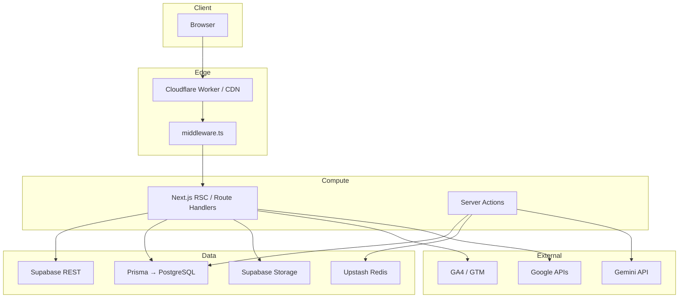
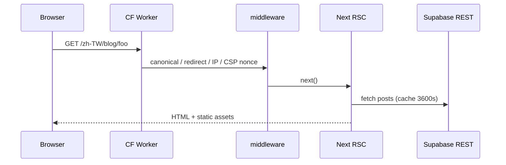
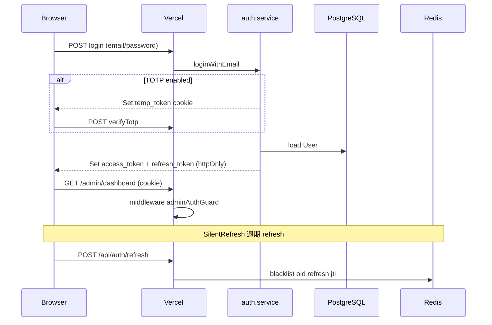
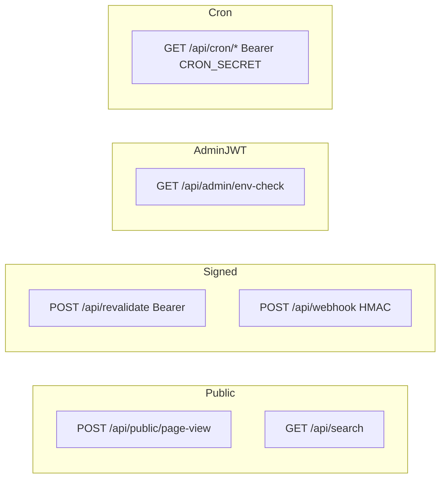
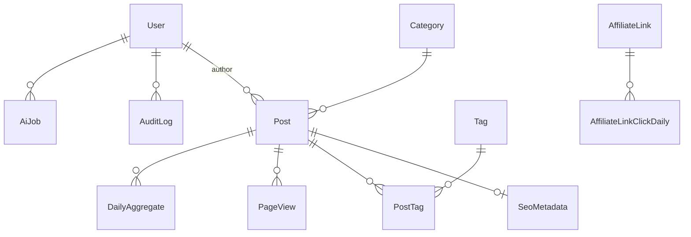
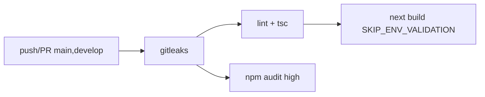
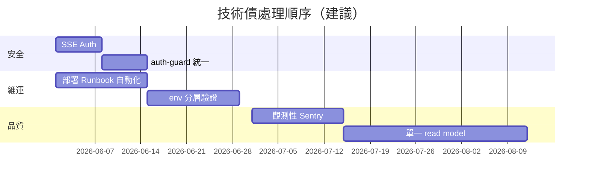

# Zenith Mind — 企業級技術交接手冊

| 文件版本 | 1.0.0 |
|----------|--------|
| 最後掃描基準 | `main` @ `daf9f8c`（2026-05-19） |
| 掃描範圍 | 實際程式碼、`package.json`、`prisma/schema.prisma`、`middleware.ts`、CI/CD、部署設定 |
| 維護者 | 【推測內容，需人工確認】指定 Tech Lead / On-call |

> **說明**：本文件依據倉庫內**現有檔案**撰寫。標示 **【推測內容，需人工確認】** 之處表示程式庫未明確定義，需由團隊補齊。

---

# 第一部分：整體系統技術說明書

## 1. 系統概述與核心技術棧（Tech Stack）

### 1.1 專案定位

**Zenith Mind** 是一套以 **Next.js 15 App Router** 為核心的**多語系內容行銷部落格系統**，並內建 **Admin 作戰中心（Command Center）**：

| 面向 | 說明 |
|------|------|
| **對外** | 公開站 `https://www.getzenithmind.com`：首頁、部落格、關於、聯盟短鏈 `/go/[slug]`、SEO/Schema、同意制分析 |
| **對內** | 後台 CMS + 儀表板：文章、媒體、站點設定、SEO/AEO/GEO、流量、AI Agent 佇列、整合健康檢查 |
| **資料** | Supabase PostgreSQL（Prisma ORM）、Upstash Redis、Supabase Storage |
| **部署** | **拆分部署**：公開站 → Cloudflare Workers（OpenNext）；後台與敏感 API → Vercel |

### 1.2 核心功能模組

| 模組 | 路徑／實作 | 說明 |
|------|------------|------|
| 公開內容 | `app/(public)/[locale]/` | 首頁、部落格列表／詳情、關於 |
| i18n | `lib/i18n/` | `zh-TW`（預設）、`en`；`localePrefix: "always"` |
| CMS | `app/admin/posts/`、`actions/post*.ts` | 文章 CRUD、SEO、FAQ、排程 |
| 站點設定 | `actions/site.actions.ts`、`lib/site/` | Hero、輪播、廣告位、Header 社群連結 |
| 分析 | `lib/analytics/`、`app/api/public/page-view` | 站內 PV、GA4/GTM（同意後） |
| 作戰中心 | `features/*/`、`app/admin/dashboard/` | War Room、Traffic、SEO、GEO、Agents… |
| AI 佇列 | `domain/ai/`、`app/api/ai/` | Gemini、AiJob、Cron Worker |
| 轉址 | `lib/redirects/`、`middleware` redirectGuard | DB 301 + Redis 快取 |
| 整合 | `services/google/`、`features/integrations-hub/` | GSC、GA4、Ads、BigQuery（可選） |

### 1.3 前後端架構模式

- **單一 Monorepo 程式庫**，執行時依環境拆分：
  - **Cloudflare Worker**：僅打包公開路由（`scripts/cf-public-build.mjs` 暫移 admin/API 目錄）
  - **Vercel**：完整應用（含 Prisma、Gemini、Cron）
- **資料取得**：
  - 公開頁：優先 **Supabase REST**（`lib/blog/public-blog-*.ts`）+ `unstable_cache` / `revalidate: 3600`
  - 後台／寫入：**Prisma**（`infrastructure/db/prisma.ts`）
  - CF Worker 上 Prisma 使用 **Neon serverless adapter**（`lib/db/prisma-cf-edge.ts`）【公開站讀取路徑以 Supabase REST 為主，見各 loader】

### 1.4 渲染與快取策略（SSR / ISR / SSG / CSR）

| 區域 | 策略 | 依據（程式碼） |
|------|------|----------------|
| 公開首頁／列表 | **ISR** `revalidate = 3600` | `app/(public)/[locale]/layout.tsx`、blog pages |
| 文章詳情 | **ISR** `revalidate = 3600` | `app/(public)/[locale]/blog/[slug]/page.tsx` |
| 後台儀表板子頁 | **ISR** `revalidate = 60` | 多數 `app/admin/dashboard/*/page.tsx` |
| 後台 CMS／設定 | **`force-dynamic`** | `app/admin/posts/`、`settings/page.tsx` |
| 互動元件 | **CSR**（Client Component） | 編輯器、圖表、`dynamic()` 載入 Recharts |
| On-demand 失效 | **`revalidatePath` / `revalidateTag`** + 遠端 `POST /api/revalidate` | `actions/site.actions.ts`、`lib/revalidate/purge-public-site.ts` |

**非 SSG 全站匯出**：使用 Node/Edge Server Components + ISR，無 `output: 'export'`。

### 1.5 API 架構方式

| 類型 | 位置 | 用途 |
|------|------|------|
| **Route Handlers** | `app/api/**/route.ts` | REST：revalidate、webhook、cron、auth、search |
| **Server Actions** | `actions/*.ts` | 表單提交、CMS 寫入（`"use server"`） |
| **Middleware** | `middleware.ts` | 語系、301、Admin 代理、JWT 頁面守衛、CSP |

統一回傳協議：`ActionResult<T>` / `ApiResponse<T>`（`domain/shared/core.types.ts`）。

### 1.6 Auth 架構

**未使用 NextAuth**。自研 **JWT + httpOnly Cookie + TOTP 2FA**：

| 元件 | 檔案 |
|------|------|
| 簽發／驗證 | `lib/auth/jwt.ts`（**jose**，Edge 相容） |
| 登入流程 | `domain/auth/auth.service.ts`、`actions/auth.actions.ts` |
| 頁面守衛 | `lib/middleware/auth-guard.ts` |
| API／Action 守衛 | `lib/auth/admin-session.ts`、`gateAdminRead` / `gateAdminWrite` |
| Refresh 黑名單 | `infrastructure/redis/token-blacklist.ts` |
| RBAC | `lib/auth/permissions.ts`（`ADMIN` / `GUEST` × `AdminEntity`） |

### 1.7 資料流設計（簡述）



### 1.8 完整技術棧表

| 技術 | 用途 | 選型原因（依現況） |
|------|------|-------------------|
| **Next.js 15.5** | App Router、RSC、ISR、Middleware | 前後端一體、Vercel/CF 雙部署 |
| **React 19** | UI | 與 Next 15 對齊 |
| **TypeScript 5.8** | 型別安全 | `strict`、`noUncheckedIndexedAccess` |
| **Tailwind CSS 4** | 樣式 | `@import "tailwindcss"` + PostCSS |
| **@tailwindcss/typography** | 文章排版 | `prose` 文章區 |
| **Prisma 6.8** | ORM、migration | PostgreSQL + driverAdapters |
| **PostgreSQL（Supabase）** | 主資料庫 | 託管、連線池 |
| **@neondatabase/serverless** | CF 上 DB 驅動 | Worker 相容 |
| **Upstash Redis** | Token 黑名單、redirect 快取、webhook nonce | Serverless REST API |
| **Supabase JS** | Storage、公開內容 REST | 公開站減少 Prisma 冷啟動 |
| **Zod 3** | env、Action、API body 驗證 | 與 t3-env、表單共用 |
| **@t3-oss/env-nextjs** | 建置期 env 驗證 | `env.ts` |
| **jose** | JWT | Edge Middleware 可用 |
| **bcryptjs** | 密碼雜湊 | 使用者／文章密碼 |
| **speakeasy** | TOTP | 2FA |
| **Zustand 5** | 作戰中心 UI 狀態 | `stores/command-ui-store.ts` |
| **TanStack Query 5** | 即時 SSE + 快取 | `hooks/use-realtime-stream.ts` |
| **React Hook Form + @hookform/resolvers** | 表單 | 後台表單 |
| **TipTap 2** | 富文本編輯 | 文章 `contentType: tiptap` |
| **Recharts 2** | 儀表板圖表 | `dynamic()` 避免 SSR bundle |
| **Framer Motion 12** | 動效 | 首頁／行銷區 |
| **next-intl 4** | i18n | 路由前綴語系 |
| **@opennextjs/cloudflare** | CF Worker 適配 | `build:cf` |
| **Wrangler 4** | CF 部署 | `wrangler.toml` |
| **googleapis / @google-analytics/data** | GSC、GA4 Reporting | 作戰中心 |
| **@google/generative-ai** | Gemini | AI 草稿／FAQ |
| **openai SDK** | OpenAI 相容介面 | 【推測：Gemini 相容層，需確認呼叫路徑】 |
| **nodemailer** | Alert 郵件 | 可選 SMTP |
| **sanitize-html** | XSS 防護 | CMS 內容 |
| **sharp** | 圖片處理 | next/image |
| **Jest 30** | 單元測試 | API、lib 測試 |
| **Playwright + axe** | a11y E2E | `test:a11y` |
| **ESLint 9 Flat + jsx-a11y** | 程式品質 | WCAG 規則 |
| **audit-ci** | 依賴安全 | `npm run security:audit` |
| **Vercel** | 後台託管、Cron | `vercel.json` |
| **Cloudflare Workers** | 公開站 CDN+運算 | 全球邊緣 |
| **GitHub Actions** | CI | `.github/workflows/ci.yml` |
| **gitleaks** | Secret scan CI | workflow `secret-scan` |

**專案中未發現（掃描結果）**：

| 技術 | 狀態 |
|------|------|
| NextAuth / Auth.js | ❌ 未使用 |
| Sentry | ❌ 未使用 |
| Redux | ❌ 未使用 |
| Docker / docker-compose | ❌ 無 Dockerfile |
| 獨立 `src/` 目錄 | ❌ 使用根目錄 `app/`、`lib/` |
| `tailwind.config.*` | ❌ Tailwind v4 以 CSS + PostCSS 設定 |

---

## 2. 專案目錄結構解析（Project Structure）

### 2.1 目錄樹（核心結構）

```
zenith-mind/
├── app/                          # Next.js App Router（路由唯一入口）
│   ├── layout.tsx                # 根 HTML、metadata
│   ├── globals.css               # Tailwind 4 + 設計 token
│   ├── (public)/[locale]/        # 公開多語系頁
│   ├── (public)/go/[slug]/       # 聯盟短鏈 Route Handler
│   ├── admin/                    # 後台頁面（Vercel；CF 上 302 出去）
│   ├── api/                      # Route Handlers
│   ├── robots.ts / sitemap.ts    # Metadata routes
│   └── middleware.ts             # 【註：middleware 在根目錄】
├── actions/                      # Server Actions（寫入層）
├── components/                   # 共用 UI（admin / blog / home / layout / ui）
├── features/                     # 作戰中心功能模組（page-view + 少數 actions）
├── domain/                       # 領域服務（auth、ai、shared types）
├── infrastructure/               # Prisma 單例、Redis、health probes
├── lib/                          # 共用函式庫（30+ 子模組）
├── services/                     # Google / integrations 外部服務
├── hooks/                        # React hooks（2 檔）
├── stores/                       # Zustand（1 檔）
├── shared/lib/                   # cn() 等極小共用
├── prisma/                       # schema + migrations
├── scripts/                      # 建置、檢查、維運腳本
├── docs/                         # 維運文件
├── tests/                        # Playwright a11y
├── messages/                     # next-intl JSON（`lib/i18n/request.ts` 動態 import）
├── env.ts                        # t3-env
├── next.config.ts
├── open-next.config.ts
├── wrangler.toml
├── vercel.json
└── package.json
```

### 2.2 分層職責

| 層級 | 目錄 | 職責 |
|------|------|------|
| **路由／畫面** | `app/` | URL、layout、metadata、revalidate 宣告 |
| **UI 組件** | `components/` | 可重用展示組件，不含業務編排 |
| **功能模組** | `features/` | 作戰中心各頁「視圖 + 資料呈現」 |
| **應用服務** | `actions/`、`app/api/` | 對外可呼叫邊界（Action / HTTP） |
| **領域** | `domain/` | 登入、AI  job 生命週期 |
| **基礎設施** | `infrastructure/` | DB、Redis 客戶端 |
| **共用函式** | `lib/` | 可跨 feature 的工具、loader、middleware 子模組 |
| **外部整合** | `services/` | Google API 封裝 |

### 2.3 資料流方向

```
User → app/page.tsx (RSC)
     → lib/* loader (cache / Supabase / Prisma)
     → components/* (presentational)

Admin Form → actions/*.ts
          → gateAdminWrite
          → prisma / storage
          → revalidateTag / purge-public-site
```

### 2.4 模組化與耦合評估

| 區塊 | 模組化程度 | 說明 |
|------|------------|------|
| `features/*` | ★★★★☆ | 各儀表板獨立 page-view，利於拆分團隊 |
| `lib/blog/*` | ★★★☆☆ | 多 loader（Prisma / Supabase）並存，切換需謹慎 |
| `lib/admin/*` | ★★★☆☆ | 儀表板資料聚合，檔案偏大 |
| `actions/post*.ts` | ★★★☆☆ | 與 Prisma、audit、revalidate 耦合 |
| `middleware.ts` | ★★☆☆☆ | 集中所有橫切關注點，修改影響全站 |
| `env.ts` vs `.env.example` | ★★☆☆☆ | 部分變數僅在 example（見 §7.1） |

**適合未來拆分**：`features/` → 獨立 package；`services/google` → integration SDK；公開／後台已是部署層拆分。

**耦合較高需謹慎**：`purge-public-site`（跨 CF/Vercel revalidate）、`cf-public-build.mjs`（實體搬移目錄）。

---

## 3. 系統架構圖（Architecture）

### 3.1 部署架構

```mermaid
flowchart TB
  User[使用者瀏覽器]
  DNS[DNS www.getzenithmind.com]
  CF[Cloudflare CDN + Worker<br/>OpenNext]
  Vercel[Vercel<br/>zenith-mind.vercel.app]
  SB[(Supabase PostgreSQL)]
  Redis[(Upstash Redis)]
  GCS[Google Cloud APIs]

  User --> DNS --> CF
  CF -->|"/admin" "302"| Vercel
  CF -->|公開頁 RSC| SB
  CF --> Redis
  Vercel --> SB
  Vercel --> Redis
  Vercel --> GCS
```

### 3.2 公開頁請求流程



### 3.3 Admin 登入與 Token 流程



### 3.4 API 分類流程



### 3.5 資料庫關聯（ER 簡圖）



---

## 4. 資料庫架構與資料模型（Database Schema）

**來源**：`prisma/schema.prisma`  
**資料庫**：PostgreSQL（Supabase）  
**連線**：`DATABASE_URL`（Transaction pooler）、`DIRECT_URL`（migrate／introspect）

### 4.1 Enum 定義

| Enum | 值 |
|------|-----|
| `UserRole` | ADMIN, GUEST |
| `PostStatus` | DRAFT, PUBLISHED, SCHEDULED, ARCHIVED |
| `AiJobStatus` | PENDING, PROCESSING, DONE, FAILED, DEAD_LETTER |
| `AiJobType` | GENERATE_DRAFT, OPTIMIZE_TITLE, EXTRACT_FAQ |
| `AuditAction` | CREATE, UPDATE, DELETE, LOGIN, LOGOUT, TOTP_*, AI_GENERATE, PUBLISH, SCHEDULE |
| `OutboxStatus` | PENDING, PROCESSED, FAILED |
| `NewsletterSubscriberStatus` | ACTIVE, UNSUBSCRIBED |
| `IntegrationConnectionStatus` | DISCONNECTED, CONNECTED, ERROR |

### 4.2 核心資料表

#### `users`（User）

| 欄位 | 型別 | Nullable | Default | 說明 |
|------|------|----------|---------|------|
| id | String | N | cuid() | PK |
| email | String | N | — | @unique |
| password | String | N | — | bcrypt |
| totpSecret | String | Y | — | AES 加密 |
| totpEnabled | Boolean | N | false | |
| totpVerifiedAt | DateTime | Y | — | |
| role | UserRole | N | ADMIN | |
| deletedAt | DateTime | Y | — | soft delete |
| createdAt / updatedAt | DateTime | N | now() | |

**關聯**：1:N → `posts`, `audit_logs`, `ai_jobs`  
**索引**：`email`, `(email, deletedAt)`, `deletedAt`

#### `posts`（Post）— 核心 Entity

| 欄位 | 型別 | Nullable | Default | 說明 |
|------|------|----------|---------|------|
| id | String | N | cuid() | PK |
| slug | String | N | — | @unique，發布後不可改（應用層） |
| status | PostStatus | N | DRAFT | |
| title / titleEn | String | N/Y | — | 多語標題 |
| excerpt / excerptEn | String | Y | — | |
| content / contentEn | Text | N/Y | — | markdown 或 tiptap |
| contentType | String | N | "markdown" | |
| contentBlocks / contentDoc | Json | Y | — | 區塊／PM 快照 |
| coverImage* | 多欄 | Y | — | 含 width/height/blurHash |
| faq / faqVersion / faqUpdatedAt | Json/Int/DT | Y | — | AEO |
| publishedAt / scheduledAt | DateTime | Y | — | 發布／排程 |
| isPasswordProtected | Boolean | N | false | |
| accessPasswordHash | String | Y | — | bcrypt |
| isProgrammatic / pSeoTemplate | Boolean/String | N/false | pSEO |
| **readingTime** | Int | N | 0 | **閱讀分鐘（已存在）** |
| deletedAt | DateTime | Y | — | soft delete |
| authorId | String | N | — | FK → User |
| categoryId | String | Y | — | FK → Category |

**關聯**：N:1 User、Category；1:1 SeoMetadata；N:M Tag（透過 PostTag）；1:N PageView、DailyAggregate、AiJob

#### `seo_metadata`（SeoMetadata）— 與 Post 1:1

| 欄位 | 型別 | 說明 |
|------|------|------|
| postId | String @unique | FK → Post |
| metaTitle/En, metaDescription/En | String? | |
| canonicalUrl, og* | String? | |
| focusKeyword/En | String? | |
| keywords | String[] | PG array |
| noIndex / noFollow | Boolean | default false |
| version / isActive | Int / Boolean | 版本控制預留 |

#### `page_views`（PageView）

| 欄位 | 型別 | 說明 |
|------|------|------|
| visitorHash | String? | SHA-256(IP+UA+salt)，不存原始 IP |
| postId | String? | null = 首頁 PV |
| locale | String | default zh-TW |
| createdAt | DateTime | 保留 180 天【cron cleanup】 |

#### `daily_aggregates` / `site_daily_aggregates`

| Model | Unique | 用途 |
|-------|--------|------|
| DailyAggregate | (date, postId) | 單篇日瀏覽 |
| SiteDailyAggregate | (date, locale) | 首頁日瀏覽 |

#### 其他表（摘要）

| Model | 表名 | 用途 |
|-------|------|------|
| Category / Tag / PostTag | categories, tags, post_tags | 分類與標籤 |
| Redirect | redirects | SEO 301 |
| AdSlot | ad_slots | 首頁廣告位 |
| AffiliateLink + ClickDaily | affiliate_* | 聯盟短鏈統計 |
| AiJob | ai_jobs | AI 任務佇列 |
| AuditLog | audit_logs | 稽核 90 天 |
| EventOutbox | event_outbox | 事件最終一致性 |
| NewsletterSubscriber | newsletter_subscribers | 電子報 |
| SiteSettings | site_settings | 單例 `id=site` |
| HeroSlide / HomeCarouselItem | hero_slides, home_carousel_items | 首頁輪播 |
| IntegrationCredential | integration_credentials | 加密憑證 |

### 4.3 關聯類型總覽

| 關係 | 實作 |
|------|------|
| User 1:N Post | `Post.authorId` |
| Post 1:1 SeoMetadata | `SeoMetadata.postId` @unique |
| Post N:M Tag | `PostTag` 複合 PK |
| Post 1:N PageView | optional `postId` |
| AffiliateLink 1:N ClickDaily | 複合 PK `(affiliateLinkId, date)` |

### 4.4 Migration 邏輯

**目錄**：`prisma/migrations/`（時間戳命名）

| Migration | 主題 |
|-----------|------|
| `20260214103000_post_cover_blocks_ad_slots` | 封面區塊、廣告位 |
| `20260215140000_hero_image_href_carousel_timing` | Hero／輪播 |
| `20260515120000_page_view_daily_rollup` | PV 日彙總 |
| `20260516120000_integration_credentials` | 整合憑證 |
| `20260518150000_guest_role_post_password` | GUEST 角色、文章密碼 |
| `20260520130000_seo_focus_keyword_en` | SEO 英文關鍵字 |
| `20260520140000_affiliate_click_daily` | 聯盟點擊日表 |

**指令**：

```bash
npm run db:migrate      # 本機開發 migrate dev
npm run db:deploy       # production migrate deploy
npm run db:deploy:local # 讀取 .env.local 的 deploy
```

---

## 5. 核心業務邏輯與 API 架構

### 5.1 Middleware 執行順序

| 步驟 | 模組 | 行為 |
|------|------|------|
| 1 | `canonical-host-redirect` | prod：vercel.app/workers.dev → www |
| 2 | `admin-origin` | CF：`/admin`、`/api/admin`… → 302 Vercel |
| 3 | 內聯 | `/` → `/zh-TW` |
| 4 | `redirectGuard` | DB 301 轉址 |
| 5 | `ip-guard` | prod 非 Vercel：須 CF 代理標頭，否則 403 |
| 6 | `adminAuthGuard` | 保護後台**頁面**前綴 |
| 7 | `security-headers` | CSP nonce → `x-nonce` |

### 5.2 API 一覽表

| Endpoint | Method | 功能 | Auth | 備註 |
|----------|--------|------|------|------|
| `/api/health/public-data` | GET | 公開資料健康檢查 | 無 | |
| `/api/public/page-view` | POST | 記錄 PV | 無 | prod 需 `PAGEVIEW_HASH_SALT` |
| `/api/search` | GET | 搜尋已發布文章 | 無 | |
| `/api/redirect` | GET | 內部轉址查詢 | `x-redirect-internal` = `REDIRECT_LOOKUP_SECRET` | dev 放寬 |
| `/api/revalidate` | POST | On-demand ISR | Bearer `REVALIDATE_SECRET` 或 `WEBHOOK_SECRET` | |
| `/api/webhook` | POST | 外部 webhook | HMAC + timestamp + Redis nonce | |
| `/api/auth/refresh` | POST | 刷新 access token | `refresh_token` cookie | |
| `/api/auth/ping` | GET | 驗證 access token | `access_token` cookie | |
| `/api/admin/env-check` | GET | 後台 env 診斷 | Admin JWT | |
| `/api/admin/integrations/probe` | POST | 探測整合 | Admin JWT | |
| `/api/admin/integrations/refresh-health` | POST | 更新健康狀態 | Admin JWT | |
| `/api/admin/audit-log/export` | GET | 匯出稽核 | Admin JWT | |
| `/api/admin/realtime/stream` | GET | SSE 即時流 | **【風險】route 內未驗證 JWT** | |
| `/api/ai/jobs` | POST | 建立 AI job | access JWT | |
| `/api/ai/jobs/[id]` | GET | 查詢 job | access JWT + userId | |
| `/api/ai/worker` | GET | 處理佇列 | Bearer `CRON_SECRET` | |
| `/api/cron/cleanup` | GET | 清理 PV/audit 等 | Bearer `CRON_SECRET` | Vercel Cron 03:00 |
| `/api/cron/aggregate-views` | GET | 日彙總 PV | Bearer `CRON_SECRET` | Cron 02:05 |
| `/api/cron/publish-scheduled` | GET | 排程發布 | Bearer `CRON_SECRET` | Cron 04:00 |
| `/go/[slug]` | GET | 聯盟轉址 | 無 | 在 `app/(public)/go/` |

### 5.3 Server Actions 一覽

| 檔案 | Actions | 權限 |
|------|---------|------|
| `auth.actions.ts` | login, verifyTotp, refresh, logout | 公開 |
| `analytics.actions.ts` | recordPageView | 公開 |
| `newsletter.actions.ts` | subscribe | 公開 |
| `post-access.actions.ts` | verify/check post password | 公開 |
| `post.create.actions.ts` | createPost | `gateAdminWrite("post")` |
| `post.actions.ts` | update, updateSeo, delete | `gateAdminWrite("post")` |
| `site.actions.ts` | site assets, settings, hero, carousel | `gateAdminWrite("site")` |
| `media.actions.ts` | deleteMedia | `gateAdminWrite("media")` |
| `affiliate.actions.ts` | CRUD affiliate | `gateAdminWrite("affiliate")` |
| `user.actions.ts` | list/create/delete users | read/write `user` |
| `totp-activate.actions.ts` | activateTotp | `gateAdminWrite("settings")` |
| `agent-queue.actions.ts` | queue 管理 | `gateAdminWrite("analytics")` |

### 5.4 RBAC 權限矩陣

| Entity | ADMIN | GUEST |
|--------|-------|-------|
| post, site, media, affiliate, integration, analytics, audit, settings, newsletter, user | read+write | **read only** |

實作：`lib/auth/permissions.ts` → `requireAdminWrite` 拋 `FORBIDDEN`。

### 5.5 Cache 策略

| 機制 | 說明 |
|------|------|
| `revalidate: 3600` | 公開頁 ISR 1 小時 |
| `unstable_cache` + tags | `hero-slides`, `home-carousel`, `posts`, `site-settings` |
| `revalidateTag` / `revalidatePath` | Server Action 後立即失效 |
| `purge-public-site.ts` | Vercel 寫入後 `fetch(CF)/api/revalidate` |
| Supabase fetch cache | `lib/db/supabase-rest.ts` 的 `next: { revalidate, tags }` |
| Redis | Redirect 快取、webhook nonce |

### 5.6 Error Handling

- **Server Actions**：回傳 `ActionResult<T>`，不直接 throw 給 UI【多數路徑】
- **API Routes**：JSON `{ error: code }` + HTTP status
- **對外錯誤**：`Errors.internal(requestId)` 含追蹤 ID
- **公開頁讀取**：`lib/db/safe-query.ts` fail-soft 降級

---

## 6. 前端 UI 與狀態管理

### 6.1 狀態管理

| 方案 | 檔案 | 用途 |
|------|------|------|
| **Zustand** | `stores/command-ui-store.ts` | 作戰中心：時間粒度、終端機 log 行、critical module |
| **TanStack Query** | `hooks/use-realtime-stream.ts` | SSE `/api/admin/realtime/stream` |
| **React state** | 各 Client Component | 表單、UI 互動 |
| **Server state** | RSC + cache tags | 公開頁主要資料來源 |
| **localStorage** | `lib/auth/client-session.ts` | 僅 session **提示**（非 token） |

**未使用**：Redux、Context 全域 store（除 next-intl Provider）。

### 6.2 表單

- **React Hook Form** + **Zod** resolver（後台編輯器、設定表單）
- Server Action 接收 `unknown` → `z.safeParse` → `ActionResult`

### 6.3 Tailwind 與設計系統

| 項目 | 實作 |
|------|------|
| 設定方式 | Tailwind v4：`app/globals.css` 內 `@import "tailwindcss"` |
| PostCSS | `postcss.config.mjs` → `@tailwindcss/postcss` |
| Typography | `@plugin "@tailwindcss/typography"` → 文章 `prose` |
| 作戰中心主題 | `.command-center` CSS 變數：`--cc-bg`, `--cc-cyan`, `--cc-green` |
| Focus | `:focus-visible` outline `#3b82f6`（WCAG） |
| 響應式 | Tailwind 預設 breakpoint（sm/md/lg/xl/2xl） |
| 元件變體 | `class-variance-authority` + `clsx` + `tailwind-merge`（`shared/lib/cn.ts`） |

**【推測內容，需人工確認】**：無獨立 Design Token JSON；品牌色分散在元件 class 與 `Category.color`。

### 6.4 Server / Client 元件策略

| 使用 Server Component | 使用 Client Component |
|---------------------|------------------------|
| 公開 layout、blog 列表/詳情資料載入 | 編輯器、Consent、追蹤器、圖表 |
| 後台 dashboard 資料 prefetch | `SilentRefresh`、登入表單 |
| metadata / JSON-LD | `dynamic()` 載入 Recharts |

### 6.5 Loading / Error

- `app/(public)/error.tsx` — 公開錯誤邊界
- 後台【推測】部分頁使用 Next 預設 error/loading【需逐頁確認】
- 資料降級：`components/public/DegradedDataBanner`（公開資料 health）

---

# 第二部分：未來維護與擴充指南

## 1. 本地開發環境建置（Local Development Setup）

### 1.1 前置需求

| 項目 | 版本／說明 |
|------|------------|
| Node.js | **22**（與 CI 一致，`.github/workflows/ci.yml`） |
| 套件管理 | **npm**（`package-lock.json`；`npm ci`） |
| PostgreSQL | Supabase 專案（或本機 PG） |
| Redis | Upstash 專案 |
| 可選 | Wrangler CLI（CF 本機預覽）、Vercel CLI |

### 1.2 從 Clone 到啟動

```bash
git clone https://github.com/thielip/zenith-mind.git
cd zenith-mind

npm ci

cp .env.example .env.local
# 編輯 .env.local，填入必填變數（見下表）

npm run db:generate:local
npm run db:deploy:local    # 或 npm run db:migrate（開發用）

npm run admin:ensure       # 建立管理員（依腳本與 ADMIN_BOOTSTRAP_*）

npm run dev                # http://localhost:3000 → /zh-TW
```

### 1.3 驗證指令

```bash
npm run lint
npm run type-check
npm test
node scripts/check-env-keys.mjs
node scripts/scan-secrets.mjs
```

### 1.4 Build

| 指令 | 用途 |
|------|------|
| `npm run build` | Vercel 完整建置（含 admin） |
| `npm run build:cf` | Cloudflare 公開站建置 |
| `npm run preview:cf` | CF 本機預覽（需 `.dev.vars`） |

### 1.5 環境變數總表

#### A. `env.ts` 強制驗證（建置期，除非 `SKIP_ENV_VALIDATION`）

| 變數名稱 | 用途 | 範例 | 必填 | 取得方式 |
|----------|------|------|------|----------|
| `DATABASE_URL` | Prisma 連線（pooler） | `postgresql://...@...:6543/...` | ✅ | Supabase → Database → Connection string |
| `DIRECT_URL` | migrate 直連 | `postgresql://...@...:5432/...` | 建議 | Supabase Session/Direct |
| `JWT_ACCESS_SECRET` | Access JWT | 64+ 字元 hex | ✅ | `openssl rand -hex 64` |
| `JWT_REFRESH_SECRET` | Refresh JWT | 64+ 字元 hex | ✅ | 同上 |
| `UPSTASH_REDIS_REST_URL` | Redis REST | `https://...upstash.io` | ✅ | Upstash Console |
| `UPSTASH_REDIS_REST_TOKEN` | Redis Token | — | ✅ | Upstash Console |
| `TOTP_ENCRYPTION_KEY` | TOTP AES | 64 hex 字元 | ✅ | `openssl rand -hex 32` |
| `GEMINI_API_KEY` | Admin AI | `AIza...` | ✅ | Google AI Studio |
| `GA4_CLIENT_EMAIL` | GA4 SA | `xxx@....iam.gserviceaccount.com` | ✅ | GCP IAM |
| `GA4_PRIVATE_KEY` | GA4 SA PEM | `"-----BEGIN...\n..."` | ✅ | SA JSON `private_key` |
| `GA4_PROPERTY_ID` | GA4 資源 ID | 數字 | ✅ | GA4 Admin |
| `WEBHOOK_SECRET` | Webhook HMAC | ≥32 字元 | ✅ | `openssl rand -hex 32` |
| `REVALIDATE_SECRET` | ISR 清除 | ≥32 字元 | 選填 | 同上 |
| `SUPABASE_SERVICE_ROLE_KEY` | Storage／REST | — | ✅ | Supabase Settings → API |
| `ALERT_EMAIL_*` | SMTP 告警 | email | 選填 | Gmail 應用程式密碼 |
| `NODE_ENV` | 環境 | development | ✅ | 自動 |
| `NEXT_PUBLIC_SITE_URL` | canonical | `https://www.getzenithmind.com` | ✅ | 固定 |
| `NEXT_PUBLIC_SUPABASE_URL` | 公開 API | `https://xxx.supabase.co` | ✅ | Supabase |
| `NEXT_PUBLIC_SUPABASE_ANON_KEY` | 公開金鑰 | `sb_publishable_...` | ✅ | Supabase |
| `NEXT_PUBLIC_GA4_MEASUREMENT_ID` | GA4 | `G-XXXX` | 選填 | GA4 |
| `NEXT_PUBLIC_GTM_ID` | GTM | `GTM-XXXX` | 選填 | GTM |
| `NEXT_PUBLIC_UMAMI_WEBSITE_ID` | Umami | UUID | 選填 | Umami |
| `NEXT_PUBLIC_TURNSTILE_SITE_KEY` | Turnstile | — | 選填 | Cloudflare |

#### B. `.env.example` 有、但 `env.ts` 未列（執行期讀取）

| 變數名稱 | 用途 | 必填 | 備註 |
|----------|------|------|------|
| `ADMIN_DEPLOYMENT_URL` | CF→Vercel 302 | CF 必填 | `lib/deploy/admin-origin.ts` |
| `REDIRECT_LOOKUP_SECRET` | 轉址 API 簽章 | 建議 | `app/api/redirect` |
| `CRON_SECRET` | Cron / AI worker | Vercel 必填 | `app/api/cron/*` |
| `PAGEVIEW_HASH_SALT` | PV 訪客 hash | prod 必填 | page-view route |
| `SKIP_ENV_VALIDATION` | 略過 t3-env | CF 公開站 | `wrangler.toml [vars]` |
| `CF_WORKER_RUNTIME` | CF 執行期標記 | CF | `lib/db/cf-public-runtime.ts` |
| `CF_PUBLIC_ONLY` | CF 建置縮 bundle | CF build | `next.config.ts` |
| `NEXT_PUBLIC_IMAGE_DELIVERY` | 圖片策略 | CF | `supabase-render` |
| `GOOGLE_*` / `GSC_*` / `BIGQUERY_*` | 整合 | 選填 | 作戰中心 |
| `ADMIN_BOOTSTRAP_EMAIL/PASSWORD` | 首次管理員 | 選填 | `domain/auth/bootstrap.ts` |
| `GUEST_BOOTSTRAP_*` | 訪客帳號 | 選填 | 同上 |
| `PLAYWRIGHT_*` | E2E | 測試 | `playwright.config.ts` |

---

## 2. 程式碼規範與開發約定（Coding Standards）

### 2.1 命名規則

| 類型 | 慣例 | 範例 |
|------|------|------|
| 檔案（React） | kebab 或 Pascal（元件） | `war-room-view.tsx` |
| Server Action | `*Action` 結尾 | `createPostAction` |
| Route Handler | `route.ts` 匯出 HTTP 方法 | `export async function POST` |
| lib 函式 | camelCase | `recordPageViewCore` |
| 型別 | PascalCase | `ActionResult`, `AdminEntity` |

### 2.2 目錄規範

- 新**後台儀表板** → `features/<name>/components/*-page-view.tsx` + `app/admin/dashboard/<name>/page.tsx`
- 新**共用邏輯** → `lib/<domain>/`
- 新**外部 API** → `services/<provider>/`
- 避免在 `components/` 寫複雜業務編排

### 2.3 Server / Client 決策

| 場景 | 選擇 |
|------|------|
| 讀取資料、SEO metadata | Server Component |
| 需要 hooks、瀏覽器 API、動畫 | Client + `"use client"` |
| 大型圖表 | Client + `next/dynamic` + `ssr: false` |

### 2.4 驗證與 DTO

- **輸入**：Zod `safeParse` → `Errors.validation(flatten())`
- **輸出**：公開文章用 `lib/dto/public-post.dto.ts` 限制欄位
- **文字**：`sanitizeText` / `sanitize-html` 後再入庫

### 2.5 ESLint（`eslint.config.mjs`）

- `next/core-web-vitals` + `next/typescript`
- **jsx-a11y** recommended（CI 0 error）
- `@typescript-eslint/no-explicit-any`: error
- `no-console`: warn（僅 allow warn/error）

### 2.6 TypeScript（`tsconfig.json`）

- `strict: true`
- `noUncheckedIndexedAccess: true`
- path alias：`@/*` → 專案根

---

## 3. 部署與 CI/CD 流程

### 3.1 部署拓撲

| 目標 | 觸發 | 建置 | 部署指令 |
|------|------|------|----------|
| **Vercel 後台** | Git push `main` | `npm run build` | 自動【推測】 |
| **Cloudflare 公開站** | 手動或 CF Git | `npm run build:cf` | `npx wrangler deploy` |
| **DB migration** | 手動／CI【推測】 | `prisma migrate deploy` | 非 Vercel 自動 |

詳見：`docs/DEPLOY-CLOUDFLARE.md`

### 3.2 GitHub Actions（`.github/workflows/ci.yml`）



| Job | 說明 |
|-----|------|
| `secret-scan` | gitleaks |
| `quality` | `npm run lint`、`npm run type-check` |
| `build` | `prisma generate` + `npm run build`（略過 env 驗證） |
| `audit` | `npm audit --audit-level=high`（允許失敗） |

### 3.3 Vercel（`vercel.json`）

- Region：`hnd1`（東京）
- Cron：cleanup `0 3 * * *`、aggregate-views `5 2 * * *`、publish-scheduled `0 4 * * *`

### 3.4 Cloudflare（`wrangler.toml` + `scripts/cf-public-build.mjs`）

- 建置前 **stash**：`app/admin`, `app/api/admin`, `app/api/ai`, `app/api/auth`, `app/api/cron`
- 建置前 **隱藏**：`.env`, `.env.local`, `.env.production`
- `compatibility_flags`: `nodejs_compat`, `global_fetch_strictly_public`
- 敏感值：`npx wrangler secret put`（勿寫入 Git）

### 3.5 環境差異

| 變數／行為 | 本機 | Vercel | CF Worker |
|------------|------|--------|-----------|
| `SKIP_ENV_VALIDATION` | 可選 | 否 | **是**（vars） |
| `ADMIN_DEPLOYMENT_URL` | 可選 | 通常無 | **必須** |
| Prisma 直連 | 是 | 是 | 受限；公開讀取偏 Supabase REST |
| IP Guard | 關 | 關 | **開**（須 CF 標頭） |
| Admin 路由 | 本機全在同一 port | 全部 | 302 到 Vercel |

### 3.6 ISR / Revalidate 維運

1. 後台儲存內容 → Server Action 內 `revalidateTag` / `revalidatePath`
2. `purge-public-site.ts` → `POST https://www.getzenithmind.com/api/revalidate`（Bearer）
3. 公開頁最多 1 小時 stale（3600），或 tag 失效後立即更新

---

## 4. 常見維護情境 SOP

### 情境 A：新增 Post 欄位（以 `seriesSlug` 為例；`readingTime` 已存在）

> 若僅調整 `readingTime` 計算邏輯，可跳過步驟 1–2，改修改計算函式與表單欄位。

| 步驟 | 動作 | 實際檔案 |
|------|------|----------|
| 1 | Prisma 新增欄位 | `prisma/schema.prisma` → `Post.seriesSlug String?` |
| 2 | Migration | `npx prisma migrate dev --name add_post_series_slug` |
| 3 | Generate Client | `npm run db:generate:local` 或 `postinstall` |
| 4 | 公開 DTO（若前台要顯示） | `lib/dto/public-post.dto.ts` |
| 5 | Supabase 公開查詢（若走 REST） | `lib/blog/public-blog-post-supabase.ts` 選取欄位 |
| 6 | Prisma loader（若走 Prisma） | `lib/blog/*-prisma*` 相關 |
| 7 | Zod schema | `actions/post.create.actions.ts`、`post.actions.ts` 的 schema |
| 8 | 後台表單 UI | `components/admin/posts/*` 或 Editor 表單 |
| 9 | 詳情頁 UI | `app/(public)/[locale]/blog/[slug]/page.tsx`、`components/blog/*` |
| 10 | Cache | Action 內 `revalidateTag("posts")`、`purgePublicSiteAfterPostChange` |
| 11 | 測試 | `npm test`、手動建立文章、檢查公開頁 |

### 情境 B：新增 API Endpoint

| 步驟 | 規範 |
|------|------|
| 位置 | `app/api/<namespace>/<name>/route.ts` |
| 命名 | 路徑 kebab；檔案固定 `route.ts` |
| Runtime | 需 Prisma/Node API → 避免 Edge【視 route 而定】 |
| Auth | 公開：`applyBaselineSecurityHeaders`；Admin：`gateAdminRead()`；Cron：`Authorization: Bearer ${CRON_SECRET}` |
| Validation | Zod parse body/query |
| Response | `NextResponse.json` + 一致 error shape；或 `ActionResult` 轉換 |
| 測試 | `app/api/**/__tests__/*.test.ts` |
| CF 部署 | 若為 admin/cron/ai/auth → 已在 stash 清單，**僅 Vercel**；公開 API 需 CF rebuild |

### 情境 C：新增頁面路由

| 步驟 | 說明 |
|------|------|
| 公開頁 | `app/(public)/[locale]/<segment>/page.tsx` |
| 後台 | `app/admin/.../page.tsx` |
| Layout | 沿用上層 `layout.tsx`；後台 dashboard 用 `app/admin/dashboard/layout.tsx` |
| i18n | 公開頁加 `messages/zh-TW.json`、`en.json` 文案 |
| Metadata | `export const metadata` 或 `generateMetadata` |
| SEO | `lib/seo/*` JSON-LD 若需要 |
| Cache | 公開：`export const revalidate = 3600`；即時：`force-dynamic` |
| Loading/Error | 可新增同層 `loading.tsx` / `error.tsx` |
| Middleware | 確認 `auth-guard` 前綴是否涵蓋 |

### 情境 D：更換全域主題色

| 位置 | 修改內容 |
|------|----------|
| `app/globals.css` | `:root` 或 `.command-center` CSS 變數 |
| Tailwind class | 各 `components/`、`features/` 內 `bg-*` `text-*`【無 central theme.ts】 |
| `Category.color` | DB 欄位驅動分類色 |
| Radix 元件 | `components/ui/*` CVA 變體 |
| 焦點樣式 | `globals.css` `:focus-visible` |

**【推測內容，需人工確認】**：若需全站一鍵換色，建議新增 CSS variables 並逐步替換硬編碼 Tailwind 色碼。

---

## 5. 已知問題、風險與技術債（Tech Debt）

### 5.1 高風險

| 項目 | 說明 | 建議 | 優先級 |
|------|------|------|--------|
| **SSE 無 Auth** | `/api/admin/realtime/stream` 未驗證 JWT | 加入 `gateAdminRead` 或 signed query | P0 |
| **拆分部署不一致** | CF 與 Vercel 版本不同步 | 部署檢查清單；main 合併後雙端 deploy | P0 |
| **wrangler.toml 含非 secret 但敏感資訊** | 如 `ALERT_EMAIL_TO`、GA 帳號 | 評估移至 secrets；文件化輪替 | P1 |
| **env.ts 與 .env.example 不一致** | 多數整合變數未 t3 驗證 | 擴充 env.ts 或分層 `integrationEnv` | P1 |

### 5.2 中風險

| 項目 | 說明 | 建議 | 優先級 |
|------|------|------|--------|
| `/admin/users` 僅頁內守衛 | 未在 `auth-guard` PROTECTED | 併入 middleware 前綴 | P1 |
| 雙資料路徑（Prisma + Supabase REST） | 公開頁 loader 複雜 | 單一 read path 文件化 | P2 |
| `eslint.ignoreDuringBuilds: true` | build 不擋 lint | CI 已擋；保持 `npm run lint` | P2 |
| 無 Sentry / 集中 log | 除錯依 Vercel/CF log | 接入錯誤追蹤 | P2 |
| AI Job / Cron 單點 | `CRON_SECRET` 洩漏影響大 | 輪替 + IP 限制【Vercel Cron 內建】 | P2 |
| Bundle 大小 | Recharts/Framer 僅 dynamic 部分緩解 | `size-limit`、分析 `@next/bundle-analyzer`【未配置】 | P2 |

### 5.3 低風險

| 項目 | 說明 | 建議 | 優先級 |
|------|------|------|--------|
| `readingTime` 手動／自動混用 | 欄位存在但計算邏輯分散 | 統一在 publish pipeline 計算 | P3 |
| Guest 帳號預設密碼 | bootstrap `guest001` | 強制首次登入改密 | P3 |
| N+1 潛在 | 列表頁多 relation | Prisma `include` 審查 | P3 |
| a11y 測試覆蓋 | 僅 `tests/a11y` | 擴大關鍵路徑 | P3 |

### 5.4 重構路線圖（建議）



---

## 附錄 A：相關文件索引

| 文件 | 路徑 |
|------|------|
| Cloudflare 部署 | `docs/DEPLOY-CLOUDFLARE.md` |
| 整合開通 | `docs/COMMAND-CENTER-INTEGRATIONS.md` |
| 專案簡介 | `README.md` |
| 環境範本 | `.env.example`、`.dev.vars.example` |

## 附錄 B：關鍵設定檔速查

| 檔案 | 用途 |
|------|------|
| `package.json` | scripts、依賴 |
| `tsconfig.json` | TS 嚴格模式 |
| `next.config.ts` | i18n plugin、images、serverActions 8mb |
| `postcss.config.mjs` | Tailwind 4 |
| `eslint.config.mjs` | Lint + a11y |
| `jest.config.ts` / `playwright.config.ts` | 測試 |
| `open-next.config.ts` | OpenNext CF 空設定 |
| `wrangler.toml` | CF Worker |
| `vercel.json` | Vercel region + crons |
| `scripts/cf-public-build.mjs` | 公開站建置 stash |
| `scripts/scan-secrets.mjs` | 本機 secret 掃描 |

## 附錄 C：詞彙表

| 詞彙 | 定義 |
|------|------|
| 作戰中心 | Admin `/admin/dashboard/*` 情報儀表板 |
| 公開站 | CF 上服務的 locale 行銷站 |
| fail-soft | 公開頁 DB 失敗時降級顯示快取/空狀態 |
| stash | CF build 暫移目錄機制 |

---

*文件結束 — 變更架構或路由時請同步更新本手冊與 `README.md`。*
