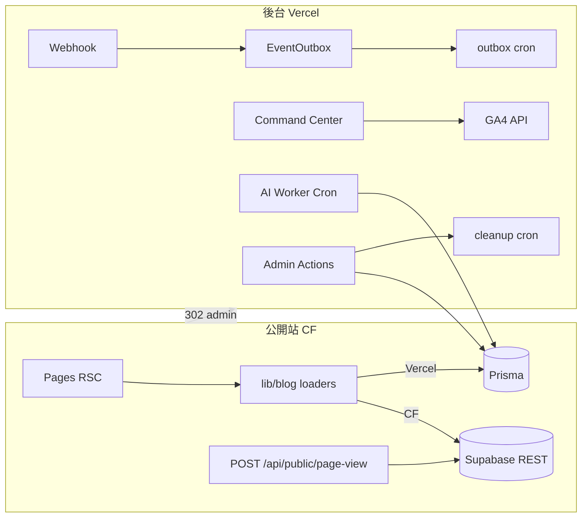

# 批次 0 — 總覽與風險評估

> **產品：** Zenith Mind Master Blueprint（合併版）  
> **說明：** Master Product Blueprint 決策基礎、風險、Frozen Core、路線圖  
> **來源檔案：** 01-MASTER-BLUEPRINT-ASSESSMENT.md

---

## 本文件目錄

- [Master Product Blueprint — 總覽與風險評估（Part 0）](#master-product-blueprint-總覽與風險評估-part-0)

---

## Master Product Blueprint — 總覽與風險評估（Part 0）

---

### 1. 系統架構總覽

#### 1.1 產品定位

| 維度 | 現況 |
|------|------|
| **類型** | 雙語內容媒體 + Admin CMS + Command Center（SEO/GEO/AEO/流量/整合健康） |
| **部署拓撲** | **分裂式：** Cloudflare Workers（公開站）+ Vercel（後台、Cron、AI Worker、完整 Prisma） |
| **資料** | PostgreSQL（Supabase）+ Upstash Redis + Supabase Storage |
| **AI** | Gemini/OpenAI 相容介面、DB 狀態機 `AiJob`、Vercel Cron 驅動 Worker |
| **SaaS 成熟度** | **單租戶產品**；具模組化雛形，**尚未**多租戶 / 白牌 / 租戶隔離 |

#### 1.2 分層架構（現行）

```
┌─────────────────────────────────────────────────────────────┐
│  Presentation: app/, components/, features/, widgets/       │
├─────────────────────────────────────────────────────────────┤
│  Application:  actions/ (Server Actions), app/api/* (Routes)│
├─────────────────────────────────────────────────────────────┤
│  Domain:       domain/auth, domain/ai, domain/shared        │
├─────────────────────────────────────────────────────────────┤
│  Services:     services/google/*, services/geo/*            │
├─────────────────────────────────────────────────────────────┤
│  Infrastructure: prisma, redis, ga4, ai adapters, storage   │
├─────────────────────────────────────────────────────────────┤
│  Cross-cutting: lib/ (auth, middleware, seo, blog loaders)  │
└─────────────────────────────────────────────────────────────┘
         Edge: middleware.ts → lib/middleware/*
```

#### 1.3 執行環境矩陣

| 能力 | Vercel (Node) | Cloudflare Worker (Edge) |
|------|---------------|---------------------------|
| Prisma 直連 | ✅ | ❌（stub + Supabase REST 分支） |
| TOTP / bcrypt | ✅ | ❌ |
| GA4 gRPC Reporting | ✅ | 受限 |
| Admin UI / Cron / AI Worker | ✅ | 302 → Vercel |
| 公開 SSR/ISR | ✅ | ✅（OpenNext） |
| Webhook + EventOutbox | ✅ | 路由在 CF build 保留 |

#### 1.4 核心資料流（簡圖）



---

### 2. 高耦合問題

| ID | 問題 | 嚴重度 | 位置 |
|----|------|--------|------|
| C1 | **雙資料平面**：每條公開讀取路徑需 `isCfPublicRuntime()` 分支，易漏 | 🔴 高 | `lib/blog/*`, `lib/homepage/*`, `lib/sitemap/*` |
| C2 | **CF 公開讀取雙實作**：`/go/[slug]`, `/api/search` 經 `getPublicContentRepository()`（CF→Supabase；Vercel→Prisma） | 🟢 已緩解 | `lib/public-content/`, `infrastructure/content/` |
| C3 | **Command Center 三層綁定**：`features/*` + `server/command-center/load-*` + `services/google/*` | 🟠 中 | 新增模組必改 3+ 目錄 |
| C4 | **Redirect 雙來源**：Middleware Supabase/Redis vs API Prisma | 🟠 中 | `redirect-guard`, `api/redirect` |
| C5 | **環境變數與部署綁定**：`wrangler.toml [vars]` + Vercel env 需手動同步 | 🟠 中 | 維運 |
| C6 | **AI Token 計數借用 `stepIndex`** | 🟡 低 | `domain/ai/ai.orchestrator.ts` |

---

### 3. SaaS 化風險

| 風險 | 說明 | 現況 |
|------|------|------|
| **無 tenant_id** | 所有表為單租戶全域資料 | Schema 無 `tenantId` |
| **無租戶設定層** | `SiteSettings` 為 singleton `id: "site"` | 無法 per-tenant 主題/網域 |
| **Auth 無租戶範圍** | JWT payload 僅 role，無 org/tenant | 無法 Super Admin → Tenant Admin 階層 |
| **白牌** | Logo/主題在 CMS JSON，非租戶 registry | 可擴充但未抽象 |
| **Onboarding** | 僅 `seedBootstrapAdminIfEmpty` / `seedGuestUserIfMissing` | 無新租戶流水線 |
| **計費/配額** | AI Token Budget 為全域日限 | 無 per-tenant 配額 |
| **部署** | 一 Worker 一品牌 | 多客戶需多專案或多租戶重構 |

**結論：** 現架構適合 **「可複製單租戶母版」**（每客戶一 repo/一部署），尚不適合 **「單程式多租戶 SaaS」** 除非進行 Schema 與 Auth 大改。

---

### 4. 資安風險

| ID | 機制 | 狀態 | 風險 |
|----|------|------|------|
| S1 | JWT + Refresh + Redis 黑名單 | ✅ 已實作 | 需確保跨網域 cookie 設定正確 |
| S2 | TOTP AES 加密 | ✅ Node only | Edge 誤 import 會炸 |
| S3 | Webhook HMAC + ts + nonce | ✅ 三重 | Payload `WebhookEnvelopeV1Schema`（Zod）；無效 envelope → `400` |
| S4 | CSP nonce（prod） | ✅ | 第三方腳本變更需更新 allowlist |
| S5 | Middleware RBAC | ⚠️ 僅驗 JWT 存在 | **GUEST 可進 admin 頁面**；寫入靠 Action gate |
| S6 | Cron `CRON_SECRET` | ✅ timingSafeEqual | 密鑰輪替需 runbook |
| S7 | `SKIP_ENV_VALIDATION` on CF | ⚠️ | 錯配 env 延遲到 runtime |
| S8 | 公開變數在 `wrangler.toml` | ⚠️ | 需區分 publishable vs secret |
| S9 | Rate limit | ⚠️ 部分 | Middleware：`POST /api/auth/*`、`/api/webhook`（30/min/IP）；webhook route 另 60/min；Redis 不可用時 fail-open |
| S10 | Audit log | ✅ | 需定義 retention 與匯出權限 |

---

### 5. 維護風險

| 風險 | 說明 |
|------|------|
| **分裂部署** | 兩套 CI（GHA CF + Vercel + CF Git）、三份設定同步 |
| **文件分散** | `docs/` + `系統架構說明書/` + 本 `docs/blueprint/` |
| **測試覆蓋** | Jest 單元為主；E2E/a11y 有限 |
| **型別與 CF** | `ignoreBuildErrors` on CF build；依賴 CI `tsc` |
| **Cron 頻率** | Vercel **Hobby** 僅支援每日 cron；`vercel.json` 已對齊（outbox `15 3 * * *`）；升級 Pro 才可改高頻 |

---

### 6. 技術債

| 優先 | 項目 | 建議 |
|------|------|------|
| ~~P0~~ | ~~CF `/search`、`/go` Prisma~~ | ✅ `PublicContentRepository` + Supabase repo |
| ~~P1~~ | ~~Webhook 無 Zod~~ | ✅ `domain/events/webhook.schema.ts` |
| ~~P1~~ | ~~Outbox 綁 cleanup~~ | ✅ `GET /api/cron/outbox` + `processEventOutbox()` |
| P2 | AI token 欄位語意不清 | 新增 `tokensUsed` 欄位 |
| P2 | GEO/AEO 示範資料與真實 API 混用 | 文件化 + feature flag |
| P3 | `stepIndex` 多用途 | 重命名或拆分欄位 |

---

### 7. 擴充性風險

| 擴充方向 | 可行性 | 阻礙 |
|----------|--------|------|
| CRM / ERP | 中 | 無通用 Entity/Module registry |
| 電商 | 低 | 無 Order/Payment domain |
| AI Agent 編排 | 中 | 已有 `AiJob` + Orchestrator，可擴 event types |
| API Marketplace | 低 | 無公開 API 版本層 |
| 多品牌 | 中 | CMS + SiteSettings；需 tenant 抽象 |
| 代理商後台 | 低 | 無 org hierarchy |

**Edge/Middleware 規則（必守）：** 禁止在 middleware 高頻路徑新增 Prisma 查詢；Redirect 已用 Supabase+Redis，須維持 <10ms 邊緣預算。

---

### 8. AI 重建風險

| 風險 | 說明 |
|------|------|
| **隱式慣例** | `isCfPublicRuntime()` 分散，AI 易漏分支 |
| **無 MACHINE_READABLE_SPEC** | 模組契約未集中 |
| **分裂部署未機器化** | AI 可能在 CF 路徑加 Server-only 程式碼 |
| **命名不一致** | `features` vs `server/command-center` vs `widgets` 邊界模糊 |

**緩解：** 產出 `10-AI-SPEC.md`（AI_DEVELOPMENT_RULES 章） + `02-EVENTS-AND-MODULES.md`（MODULE_DEPENDENCY 章） + 禁止清單（不可破壞清單）。

---

### 9. 補充分析摘要

#### 9.1 Webhook 觸發與 Payload（現況）

- **端點：** `POST /api/webhook`
- **Headers：** `x-webhook-signature`, `x-webhook-timestamp`, `x-webhook-nonce`
- **簽名：** `HMAC-SHA256(secret, "${timestamp}.${rawBody}")`
- **事件：** `POST_PUBLISHED`, `AI_JOB_DONE` → 寫入 `EventOutbox`
- **Envelope：** `{ eventVersion?: 1, event, data? }` — `WebhookEnvelopeV1Schema`；無效 → `400 INVALID_ENVELOPE`；未知 `event` → `200` + warn、不寫 Outbox

→ 詳見 **`06-INTEGRATION-AUTOMATION.md`（WEBHOOK 章）**（✅）

#### 9.2 外部 API 與 Retry

- **GA4 / Google APIs：** `infrastructure/ga4`, `services/google/*` — 錯誤多為 throw，無統一 retry policy
- **AI：** Orchestrator 內 self-correction；429 → domain error mapping
- **缺口：** 無集中 `RetryPolicy`（exponential backoff + idempotency key）

→ 詳見 **`06-INTEGRATION-AUTOMATION.md`（INTEGRATION 章）**（✅）

#### 9.3 工作流自動化

- **現有：** EventOutbox + Cron cleanup + scheduled publish + AI worker
- **缺口：** 無 Workflow DSL / 步驟可視化 / 失敗重試佇列獨立於 cleanup

→ 詳見 **`06-INTEGRATION-AUTOMATION.md`（WORKFLOW 章）**（✅）

#### 9.4 Database & Edge Rules

- Prisma：**Neon serverless adapter**；`DATABASE_URL` 應為 pooler（:6543）
- CF：**禁止**直接 `prisma.*`（除 stub 拋錯）
- Middleware：**禁止**新增耗時 DB query
- 連線：**DIRECT_URL** 僅 migrate/introspect

→ 詳見 **`03-DATA.md`（DATABASE_SCHEMA 章）** + **`03-DATA.md`（DATA_ACCESS_EDGE_RULES 章）**（✅）

#### 9.5 初始化策略（Seeding / Onboarding）

- **現有：** `domain/auth/bootstrap.ts` — 首位 ADMIN + GUEST
- **缺口：** 無 tenant 預設分類、預設 SiteSettings、預設整合憑證模板

→ 詳見 **`04-SEEDING.md`**（✅）

---

### 10. 重構優先級（建議）

| 階段 | 時程建議 | 內容 |
|------|----------|------|
| **P0 — 穩定** | 立即 | 修 CF 上 Prisma 路由；文件化 Edge 規則；Webhook schema |
| **P1 — 可複製** | 1–2  sprint | 抽象 `PublicDataPort`；統一 EventOutbox consumer；`AI_DEVELOPMENT_RULES` |
| **P2 — 可售** | 1–2 月 | Tenant-ready Schema 設計（不破壞現網）；Seeding pipeline；Integration retry 層 |
| **P3 — SaaS** | 3+ 月 | 多租戶 Auth、tenant config、配額、白牌 registry |

---

### 11. 不可動核心（Frozen Core）

以下 **禁止 AI/重構擅自移除或繞過**：

1. **分裂部署契約：** CF 公開 + Vercel 後台 + `ADMIN_DEPLOYMENT_URL` 302
2. **Auth 鏈：** JWT 雙 token + Refresh 輪替 + Redis blacklist + TOTP 流程
3. **Webhook 三重驗證：** HMAC + timestamp window + Redis nonce
4. **Cron 保護：** `CRON_SECRET` Bearer + timingSafeEqual
5. **Middleware 順序：** canonical → admin proxy → redirect → IP guard → auth → CSP
6. **寫入 RBAC：** `gateAdminWrite` / `requireAdminWrite` on all mutations
7. **訪客隱私：** PageView 僅 `visitorHash`，不存 raw IP
8. **SEO 基線：** locale routing、sitemap、JSON-LD、canonical host redirect
9. **Prisma migrate：** 僅透過 `prisma migrate`，禁止手改 production schema
10. **Secret：** 禁止 hardcode；`env.ts` + wrangler secret 分工

---

### 12. 建議抽象化模組（母版化）

| 模組 | 介面 | 實作替換 |
|------|------|----------|
| **PublicContentRepository** | `getPost`, `listPosts`, `search` | Prisma / Supabase |
| **RedirectRepository** | `findByPath` | Prisma / Supabase / Redis cache |
| **PageViewRecorder** | `record` | Prisma / Supabase REST |
| **IntegrationProvider** | `probe`, `fetchMetrics` | GA4, GSC, BigQuery, Semrush |
| **AiJobQueue** | `enqueue`, `claim`, `complete` | Prisma 狀態機（→ 未來 SQS） |
| **EventBus** | `publish`, `subscribe` | EventOutbox（→ 未來 queue） |
| **MediaStorage** | `upload`, `getUrl` | Supabase Storage |
| **TenantContext** | `tenantId`, `theme`, `domain` | 現為 singleton SiteSettings（→ 未來） |

---

### 13. 技術文件索引（合併版）

全系列已合併為 **11 份** 文件。目錄索引：[README.md](./README.md)

| 批次 | 合併檔案 |
|------|----------|
| 0 | `00-OVERVIEW.md` |
| A | `01-ARCHITECTURE.md` |
| B | `02-EVENTS-AND-MODULES.md` |
| C | `03-DATA.md` |
| D | `04-SEEDING.md` |
| E | `05-API-AUTH-PERMISSIONS.md` |
| F | `06-INTEGRATION-AUTOMATION.md` |
| G | `07-SEO-CONTENT.md` |
| H | `08-SECURITY.md` |
| I | `09-OPERATIONS.md` |
| J | `10-AI-SPEC.md` |

**AI 入口：** `10-AI-SPEC.md`

---

### 14. 產出狀態

| 項目 | 狀態 |
|------|------|
| 批次 0–J 內容 | ✅ 已完成 |
| 合併 29 → 11 份 | ✅ 2026-05-23 |

---

### 15. 維護說明

各合併檔內以 `## 原檔名` 區分章節。重新合併：`node scripts/merge-blueprint-batches.mjs`。

---

*本文件為 Master Product Blueprint 之決策基礎，非實作指令。任何架構變更須通過本 Frozen Core 檢查。*

