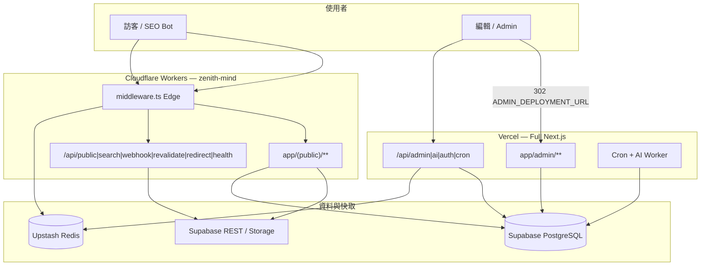
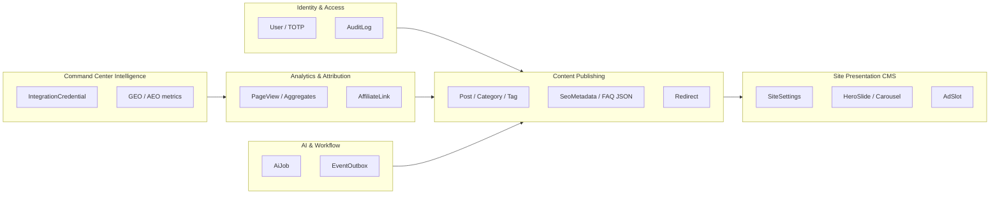
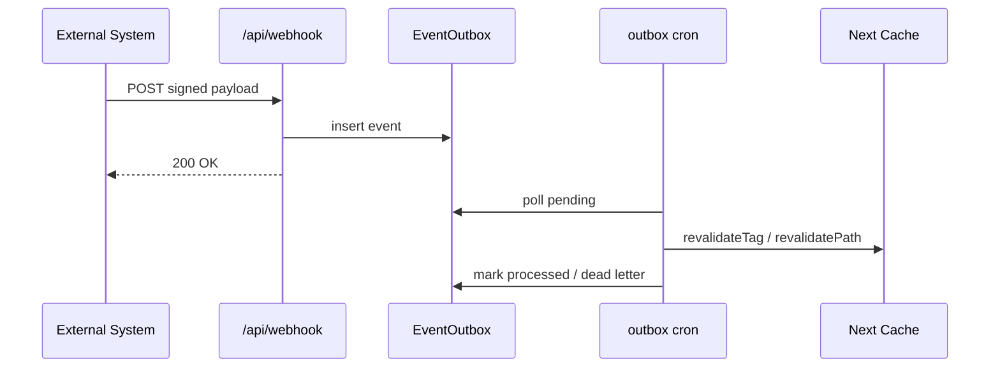

# 批次 A — 系統與領域架構

> **產品：** Zenith Mind Master Blueprint（合併版）  
> **說明：** 系統拓撲、分層、部署矩陣、Bounded Context  
> **來源檔案：** 02_SYSTEM_ARCHITECTURE.md、03_DOMAIN_ARCHITECTURE.md

---

## 本文件目錄

- [SYSTEM_ARCHITECTURE.md](#system-architecture-md)
- [DOMAIN_ARCHITECTURE.md](#domain-architecture-md)

---

## SYSTEM_ARCHITECTURE.md

---

### 1. 文件目的

本文件描述 **系統級架構**：部署拓撲、執行環境、分層邊界、請求生命週期、快取與 CDN 策略。  
供人類工程師與 AI Agent 在 **不破坏 Frozen Core** 的前提下擴充或重建系統。

---

### 2. 系統定位（System Identity）

| 屬性 | 值 |
|------|-----|
| **產品類型** | 內容媒體 + CMS + 營運指揮中心（Command Center） |
| **目標品質** | 高資安、高 SEO、高可維護、AI Native、SaaS-Ready（設計預留） |
| **現行租戶模型** | 單租戶（Single-tenant deployment） |
| **主要網域** | `https://www.getzenithmind.com` |
| **後台網域** | Vercel（`ADMIN_DEPLOYMENT_URL`，例：`https://zenith-mind.vercel.app`） |

---

### 3. 部署拓撲（Deployment Topology）

#### 3.1 分裂式雙平面（Frozen Core #1）

公開流量與後台流量 **刻意分離**，以降低 Cloudflare Worker 體積限制並隔離高權限 API。



#### 3.2 建置與部署管線

| 管線 | 觸發 | 產物 | 設定檔 |
|------|------|------|--------|
| **Vercel Production** | Git push `main` | 完整 Next.js | `vercel.json`, `next.config.ts` |
| **Cloudflare Git Build** | CF Workers Builds | OpenNext bundle | `wrangler.toml`, `open-next.config.ts` |
| **GitHub Actions** | `deploy.yml` on `main` | `npm run build:cf` + `wrangler deploy` | `scripts/cf-gha-deploy.mjs` |
| **本機 CF** | `npm run build:cf` + `deploy:cf` | `.open-next/` | `scripts/cf-public-build.mjs` |

**CF 公開建置特殊行為（`scripts/cf-public-build.mjs`）：**

1. 暫移 `app/admin`, `app/api/admin|ai|auth|cron`（不刪 repo）  
2. 隱藏 `.env`, `.env.local`（防 secret 進 bundle）  
3. 執行 `opennextjs-cloudflare build`（`buildCommand: npm run build:next:public`）  
4. 還原目錄與 env 檔  

#### 3.3 環境變數平面

| 平面 | 驗證 | 說明 |
|------|------|------|
| **Build-time** | `env.ts`（可 `SKIP_ENV_VALIDATION`） | Vercel 全量；CF 公開建置略過 tsc/eslint |
| **Vercel Runtime** | `env.ts` 完整 server schema | Prisma、JWT、GA4 私鑰等 |
| **CF Worker Runtime** | `wrangler.toml [vars]` + Secrets | `SKIP_ENV_VALIDATION=true`, `CF_WORKER_RUNTIME=1` |

公開變數寫入 `wrangler.toml [vars]` 以防 deploy 清空；敏感值僅 `wrangler secret put`。

---

### 4. 邏輯分層（Layered Architecture）

#### 4.1 層級定義與依賴規則

```
┌──────────────────────────────────────────────────────────────┐
│ L0  Edge Entry     middleware.ts, sentry.edge.config.ts      │
├──────────────────────────────────────────────────────────────┤
│ L1  Presentation   app/, components/, features/, widgets/     │
├──────────────────────────────────────────────────────────────┤
│ L2  Application    actions/*.ts, app/api/**/route.ts           │
├──────────────────────────────────────────────────────────────┤
│ L3  Domain         domain/auth, domain/ai, domain/shared     │
├──────────────────────────────────────────────────────────────┤
│ L4  Services       services/google/*, services/geo/*         │
├──────────────────────────────────────────────────────────────┤
│ L5  Infrastructure infrastructure/*, lib/* (cross-cutting)   │
└──────────────────────────────────────────────────────────────┘
```

**依賴方向（Architecture Rules）：**

| 規則 ID | 規則 |
|---------|------|
| AR-01 | L1 不可直接 `import` Prisma（公開頁走 `lib/*` loader） |
| AR-02 | L2 Server Actions 必須經 `gateAdminRead/Write` 或 API 等價檢查 |
| AR-03 | L3 Domain 不可依賴 `app/` 或 `components/` |
| AR-04 | L4 Services 不可依賴 Presentation |
| AR-05 | L0 Middleware **禁止** Prisma；**禁止** 耗時外部 API |
| AR-06 | Edge 路徑禁止 `bcrypt`, `speakeasy`, GA4 gRPC |

#### 4.2 目錄職責對照

| 目錄 | 層級 | 職責 |
|------|------|------|
| `app/(public)/[locale]/**` | L1 | 公開 SSR/SSG 頁面 |
| `app/admin/**` | L1 | 後台 UI（Vercel） |
| `app/api/**` | L2 | HTTP API（REST 語意） |
| `actions/**` | L2 | Server Actions（表單、CMS 變更） |
| `server/command-center/**` | L2 | RSC 資料載入（後台儀表板） |
| `features/**` | L1 | 後台「情報模組」視圖 |
| `widgets/**` | L1 | Command Center 可重用圖表/殼層 |
| `domain/**` | L3 | 認證、AI 編排、共用 `ActionResult` |
| `services/**` | L4 | 第三方 API 封裝（Google、GEO） |
| `infrastructure/**` | L5 | Prisma、Redis、GA4 client、AI adapter |
| `lib/**` | L5 | Auth、Middleware 模組、Blog loader、SEO |

---

### 5. 請求生命週期（Request Lifecycle）

#### 5.1 公開頁請求（Cloudflare）

```
Client Request
  → canonicalHostRedirect (*.vercel.app / *.workers.dev → www)
  → shouldProxyAdminToExternal? (skip for public paths)
  → redirectGuard (301 from Supabase/Redis redirect table)
  → ipGuard (403 if not CF/Vercel-proxied in prod)
  → adminAuthGuard (skip for public)
  → generateNonce + injectSecurityHeaders (CSP)
  → Next.js RSC / Route Handler
  → lib/blog|homepage loaders (branch: isCfPublicRuntime → Supabase REST)
  → Response
```

**關鍵檔案：** `middleware.ts`, `lib/middleware/*`, `lib/db/cf-public-runtime.ts`

#### 5.2 後台請求（Vercel 或 CF→302）

```
Client → CF middleware → 302 ADMIN_DEPLOYMENT_URL + path
  → Vercel middleware (full chain including adminAuthGuard)
  → JWT verify (access_token cookie / Authorization)
  → Admin layout (noindex robots)
  → Server Action or RSC loader (Prisma)
```

**關鍵檔案：** `lib/deploy/admin-origin.ts`, `lib/middleware/auth-guard.ts`

#### 5.3 API 請求分類

| 類別 | 範例 | Runtime | 認證 |
|------|------|---------|------|
| **Public read** | `/api/search`, `/api/health/public-data` | Node/Edge | 無或輕量 |
| **Public write** | `POST /api/public/page-view` | Node | Hash salt |
| **Signed** | `/api/webhook`, `/api/revalidate` | Node | HMAC / Bearer |
| **Internal** | `/api/redirect` | Node | `REDIRECT_LOOKUP_SECRET` header |
| **Admin** | `/api/admin/*` | Node | JWT + role |
| **Cron** | `/api/cron/*`, `/api/ai/worker` | Node | `CRON_SECRET` Bearer |

---

### 6. 渲染策略（SSR / CSR / ISR）

| 區域 | 策略 | 設定 |
|------|------|------|
| 首頁 / 部落格列表 | SSG + `generateStaticParams`（無 DB 時 `[]`） | `lib/sitemap`, blog pages |
| 文章詳頁 | 動態 SSR（密碼文、即時 view） | `force-dynamic` 條件 |
| 後台 | 全動態 RSC | `app/admin/**` |
| Sitemap | ISR `revalidate: 3600` | `app/sitemap.ts` |
| 快取標籤 | `revalidateTag` / `revalidatePath` | `lib/revalidate/*`, EventOutbox |

**內容渲染（Edge 安全）：** 公開 HTML 使用 `lib/sanitize/html-edge.ts` + `html-display.ts`；完整 `sanitize-html` 僅後台/Node。

---

### 7. 資料存取雙平面（Data Access Dual Plane）

#### 7.1 判斷旗標

```typescript
// lib/db/cf-public-runtime.ts
export function isCfPublicRuntime(): boolean {
  return process.env["CF_WORKER_RUNTIME"] === "1";
}
```

#### 7.2 分支模式（母版標準）

所有 **公開讀取** 必須遵循：

```
if (isCfPublicRuntime()) {
  return fetchViaSupabaseRest(...);
}
return fetchViaPrisma(...);
```

**已分支範例：** `lib/blog/load-blog-post-data.ts`, `lib/homepage/load-homepage-data.ts`, `lib/sitemap/load-sitemap-posts.ts`

**已分支（PublicContentRepository）：** `app/(public)/go/[slug]/route.ts`, `app/api/search/route.ts`

#### 7.3 Prisma 連線（Vercel / 本機）

| 變數 | 用途 |
|------|------|
| `DATABASE_URL` | Transaction pooler（建議 `:6543`） |
| `DIRECT_URL` | `prisma migrate` / introspect |

**禁止：** 在 Middleware 建立 Prisma 查詢。  
**禁止：** CF Worker 靜態 import `@/infrastructure/db/prisma`（應使用 stub 或 Supabase）。

---

### 8. 快取與 CDN 策略

| 層級 | 機制 | 檔案 |
|------|------|------|
| **CDN** | Cloudflare 邊緣 + `CF-Ray` IP Guard 信號 | `lib/middleware/ip-guard.ts` |
| **ISR** | Next `revalidate`、tag purge | `app/sitemap.ts`, cron aggregate |
| **Redis** | Redirect cache、JWT blacklist、Webhook nonce、AI queue | `infrastructure/redis/*` |
| **應用快取** | `unstable_cache` 包裝 site/homepage | `lib/site/*-cache.ts` |
| **圖片** | CF 公開站：`NEXT_PUBLIC_IMAGE_DELIVERY=supabase-render` | `lib/images/delivery.ts` |

---

### 9. 背景工作（Background Jobs）

| 工作 | 排程 | 路徑 | 職責 |
|------|------|------|------|
| Cleanup | `0 3 * * *` | `/api/cron/cleanup` | PageView/Audit 清理 |
| Outbox | `15 3 * * *` | `/api/cron/outbox` | EventOutbox 消費（`processEventOutbox`） |
| Aggregate views | `5 2 * * *` | `/api/cron/aggregate-views` | 日聚合 + cache revalidate |
| Publish scheduled | `0 4 * * *` | `/api/cron/publish-scheduled` | SCHEDULED → PUBLISHED |
| AI Worker | `10 5 * * *` | `/api/ai/worker` | 認領 `AiJob`、執行 Orchestrator |

**重要：** Cron **僅存在於 Vercel**；CF build 會 stash cron routes。

---

### 10. 觀測性（Observability）入口

| 類型 | 實作 | 備註 |
|------|------|------|
| Error tracking | Sentry（Vercel 完整；CF 公開建置可關閉 client SDK） | `sentry.*.config.ts` |
| Health | `GET /api/health/public-data` | Supabase 探測 → 503 |
| Audit | `AuditLog` + admin 匯出 | Prisma |
| Logging | `lib/logger` | 結構化日誌 |
| Integration probe | `/api/admin/integrations/probe` | 21 項探測 |

詳見 `09-OPERATIONS.md`（OBSERVABILITY 章）。

---

### 11. 國際化（i18n）

| 項目 | 值 |
|------|-----|
| 框架 | `next-intl` v4 |
| Locales | `zh-TW`, `en` |
| 預設 | `/` → `/zh-TW` |
| 設定 | `lib/i18n/routing.ts`, `lib/i18n/request.ts`, `messages/zh-TW.json` |

**SEO：** 每 locale 獨立 URL；`hreflang` 與 JSON-LD 由頁面 `generateMetadata` 負責。

---

### 12. 擴充邊界（Extension Boundaries）

未來模組（CRM、電商、AI Agent、API Marketplace）應：

1. 新增 `features/<module>/` + `server/command-center/load-<module>.ts`（後台）  
2. 或新增 `app/(public)/[locale]/<module>/`（公開）  
3. 透過 **Port 介面** 註冊到 `domain/` 或 `services/`  
4. **不得** 繞過 `gateAdminWrite` 或 Webhook 驗證鏈  

詳見 `01-ARCHITECTURE.md`（DOMAIN_ARCHITECTURE 章） 與 `10-AI-SPEC.md`（MODULE_GENERATION 章）。

---

### 13. 架構決策記錄（ADR 摘要）

| ID | 決策 | 理由 |
|----|------|------|
| ADR-001 | 分裂 CF + Vercel | Worker 3–10 MiB 限制；後台需完整 Node |
| ADR-002 | 公開站 Supabase REST | Prisma 不適用 CF Worker |
| ADR-003 | EventOutbox 非同步副作用 | Webhook 快速 ACK；revalidate 由 cron 處理 |
| ADR-004 | JWT + TOTP 非 Session DB | Edge 可驗證；Redis 處理撤銷 |
| ADR-005 | GUEST 唯讀角色 | 展示/稽核 без 寫入權 |

---

### 14. AI 機器可讀摘要（YAML）

```yaml
system: zenith-mind
version: "1.0"
deployment:
  public: cloudflare_workers
  admin: vercel
  admin_proxy_env: ADMIN_DEPLOYMENT_URL
layers:
  - edge: middleware.ts
  - presentation: [app, components, features, widgets]
  - application: [actions, app/api]
  - domain: [domain/auth, domain/ai, domain/shared]
  - services: [services/google, services/geo]
  - infrastructure: [infrastructure, lib]
runtime_flags:
  cf_public: CF_WORKER_RUNTIME=1
  cf_build: CF_PUBLIC_ONLY=1
frozen_core_doc: 00-OVERVIEW.md#11
high_risk_paths:
  - app/(public)/go/[slug]/route.ts
  - app/api/search/route.ts
```

---

### 15. 相關文件索引

| 文件 | 狀態 |
|------|------|
| `00-OVERVIEW.md` | ✅ |
| `01-ARCHITECTURE.md`（SYSTEM_ARCHITECTURE 章） | ✅ 本文件 |
| `01-ARCHITECTURE.md`（DOMAIN_ARCHITECTURE 章） | ✅ 批次 A |
| `02-EVENTS-AND-MODULES.md`（EVENT_FLOW 章） | ✅ |
| `05-API-AUTH-PERMISSIONS.md`（API_CONTRACT 章） | ✅ |
| `05-API-AUTH-PERMISSIONS.md`（AUTH_FLOW 章） | ✅ |
| `05-API-AUTH-PERMISSIONS.md`（PERMISSION_MATRIX 章） | ✅ |
| `09-OPERATIONS.md`（DEPLOYMENT 章） | 批次 I |

---

*變更本架構前請對照 Frozen Core。下一批輸入「繼續」產出 `02-EVENTS-AND-MODULES.md`（EVENT_FLOW 章） + `02-EVENTS-AND-MODULES.md`（MODULE_DEPENDENCY 章）。*


---

## DOMAIN_ARCHITECTURE.md

---

### 1. 文件目的

定義系統的 **業務領域（Bounded Contexts）**、核心實體、不變量（Invariants）、領域服務與應用層邊界。  
目標：讓 AI 與工程師新增功能時，知道邏輯應落在哪個 Domain，避免污染 Presentation 或 Infrastructure。

---

### 2. 領域地圖（Bounded Context Map）



---

### 3. 領域清單與職責

#### 3.1 Content Publishing（內容發布）

| 概念 | Prisma 模型 | 核心不變量 |
|------|-------------|------------|
| **文章** | `Post` | 僅 `PUBLISHED` 對外可見；slug 唯一 |
| **分類/標籤** | `Category`, `Tag`, `PostTag` | 分類可選；標籤多對多 |
| **SEO** | `SeoMetadata` | 1:1 Post；可含 FAQ JSON-LD 來源 |
| **排程** | `Post.status=SCHEDULED` | Cron 轉 `PUBLISHED` |
| **密碼文** | `Post.passwordHash` | 公開站需 cookie unlock |
| **歸檔導向** | `Redirect` | `oldPath` 唯一；Middleware 301 |

**應用入口：**

- Server Actions: `actions/post.actions.ts`, `post.create.actions.ts`, `post-access.actions.ts`
- 公開載入: `lib/blog/*`, `lib/sitemap/*`
- Cron: `app/api/cron/publish-scheduled/route.ts`

**商業事件（概念）：**

- `PostPublished`, `PostScheduled`, `PostArchived`, `RedirectCreated`

---

#### 3.2 Site Presentation CMS（站點呈現）

| 概念 | 模型 | 說明 |
|------|------|------|
| **全站設定** | `SiteSettings` (id=`site`) | JSON：品牌、文案、社群連結 |
| **首頁輪播** | `HeroSlide`, `HomeCarouselItem` | 依 locale |
| **廣告位** | `AdSlot` | `[slotKey, locale]` 唯一 |

**應用入口：** `actions/site.actions.ts`, `lib/site/*`, `lib/homepage/load-homepage-data.ts`

**不變量：** Singleton `SiteSettings` — **SaaS 化時需改為 `tenantId` + 預設 seed**

---

#### 3.3 Identity & Access（身分與存取）

| 概念 | 實作位置 | 說明 |
|------|----------|------|
| **登入** | `domain/auth/auth.service.ts` | Email/password → temp JWT 或 token pair |
| **JWT** | `lib/auth/jwt.ts` | Access 1h / Refresh 7d / Temp 5m |
| **TOTP** | `lib/auth/totp.ts` | AES-256-CBC；**Node only** |
| **RBAC** | `lib/auth/permissions.ts` | `ADMIN` vs `GUEST` × `AdminEntity` |
| **Bootstrap** | `domain/auth/bootstrap.ts` | 首位 admin + guest 帳號 |
| **審計** | `AuditLog` | 所有敏感 Action 應寫入 |

**角色矩陣（摘要）：**

| 角色 | 讀 | 寫 |
|------|----|----|
| `ADMIN` | 全部實體 | 全部實體 |
| `GUEST` | 全部實體 | **禁止** |

**應用入口：** `actions/auth.actions.ts`, `actions/totp-activate.actions.ts`, `lib/auth/resolve-admin-action.ts`

**Frozen Core：** JWT 雙 token、Refresh 黑名單、TOTP 流程不可刪。

---

#### 3.4 Analytics & Attribution（分析與归因）

| 概念 | 模型 / API | 隱私規則 |
|------|------------|----------|
| **頁面瀏覽** | `PageView`, `SiteDailyAggregate` | 僅 `visitorHash`（`PAGEVIEW_HASH_SALT`） |
| **日聚合** | `DailyAggregate` | Cron rollup |
| **聯盟點擊** | `AffiliateLink`, `AffiliateLinkClickDaily` | `/go/[slug]` 302 + 計數 |
| **GA4** | 外部 API | Service Account；Property ID |

**應用入口：**

- `POST /api/public/page-view` → `lib/analytics/record-page-view-core.ts`
- `actions/analytics.actions.ts`
- Client: `components/analytics/*`（Consent-gated）

**不變量：** 不儲存 raw IP 於 `PageView`。

---

#### 3.5 Command Center Intelligence（營運情報）

此領域偏 **讀取型聚合**，整合第三方指標供後台決策。

| 子域 | 資料來源 | 載入器 |
|------|----------|--------|
| **SEO** | GA4 + GSC | `server/command-center/load-seo.ts` |
| **GEO** | 自訂 REST / Semrush | `server/command-center/load-geo.ts`, `services/geo/*` |
| **Traffic** | GA4 bundle | `load-traffic.ts` |
| **Integrations** | DB + probe | `services/integrations/*` |

**特性：** 多為 **展示 + 探測**；失敗時 fallback 示範值並顯示 `apiWarning`（見 `load-geo.ts` 模式）。

**耦合風險：** `features/*/components` 與 `load-*.ts` 一對一綁定。

---

#### 3.6 AI & Workflow Automation（AI 與工作流）

| 概念 | 實作 | 說明 |
|------|------|------|
| **任務** | `AiJob` | 狀態機：PENDING → PROCESSING → DONE / FAILED / DEAD_LETTER |
| **編排** | `domain/ai/ai.orchestrator.ts` | Token budget、self-correction、Zod 輸出 |
| **佇列** | `domain/ai/ai.job-manager.ts` | DB 認領（`claimNextJob`） |
| **Port** | `domain/ai/ai.port.ts` | `AiPort.generate()` |
| **Adapter** | `infrastructure/ai/openai.adapter.ts` | OpenAI 相容（含 Gemini 路由） |
| **副作用** | `EventOutbox` | 非同步 revalidate、告警 |

**AI Job 類型（enum）：**

```
GENERATE_DRAFT | OPTIMIZE_TITLE | EXTRACT_FAQ
```

Worker 目前主要處理 `GENERATE_DRAFT`（見 `app/api/ai/worker/route.ts`）。

**Token 熔斷（Orchestrator）：**

| 使用率 | 行為 |
|--------|------|
| ≥80% | 告警 |
| ≥90% | 降級模型 |
| 100% | 熔斷 |

---

### 4. 共用語言（Ubiquitous Language）

| 術語 | 定義 |
|------|------|
| **公開站** | Cloudflare 服務的 `(public)` 路由與公開 API |
| **後台** | Admin UI + 特權 API（Vercel） |
| **Command Center** | `/admin/dashboard/*` 情報模組群 |
| **軟刪除** | `User.deletedAt`（非全系統軟刪） |
| **Outbox** | 至少一次投遞語意；Cron 消費 |
| **公開資料降級** | Supabase 不可用時 banner + 503 health |

---

### 5. Domain Layer 程式結構

```
domain/
├── shared/
│   └── core.types.ts      # ActionResult<T>, Errors.*, ApiResponse
├── auth/
│   ├── auth.service.ts    # 登入、token 發放
│   ├── user.service.ts    # Admin 使用者列舉
│   └── bootstrap.ts       # Seed admin/guest
└── ai/
    ├── ai.port.ts         # 介面
    ├── ai.validator.ts    # Zod schemas
    ├── ai.orchestrator.ts # 業務編排
    ├── ai.job-manager.ts  # 任務認領
    └── queue.port.ts      # 佇列抽象（Redis 實作於 infrastructure）
```

#### 5.1 ActionResult 協議（Frozen Pattern）

所有 Server Actions 應回傳 `ActionResult<T>`：

```typescript
// domain/shared/core.types.ts
type ActionResult<T> =
  | { success: true;  data: T;    error: null }
  | { success: false; data: null; error: ActionError };
```

`ActionError` 含 `code`, `retryable`, `httpStatus`, `severity` — **Queue / AI Worker 依此決策重試**。

---

### 6. Application Layer 與 Domain 的邊界

| 層 | 可做 | 不可做 |
|----|------|--------|
| **actions/** | Zod 輸入驗證、呼叫 domain service、寫 AuditLog、回 ActionResult | 直接嵌入 UI 邏輯 |
| **app/api/** | HTTP 語意、Bearer/HMAC、映射 ActionResult → status | 複製 domain 規則 |
| **server/command-center/** | 組合多個 service 為 ViewModel | 直接改 Post 狀態 |
| **features/** | 純展示、表單觸發 Action | Prisma 查詢 |

**標準 Action 流程：**

```
Client Form
  → actions/*.ts (Zod + gateAdminWrite)
  → domain/* or infrastructure/*
  → prisma / external API
  → auditLog.create (mutations)
  → ActionResult
```

---

### 7. Infrastructure Ports（建議契約）

母版化時，Domain 應只依賴 Port，由 Infrastructure 注入：

| Port | 方法（概念） | 現行實作 |
|------|--------------|----------|
| `AiPort` | `generate(prompt, options)` | `openai.adapter.ts` |
| `QueuePort` | `enqueue`, `dequeue` | Redis adapter（輔助 AI） |
| `PublicContentRepository` | `searchPublishedPosts`, `findActiveAffiliateLinkBySlug` | **部分** — `domain/content/ports.ts` + `infrastructure/content/*` |
| `PageViewRecorder` | `record(event)` | `record-page-view-core.ts` |
| `IntegrationProbe` | `probeAll()` | `services/integrations/probe-provider.ts` |

**後續（P2）：** 擴充 port 覆蓋 blog 詳情／列表；其餘讀取仍 `lib/blog/*`。

---

### 8. 領域事件與 EventOutbox

#### 8.1 事件目錄（現行）

| eventType | 觸發源 | 消費者 | 副作用 |
|-----------|--------|--------|--------|
| `POST_PUBLISHED` | Webhook | outbox cron | revalidate tags/paths |
| `AI_JOB_DONE` | Webhook | outbox cron | 通知 / revalidate（可擴充） |

Webhook 寫入：`app/api/webhook/route.ts` → `prisma.eventOutbox.create`

#### 8.2 事件流（簡圖）



詳細契約見`06-INTEGRATION-AUTOMATION.md`（WEBHOOK 章）、`02-EVENTS-AND-MODULES.md`（EVENT_FLOW 章）。

---

### 9. 跨領域規則（Cross-Domain Policies）

| 政策 ID | 描述 |
|---------|------|
| DP-01 | 發布文章必須可使 sitemap 與公開 cache 失效 |
| DP-02 | 刪除/歸檔文章應建立 `Redirect` 或 Middleware 可解析的 301 |
| DP-03 | 媒體 URL 通過 `lib/validation/external-image-url.ts`（`optionalExternalImageUrlSchema`） |
| DP-04 | 整合憑證必須加密存於 `IntegrationCredential.payloadEncrypted` |
| DP-05 | AI 輸出必須經 Zod schema（`DraftResultSchema` 等） |
| DP-06 | GUEST 角色禁止任何 `gateAdminWrite` 路徑 |

---

### 10. SaaS 化領域擴充預留

未來多租戶時，各 Context 需增加 **`tenantId`**：

| Context | 變更要點 |
|---------|----------|
| Content | `Post.tenantId`；slug 唯一改為 `(tenantId, slug)` |
| Site | `SiteSettings` 改為 per-tenant |
| Auth | JWT claims 含 `tenantId`；Super Admin 跨租戶 |
| Analytics | 聚合表加分區鍵 |
| AI | per-tenant token budget |

**Onboarding 領域流程（目標）：**

```
TenantCreated
  → seedTenantDefaults (categories, SiteSettings, admin user)
  → IntegrationPlaceholder
  → DomainVerified (future)
```

詳見`04-SEEDING.md`。

---

### 11. 領域 × 執行環境矩陣

| 領域能力 | CF Worker | Vercel Node |
|----------|-----------|-------------|
| 讀取已發布內容 | Supabase REST | Prisma |
| 寫入 CMS | ❌（302 後台） | ✅ |
| PageView 寫入 | Supabase insert | Prisma |
| AI Job | ❌ | ✅ |
| Webhook / Outbox | ✅ 路由在 CF* | ✅ 建議 primary |
| TOTP | ❌ | ✅ |
| GA4 Reporting | ❌ / 受限 | ✅ |

\*Webhook 在 CF 上可接收，但 Outbox 處理依賴 Vercel Cron — **生產配置應以 Vercel 為 Outbox consumer 權威**。

---

### 12. AI 開發規則（Domain 專用）

| 規則 ID | 內容 |
|---------|------|
| DA-01 | 新商業規則放 `domain/` 或 `domain/<context>/`，不放 `components/` |
| DA-02 | 新 Zod schema 放 `domain/*/validator` 或 `actions` 旁，並單測 |
| DA-03 | 錯誤使用 `Errors.*` 工廠，禁止裸 `throw new Error` 給 Action |
| DA-04 | 跨 Context 呼叫透過 Application 層組合，禁止 Domain 互 import 循環 |
| DA-05 | 公開讀取禁止新增 Prisma 依賴 without `isCfPublicRuntime` 分支 |

---

### 13. 機器可讀領域註冊表（YAML）

```yaml
domains:
  - id: content_publishing
    models: [Post, Category, Tag, SeoMetadata, Redirect]
    entry_actions: [post.actions, post.create.actions, post-access.actions]
  - id: site_cms
    models: [SiteSettings, HeroSlide, HomeCarouselItem, AdSlot]
    entry_actions: [site.actions]
  - id: identity_access
    models: [User, AuditLog]
    domain_services: [auth.service, bootstrap]
    roles: [ADMIN, GUEST]
  - id: analytics
    models: [PageView, DailyAggregate, SiteDailyAggregate, AffiliateLink]
    apis: [public/page-view]
  - id: intelligence
    loaders: [server/command-center/load-seo, load-geo, load-traffic]
    services: [services/google, services/geo]
  - id: automation
    models: [AiJob, EventOutbox]
    domain_services: [ai.orchestrator, ai.job-manager]
    crons: [ai/worker, cron/cleanup, cron/publish-scheduled]
invariants:
  - no_raw_ip_in_pageview
  - guest_no_write
  - published_only_public
  - webhook_triple_auth
```

---

### 14. 相關文件

| 文件 | 狀態 |
|------|------|
| `01-ARCHITECTURE.md`（SYSTEM_ARCHITECTURE 章） | ✅ |
| `01-ARCHITECTURE.md`（DOMAIN_ARCHITECTURE 章） | ✅ 本文件 |
| `02-EVENTS-AND-MODULES.md`（EVENT_FLOW 章） | 批次 B（下一批） |
| `03-DATA.md`（DATABASE_SCHEMA 章） | 批次 C |
| `05-API-AUTH-PERMISSIONS.md`（AUTH_FLOW 章） | 批次 E |
| `10-AI-SPEC.md`（AI_DEVELOPMENT_RULES 章） | 批次 J |

---

*輸入「繼續」產出批次 B：`02-EVENTS-AND-MODULES.md`（EVENT_FLOW 章）、`02-EVENTS-AND-MODULES.md`（MODULE_DEPENDENCY 章）。*

