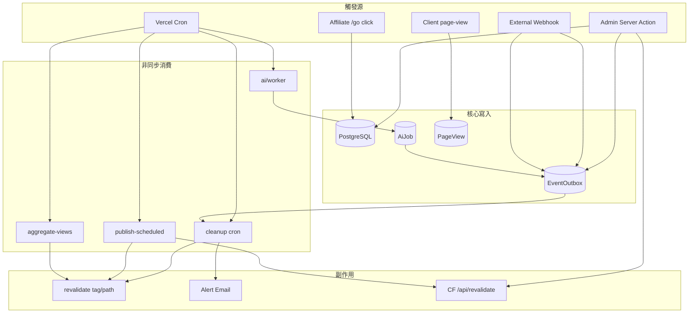
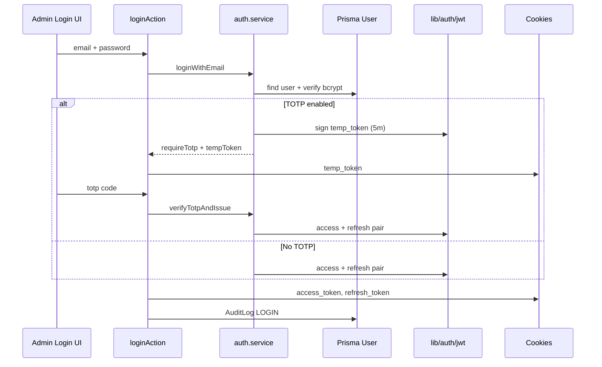
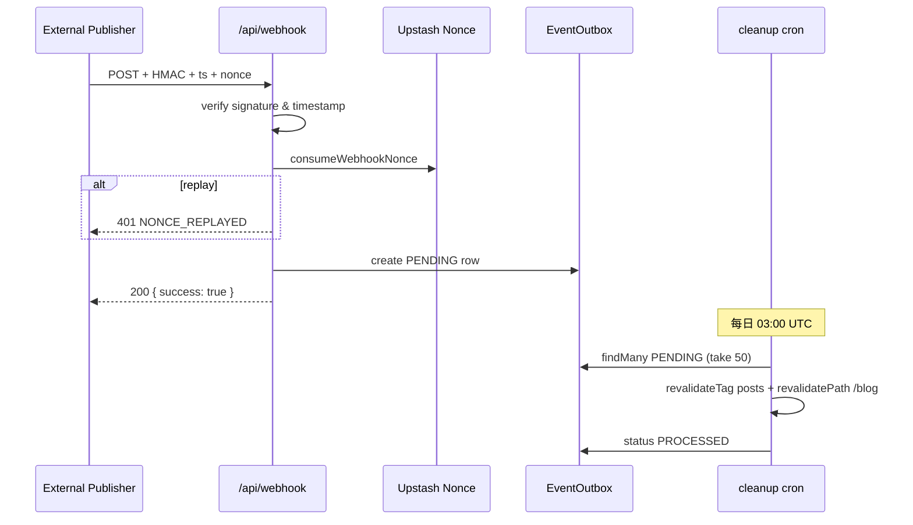
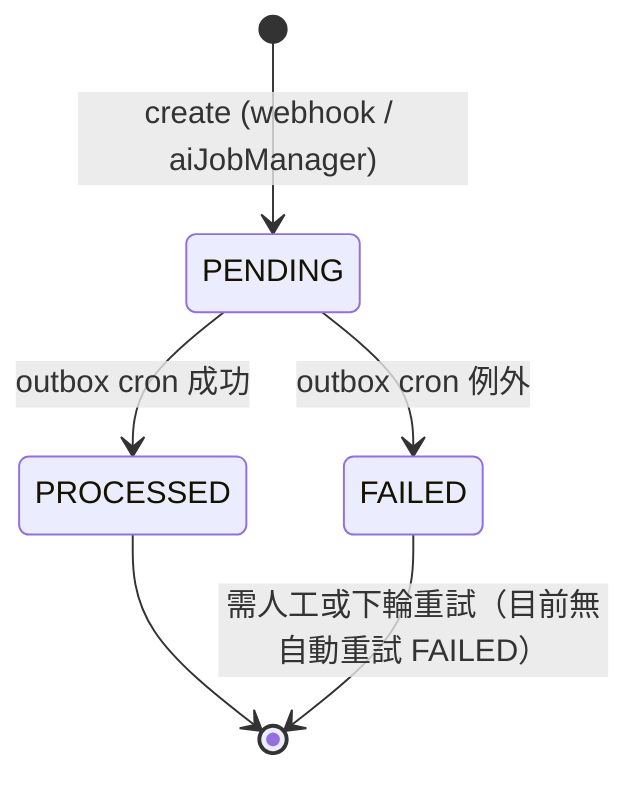
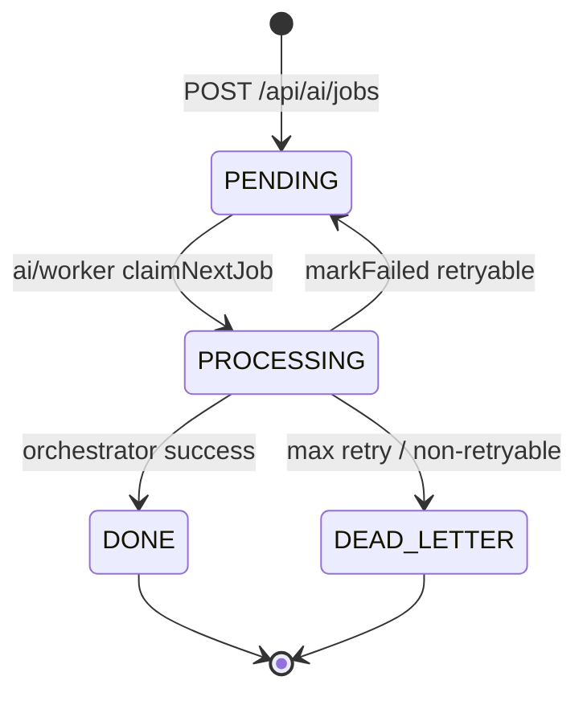
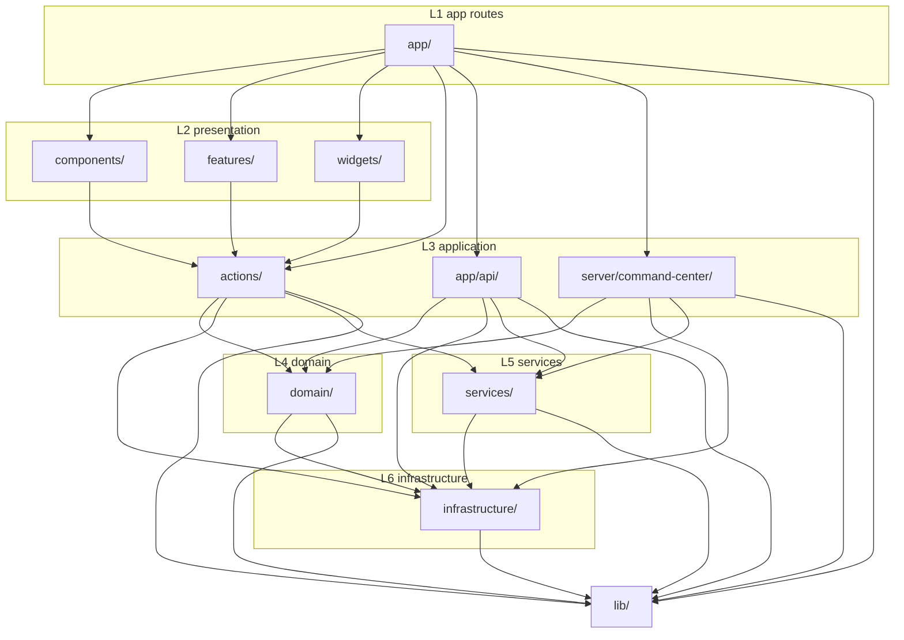
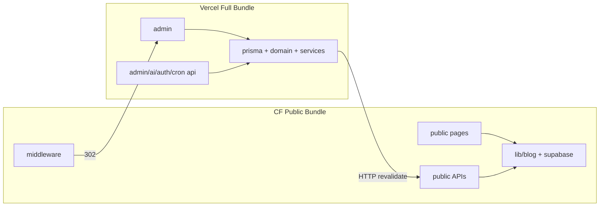

# 批次 B — 事件流與模組依賴

> **產品：** Zenith Mind Master Blueprint（合併版）  
> **說明：** EventOutbox、事件流、模組邊界與依賴規則  
> **來源檔案：** 04_EVENT_FLOW.md、05_MODULE_DEPENDENCY.md

---

## 本文件目錄

- [EVENT_FLOW.md](#event-flow-md)
- [MODULE_DEPENDENCY.md](#module-dependency-md)

---

## EVENT_FLOW.md

---

### 1. 文件目的

描述系統內 **商業事件、技術事件、非同步副作用** 的完整流動：觸發源、處理者、重試語意、快取失效與告警。  
供 AI 新增功能時判斷：應寫 Outbox、應直接 revalidate、或應進 Cron。

---

### 2. 事件分類

| 類型 | 定義 | 持久化 | 範例 |
|------|------|--------|------|
| **領域事件（Domain）** | 業務狀態變更的語意 | 通常經 Outbox 或 DB 狀態 | `PostPublished`, `AiJobCompleted` |
| **整合事件（Integration）** | 外部系統 webhook 送入 | `EventOutbox` | `POST_PUBLISHED` |
| **技術事件（Technical）** | 基礎設施、排程 | Cron log / logger | `DailyAggregateRefreshed` |
| **副作用（Side Effect）** | 快取、郵件、ISR | 執行點分散 | `revalidateTag("posts")` |

---

### 3. 全域事件總覽



---

### 4. 認證與工作階段事件流

#### 4.1 登入（含 TOTP）



| 步驟 | 檔案 |
|------|------|
| Action | `actions/auth.actions.ts` |
| Domain | `domain/auth/auth.service.ts` |
| JWT | `lib/auth/jwt.ts` |
| Edge 守衛 | `lib/middleware/auth-guard.ts`（僅驗 access JWT） |

#### 4.2 Token 刷新

| 觸發 | 路徑 | 行為 |
|------|------|------|
| 前端定時 | `POST /api/auth/refresh` | 驗 refresh → 新 pair → Redis 黑名單舊 refresh |
| 靜默刷新 | `components/analytics/SilentRefresh.tsx` | 依 `lib/auth/constants.ts` 間隔 |

#### 4.3 登出

`logoutAction` → `auth.service.logout` → 黑名單 token → 清除 cookies。

---

### 5. 內容發布事件流

#### 5.1 手動發布（Admin）

```
post.actions (update status → PUBLISHED)
  → prisma.post.update
  → writeAuditLog
  → purgePublicSiteAfterPostChange (lib/revalidate/purge-public-site.ts)
       → HTTP POST https://www.getzenithmind.com/api/revalidate
       → Bearer REVALIDATE_SECRET | WEBHOOK_SECRET
  → revalidateTag / revalidatePath (Vercel 本機快取)
```

**跨平面：** Vercel 後台變更需 **主動打公開站** `/api/revalidate`，否則 CF Worker ISR 可能過期。

#### 5.2 排程發布（Cron）

| 項目 | 值 |
|------|-----|
| **排程** | `0 4 * * *`（`vercel.json`） |
| **路由** | `GET /api/cron/publish-scheduled` |
| **認證** | `Authorization: Bearer ${CRON_SECRET}` |

**流程：**

```
Cron GET publish-scheduled
  → find Post where status=SCHEDULED AND scheduledAt <= now
  → foreach: update to PUBLISHED, set publishedAt
  → purgePublicSiteAfterPostChange per slug
  → revalidateTag("posts") on Vercel
```

**檔案：** `app/api/cron/publish-scheduled/route.ts`

#### 5.3 歸檔與 301

```
Post ARCHIVED + Redirect oldPath
  → redirectGuard (middleware) 讀 Supabase/Redis/Prisma 鏈
  → 301 to newPath
```

**注意：** Redirect 資料源在 Edge 與 API 間需一致（見 `02-EVENTS-AND-MODULES.md`（MODULE_DEPENDENCY 章） 風險區）。

---

### 6. Webhook 事件流（Frozen Core #3）

#### 6.1 端點契約

| 項目 | 規範 |
|------|------|
| **Method** | `POST /api/webhook` |
| **Headers** | `x-webhook-signature`, `x-webhook-timestamp`, `x-webhook-nonce` |
| **簽名** | `HMAC-SHA256(WEBHOOK_SECRET, "${timestamp}.${rawBody}")` hex |
| **時間窗** | ±5 分鐘 |
| **Nonce** | Redis `SET NX` 防重放（`infrastructure/redis/webhook-nonce.ts`） |
| **Body** | JSON `{ "event": string, "data": unknown }` |

#### 6.2 支援事件

| `event` | Outbox `eventType` | 立即副作用 |
|---------|-------------------|------------|
| `POST_PUBLISHED` | `POST_PUBLISHED` | 無（延遲至 Cron） |
| `AI_JOB_DONE` | `AI_JOB_DONE` | 無 |
| *其他* | — | `console.warn`，**200 OK**（向前相容） |

#### 6.3 序列圖



**契約詳見：** `06-INTEGRATION-AUTOMATION.md`（WEBHOOK 章）（含目標 v1 Zod envelope；現行仍為 loose parse）。

---

### 7. EventOutbox 狀態機

#### 7.1 模型

```prisma
// prisma/schema.prisma — 摘要
model EventOutbox {
  eventType String   // POST_PUBLISHED | AI_JOB_DONE | AI_JOB_DEAD_LETTER | ...
  payload   Json
  status    OutboxStatus  // PENDING | PROCESSED | FAILED
}
```

#### 7.2 狀態轉換



#### 7.3 消費者邏輯（outbox cron）

**檔案：** `lib/events/process-event-outbox.ts`（由 `app/api/cron/outbox/route.ts` 呼叫）  
**排程：** `15 3 * * *`（`vercel.json`；Hobby 僅支援每日）

| eventType | 處理 |
|-----------|------|
| `POST_PUBLISHED` | `revalidateTag("posts")`, `revalidatePath("/blog", "layout")` |
| `AI_JOB_DONE` | 同上 |
| `AI_JOB_DEAD_LETTER` | `sendAlertEmail` → 標記 PROCESSED |

**批次：** 每次最多 50 筆 `PENDING`，`orderBy createdAt asc`。

**設計原則：** Webhook **快速 ACK**；副作用 **最終一致**（可能延遲至隔日 Cron，除非另觸發 on-demand revalidate）。

---

### 8. On-Demand 快取失效

#### 8.1 公開站 API

| 項目 | 值 |
|------|-----|
| **路由** | `POST /api/revalidate` |
| **認證** | `Bearer REVALIDATE_SECRET` 或 `WEBHOOK_SECRET` |
| **Body** | `{ type, value }` 或 `{ items: [{ type, value }] }` |
| **護欄** | `assertRevalidateTarget` — 路徑/tag 白名單 |

**檔案：** `app/api/revalidate/route.ts`, `lib/security/revalidate-target.ts`

#### 8.2 後台觸發公開站

`lib/revalidate/purge-public-site.ts` → 對 `NEXT_PUBLIC_SITE_URL` 等發 POST。

**母版規則：** 任何在 Vercel 修改並影響公開 HTML 的寫入，應呼叫 `purgePublicSiteAfterPostChange` 或等價物。

---

### 9. AI Job 事件流

#### 9.1 狀態機



| 狀態 | 說明 |
|------|------|
| `PENDING` | FIFO 等待 Worker |
| `PROCESSING` | `lockedAt`, `lockedBy`, `timeoutAt`（120s SLA） |
| `DONE` | 寫入 `result`；建立 Outbox `AI_JOB_DONE` |
| `FAILED` | 中間態（重試時回到 PENDING） |
| `DEAD_LETTER` | Outbox `AI_JOB_DEAD_LETTER` + Email |

#### 9.2 建立 Job

```
Admin UI → POST /api/ai/jobs
  → verifyAccessToken (cookie)
  → CreateAiJobSchema (Zod)
  → prisma.aiJob.create (idempotencyKey UNIQUE)
  → status PENDING
```

**檔案：** `app/api/ai/jobs/route.ts`, `domain/ai/ai.validator.ts`

#### 9.3 Worker 執行

| 項目 | 值 |
|------|-----|
| **路由** | `GET /api/ai/worker` |
| **排程** | `10 5 * * *`（**每日一次**，非每分鐘） |
| **認證** | `CRON_SECRET` |
| **maxDuration** | 60s |

```
Worker GET
  → aiJobManager.claimNextJob()
       → recoverTimedOutJobs()  // PROCESSING 逾時 → markFailed retry
       → updateMany PENDING → PROCESSING (atomic)
  → switch job.type
       GENERATE_DRAFT → AiOrchestrator.generateDraft(jobId, payload, stepIndex)
  → markDone | markFailed
```

**檔案：** `app/api/ai/worker/route.ts`, `domain/ai/ai.orchestrator.ts`, `domain/ai/ai.job-manager.ts`

#### 9.4 Orchestrator 內部事件

| 階段 | 行為 |
|------|------|
| Token budget 檢查 | 日用量 ≥80% 告警語意；≥90% 降級模型；100% 熔斷 |
| 生成 | `AiPort.generate` → Zod `DraftResultSchema` 驗證 |
| Self-correction | 解析失敗 → 補充 prompt 重試 |
| Checkpoint | `stepIndex` 持久化於 `AiJob`（續跑） |

**重試語意：** `ActionError.retryable` 與 Job `markFailed(shouldRetry)` 分離；API 429 應 `retryable: true`。

---

### 10. 分析與 PageView 事件流

#### 10.1 客戶端記錄

```
Browser (consent granted)
  → recordPageViewClient / HomePageViewTracker / PageViewTracker
  → POST /api/public/page-view
  → recordPageViewCore
       → Zod validate
       → visitorHash = SHA256(ip + ua + PAGEVIEW_HASH_SALT)
       → CF: supabaseInsert("page_views")
       → Vercel: prisma.pageView.create
```

**隱私不變量：** 不存 raw IP 於 DB。

#### 10.2 日聚合

| 項目 | 值 |
|------|-----|
| **Cron** | `5 2 * * *` |
| **路由** | `/api/cron/aggregate-views` |
| **SQL** | `SELECT public.refresh_page_view_daily_aggregates()` |
| **快取** | `revalidateTag("page-view-stats")`, `revalidateTag("homepage-stats")` |

**檔案：** `app/api/cron/aggregate-views/route.ts`, Supabase migration in `supabase/`

---

### 11. 聯盟點擊事件流

```
GET /go/[slug]
  → prisma.affiliateLink.find (⚠ CF 上需 Supabase 分支)
  → increment click / daily aggregate
  → 302 → targetUrl
```

---

### 12. 整合健康檢查事件流

```
Admin → /api/admin/integrations/probe
  → services/integrations/probe-provider
  → 並行探測 GA4, GSC, Storage, Redis, ...
  → 回傳 ok / missing / error 計數
```

手動刷新：`/api/admin/integrations/refresh-health`

---

### 13. 排程總表（Cron Registry）

| Cron path | Schedule (UTC) | 認證 | 主要事件 |
|-----------|----------------|------|----------|
| `/api/cron/cleanup` | `0 3 * * *` | CRON_SECRET | 清理 PV/Audit（**不**消費 Outbox） |
| `/api/cron/outbox` | `15 3 * * *` | CRON_SECRET | **消費 EventOutbox**（revalidate / alert） |
| `/api/cron/aggregate-views` | `5 2 * * *` | CRON_SECRET | 日聚合 + revalidate stats tags |
| `/api/cron/publish-scheduled` | `0 4 * * *` | CRON_SECRET | 排程發布 + purge CF |
| `/api/ai/worker` | `10 5 * * *` | CRON_SECRET | 處理 1 筆 PENDING AiJob |

**權威設定：** `vercel.json`（非程式註解）。

**環境限制：** 僅 Vercel 執行；CF build stash 不含 cron routes。

---

### 14. 重試與冪等策略摘要

| 流程 | 冪等鍵 | 重試 |
|------|--------|------|
| Webhook | `x-webhook-nonce` | 客戶端重送 → nonce 擋重放 |
| AI Job 建立 | `idempotencyKey` UNIQUE | UI 連點安全 |
| AI Job 執行 | `claimNextJob` 條件更新 | 最多 3 次指數退避 |
| Outbox FAILED | — | **無自動**；需運維 |
| Revalidate POST | Bearer secret | 呼叫方 `purge-public-site` 可並行多 URL |

**外部 API Retry（現況）：** 未統一；見 `06-INTEGRATION-AUTOMATION.md`（INTEGRATION 章）（✅）。

---

### 15. 新增事件檢查清單（AI 必讀）

新增業務事件時必答：

1. 是否需 **Outbox**（跨服務、需 ACK 快）還是可同步 `revalidate`？  
2. 是否需 **purge 公開站**（Vercel 寫入 + CF 讀取）？  
3. Cron 消費者是否需 **新 case** in `lib/events/process-event-outbox.ts`？  
4. 是否需 **AuditLog**？  
5. CF 公開路徑是否 **禁止 Prisma**？  
6. Payload 是否需 **Zod + eventVersion**？

---

### 16. 機器可讀事件註冊表（YAML）

```yaml
events:
  - name: POST_PUBLISHED
    sources: [webhook, admin_purge]
    outbox: true
    consumer: cron/cleanup
    effects: [revalidateTag:posts, revalidatePath:/blog]
  - name: AI_JOB_DONE
    sources: [ai.job-manager.markDone]
    outbox: true
    consumer: cron/cleanup
  - name: AI_JOB_DEAD_LETTER
    sources: [ai.job-manager.markFailed]
    outbox: true
    consumer: cron/cleanup
    effects: [alert_email]
  - name: PAGE_VIEW_RECORDED
    sources: [api/public/page-view]
    outbox: false
    storage: [page_views]
  - name: SCHEDULED_POST_PUBLISHED
    sources: [cron/publish-scheduled]
    outbox: false
    effects: [purge_public_site, revalidateTag:posts]
crons:
  - path: /api/cron/cleanup
    schedule: "0 3 * * *"
  - path: /api/cron/aggregate-views
    schedule: "5 2 * * *"
  - path: /api/cron/publish-scheduled
    schedule: "0 4 * * *"
  - path: /api/ai/worker
    schedule: "10 5 * * *"
```

---

### 17. 相關文件

| 文件 | 狀態 |
|------|------|
| `02-EVENTS-AND-MODULES.md`（EVENT_FLOW 章） | ✅ 本文件 |
| `02-EVENTS-AND-MODULES.md`（MODULE_DEPENDENCY 章） | ✅ 批次 B |
| `06-INTEGRATION-AUTOMATION.md`（WEBHOOK 章） | ✅ |
| `06-INTEGRATION-AUTOMATION.md`（WORKFLOW 章） | ✅ |
| `06-INTEGRATION-AUTOMATION.md`（INTEGRATION 章） | ✅ |

---

*輸入「繼續」產出批次 C（資料層 + Edge 規則 + Seeding）。*


---

## MODULE_DEPENDENCY.md

---

### 1. 文件目的

定義 **模組邊界、允許的依賴方向、禁止的依賴、功能模組掛點**，避免 AI 或工程師引入循環依賴、跨層穿透、或 CF/Vercel 分裂部署下的 runtime 錯誤。

---

### 2. 依賴層級（Dependency Layers）

數字越小越內層；**只能依賴同層或更內層**（數字 ≤ 自身）。

| Layer | ID | 目錄 | 可依賴 |
|-------|-----|------|--------|
| L0 | `edge` | `middleware.ts`, `sentry.edge.config.ts` | `lib/middleware/*`, `lib/deploy/*`, `lib/i18n/routing` |
| L1 | `app` | `app/**` | L2–L6, L1 components |
| L2 | `presentation` | `components/`, `features/`, `widgets/`, `shared/ui/` | L3–L6, actions（client 呼叫） |
| L3 | `application` | `actions/`, `app/api/**`, `server/command-center/` | L4–L6 |
| L4 | `domain` | `domain/**` | L5–L6, L4 |
| L5 | `services` | `services/**` | L6, L5 |
| L6 | `infrastructure` | `infrastructure/**` | L6, `lib/*`（非 UI） |
| — | `lib` | `lib/**` | 橫切；**禁止** import L1–L3 |



---

### 3. 禁止依賴（Hard Rules）

| Rule ID | 禁止 | 原因 |
|---------|------|------|
| **MD-01** | `domain/` → `app/`, `components/`, `features/` | 領域純淨 |
| **MD-02** | `infrastructure/db/prisma` → 在 Edge/middleware 靜態 import | Node only |
| **MD-03** | `lib/auth/totp.ts` → Edge bundle | Node crypto + speakeasy |
| **MD-04** | `features/` → `prisma` 直接查詢 | 必須經 actions 或 server loader |
| **MD-05** | `components/(public)/` → `actions/admin*` | 公開 UI 不觸後台 mutation |
| **MD-06** | 公開 `app/(public)/` 新路徑 → `prisma` 無 `isCfPublicRuntime` 分支 | CF Worker 爆炸 |
| **MD-07** | `services/google/*` → `components/*` | 整合層不上 UI |
| **MD-08** | 繞過 `gateAdminWrite` 的 Server Action 寫入 | RBAC Frozen Core |

---

### 4. 功能模組矩陣（Product Modules）

以下為 **產品模組** 與程式目錄對照（非 npm package）。

#### 4.1 公開站（Public Site）

| 模組 ID | 功能 | 主要路徑 | 資料依賴 |
|---------|------|----------|----------|
| `pub-home` | 首頁 | `app/(public)/[locale]/page.tsx`, `components/home/*` | `lib/homepage/load-homepage-data.ts` |
| `pub-blog` | 部落格 | `app/(public)/[locale]/blog/**` | `lib/blog/load-blog-*` |
| `pub-about` | 關於 | `app/(public)/[locale]/about/` | site settings |
| `pub-affiliate` | 聯盟短鏈 | `app/(public)/go/[slug]/route.ts` | ✅ `getPublicContentRepository()` |
| `pub-seo` | SEO/JSON-LD | `components/seo/*`, `lib/seo/*` | — |
| `pub-analytics` | 同意後追蹤 | `components/analytics/*` | `/api/public/page-view` |
| `pub-health` | 降級橫幅 | `lib/db/public-data-health.ts` | health API |

#### 4.2 後台 CMS（Admin CMS）

| 模組 ID | 功能 | 路徑 | 寫入閘門 |
|---------|------|------|----------|
| `adm-posts` | 文章 CRUD | `app/admin/posts/**`, `actions/post*.ts` | `gateAdminWrite("post")` |
| `adm-media` | 媒體 | `app/admin/media/`, `actions/media.actions.ts` | `gateAdminWrite("media")` |
| `adm-site` | 站點 CMS | `app/admin/site/`, `actions/site.actions.ts` | `gateAdminWrite("site")` |
| `adm-affiliate` | 聯盟管理 | `app/admin/affiliate/`, `actions/affiliate*.ts` | `gateAdminWrite("affiliate")` |
| `adm-users` | 使用者 | `app/admin/users/` | `gateAdminWrite("user")` |
| `adm-audit` | 稽核 | `app/admin/audit-log/` | read + export API |

#### 4.3 Command Center（情報中心）

| 模組 ID | UI | Loader | 外部服務 |
|---------|-----|--------|----------|
| `cc-war-room` | `app/admin/dashboard/page.tsx` | `load-overview` 等 | 多源 |
| `cc-seo` | `features/seo-intelligence/` | `server/command-center/load-seo.ts` | GA4, GSC |
| `cc-geo` | `features/geo-intelligence/` | `load-geo.ts` | `services/geo/*` |
| `cc-aeo` | `features/aeo-intelligence/` | `load-aeo.ts` | 站內 + 示範 |
| `cc-traffic` | `features/traffic-intelligence/` | `load-traffic.ts` | GA4 |
| `cc-business` | `features/business-intelligence/` | `load-business.ts` | Ads/BQ |
| `cc-content` | `features/content-intelligence/` | `load-content.ts` | Prisma 聚合 |
| `cc-realtime` | `features/realtime/` | `load-realtime.ts`, SSE | `server/realtime/event-hub.ts` |
| `cc-forecast` | `features/forecast-center/` | `load-forecast.ts` | — |
| `cc-agents` | `features/agent-control/` | `load-agents.ts` | AiJob |
| `cc-integrations` | `features/integrations-hub/` | probe actions | `services/integrations/*` |
| `cc-security` | `features/security-center/` | `load-security.ts` | env/audit |
| `cc-errors` | `features/error-intelligence/` | `load-errors.ts` | Sentry |

**擴充掛點（標準）：**

```
1. features/<module>/components/*-page-view.tsx
2. server/command-center/load-<module>.ts
3. app/admin/dashboard/<module>/page.tsx
4. shared/config/admin-sidebar-nav.ts  ← 登記導航
5. types/command-center/module-payloads.ts  ← ViewModel 型別
```

#### 4.4 平台與自動化（Platform）

| 模組 ID | 路徑 | 僅 Vercel |
|---------|------|-----------|
| `plt-auth` | `actions/auth.actions.ts`, `app/api/auth/*` | ✅ |
| `plt-ai` | `app/api/ai/*`, `domain/ai/*` | ✅ |
| `plt-cron` | `app/api/cron/*` | ✅ |
| `plt-webhook` | `app/api/webhook/route.ts` | 路由可在 CF；消費在 Vercel |
| `plt-revalidate` | `app/api/revalidate/route.ts` | CF + Vercel |

---

### 5. 分裂部署依賴圖



#### 5.1 CF Build 排除清單（物理依賴）

**腳本：** `scripts/cf-public-build.mjs`  
**暫移目錄（不進 Worker bundle）：**

- `app/admin`
- `app/api/admin`, `app/api/ai`, `app/api/auth`, `app/api/cron`
- `app/sentry-example-page`, `app/api/sentry-example-api`

**AI 規則：** 新增後台 API **必須** 加入 `STASH_PATHS`，否則 CF 建置膨脹或洩漏 admin 程式碼。

#### 5.2 Runtime 分支依賴

| 函式 | 位置 | 分支 |
|------|------|------|
| `isCfPublicRuntime()` | `lib/db/cf-public-runtime.ts` | `CF_WORKER_RUNTIME=1` |
| `supabaseInsert/select` | `lib/db/supabase-rest.ts` | CF 讀寫 |
| `prisma` | `infrastructure/db/prisma.ts` | Vercel；CF 用 stub |

**已正確分支的模組：** `pub-blog`, `pub-home`, sitemap, post-access（部分）

**高風險未分支：**

| 模組 | 檔案 | 風險 |
|------|------|------|
| `pub-affiliate` | `app/(public)/go/[slug]/route.ts` | ✅ Supabase via `PublicContentRepository` |
| `pub-search` | `app/api/search/route.ts` | ✅ 同上 |

---

### 6. 核心模組依賴詳圖

#### 6.1 Auth 模組

```
components/admin/login
  → actions/auth.actions.ts
    → domain/auth/auth.service.ts
      → lib/auth/password.ts, lib/auth/jwt.ts
      → infrastructure/db (User)
middleware auth-guard
  → lib/auth/jwt.ts (verify only, Edge-safe)
```

#### 6.2 AI 模組

```
components/admin/AiAssistant
  → POST /api/ai/jobs
    → domain/ai/ai.validator (Zod)
    → prisma AiJob
  → GET /api/ai/jobs/[id] (poll)
  → GET /api/ai/worker (cron)
    → domain/ai/ai.job-manager
    → domain/ai/ai.orchestrator
      → domain/ai/ai.port
      → infrastructure/ai/openai.adapter.ts
    → eventOutbox (on done / dead letter)
```

#### 6.3 SEO 公開模組

```
app/(public)/[locale]/blog/[slug]/page.tsx
  → lib/blog/load-blog-post-data.ts
  → components/seo/JsonLd.tsx
  → lib/seo/schemas/article.schema.ts
middleware redirect-guard
  → lib/redirects/* (Supabase on edge)
```

#### 6.4 Command Center 模組（耦合熱點）

```
app/admin/dashboard/seo/page.tsx
  → features/seo-intelligence/components/seo-page-view.tsx
  → server/command-center/load-seo.ts
    → infrastructure/ga4/dashboard-bundle.ts
    → services/google/search-console.ts
```

**依賴深度：** 4–5 層；測試應 mock 最外層 loader 或 service。

---

### 7. 共享內核（Shared Kernel）

可被多模組依賴、**變更需謹慎** 的共用件：

| 模組 | 路徑 | 消費者 |
|------|------|--------|
| `ActionResult` | `domain/shared/core.types.ts` | 所有 actions |
| `Errors.*` | 同上 | actions, domain |
| `gateAdminRead/Write` | `lib/auth/resolve-admin-action.ts` | 所有 admin actions |
| `permissions` | `lib/auth/permissions.ts` | actions, UI banners |
| `logger` | `lib/logger.ts` | server, cron, domain |
| `env` | `env.ts` | 全站（build/runtime） |
| `routing i18n` | `lib/i18n/routing.ts` | middleware, public pages |
| `cn` | `shared/lib/cn.ts` | UI |
| `admin-sidebar-nav` | `shared/config/admin-sidebar-nav.ts` | Admin layout |

---

### 8. 外部依賴（Third-Party）

| 套件 | 使用模組 | Edge 安全 |
|------|----------|-----------|
| `@prisma/client` | Vercel only | ❌ |
| `@supabase/supabase-js` | CF REST | ✅ fetch |
| `@upstash/redis` | webhook, token, redirect cache | ✅ REST |
| `jose` | JWT | ✅ |
| `bcryptjs`, `speakeasy` | auth | ❌ Edge |
| `@google-analytics/data` | GA4 reporting | ❌ gRPC |
| `openai` / Gemini client | AI adapter | ❌ |
| `@sentry/nextjs` | monitoring | 部分 |
| `next-intl` | i18n | ✅ |

---

### 9. 循環依賴與熱點風險

| 熱點 | 描述 | 緩解 |
|------|------|------|
| **lib ↔ infrastructure** | 部分 lib 呼叫 infra adapters | 保持 lib 為薄工具；重邏輯放 infra |
| **features ↔ server** | 一對一 loader 名稱約定 | 建立 `MODULE_REGISTRY.yaml` |
| **purge ↔ revalidate** | 雙向觸發快取 | 文件化「寫入後必 purge」 |
| **Redirect 雙源** | middleware vs API | 統一 `RedirectRepository` port |
| **示範資料** | GEO/AEO fallback | Feature flag `USE_LIVE_GEO_API` |

---

### 10. 建議抽象化模組（Port 安裝點）

| Port 名稱 | 取代現狀 | 建議路徑 |
|-----------|----------|----------|
| `PublicContentRepository` | `lib/blog/*` 分散 | `domain/content/ports.ts` |
| `RedirectRepository` | redirect-guard + api/redirect | `domain/redirect/ports.ts` |
| `PageViewRecorder` | `record-page-view-core.ts` | `domain/analytics/ports.ts` |
| `CachePurger` | `purge-public-site.ts` | `domain/platform/cache-purger.ts` |
| `IntegrationProbePort` | `probe-provider.ts` | 已有，可正式化 interface |
| `EventPublisher` | 直接 `prisma.eventOutbox.create` | `domain/events/publisher.ts` |

**安裝方式：** Infrastructure 提供 `Prisma*` / `Supabase*` 實作；Application 層注入。

---

### 11. 新模組檢查清單（AI 必讀）

新增功能模組前：

- [ ] 確認 Layer（§2）與禁止規則（§3）  
- [ ] 公開功能是否需 `isCfPublicRuntime` 分支  
- [ ] 是否修改 `STASH_PATHS`（若為 admin-only）  
- [ ] 是否在 `admin-sidebar-nav.ts` 註冊  
- [ ] 寫入是否經 `gateAdminWrite`  
- [ ] 是否更新 `02-EVENTS-AND-MODULES.md`（EVENT_FLOW 章） 事件註冊表  
- [ ] 是否新增 Cron（僅 `vercel.json` + route）  
- [ ] 跨 CF/Vercel 是否需 `purgePublicSiteCache`  

---

### 12. 模組依賴矩陣（簡表）

行 = 依賴方，欄 = 被依賴方；✅ 允許，❌ 禁止，⚠ 條件

|  | domain | infra | services | actions | features | lib | prisma@CF |
|--|--------|-------|----------|---------|----------|-----|-----------|
| **features** | ❌ | ❌ | ❌ | ✅ | — | ✅ | ❌ |
| **actions** | ✅ | ✅ | ✅ | — | ❌ | ✅ | ⚠ Vercel |
| **server/cc** | ❌ | ✅ | ✅ | ❌ | ❌ | ✅ | ✅ Vercel |
| **app/(public)** | ❌ | ❌ | ❌ | ⚠ | ✅ | ✅ | ❌ |
| **middleware** | ❌ | ❌ | ❌ | ❌ | ❌ | ✅ | ❌ |
| **domain** | — | ✅ | ❌ | ❌ | ❌ | ✅ | ❌ |

---

### 13. 機器可讀模組註冊表（YAML）

```yaml
modules:
  - id: pub-blog
    layer: app
    routes: ["app/(public)/[locale]/blog"]
    loaders: [lib/blog/load-blog-post-data, lib/blog/load-blog-list-data]
    cf_safe: true
  - id: pub-affiliate
    layer: app
    routes: ["app/(public)/go/[slug]"]
    cf_safe: false
    remediation: add_supabase_branch
  - id: adm-posts
    layer: application
    routes: [app/admin/posts]
    actions: [actions/post.actions, actions/post.create.actions]
    deploy: vercel_only
  - id: cc-seo
    layer: presentation
    routes: [app/admin/dashboard/seo]
    loader: server/command-center/load-seo
    services: [infrastructure/ga4, services/google/search-console]
stash_on_cf_build:
  - app/admin
  - app/api/admin
  - app/api/ai
  - app/api/auth
  - app/api/cron
frozen_imports:
  edge_forbidden: [infrastructure/db/prisma, lib/auth/totp, bcryptjs]
```

---

### 14. 相關文件

| 文件 | 狀態 |
|------|------|
| `02-EVENTS-AND-MODULES.md`（MODULE_DEPENDENCY 章） | ✅ 本文件 |
| `02-EVENTS-AND-MODULES.md`（EVENT_FLOW 章） | ✅ |
| `03-DATA.md`（DATA_ACCESS_EDGE_RULES 章） | 批次 C |
| `10-AI-SPEC.md`（MODULE_GENERATION 章） | 批次 J |

---

*輸入「繼續」產出批次 C：`03-DATA.md`（DATABASE_SCHEMA 章）、`03-DATA.md`（DATA_LIFECYCLE 章）、`03-DATA.md`（MIGRATION_STRATEGY 章）、`03-DATA.md`（DATA_ACCESS_EDGE_RULES 章）。*

