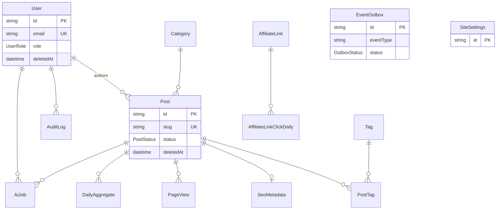
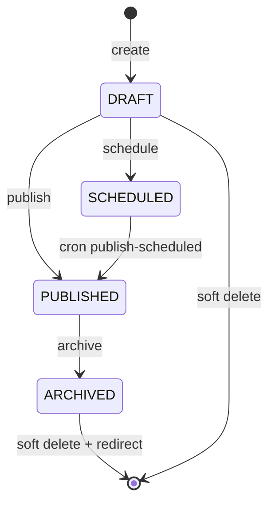
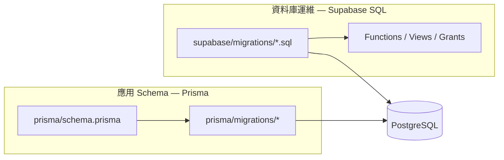

# 批次 C — 資料與遷移

> **產品：** Zenith Mind Master Blueprint（合併版）  
> **說明：** Schema、生命週期、遷移策略、Edge 資料存取  
> **來源檔案：** 06_DATABASE_SCHEMA.md、07_DATA_LIFECYCLE.md、08_MIGRATION_STRATEGY.md、09_DATA_ACCESS_EDGE_RULES.md

---

## 本文件目錄

- [DATABASE_SCHEMA.md](#database-schema-md)
- [DATA_LIFECYCLE.md](#data-lifecycle-md)
- [MIGRATION_STRATEGY.md](#migration-strategy-md)
- [DATA_ACCESS_EDGE_RULES.md](#data-access-edge-rules-md)

---

## DATABASE_SCHEMA.md

---

### 1. 概述

| 項目 | 值 |
|------|-----|
| **引擎** | PostgreSQL 15+（Supabase 託管） |
| **ORM** | Prisma Client + `driverAdapters` preview |
| **連線（App）** | `DATABASE_URL` → Transaction pooler **:6543** |
| **連線（Migrate）** | `DIRECT_URL` → Direct **:5432** |
| **公開讀取（CF）** | PostgREST + 白名單表（`lib/db/supabase-rest-tables.ts`） |
| **表數量** | 18 Prisma models + 2 SQL Views（`v_*`） |

---

### 2. ERD（實體關係圖）



---

### 3. 枚舉（Enums）

| Enum | 值 | 用途 |
|------|-----|------|
| `UserRole` | ADMIN, GUEST | 後台 RBAC |
| `PostStatus` | DRAFT, PUBLISHED, SCHEDULED, ARCHIVED | 內容生命週期 |
| `AiJobStatus` | PENDING, PROCESSING, DONE, FAILED, DEAD_LETTER | AI 佇列 |
| `AiJobType` | GENERATE_DRAFT, OPTIMIZE_TITLE, EXTRACT_FAQ | AI 任務類型 |
| `AuditAction` | CREATE, UPDATE, DELETE, LOGIN, … | 稽核 |
| `OutboxStatus` | PENDING, PROCESSED, FAILED | 事件外盒 |
| `IntegrationConnectionStatus` | DISCONNECTED, CONNECTED, ERROR | 整合憑證 |

---

### 4. 實體目錄

#### 4.1 身分與稽核

##### `users`（User）

| 欄位 | 類型 | 說明 |
|------|------|------|
| `email` | String @unique | 登入識別 |
| `password` | String | bcrypt hash |
| `totpSecret` | String? | AES-256-CBC 加密 |
| `totpEnabled` | Boolean | 2FA 開關 |
| `role` | UserRole | ADMIN / GUEST |
| `deletedAt` | DateTime? | 軟刪除 |

**索引：** `email`, `(email, deletedAt)`, `deletedAt`

##### `audit_logs`（AuditLog）

| 欄位 | 說明 |
|------|------|
| `action` | AuditAction |
| `entityType`, `entityId` | 操作對象 |
| `metadata` | Json 結構化附註 |
| `ipMasked` | 完整 IP 字串（欄位名歷史遺留） |
| `requestId` | 鏈路追蹤 |

**索引：** `createdAt`, `(userId, createdAt)`, `(action, entityType)`

---

#### 4.2 內容核心

##### `posts`（Post）

| 欄位群 | 重點 |
|--------|------|
| **識別** | `slug` @unique；發布後應用層禁止改 slug |
| **多語** | `title`/`content` + `*En` |
| **內容格式** | `contentType`: markdown \| tiptap；`contentBlocks`, `contentDoc` Json |
| **SEO 內容** | `faq` Json + `faqVersion` |
| **排程** | `scheduledAt`, `publishedAt` |
| **密碼文** | `isPasswordProtected`, `accessPasswordHash` |
| **pSEO** | `isProgrammatic`, `pSeoTemplate` |
| **封面** | `coverImage*` + width/height/blurHash（CLS） |
| **軟刪** | `deletedAt`；刪除應配 `redirects` |

**關聯：** `authorId` → User；`categoryId` → Category；1:N PageView, DailyAggregate, AiJob

**關鍵索引：**

- `(status, publishedAt)` — 公開列表
- `(status, deletedAt, publishedAt)` — 篩選已發布
- `(scheduledAt, status)` — 排程 Cron
- `slug` — 詳頁路由

##### `categories` / `tags` / `post_tags`

- Category：`slug` unique；軟刪 `deletedAt`
- Tag：多對多經 `post_tags`，composite PK `(postId, tagId)`，Cascade delete

##### `seo_metadata`（SeoMetadata）

- 1:1 `postId` @unique，Cascade delete
- `keywords`：PostgreSQL `String[]`
- `noIndex`, `noFollow`；OG 欄位

##### `redirects`（Redirect）

| 欄位 | 說明 |
|------|------|
| `oldPath` | @unique，Middleware 查詢鍵 |
| `newPath` | 目標路徑 |
| `statusCode` | 預設 301 |
| `isActive` | 開關 |

---

#### 4.3 站點 CMS（Singleton + 區域）

##### `site_settings`（SiteSettings）

- **PK 固定：** `id = "site"`（單租戶假設）
- JSON：`quickLinks`, `socialLinks`, `homepageCopy`, `aboutSections`
- 輪播秒數：`heroAutoplaySeconds`, `carouselAutoplaySeconds`

##### `hero_slides` / `home_carousel_items`

- 依 `locale` 分區；`sortOrder`, `isActive`
- Hero 含 `textX`, `textY`, `imageHref`

##### `ad_slots`（AdSlot）

- Unique `(slotKey, locale)`；圖片寬高、`aspectRatio`（防 CLS）

---

#### 4.4 分析

##### `page_views`（PageView）

| 欄位 | 隱私 |
|------|------|
| `visitorHash` | SHA-256(IP+UA+salt)，**無 raw IP** |
| `postId` | null = 首頁瀏覽 |
| `locale` | zh-TW / en |
| `referer` | 可選 |

**保留：** 180 天（見 `03-DATA.md`（DATA_LIFECYCLE 章））

##### `daily_aggregates`（DailyAggregate）

- Unique `(date, postId)`
- `views`, `uniqueVisitors`（日 distinct hash）

##### `site_daily_aggregates`（SiteDailyAggregate）

- Unique `(date, locale)`；首頁流量

##### SQL View（Supabase 維護，非 Prisma model）

| View | 用途 |
|------|------|
| `v_post_view_totals` | 文章累計瀏覽（歷史聚合 + 當日） |
| `v_site_view_totals` | 首頁累計瀏覽 |

---

#### 4.5 聯盟

##### `affiliate_links` / `affiliate_link_click_daily`

- `slug` → `/go/[slug]`
- `clickCount` 總計 + 日表 `(affiliateLinkId, date)` PK

---

#### 4.6 自動化

##### `ai_jobs`（AiJob）

| 欄位 | 說明 |
|------|------|
| `idempotencyKey` | @unique，防重複提交 |
| `status` | 狀態機 |
| `payload`, `result`, `failedReason` | Json |
| `lockedAt`, `lockedBy`, `timeoutAt` | 分散式鎖語意 |
| `stepIndex`, `partialResult` | Checkpoint / token 計數（待拆分） |

##### `event_outbox`（EventOutbox）

- `eventType` + `payload` Json
- `status`: PENDING → PROCESSED | FAILED

---

#### 4.7 整合

##### `integration_credentials`（IntegrationCredential）

- `provider` @unique（如 ga4, gsc）
- `payloadEncrypted` @db.Text
- `status`, `lastError`, `lastVerifiedAt`

---

### 5. 索引策略摘要

| 模式 | 代表表 | 查詢場景 |
|------|--------|----------|
| 時間範圍清理 | PageView, AuditLog | `createdAt` |
| 狀態 + 時間 | Post, AiJob | 列表、Worker |
| 唯一業務鍵 | slug, oldPath, idempotencyKey | 路由、防重 |
| 外鍵 | postId, categoryId | Join / 聚合 |

**AI 規則：** 新增高頻查詢欄位必須加 index 或說明理由；禁止無 index 的全表掃描於 Middleware。

---

### 6. 多租戶擴充預留（Schema 演進）

現行 **無 `tenantId`**。SaaS 化時建議：

| 表 | 變更 |
|----|------|
| 幾乎所有業務表 | 加 `tenantId String` + composite unique |
| `site_settings` | PK 改 `tenantId` 或 `(tenantId)` unique |
| `users` | `email` unique 改 `(tenantId, email)` |

**遷移策略：** 見 `03-DATA.md`（MIGRATION_STRATEGY 章） §6。

---

### 7. Prisma ↔ Supabase 雙軌物件

| 類型 | 維護方式 | 範例 |
|------|----------|------|
| Tables | Prisma migrate | `posts`, `page_views` |
| Functions | Supabase SQL | `refresh_page_view_daily_aggregates()` |
| Views | Supabase SQL | `v_post_view_totals` |
| Grants | Supabase SQL | `service_role` on tables |

**風險：** 僅跑 Prisma 而漏 Supabase SQL → Cron 聚合或 CF 讀 View 失敗。

---

### 8. 機器可讀 Schema 摘要（YAML）

```yaml
datasource:
  provider: postgresql
  app_url_env: DATABASE_URL
  direct_url_env: DIRECT_URL
  pooler_port: 6543
  direct_port: 5432
models:
  - users
  - posts
  - categories
  - tags
  - post_tags
  - seo_metadata
  - redirects
  - page_views
  - daily_aggregates
  - site_daily_aggregates
  - affiliate_links
  - affiliate_link_click_daily
  - ai_jobs
  - audit_logs
  - event_outbox
  - site_settings
  - hero_slides
  - home_carousel_items
  - ad_slots
  - integration_credentials
views:
  - v_post_view_totals
  - v_site_view_totals
functions:
  - refresh_page_view_daily_aggregates
```

---

### 9. 相關文件

| 文件 | 狀態 |
|------|------|
| `03-DATA.md`（DATABASE_SCHEMA 章） | ✅ 本文件 |
| `03-DATA.md`（DATA_LIFECYCLE 章） | ✅ 批次 C |
| `03-DATA.md`（MIGRATION_STRATEGY 章） | ✅ 批次 C |
| `03-DATA.md`（DATA_ACCESS_EDGE_RULES 章） | ✅ 批次 C |

---

*Schema 變更僅透過 Prisma migrate + 審核過的 Supabase SQL；禁止手改 production 無 migration 紀錄。*


---

## DATA_LIFECYCLE.md

---

### 1. 文件目的

定義資料的 **建立、讀取、更新、刪除、保留、歸檔、所有權** 規則，確保 SEO、隱私合規與 SaaS 擴充時資料隔離一致。

---

### 2. 資料所有權（Data Ownership）

| 資料類 | 擁有者 | 寫入者 | 讀取者 |
|--------|--------|--------|--------|
| 內容 `Post` | 平台 / 編輯 | Admin Actions（Vercel） | 公開 RSC（CF/Vercel） |
| 站點設定 | 平台 | `site.actions` | 公開 homepage loaders |
| PageView | 訪客（匿名 hash） | `/api/public/page-view` | Admin 統計、公開 social proof |
| AuditLog | 合規 | Server Actions（fire-and-forget） | Admin audit UI |
| AiJob | 編輯觸發 | `/api/ai/jobs` + Worker | Admin agents UI |
| IntegrationCredential | 平台密鑰 | Admin 整合設定 | Probe services |
| Redirect | SEO 維運 | Admin + 歸檔流程 | Middleware Edge |

**單租戶假設：** 所有資料屬同一邏輯租戶；`SiteSettings.id = "site"` 為全域設定根。

---

### 3. 實體生命週期

#### 3.1 Post（文章）



| 狀態 | 公開可見 | 說明 |
|------|----------|------|
| `DRAFT` | ❌ | 僅後台 |
| `SCHEDULED` | ❌ 直到 `scheduledAt` | Cron 轉 PUBLISHED |
| `PUBLISHED` | ✅（無密碼門檻時） | sitemap、列表、ISR |
| `ARCHIVED` | ❌ | 應配 301 Redirect |

**不變量：**

- 發布後 **禁止改 `slug`**（應用層強制；改 slug 需新建 Redirect）。
- 刪除使用 **`deletedAt` 軟刪**，不硬刪（保留 SEO 修復空間）。
- 密碼文：`accessPasswordHash` bcrypt；解鎖 token 見 `post-access` cookie。

**副作用：**

- 發布 → `purgePublicSiteCache` + 可選 EventOutbox
- 歸檔/刪除 → `Redirect` + revalidate

---

#### 3.2 User（後台帳號）

| 階段 | 行為 |
|------|------|
| Bootstrap | `seedBootstrapAdminIfEmpty`（env `ADMIN_BOOTSTRAP_*`） |
| Guest | `seedGuestUserIfMissing`（預設 guest@…） |
| 停用 | `deletedAt` 非 null；登入拒絕 |
| TOTP | 啟用後登入改 temp_token 流程 |

**不變量：** 密碼僅 bcrypt 儲存；TOTP secret 加密。

---

#### 3.3 PageView（瀏覽）

```
建立：每次合法 POST page-view → insert
聚合：每日 cron → daily_aggregates / site_daily_aggregates
清理：cleanup cron → DELETE where createdAt < 180 days
讀取：Dashboard 用聚合表；即時用 View v_*
```

**隱私生命週期：**

| 階段 | 資料 |
|------|------|
| 收集 | IP+UA → **僅 hash** 入庫 |
| 儲存 | `visitorHash`, referer, locale |
| 刪除 | 180 天後實體列刪除 |
| 禁止 | 還原 raw IP（無此欄位） |

---

#### 3.4 AiJob

見 `02-EVENTS-AND-MODULES.md`（EVENT_FLOW 章） §9。補充：

- `DONE` / `DEAD_LETTER` 列 **保留**（無自動清理；需運維政策）
- `partialResult` 含中間 AI 輸出（注意 token 與 PII）

---

#### 3.5 EventOutbox

| 狀態 | 保留 |
|------|------|
| PENDING | 直到 Cron 處理 |
| PROCESSED | 永久（建議未來加清理政策） |
| FAILED | 永久（需人工介入） |

---

#### 3.6 AuditLog

- **保留 90 天** → `cleanupAuditLogs()`
- 寫入：**非同步**，失敗僅 log，不阻擋主流程

---

### 4. 保留政策（Retention Policy）

| 實體 | 保留期 | 清理機制 | 檔案 |
|------|--------|----------|------|
| `PageView` | **180 天** | `deleteMany` | `audit.prisma-adapter.ts` |
| `AuditLog` | **90 天** | `deleteMany` | 同上 |
| `DailyAggregate` | 長期 | 未自動刪（體積小） | — |
| `Post`（軟刪） | 永久直到硬刪政策 | 無自動 | — |
| `EventOutbox` PROCESSED | 未定 | 無 | 技術債 |
| `AiJob` | 未定 | 無 | 技術債 |

**Cron：** `GET /api/cron/cleanup` @ `0 3 * * *`（`vercel.json`）

---

### 5. 軟刪除 vs 硬刪除

| 模型 | 軟刪欄位 | 公開查詢過濾 |
|------|----------|--------------|
| `Post` | `deletedAt` | ✅ `deletedAt: null` |
| `User` | `deletedAt` | ✅ 登入檢查 |
| `Category`, `Tag` | `deletedAt` | ✅ 列表過濾 |

**硬刪場景：** 僅運維腳本或明確 GDPR 刪除流程（**尚無** 自動化 erasure API）。

---

### 6. 歸檔與 SEO 資料生命週期

```
Post ARCHIVED 或 slug 變更
  → 建立 Redirect (oldPath → newPath, 301)
  → Middleware redirectGuard 讀取（Supabase + Redis cache）
  → 舊 URL 流量導向新 URL
```

**Redirect 列：** 無 `deletedAt`；以 `isActive` 控制。

**循環檢測：** `lib/redirects/cycle.ts` — `resolveSafeFirstRedirectHop`

---

### 7. 快取與資料新鮮度

| 資料 | 快取層 | TTL / 失效 |
|------|--------|------------|
| 公開文章 | Next ISR / fetch cache | `revalidate: 3600` on Supabase fetch |
| 站點設定 | `site-settings-cache` | tag revalidate |
| 首頁統計 | `homepage-data-cache` | `page-view-stats`, `homepage-stats` tags |
| Redirect | Redis | `lib/redirects/redis-cache` |

**寫入後失效：** 見 `02-EVENTS-AND-MODULES.md`（EVENT_FLOW 章） — purge + revalidateTag。

---

### 8. 環境生命週期（Dev / Staging / Prod）

| 環境 | 建議資料 | 風險 |
|------|----------|------|
| **Local Dev** | 獨立 Supabase 專案 | 與 Prod 共用 → 誤刪真實文章 |
| **Preview** | Dev 或 Staging | Vercel Preview env |
| **Production** | 正式專案 | CF + Vercel 讀寫 |

詳見 `docs/DATABASE-ENVIRONMENTS.md` 與 `03-DATA.md`（MIGRATION_STRATEGY 章）。

**防呆：** `ALLOW_PRODUCTION_DATABASE=1` 才允許對 prod 跑 `migrate deploy`。

---

### 9. 備份與復原（高層）

| 項目 | 責任方 |
|------|--------|
| Postgres 備份 | Supabase 自動備份（依方案） |
| 物件儲存 | Supabase Storage bucket |
| 應用層還原 | 手動 point-in-time + migration 重跑 |

詳見 `09-OPERATIONS.md`（BACKUP 章）。

---

### 10. SaaS 化資料生命週期（目標）

#### 10.1 租戶建立（Onboarding）

```
TenantProvisioned
  → seed categories (sync-default-categories)
  → seed SiteSettings template
  → seed admin user (per-tenant bootstrap)
  → optional IntegrationCredential placeholders
```

現行僅 **全域** `seedBootstrapAdminIfEmpty` — 見 `04-SEEDING.md`（✅ 已產出）。

#### 10.2 租戶停用

```
TenantSuspended
  → 公開站 503 或停機頁
  → 保留資料（法規允許期間）
TenantDeleted
  → 軟刪 + 排程硬刪（需 legal retention 政策）
```

---

### 11. GDPR / 隱私對照

| 要求 | 實作 |
|------|------|
| 最小化 | PageView 無 raw IP |
| 存取日誌 | AuditLog 含 IP（後台追蹤） |
| 刪除權 | 無自助；需流程 |
| 加密靜態 | Supabase + `IntegrationCredential` 應用層加密 |

---

### 12. AI 資料生命週期規則

| 規則 ID | 內容 |
|---------|------|
| DL-AI-01 | AI 輸入不得寫入 PageView |
| DL-AI-02 | `result` Json 可能含生成內容；存於 `ai_jobs` |
| DL-AI-03 | 日 Token 統計應獨立欄位（勿長期借用 `stepIndex`） |
| DL-AI-04 | DEAD_LETTER 觸發 Email，列永久保留至處理 |

---

### 13. 機器可讀生命週期表（YAML）

```yaml
entities:
  post:
    states: [DRAFT, SCHEDULED, PUBLISHED, ARCHIVED]
    soft_delete: deletedAt
    slug_immutable_after_publish: true
  page_view:
    retention_days: 180
    pii: visitorHash_only
  audit_log:
    retention_days: 90
  event_outbox:
    terminal_states: [PROCESSED, FAILED]
cron_cleanup:
  path: /api/cron/cleanup
  schedule: "0 3 * * *"
```

---

### 14. 相關文件

| 文件 | 狀態 |
|------|------|
| `03-DATA.md`（DATA_LIFECYCLE 章） | ✅ 本文件 |
| `04-SEEDING.md` | ✅ |
| `09-OPERATIONS.md`（BACKUP 章） | 批次 I |

---

*輸入「繼續」產出批次 E：`05-API-AUTH-PERMISSIONS.md`（API_CONTRACT 章）, `05-API-AUTH-PERMISSIONS.md`（AUTH_FLOW 章）, `05-API-AUTH-PERMISSIONS.md`（PERMISSION_MATRIX 章）。*


---

## MIGRATION_STRATEGY.md

---

### 1. 文件目的

規範 **Schema 變更、部署順序、環境隔離、回滾策略**，避免 AI 或工程師直接改 production 資料庫導致 CF/Vercel 分裂部署失敗。

---

### 2. 雙軌遷移模型



| 軌道 | 路徑 | 負責內容 |
|------|------|----------|
| **Prisma** | `prisma/migrations/` | Tables, columns, indexes, enums 對應 DDL |
| **Supabase** | `supabase/migrations/` | RPC、View、GRANT、修正 PostgREST |

**規則：** 新功能若需 **View/Function**，必須同 PR 提交 Supabase SQL；不可只改 Prisma。

---

### 3. Prisma 遷移清單（現行）

| Migration | 主題 |
|-----------|------|
| `20260214103000_post_cover_blocks_ad_slots` | 封面區塊、廣告位 |
| `20260215140000_hero_image_href_carousel_timing` | Hero/Carousel |
| `20260515120000_page_view_daily_rollup` | 日聚合表結構 |
| `20260516120000_integration_credentials` | 整合憑證表 |
| `20260518150000_guest_role_post_password` | GUEST 角色、文章密碼 |
| `20260520130000_seo_focus_keyword_en` | SEO 英文關鍵字 |
| `20260520140000_affiliate_click_daily` | 聯盟日點擊 |
| `20260520150000_drop_newsletter_subscribers` | 移除 newsletter 表 |

**鎖定檔：** `prisma/migrations/migration_lock.toml` → `postgresql`

---

### 4. Supabase SQL 遷移清單（現行）

| 檔案 | 主題 |
|------|------|
| `20260515120000_page_view_daily_rollup.sql` | `refresh_page_view_daily_aggregates()`、Views、grants |
| `20260515130000_fix_postgrest_grants_and_reload.sql` | PostgREST 權限 |
| `20260518150000_post_password_protection.sql` | 密碼欄位 RLS/權限（若適用） |
| `20260519150000_fix_view_totals_columns.sql` | View 欄位修正 |
| `20260519160000_fix_site_daily_aggregate_rpc_id.sql` | RPC id 修正 |

**執行方式：**

- Supabase Dashboard SQL Editor，或  
- `supabase db push`（若專案有 CLI 連結）

---

### 5. 標準工作流程

#### 5.1 本機開發（Schema 變更）

```bash
## 1. 確認連到 DEV 資料庫（非 Production）
node --env-file=.env.local scripts/db-connection-info.mjs

## 2. 修改 prisma/schema.prisma

## 3. 產生 migration（互動命名）
npm run db:migrate
## 內部：node scripts/prisma-with-local-env.mjs migrate dev

## 4. 若有 View/Function 需求 → 新增 supabase/migrations/YYYYMMDDHHMMSS_desc.sql

## 5. 驗證
npm run type-check
npm run test
```

**禁止：** 對 production `DATABASE_URL` 跑 `migrate dev`。

#### 5.2 CI / Production 部署

```bash
## Production（需明確授權）
ALLOW_PRODUCTION_DATABASE=1 npm run db:deploy
## 或 prisma migrate deploy with production env
```

**Vercel：** 可在 build 前 hook `prisma migrate deploy`（目前專案以手動/維運為主 — 確認 `package.json` `db:deploy`）。

#### 5.3 變更後應用部署

| 變更類型 | 部署順序 |
|----------|----------|
| 僅新增 nullable 欄位 | migrate deploy → Vercel → CF（可並行） |
| 新增必填欄位 | migrate → **回填資料** → deploy app |
| 新增 View/Function | Supabase SQL → deploy app（依賴新 RPC） |
| 刪表/改名 | migrate → deploy（單一維護窗口） |

---

### 6. 環境與連線策略

| 變數 | Port | 用途 |
|------|------|------|
| `DATABASE_URL` | **6543** | App runtime（PgBouncer transaction mode） |
| `DIRECT_URL` | **5432** | `prisma migrate`、introspect |

**腳本：** `scripts/prisma-with-local-env.mjs` — 載入 `.env.local`，migrate 前警告 Supabase host。

**文件：** `docs/DATABASE-ENVIRONMENTS.md`

---

### 7. 回滾策略

| 情境 | 策略 |
|------|------|
| Migration 失敗 mid-deploy | 修復 SQL，新 migration 前進（**不用** migrate rollback 生產） |
| App 與 Schema 不符 | 優先 rollback app deploy；Schema 保留向後相容欄位 |
| 錯誤資料 | 從 Supabase PITR 還原（依訂閱） |

**Prisma 不提供** 自動 down migration 於 production — 以 **前進修復 migration** 為主。

---

### 8. 破壞性變更檢查清單

變更 `schema.prisma` 前必答：

- [ ] 是否新增 **NOT NULL** 無 default？→ 需 backfill  
- [ ] 是否改 `slug` unique？→ 需 Redirect  
- [ ] 是否刪欄位仍被 CF 舊 bundle 讀取？→ 分階段 deploy  
- [ ] 是否影響 `supabase-rest-tables` 白名單？  
- [ ] 是否需更新 `refresh_page_view_daily_aggregates`？  
- [ ] CF 公開 loader 是否需 Supabase 分支？  

---

### 9. SaaS 多租戶遷移（未來）

建議分階段：

| Phase | 內容 |
|-------|------|
| 1 | 加 nullable `tenantId`，backfill 預設租戶 |
| 2 | 改 unique 為 `(tenantId, slug)` 等 |
| 3 | RLS policies per tenant（Supabase） |
| 4 | 應用層注入 `TenantContext` |

**禁止：** 大 bang 單次切換無 backfill。

---

### 10. 與 OpenNext / CF 建置的關係

- `prisma generate` 在 **CI**（GHA `deploy.yml`）與 **postinstall** 執行  
- CF 公開建置 **不打包** Prisma engine（`prisma-public-stub` alias）  
- Schema 變更影響 CF 時，只需 **Supabase REST 相容**（欄位需 PostgREST 暴露或透過 View）

**新增表給 CF 讀取：**

1. Prisma migration 建表  
2. `GRANT` + PostgREST reload（Supabase SQL）  
3. 加入 `lib/db/supabase-rest-tables.ts` 白名單  
4. 實作 loader 分支  

---

### 11. 版本對齊矩陣

| 元件 | 版本 |
|------|------|
| Prisma | 6.8.0 |
| Node | ≥22 |
| PostgreSQL | Supabase 託管 |

`package.json` `postinstall`: `prisma generate`

---

### 12. 機器可讀（YAML）

```yaml
migration:
  orm: prisma
  lock: postgresql
  dev_command: npm run db:migrate
  deploy_command: npm run db:deploy
  direct_url_required: true
  supabase_sql_path: supabase/migrations/
  production_guard_env: ALLOW_PRODUCTION_DATABASE
post_deploy:
  - prisma generate
  - npm run build (vercel)
  - npm run build:cf (cloudflare)
```

---

### 13. 相關文件

| 文件 | 狀態 |
|------|------|
| `03-DATA.md`（MIGRATION_STRATEGY 章） | ✅ 本文件 |
| `03-DATA.md`（DATABASE_SCHEMA 章） | ✅ |
| `03-DATA.md`（DATA_ACCESS_EDGE_RULES 章） | ✅ |
| `09-OPERATIONS.md`（DEPLOYMENT 章） | 批次 I |

---

*任何 migration PR 應附：變更說明、是否需 Supabase SQL、是否需 backfill、deploy 順序。*


---

## DATA_ACCESS_EDGE_RULES.md

---

### 1. 文件目的

Cloudflare Worker（Edge）與 Next.js Middleware 的 **資料存取鐵律**：相容性、連線池、延遲預算、分裂部署下的 Prisma/Supabase 分工。

違反本文件會導致：**Worker 啟動失敗、503、CPU 超限、連線池耗盡、SEO 301 失敗**。

---

### 2. 執行環境分類

| 類別 | 識別 | 允許的 IO |
|------|------|-----------|
| **Edge Middleware** | `middleware.ts` | fetch、Redis REST、Supabase REST、JWT verify |
| **CF Worker RSC/API** | `CF_WORKER_RUNTIME=1` | 同上 + 輕量 transform |
| **Node Server** | Vercel、未設 CF 旗標 | Prisma、bcrypt、TOTP、GA4 gRPC、nodemailer |
| **Build-time** | `next build` / `build:cf` | 可無 DB；`generateStaticParams` 回傳 `[]` 若無 DB |

```typescript
// lib/db/cf-public-runtime.ts
export function isCfPublicRuntime(): boolean {
  return process.env["CF_WORKER_RUNTIME"] === "1";
}
```

---

### 3. 鐵律（Edge Rules）

#### ER-01 — Middleware 禁止 Prisma

| | |
|-|-|
| **禁止** | `import { prisma } from "@/infrastructure/db/prisma"` in `middleware.ts` 或 `lib/middleware/*` |
| **原因** | Prisma Query Engine 非 Edge；啟動失敗或體積暴增 |
| **替代** | `findActiveRedirectViaSupabase` + Redis cache |

#### ER-02 — CF Runtime 禁止 Prisma 呼叫

| | |
|-|-|
| **禁止** | 任何 `prisma.*` 在 `CF_WORKER_RUNTIME=1` 路徑執行 |
| **機制** | `infrastructure/db/prisma-public-stub.ts` Proxy 拋錯 |
| **替代** | `lib/db/supabase-rest.ts` + 白名單表 |

#### ER-03 — 公開讀取必須雙分支

新增 **任何** `app/(public)/**` 或公開 `app/api/**` 讀取 DB 時：

```typescript
if (isCfPublicRuntime()) {
  return loadViaSupabase(...);
}
return loadViaPrisma(...);
```

**現行違規（必須修復）：**

- `app/(public)/go/[slug]/route.ts`
- `app/api/search/route.ts`

#### ER-04 — Middleware 查詢延遲預算

| 操作 | 上限（建議） |
|------|--------------|
| Redirect 單次 lookup | < 50ms（Redis hit）/ < 200ms（Supabase miss） |
| 總 Middleware 鏈 | 避免額外 N+1 fetch |

**禁止：** Middleware 內 `COUNT(*)` 全表、多表 join、GA4 呼叫。

#### ER-05 — 連線池僅在 Node 使用

| 變數 | 模式 | 使用處 |
|------|------|--------|
| `DATABASE_URL` | `?pgbouncer=true` 或 pooler **:6543** | Prisma Client singleton |
| `DIRECT_URL` | **:5432** direct | **僅** `prisma migrate` |

**禁止：**

- Edge 建立 TCP 直連 Postgres  
- 每請求 `new PrismaClient()`（用 `globalForPrisma` singleton）  
- Serverless 長交易佔用 pooler 連線  

#### ER-06 — Supabase REST 白名單

僅允許 `lib/db/supabase-rest-tables.ts` 內表名：

```
posts, categories, tags, post_tags, seo_metadata,
hero_slides, site_settings, home_carousel_items, ad_slots,
affiliate_links, redirects, page_views,
v_post_view_totals, v_site_view_totals, site_daily_aggregates
```

**禁止：** 動態拼接表名繞過白名單。

#### ER-07 — Node-only 模組隔離

下列 **不得** 被 Middleware / 公開 Edge bundle import：

| 模組 | 原因 |
|------|------|
| `lib/auth/totp.ts` | speakeasy + AES |
| `bcryptjs` | Node crypto 依賴 |
| `@google-analytics/data` | gRPC |
| `sanitize-html`（重） | CPU；公開用 `html-edge.ts` |
| `infrastructure/db/prisma.ts` | Query engine |

`next.config.ts` 在 `CF_PUBLIC_ONLY` 時 `serverExternalPackages` 排除上述套件。

#### ER-08 — PageView 寫入雙路徑

`record-page-view-core.ts`：

- CF → `supabaseInsert("page_views", row)`  
- Vercel → `prisma.pageView.create`  

**鹽：** 生產必須 `PAGEVIEW_HASH_SALT`；禁止存 raw IP。

#### ER-09 — Redirect 資料源一致

| 層 | 來源 |
|----|------|
| Middleware | Supabase `redirects` + Redis |
| `/api/redirect` | Prisma（內部 API，secret header） |

**母版目標：** 統一 `RedirectRepository`；過渡期變更需雙寫或同步。

#### ER-10 — env 驗證

CF Worker 設 `SKIP_ENV_VALIDATION=true` — **不代表** 可不配置 runtime secrets。  
缺少 `SUPABASE_SERVICE_ROLE_KEY` → REST 401/403 → 公開站降級（`public-data-health`）。

---

### 4. 連線池最佳實踐（Node / Vercel）

#### 4.1 Prisma Singleton

```typescript
// infrastructure/db/prisma.ts — 模式
globalForPrisma.prisma ??= new PrismaClient({ log });
```

**禁止** 在 Server Action 每次 request 新建 client。

#### 4.2 Serverless 查詢守則

| 守則 | 說明 |
|------|------|
| 短查詢 | 避免 30s+ 報表在 RSC 同步執行 |
| 分頁 | 列表必須 `take/skip` 或 cursor |
| 批次 | Cron 用 `take: 50`（Outbox 已遵守） |
| 生連線 | `prisma.$disconnect()` 僅腳本結束時 |

#### 4.3 Neon / Supabase Pooler

- 使用 **Transaction mode** pooler URL 作 `DATABASE_URL`  
- Migrate 用 `DIRECT_URL` 直連，避免 pooler 不支援 migration 語句

---

### 5. Supabase REST 快取策略

| 策略 | 常數 | 用途 |
|------|------|------|
| 公開內容 | `SUPABASE_PUBLIC_CACHE` revalidate 3600 | 文章、首頁 |
| 即時 | `{ kind: "fresh" }` | Redirect lookup |

**寫入後：** 必須 `revalidateTag` / `purgePublicSiteCache`，不可僅依 3600s 過期。

---

### 6. 建置期 vs 執行期

| 階段 | DB 存取 |
|------|---------|
| `build:cf` | 無 DB 亦可；`generateStaticParams` → `[]` |
| `build:cf` stash | 移除 admin 路徑，減 bundle |
| Vercel `next build` | 可連 DB；`SKIP_ENV_VALIDATION` 在 CI |

**禁止：** 建置期寫入 production 資料（除明確 seed 腳本）。

---

### 7. 高頻路徑審計表

| 路徑 | 執行環境 | DB 方式 | 合規 |
|------|----------|---------|------|
| `middleware` redirect | Edge | Supabase+Redis | ✅ |
| `middleware` auth | Edge | JWT only | ✅ |
| `/api/public/page-view` | CF/Node | Supabase/Prisma | ✅ |
| `/[locale]/blog/[slug]` | CF | Supabase branch | ✅ |
| `/go/[slug]` | CF | Supabase（`PublicContentRepository`） | ✅（點擊計數僅 Vercel） |
| `/api/search` | CF | Supabase（`PublicContentRepository`） | ✅ |
| `/api/cron/*` | Vercel | Prisma | ✅（不在 CF） |
| Command Center loaders | Vercel | Prisma + APIs | ✅ |

---

### 8. AI 不可違反規則（摘要）

```
IF 檔案在 middleware.ts 或 lib/middleware/*
  THEN 不得 import prisma, totp, bcrypt, ga4

IF 新增 app/(public) 讀取資料
  THEN 必須 isCfPublicRuntime 分支 + 更新 supabase-rest-tables

IF 需要新表給 CF 讀
  THEN prisma migrate + supabase GRANT + 白名單 + loader

IF 查詢在 Middleware
  THEN 僅允許 redirect 輕量 lookup，禁止聚合統計
```

---

### 9. 故障模式與診斷

| 症狀 | 可能原因 | 檢查 |
|------|----------|------|
| CF 500 on blog | Supabase 403 | service_role、GRANT SQL |
| `Prisma is not available on CF` | 漏分支 | grep `prisma` in public routes |
| Worker CPU 超限 | 重 sanitize / 大 HTML | `html-edge.ts` |
| Pool timeout | 連線耗盡 | 減長查詢、檢查 singleton |
| Redirect 迴圈 | bad redirect chain | `cycle.ts` logs |

---

### 10. 機器可讀（YAML）

```yaml
edge_rules:
  middleware_prisma: forbidden
  cf_prisma: forbidden
  cf_data_plane: supabase_rest
  pooler_port: 6543
  migrate_port: 5432
  allowed_supabase_tables: lib/db/supabase-rest-tables.ts
  violations:
    - app/(public)/go/[slug]/route.ts
    - app/api/search/route.ts
node_only:
  - infrastructure/db/prisma.ts
  - lib/auth/totp.ts
  - bcryptjs
```

---

### 11. 相關文件

| 文件 | 狀態 |
|------|------|
| `03-DATA.md`（DATA_ACCESS_EDGE_RULES 章） | ✅ 本文件 |
| `BLOG-DATA-LOADERS.md` | 現行 `docs/` 實作說明 |
| `DATABASE-ENVIRONMENTS.md` | 環境隔離 |

---

*本文件與 Frozen Core 同等重要；PR 審查必檢 ER-01～ER-03。*

