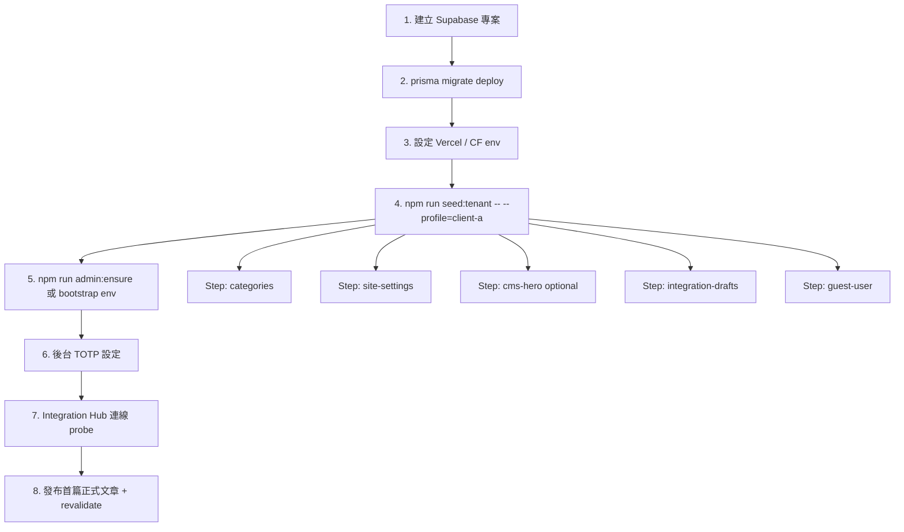

# 批次 D — 初始化與 Mock

> **產品：** Zenith Mind Master Blueprint（合併版）  
> **說明：** Bootstrap、Seeding pipeline、示範資料  
> **來源檔案：** 10_SEEDING_AND_MOCKING_STRATEGY.md

---

## 本文件目錄

- [SEEDING_AND_MOCKING_STRATEGY.md](#seeding-and-mocking-strategy-md)

---

## SEEDING_AND_MOCKING_STRATEGY.md

---

### 1. 文件目的

本文件定義 **新客戶上線（Onboarding）** 與 **開發/測試環境資料初始化** 的標準化策略，解決現況中 seed 腳本分散、憑證模板中斷、Category/CMS 未整合的問題。

**讀者：** 工程師、DevOps、AI Agent（接手新租戶部署時必讀）。

**目標：**

1. 新客戶從「空 DB + migrate」到「可登入後台 + 首頁可瀏覽」≤ 15 分鐘（含 env 設定）。
2. 所有 seed 操作 **可重複、可預測、可審計**。
3. **生產環境零誤刪** — 任何 destructive reset 必須有多重護欄。
4. 為未來 P2「Tenant-ready Schema」預留 **TenantProfile 抽象**，現階段以 **Deployment Profile** 實作。

---

### 2. 現況盤點與缺口

#### 2.1 現有 Seed 資產

| 資產 | 路徑 | 觸發時機 | 行為 | 缺口 |
|------|------|----------|------|------|
| **Bootstrap Admin** | `domain/auth/bootstrap.ts` → `seedBootstrapAdminIfEmpty()` | 首次 `loginWithEmail()` | 若 `users` 為空且 env 有 `ADMIN_BOOTSTRAP_*`，建立 ADMIN | 被動觸發；無 CLI；登入後應刪 env |
| **Guest User** | 同上 → `seedGuestUserIfMissing()` | 每次登入流程 | 確保 GUEST 帳號存在 | 預設密碼 `guest001` 需文件化輪替 |
| **Ensure Admin CLI** | `scripts/ensure-admin.mjs` | 手動 | upsert 指定 ADMIN | 無 production guard |
| **CMS Defaults** | `scripts/seed-cms-defaults.mjs` | 手動 | upsert `SiteSettings` + **deleteMany** Hero/Carousel 後重建 | **會覆寫客戶已編輯 CMS**；無 env guard |
| **Categories Sync** | `scripts/sync-default-categories.mjs` | `npm run sync:categories` | upsert 6 分類 + soft-delete 多餘 | 與 `import-initial-posts.mjs` slug 不一致 |
| **Demo Posts** | `scripts/import-initial-posts.mjs` | 手動 | 建立示範文章（舊 category slug） | 未納入標準 onboarding；無 idempotent key |
| **Integration Credentials** | 後台 UI + `services/integrations/repository.ts` | 手動 | 加密寫入 `integration_credentials` | **無 seed 模板**；env → DB 同步腳本分散 |
| **Code Defaults** | `lib/site/queries.ts`, `lib/categories/defaults.ts` | Runtime fallback | DB 空時 UI 仍有預設文案 | 與 DB seed 可能不一致 |

#### 2.2 核心問題摘要

```
┌─────────────────────────────────────────────────────────────────┐
│  現況：碎片化、無統一 Onboarding Pipeline、CMS seed 具破壞性       │
├─────────────────────────────────────────────────────────────────┤
│  目標：TenantBootstrapProfile → ordered steps → audit log       │
└─────────────────────────────────────────────────────────────────┘
```

| ID | 問題 | 嚴重度 |
|----|------|--------|
| G1 | 無單一 `npm run seed:tenant` 入口 | 🔴 |
| G2 | `seed-cms-defaults.mjs` 對 hero/carousel 執行 `deleteMany` | 🔴 |
| G3 | Category 定義三處不一致（defaults.ts / sync / import-posts） | 🟠 |
| G4 | Integration 憑證無「從 env 匯入 DISCONNECTED 草稿」標準步驟 | 🟠 |
| G5 | Bootstrap admin 僅在 login 時觸發，部署後無法無 UI 驗證 | 🟡 |
| G6 | 生產 destructive seed 護欄 | 🟢 已實作 `scripts/lib/assert-seed-allowed.mjs` |

---

### 3. 設計原則（Frozen Core 延伸）

| 規則 ID | 規則 | 說明 |
|---------|------|------|
| **SD-01** | **Production 禁止 destructive seed** | `NODE_ENV=production` 且無明確 `ALLOW_DESTRUCTIVE_SEED=1` → 拒絕 |
| **SD-02** | **Idempotent by default** | 所有 seed 步驟使用 upsert / `findFirst` + skip，除非標記 `--force` |
| **SD-03** | **Secrets 不進 Git** | 憑證僅來自 env 或 Secret Manager；seed 只寫 **加密後** payload |
| **SD-04** | **Single source of truth** | Category 定義以 `lib/categories/defaults.ts` 為唯一來源 |
| **SD-05** | **CMS seed 分級** | `minimal`（僅 SiteSettings 骨架）vs `demo`（含 hero/carousel 示範圖） |
| **SD-06** | **Bootstrap admin 一次性** | 成功建立後必須移除 `ADMIN_BOOTSTRAP_*` from env |
| **SD-07** | **Vercel 僅 Node seed** | Seed 腳本禁止 Edge Runtime；使用 `DIRECT_URL` 或 pooler 依腳本類型 |
| **SD-08** | **Audit 可選** | `--audit` 模式寫入 `AuditLog` action=`CREATE` entityType=`seed` |

---

### 4. 單租戶 Onboarding 流水線

#### 4.1 概念：Deployment Profile（非 Tenant DB 欄位）

現階段 **不新增 `tenantId` 欄位**。以 **一次部署 = 一個 Deployment Profile** 表示客戶實例：

```yaml
## seeds/profiles/default.profile.yaml（建議新增）
deploymentProfile:
  id: "zenith-mind-default"
  brand:
    siteName: "Zenith Mind"
    logoAlt: "Zenith Mind"
    publicSiteUrl: "https://www.example.com"
    defaultLocale: "zh-TW"
    locales: ["zh-TW", "en"]
  seed:
    tier: "minimal          # minimal | demo | full-demo
    categories: true
    cms: true
    demoPosts: false
    guestUser: true
    integrationPlaceholders: true
  integrations:
    importFromEnv: true      # 將 env 匯入 integration_credentials 為 DISCONNECTED
    providers: [ga4, gemini, search_console]
```

白牌化時：**複製 profile YAML → 改 brand 區塊 → 跑 pipeline**。

#### 4.2 標準 Onboarding 流程（新客戶）



#### 4.3 建議執行順序（Pipeline Steps）

| Step | 名稱 | 指令（目標統一入口） | Idempotent | Destructive |
|------|------|----------------------|------------|-------------|
| **S0** | Preflight | `seed:tenant --dry-run` | ✅ | ❌ |
| **S1** | Categories | 同步 `DEFAULT_CATEGORIES` | ✅ upsert | ⚠️ soft-delete 非 listed slug |
| **S2** | SiteSettings | upsert `id: "site"` 骨架 | ✅ | ❌ 不覆寫已有非空 JSON 欄位 |
| **S3** | Homepage Copy | 寫入 `homepageCopy` / `aboutSections` 預設 | ✅ 僅空值填充 | ❌ |
| **S4** | Hero / Carousel | `--tier=demo` 時才執行 | ✅ skip if rows exist | ⚠️ `--force` 才 deleteMany |
| **S5** | Guest User | `seedGuestUserIfMissing()` | ✅ | ❌ |
| **S6** | Bootstrap Admin | env 或 CLI 參數 | ✅ skip if admin exists | ❌ |
| **S7** | Integration Drafts | env → `integration_credentials` DISCONNECTED | ✅ upsert | ❌ |
| **S8** | Demo Posts | `--tier=full-demo` | ✅ slug unique skip | ❌ |
| **S9** | Warm Cache | `npm run redirects:warm` | ✅ | ❌ |

> **現行過渡期：** 在 `seed:tenant` 未實作前，使用 §6「現有腳本對照表」依序手動執行。

---

### 5. Seed 分級（Tier）

#### 5.1 Tier 定義

| Tier | 用途 | 包含 | 典型場景 |
|------|------|------|----------|
| **minimal** | 生產新站 | S1–S3, S5–S7 | 客戶正式上線 |
| **demo** | 銷售 Demo / Staging | minimal + S4（hero/carousel 示範 SVG） | 提案展示 |
| **full-demo** | 本機 / 培訓 | demo + S8（示範文章） | 開發體驗 |
| **dev-reset** | 本機重置 | 全部 + 可選 truncate 子集 | **僅 local** |

#### 5.2 Tier × 環境矩陣

| 環境 | 允許 Tier | Destructive | 必要 Guard |
|------|-----------|-------------|------------|
| **local** (`NODE_ENV=development`) | all | `--force` 可重置 CMS | 無 |
| **Vercel Preview** | minimal, demo | ❌ | `SEED_ENV=preview` |
| **Vercel Production** | **minimal only** | ❌ | `SEED_ENV=production` + 人工確認 flag |
| **CF Worker** | ❌ 不執行 seed | — | Seed 僅 Vercel CLI / 本機 |

---

### 6. 現有腳本對照表（過渡期 Runbook）

在新統一入口 `scripts/seed-tenant.mjs` 實作前，依下列順序操作：

```bash
## ── 0. 前置 ─────────────────────────────────────────
npm run db:deploy:local          # 或 db:deploy（CI/Vercel）
export SEED_ENV=local            # 自訂：local | preview | production

## ── 1. 分類（S1）──────────────────────────────────
npm run sync:categories

## ── 2. CMS（S2–S4，注意 tier）──────────────────────
## minimal：略過 seed-cms-defaults，僅依賴 lib/site/queries DEFAULT
## demo：
node scripts/seed-cms-defaults.mjs   # ⚠ 會重建 hero/carousel

## ── 3. 管理員（S5–S6）──────────────────────────────
node scripts/ensure-admin.mjs admin@client.com 'StrongPassw0rd!'
## 或設定 ADMIN_BOOTSTRAP_EMAIL/PASSWORD 後首次登入

## ── 4. 示範文章（S8，可選）────────────────────────
node scripts/import-initial-posts.mjs   # 需先 sync:categories

## ── 5. 整合憑證草稿（S7，見 §8）──────────────────
node scripts/import-integration-drafts.mjs   # 待實作

## ── 6. 轉址快取（S9）──────────────────────────────
npm run redirects:warm
```

#### 6.1 package.json 建議新增（P1 實作）

```json
{
  "scripts": {
    "seed:tenant": "node scripts/seed-tenant.mjs",
    "seed:tenant:dry-run": "node scripts/seed-tenant.mjs --dry-run",
    "seed:categories": "node scripts/sync-default-categories.mjs",
    "seed:cms:demo": "node scripts/seed-cms-defaults.mjs",
    "seed:integrations": "node scripts/import-integration-drafts.mjs"
  }
}
```

---

### 7. 各步驟詳細規格

#### 7.1 S1 — Categories（`sync-default-categories.mjs`）

**單一真相來源：** `lib/categories/defaults.ts` → `DEFAULT_CATEGORIES`

| 欄位 | 規則 |
|------|------|
| slug | 固定 6 個：international, finance, ai-tech, education, lifestyle, other |
| oldSlugs | 映射舊 slug，避免重複建立 |
| 刪除 | `slug not in desired` → `deletedAt = now()`（soft delete） |

**AI 規則：** 禁止在 `import-initial-posts.mjs` 硬編碼不同 slug；示範文章須引用 `DEFAULT_CATEGORIES` 匯出或改為讀 profile。

#### 7.2 S2/S3 — SiteSettings 骨架

**模型：** `SiteSettings` singleton `id: "site"`

**minimal tier 寫入策略（建議改寫 seed 邏輯）：**

```typescript
// 伪代码 — 目標行為
await prisma.siteSettings.upsert({
  where: { id: "site" },
  create: { id: "site", logoAlt: profile.brand.siteName, quickLinks: DEFAULT_QUICK_LINKS, ... },
  update: {
    // 僅填充 null/空陣列欄位，不覆寫客戶已編輯內容
    logoAlt: existing.logoAlt ?? profile.brand.logoAlt,
    quickLinks: isEmpty(existing.quickLinks) ? DEFAULT_QUICK_LINKS : undefined,
  },
});
```

**現行 `seed-cms-defaults.mjs` 問題：** `update` 無條件覆寫 `quickLinks` / `socialLinks` → **生產環境禁用**（除非 `--force` + guard）。

**Runtime fallback：** `lib/site/queries.ts` 的 `DEFAULT_HOMEPAGE_COPY` 等確保 DB 空時前台不白屏；seed 應與其 **文案對齊**。

#### 7.3 S4 — Hero / Carousel（demo tier）

| 項目 | 規則 |
|------|------|
| 圖片 | 使用 `public/cms/*.svg`（repo 內建，無外部依賴） |
| locale | 各建立 zh-TW × 2 + en × 2 hero；carousel 各 3 |
| Idempotent | 若 `(locale, sortOrder)` 已有 `isActive` 列 → skip |
| Destructive | 僅 `--force` 時 `deleteMany({ locale })` |

#### 7.4 S5 — Guest User

| 項目 | 值 |
|------|-----|
| 預設 email | `GUEST_BOOTSTRAP_EMAIL` 或 `guest@<brand-domain>` |
| 預設 password | `GUEST_BOOTSTRAP_PASSWORD`（**禁止**生產使用預設 `guest001`） |
| role | `GUEST` |
| 用途 | 客戶展示唯讀後台 |

#### 7.5 S6 — Bootstrap Admin

**雙路徑：**

| 路徑 | 適用 | 說明 |
|------|------|------|
| **A. Env 被動** | 首次登入 | `ADMIN_BOOTSTRAP_EMAIL/PASSWORD`；`users` 為空才建立 |
| **B. CLI 主動** | 部署自動化 | `ensure-admin.mjs <email> <password>` |

**生產 Checklist：**

1. 建立 admin 成功
2. 登入並設定 TOTP
3. **刪除** Vercel/CF 的 `ADMIN_BOOTSTRAP_*`
4. 變更為強密碼（若使用 bootstrap 密碼）

#### 7.6 S7 — Integration Credential 模板

**目的：** 新客戶 env 已設但後台 Integration Hub 為空 → 匯入 **DISCONNECTED** 草稿，供 UI 顯示待連線欄位。

**建議腳本 `import-integration-drafts.mjs` 行為：**

```
FOR each provider IN profile.integrations.providers:
  READ env keys FROM lib/integrations/providers.ts envKeys
  IF any env key is non-empty:
    encryptSecret(JSON.stringify(values))
    upsert integration_credentials
      status = DISCONNECTED（不自動 CONNECTED）
  ELSE:
    skip
```

**禁止：** seed 腳本不得將 status 設為 `CONNECTED`（需經 `probe-provider` 驗證）。

**加密：** 使用 `lib/integrations/crypto.ts` 的 `encryptSecret`（AES-256-CBC + `TOTP_ENCRYPTION_KEY` 衍生）。

#### 7.7 S8 — Demo Posts（full-demo）

- 來源：重構 `import-initial-posts.mjs` 使用 `DEFAULT_CATEGORIES` slug
- 每篇以 `slug` 為 idempotency key：`findUnique({ slug })` → skip
- `authorId`：指向 S6 建立的 admin
- status：`PUBLISHED`（demo）或 `DRAFT`（培訓）

---

### 8. 生產環境安全護欄

#### 8.1 環境判定

```javascript
// scripts/lib/assert-seed-allowed.mjs（已實作）
export function assertSeedAllowed(scriptName) {
  // 生產／prod-like DB：需 ALLOW_PRODUCTION_SEED=1
  // SEED_TIER=minimal 時，seed-cms-defaults 拒絕 deleteMany hero/carousel
}
```

**環境變數：** `ALLOW_PRODUCTION_SEED=1`、`SEED_TIER=minimal`（見 `scripts/seed-cms-defaults.mjs`）。

#### 8.2 操作分類

| 操作 | local | preview | production |
|------|-------|---------|------------|
| upsert SiteSettings 空欄填充 | ✅ | ✅ | ✅ |
| sync categories | ✅ | ✅ | ✅（不 soft-delete 需 `--allow-category-prune`） |
| deleteMany hero/carousel | ✅ `--force` | ❌ | ❌ |
| import demo posts | ✅ | ⚠️ 需 flag | ❌ |
| ensure-admin 覆写密码 | ✅ | ⚠️ | ⚠️ 需人工 |
| truncate tables | ✅ local only | ❌ | ❌ |

#### 8.3 Vercel 執行 Seed 的方式

| 方式 | 建議 |
|------|------|
| **Build 時 seed** | ❌ 禁止（競態、secret 暴露、不可審計） |
| **Deploy Hook + 一次性 Job** | ✅ 使用 Vercel CLI `vercel env pull` 後本機跑 |
| **GitHub Actions manual workflow** | ✅ `workflow_dispatch` + `ALLOW_PRODUCTION_SEED` secret |
| **Login 時 bootstrap** | ✅ 僅 S6 被動路徑 |

---

### 9. Mocking 策略（測試與本機）

#### 9.1 測試分層

| 層級 | 工具 | Mock 對象 |
|------|------|-----------|
| **Unit** | Jest + `test-utils/prisma-mock.ts` | Prisma models |
| **Integration** | Jest + test DB 或 SQLite（未採用） | 可選 local Postgres |
| **E2E / a11y** | Playwright `tests/a11y/` | 真實 dev server |
| **Command Center** | `isDemo` flag in payloads | GA4/GSC/GEO 第三方 |

#### 9.2 固定 Mock 契約

| 模組 | Mock 入口 | 說明 |
|------|-----------|------|
| Prisma | `test-utils/prisma-mock.ts` | 各 route/action test 使用 |
| Next.js | `test-utils/next-mocks.ts` | headers/cookies |
| Env | `test-utils/env-mock.ts` | 隔離 `process.env` |
| GA4 | stub in `infrastructure/ga4/*` tests | 避免 gRPC 網路 |
| Redis | mock `@upstash/redis` | webhook nonce tests |

#### 9.3 本機 Mock 資料（非 DB）

| 資料 | 來源 | 用途 |
|------|------|------|
| 首页 SVG | `public/cms/*.svg` | 無 CDN 依賴 |
| 默认文案 | `lib/site/queries.ts` | DB 空時 fallback |
| Command Center demo | `shared/ui/demo-banner.tsx` | 標示 placeholder 數據 |

**規則：** Mock 數據 **不得** 出現在 production sitemap；`isDemo: true` 的 payload 必須在 UI 顯示 Demo Banner。

#### 9.4 本機 Dev Reset（dev-reset tier）

```bash
## 僅 local — 重置 CMS 示範內容
SEED_ENV=local ALLOW_DESTRUCTIVE_SEED=1 \
  node scripts/seed-tenant.mjs --tier=dev-reset --force

## 禁止：prisma migrate reset 對 shared staging DB
```

---

### 10. 白牌化 / 新客戶 Checklist

#### 10.1 交付前（母版團隊）

- [ ] 複製 `seeds/profiles/_template.profile.yaml` → `client-<name>.profile.yaml`
- [ ] 更新 brand（siteName, logoAlt, publicSiteUrl）
- [ ] 決定 tier（minimal / demo）
- [ ] 準備 env 清單（`.env.example` 對照 `env.ts`）

#### 10.2 部署日（客戶實例）

- [ ] 建立 Supabase 專案 + 取得 `DATABASE_URL` / `DIRECT_URL`
- [ ] `prisma migrate deploy`
- [ ] 設定 Vercel env（完整 server schema）
- [ ] 設定 CF Worker vars + secrets
- [ ] 執行 `seed:tenant --profile=client-<name>`
- [ ] 執行 `ensure-admin.mjs` 或 bootstrap 登入
- [ ] 設定 TOTP
- [ ] Integration Hub probe 全部通過
- [ ] 上傳正式 Logo → Supabase Storage
- [ ] 發布首篇 production 文章
- [ ] 驗證 `sitemap.xml` / JSON-LD / GA4 consent
- [ ] **刪除** `ADMIN_BOOTSTRAP_*`

#### 10.3 交付後（7 日內）

- [ ] 移除 demo tier 文章（若有）
- [ ] 輪替 bootstrap 密碼
- [ ] 確認 GUEST 帳密已改或停用
- [ ] 備份策略生效（見 `09-OPERATIONS.md`（BACKUP 章））

---

### 11. 與 EventOutbox / Revalidate 的銜接

Seed 完成後 **不直接** 大量 `revalidatePath`（避免 CF/Vercel 快取風暴）。

| 時機 | 動作 |
|------|------|
| S8 demo posts 完成 | 單次 `POST /api/revalidate` Bearer `REVALIDATE_SECRET` tag=`posts` |
| SiteSettings 更新 | tag=`site-settings` |
| 標準 | 使用 `lib/revalidate/purge-public-site.ts` 既有封裝 |

---

### 12. 目標目錄結構（P1 實作）

```
seeds/
  profiles/
    _template.profile.yaml
    zenith-mind-default.profile.yaml
  fixtures/
    demo-posts.json              # 自 import-initial-posts 抽出
    hero-slides.demo.json
  steps/
    01-categories.mjs
    02-site-settings.mjs
    03-cms-demo.mjs
    04-users.mjs
    05-integrations.mjs
    06-demo-posts.mjs
scripts/
  seed-tenant.mjs                  # 統一入口
  _seed-guards.mjs
  import-integration-drafts.mjs
  sync-default-categories.mjs    # 保留，由 step 呼叫
  seed-cms-defaults.mjs            # 改為呼叫 step 03
domain/
  seed/
    seed.types.ts                # DeploymentProfile Zod schema
    run-pipeline.ts              # Node-only orchestrator
```

---

### 13. AI 開發規則（Seeding 專章）

| 規則 ID | 內容 |
|---------|------|
| **AI-SD-01** | 新增 seed 邏輯必須 idempotent，並加入 `seed-guards` |
| **AI-SD-02** | 禁止 seed 腳本 `import` Edge-only 或 `middleware` 模組 |
| **AI-SD-03** | Category 變更只改 `lib/categories/defaults.ts`，並跑 sync |
| **AI-SD-04** | 禁止 production 使用 `deleteMany` 無 `--force` + guard |
| **AI-SD-05** | Integration seed 不得設 `CONNECTED` without probe |
| **AI-SD-06** | 新客戶 profile 必須新增 YAML，不可 hardcode 品牌名於腳本 |
| **AI-SD-07** | Demo 文章 slug 全域唯一，禁止随机 UUID slug |

---

### 14. 機器可讀摘要（YAML）

```yaml
seeding:
  model: single_tenant_per_deployment
  profileFormat: seeds/profiles/*.profile.yaml
  tiers: [minimal, demo, full-demo, dev-reset]
  pipeline:
    - categories
    - site_settings
    - homepage_copy
    - cms_demo_optional
    - guest_user
    - bootstrap_admin
    - integration_drafts
    - demo_posts_optional
    - warm_redirect_cache
  guards:
    production:
      allowedTier: minimal
      destructive: false
      requireEnv: ALLOW_PRODUCTION_SEED=1
    secrets:
      neverInGit: true
      encryptIntegrationPayload: true
  singleSourceOfTruth:
    categories: lib/categories/defaults.ts
    quickLinks: lib/site/default-quick-links.ts
    homepageCopy: lib/site/queries.ts
  existingScripts:
    bootstrap: domain/auth/bootstrap.ts
    cms: scripts/seed-cms-defaults.mjs
    categories: scripts/sync-default-categories.mjs
    admin: scripts/ensure-admin.mjs
    demoPosts: scripts/import-initial-posts.mjs
  pendingImplementation:
    - scripts/seed-tenant.mjs
    - scripts/import-integration-drafts.mjs
    - scripts/_seed-guards.mjs
    - seeds/profiles/_template.profile.yaml
frozenCoreRef: 00-OVERVIEW.md#11
```

---

### 15. 實作路線圖

| 優先 | 任務 | 工時估 | 依賴 |
|------|------|--------|------|
| ~~**P0**~~ | ~~seed-guards~~ | ✅ `scripts/lib/assert-seed-allowed.mjs` + `seed-cms-defaults` 已呼叫 | — |
| **P0** | 統一 `import-initial-posts` category slug | 0.5d | 無 |
| **P1** | 實作 `seed-tenant.mjs` + profile YAML | 2d | guards |
| **P1** | 實作 `import-integration-drafts.mjs` | 1d | crypto |
| **P2** | 重構 seed 為 `seeds/steps/*` | 1d | seed-tenant |
| **P2** | GHA `workflow_dispatch` seed job | 0.5d | seed-tenant |

---

### 16. 相關文件

| 文件 | 關係 |
|------|------|
| `03-DATA.md`（DATA_LIFECYCLE 章） | §10 Onboarding 生命週期 |
| `03-DATA.md`（MIGRATION_STRATEGY 章） | migrate deploy 必在 seed 前 |
| `05-API-AUTH-PERMISSIONS.md`（AUTH_FLOW 章） | Bootstrap / TOTP 流程 |
| `06-INTEGRATION-AUTOMATION.md`（WEBHOOK 章） | Seed 後 revalidate 契約 |
| `10-AI-SPEC.md`（AI_DEVELOPMENT_RULES 章） | 匯總 AI-SD-* 規則 |

---

*本文件為單租戶母版 Onboarding 之權威規格。變更 seed 行為前須更新本文件並通過 SD-01 護欄檢查。*

