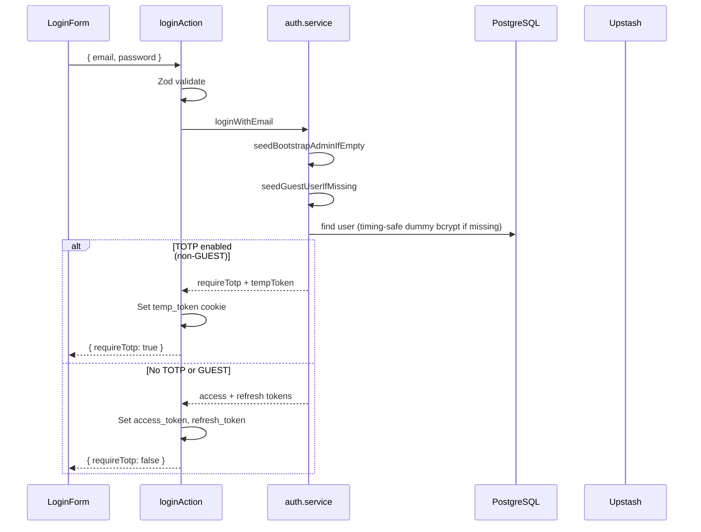
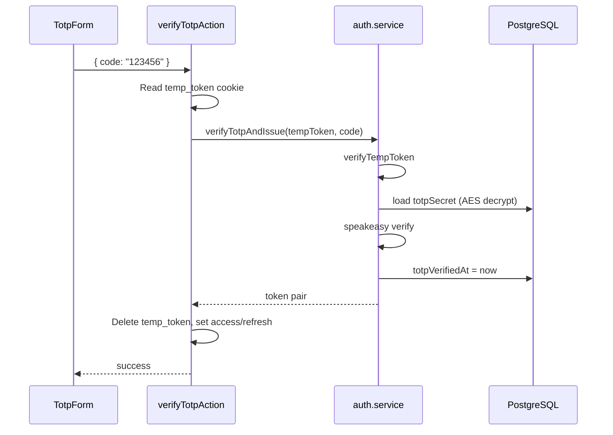
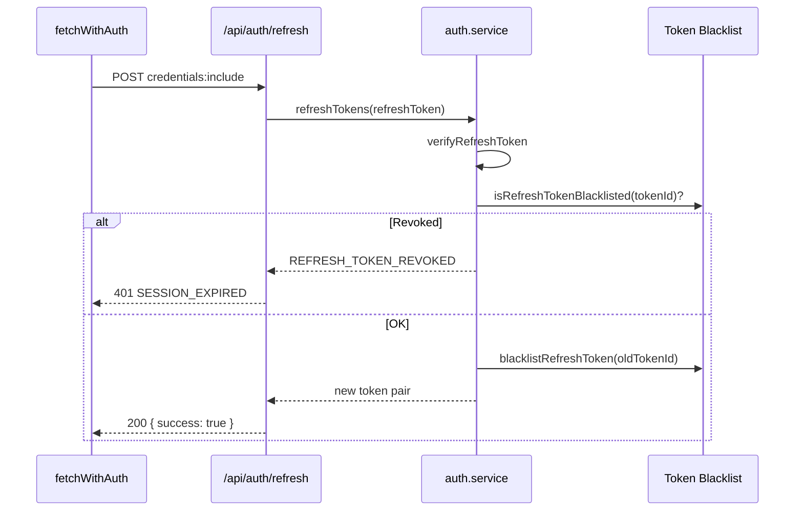
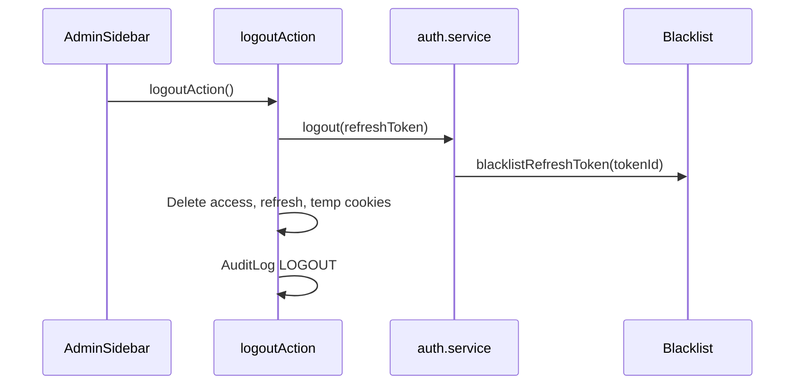

# 批次 E — API、認證與權限

> **產品：** Zenith Mind Master Blueprint（合併版）  
> **說明：** API 契約、Auth 流程、RBAC 矩陣  
> **來源檔案：** 11_API_CONTRACT.md、12_AUTH_FLOW.md、13_PERMISSION_MATRIX.md

---

## 本文件目錄

- [API_CONTRACT.md](#api-contract-md)
- [AUTH_FLOW.md](#auth-flow-md)
- [PERMISSION_MATRIX.md](#permission-matrix-md)

---

## API_CONTRACT.md

---

### 1. 文件目的

定義系統對外（含內部自動化）的 **API 契約**：方法、路徑、認證、請求/回應形狀、錯誤碼、執行環境與部署歸屬。

**不包含：** 第三方 Google/GEO API（見 `06-INTEGRATION-AUTOMATION.md`（INTEGRATION 章））。

---

### 2. 全域契約

#### 2.1 通訊協議

| 項目 | 規格 |
|------|------|
| **格式** | JSON（`Content-Type: application/json`） |
| **字元** | UTF-8 |
| **時間** | ISO 8601（UTC）於 DTO 欄位 |
| **ID** | Prisma `cuid()` 字串 |

#### 2.2 兩種入口

| 入口 | 路徑 | 認證 | 回應形狀 |
|------|------|------|----------|
| **Route Handler** | `/api/*` | 見各端點 | JSON（多為 ad-hoc 或簡化） |
| **Server Action** | `actions/*.ts` | Cookie JWT + `gateAdmin*` | `ActionResult<T>` |

#### 2.3 ActionResult（Server Actions 標準）

定義於 `domain/shared/core.types.ts`：

```typescript
type ActionResult<T> =
  | { success: true;  data: T;    error: null }
  | { success: false; data: null; error: ActionError };

interface ActionError {
  code: string;       // 機器讀取，如 AUTH_FAILED
  message: string;    // 開發者用，勿直接暴露使用者
  details?: unknown;
  httpStatus?: number;
  retryable: boolean;
  severity: "info" | "warn" | "fatal";
}
```

**標準錯誤碼：** `VALIDATION_ERROR`, `AUTH_FAILED`, `FORBIDDEN`, `NOT_FOUND`, `RATE_LIMIT`, `TOTP_INVALID`, `DUPLICATE_ERROR`, `AI_RATE_LIMIT`, `AI_TIMEOUT`, `AI_FORMAT_ERROR`, `INTERNAL_ERROR`

#### 2.4 部署歸屬（Frozen Core）

| 類別 | Cloudflare Worker | Vercel |
|------|-------------------|--------|
| `/api/public/*`, `/api/search`, `/api/health/*`, `/api/webhook`, `/api/revalidate`, `/api/redirect` | ✅ 可能暴露 | ✅ |
| `/api/admin/*`, `/api/auth/*`, `/api/ai/*`, `/api/cron/*` | ❌ build 時 stash → **僅 Vercel** | ✅ |

公開站 middleware 會將 `/admin` 與 admin API **302** 至 `ADMIN_DEPLOYMENT_URL`。

---

### 3. 認證模式一覽

| 模式 | 機制 | 使用端點 |
|------|------|----------|
| **None** | 無 | 公開讀取（部分） |
| **Cookie JWT** | `access_token` httpOnly | Admin API、AI Jobs |
| **Bearer Secret** | `Authorization: Bearer <secret>` | Cron、Revalidate |
| **HMAC Webhook** | `x-webhook-signature` + ts + nonce | Webhook |
| **Internal Header** | `x-redirect-internal: <REDIRECT_LOOKUP_SECRET>` | Redirect lookup |
| **Implicit Dev** | `NODE_ENV !== production` 放寬 | Redirect lookup（dev only） |

---

### 4. 公開 API（Public）

#### 4.1 `POST /api/public/page-view`

記錄站內瀏覽（不存 raw IP）。

| 項目 | 規格 |
|------|------|
| **Runtime** | `nodejs` |
| **Auth** | 無（依 `PAGEVIEW_HASH_SALT` 產生 `visitorHash`） |
| **Body** | `{ postId?: string, locale?: "zh-TW" \| "en", referer?: string }` |
| **Success** | `200 { ok: true }` |
| **Errors** | `400 invalid_json` / `validation`；`503 missing_salt`；`502` DB 失敗 |
| **資料寫入** | CF：`supabaseInsert("page_views")`；否則 Prisma |
| **實作** | `lib/analytics/record-page-view-core.ts` |

#### 4.2 `GET /api/search`

部落格公開搜尋（ILIKE MVP）。

| 項目 | 規格 |
|------|------|
| **Query** | `q`（≥2 字元）、`locale`（`zh-TW` \| `en`，預設 zh-TW） |
| **Auth** | 無 |
| **Success** | `200 { query, locale, items: PublicPostListItemDto[] }` |
| **Errors** | `400` q 太短 → `{ error, items: [] }` |
| **DTO** | `lib/dto/post-public.dto.ts` → `toPublicPostListItemDto` |
| **實作** | `getPublicContentRepository()` — CF→Supabase、Vercel→Prisma；失敗 `503 SEARCH_UNAVAILABLE` |

**PublicPostListItemDto：**

```json
{
  "id": "cuid",
  "slug": "string",
  "title": { "primary": "...", "secondary": "..." },
  "excerpt": { "primary": "...", "secondary": "..." },
  "publishedAt": "ISO8601|null",
  "readingTime": 5,
  "category": { "slug": "ai-tech", "name": { "primary": "...", "secondary": "..." } } | null
}
```

#### 4.3 `GET /api/health/public-data`

公開資料平面健康檢查。

| 項目 | 規格 |
|------|------|
| **Success** | `200 { status: "ok", health: {...} }` |
| **Degraded** | `503` + `Retry-After: 300` + `{ status: "degraded", health }` |
| **用途** | 前台 `PublicDataDegradedBanner`、監控 |

#### 4.4 `GET /api/redirect`

內部轉址查詢（非公開瀏覽器直接呼叫）。

| Header | `x-redirect-internal: <REDIRECT_LOOKUP_SECRET>` |
| Query | `path`（必須以 `/` 開頭） |
| Success | `{ hit: true, newPath, statusCode }` 或 `{ hit: false }` |
| Errors | `403 forbidden` |
| **備註** | Edge middleware 使用 Supabase/Redis；此 API 用 Prisma |

---

### 5. 簽章 / 自動化 API

#### 5.1 `POST /api/webhook`

外部事件接收（詳見 `06-INTEGRATION-AUTOMATION.md`（WEBHOOK 章））。

| Header | 必填 |
|--------|------|
| `x-webhook-signature` | HMAC-SHA256 hex |
| `x-webhook-timestamp` | Unix ms，±5 分鐘 |
| `x-webhook-nonce` | Redis NX 防重放 |

| Body | `{ eventVersion?: 1, event: string, data?: unknown }` — `WebhookEnvelopeV1Schema` |
| Events | `POST_PUBLISHED`, `AI_JOB_DONE` → `EventOutbox`（未知 event 不寫入） |
| Success | `200 { success: true }` |
| Errors | `401` 簽章類；`400` INVALID_JSON / INVALID_ENVELOPE；`429` RATE_LIMIT |

#### 5.2 `POST /api/revalidate`

On-demand ISR 快取失效。

| Auth | `Authorization: Bearer <REVALIDATE_SECRET>`（fallback `WEBHOOK_SECRET`） |
| Body | `{ type?: "path"\|"tag", value?: string }` 或 `{ items: [{ type, value }] }` |
| Validation | `assertRevalidateTarget` 防 path injection |
| Success | `200 { success: true, revalidated: string[] }` |
| Errors | `401`, `400 MISSING_VALUE` / `INVALID_TARGET` |

**允許 tag 範例：** `posts`, `site-settings`（以 `lib/revalidate` 實際使用為準）。

#### 5.3 Cron Routes（`GET` + Bearer）

| 路徑 | Schedule (vercel.json) | 職責 |
|------|------------------------|------|
| `/api/cron/cleanup` | `0 3 * * *` | PageView/Audit 清理 |
| `/api/cron/outbox` | `15 3 * * *` | EventOutbox 消費（`processEventOutbox`） |
| `/api/cron/aggregate-views` | `5 2 * * *` | 日聚合、revalidate |
| `/api/cron/publish-scheduled` | `0 4 * * *` | SCHEDULED → PUBLISHED |
| `/api/ai/worker` | `10 5 * * *` | 認領並執行 `AiJob` |

**Auth：** `Authorization: Bearer <CRON_SECRET>` + `timingSafeEqual`

**Response 範例（cleanup）：** `200 { success: true, deletedPageViews, deletedAuditLogs }`（無 `processedEvents`）

---

### 6. 認證 API（Auth）

詳見 `05-API-AUTH-PERMISSIONS.md`（AUTH_FLOW 章）。摘要：

| 方法 | 路徑 | 說明 |
|------|------|------|
| `POST` | `/api/auth/refresh` | Silent refresh（`fetchWithAuth`） |
| `GET` | `/api/auth/ping` | `{ authenticated, remainingSeconds? }` |

**Cookie（Server Actions 登入）：** `sameSite: strict`  
**Cookie（refresh route）：** `sameSite: lax`

---

### 7. 後台 API（Admin）

#### 7.1 共通規則

- **Runtime：** Node（`force-dynamic`）
- **Auth：** `access_token` cookie 或 `verifyAccessToken`
- **RBAC：** Route 層多僅驗 JWT；**寫入權限以 Server Actions 的 `gateAdminWrite` 為準**
- **部署：** 僅 Vercel（CF 302 導向）

#### 7.2 `GET /api/admin/env-check`

| Auth | JWT（實務上後台頁觸發） |
| Response | 各 env key 是否「已設定」（不回傳 secret 值） |

#### 7.3 `GET /api/admin/audit-log/export`

| Query | 與 `lib/admin/audit-log-params.ts` 對齊（分頁、action、日期） |
| Response | CSV stream |
| Auth | 需有效 JWT；匯出權限見 `05-API-AUTH-PERMISSIONS.md`（PERMISSION_MATRIX 章） |

#### 7.4 `POST /api/admin/integrations/probe`

| Body | `{ id?: string }` — 單一 probe id 或省略 |
| Auth | `gateAdminRead()` |
| Probes | `postgres`, `redis`, `supabase-admin`, `gemini`, `ga4-reporting`, `google-ads-oauth`, `search-console-live` |
| Response | `{ ok, message }` per probe |

#### 7.5 `POST /api/admin/integrations/refresh-health`

清除整合健康快取並重跑探測。

#### 7.6 `GET /api/admin/realtime/stream`

| 協議 | SSE（Server-Sent Events） |
| Auth | JWT |
| 資料 | `server/realtime/event-hub.ts` 緩衝事件 |

---

### 8. AI API

#### 8.1 `POST /api/ai/jobs`

建立 AI 任務。

**Request（Zod `CreateAiJobSchema` v1）：**

```json
{
  "version": 1,
  "type": "GENERATE_DRAFT" | "OPTIMIZE_TITLE" | "EXTRACT_FAQ",
  "postId": "cuid",
  "idempotencyKey": "string 16-128",
  "options": {}
}
```

| Response | `201 { success: true, jobId }` |
| Idempotent | `P2002` → `200 { success: true, jobId, idempotent: true }` |
| Errors | `401 UNAUTHORIZED`, `400 VALIDATION_ERROR` |

#### 8.2 `GET /api/ai/jobs/[id]`

| Response | `AiJobStatus` 欄位：id, status, stepIndex, retryCount, result, failedReason, createdAt, updatedAt |
| Scope | 僅能查詢 **自己的** job（`getJobStatusForUser`） |
| Errors | `404 NOT_FOUND` |

#### 8.3 `GET /api/ai/worker`

Cron 觸發；非前端呼叫。執行 `AiOrchestrator` + `AiJobManager`。

---

### 9. Server Actions 契約索引

所有 Actions：`"use server"`，回傳 `ActionResult<T>`。

#### 9.1 認證（無 gate）

| Action | 輸入 | 輸出 |
|--------|------|------|
| `loginAction` | `{ email, password }` | `{ requireTotp: boolean }` |
| `verifyTotpAction` | `{ code: 6 digits }` | `void` |
| `refreshAction` | — | `void` |
| `logoutAction` | — | `void` |

#### 9.2 內容 / CMS（`gateAdminWrite`）

| Action | Entity | 摘要 |
|--------|--------|------|
| `createPostAction` | `post` | 新建文章 |
| `updatePostAction` | `post` | 更新內容、狀態、FAQ、密碼保護 |
| `updateSeoAction` | `post` | SEO metadata |
| `deletePostAction` | `post` | 軟刪 + redirect |
| `updateSiteSettingsAction` | `site` | SiteSettings JSON |
| `saveHeroSlidesAction` | `site` | Hero 輪播 |
| `saveHomeCarouselItemsAction` | `site` | 中段輪播 |
| `uploadSiteAssetAction` | `site` | Supabase Storage 上傳 |

#### 9.3 營運

| Action | Entity |
|--------|--------|
| `createAffiliateLinkAction` / `update*` / `toggle*` / `delete*` | `affiliate` |
| `deleteMediaItemAction` | `media` |
| `cancelAgentJobAction` / `prioritize*` / `clearPending*` / `recoverStuck*` | `analytics` |

#### 9.4 使用者

| Action | Gate |
|--------|------|
| `listUsersAction` | `gateAdminRead` |
| `createUserAction` / `changePasswordAction` / `deleteUserAction` | `gateAdminWrite("user")` |
| `activateTotpAction` | `gateAdminWrite("settings", userId)` |

#### 9.5 公開（無 admin gate）

| Action | 說明 |
|--------|------|
| `verifyPostPasswordAction` | 密碼文解鎖 cookie |
| `checkPostAccessAction` | 檢查解鎖狀態 |
| `recordPageViewAction` | 可選 server-side PV（與 API 重複職責） |

---

### 10. 公開頁面 Route（非 `/api`）

| 方法 | 路徑 | 說明 |
|------|------|------|
| `GET` | `/go/[slug]` | 聯盟 301；lookup 經 `getPublicContentRepository()`；**點擊計數僅 Vercel**（`!isCfPublicRuntime()`） |

---

### 11. Metadata Routes

| 路徑 | 檔案 | Revalidate |
|------|------|------------|
| `/sitemap.xml` | `app/sitemap.ts` | 3600 |
| `/robots.txt` | `app/robots.ts` | dynamic |

---

### 12. 版本與擴充規則

| 規則 ID | 內容 |
|---------|------|
| **API-01** | 新增公開 API 必須定義 Zod schema + DTO，禁止回傳 Prisma 裸物件 |
| **API-02** | 破壞性變更必須遞增 `version`（參考 `CreateAiJobSchema.version`） |
| **API-03** | 新增寫入端點必須 `gateAdminWrite(entity)` |
| **API-04** | CF 暴露的 route 禁止靜態 import `@/infrastructure/db/prisma` |
| **API-05** | Cron/Webhook 必須 timing-safe 比對 secret |
| **API-06** | 錯誤回應不得洩漏 stack / SQL |

---

### 13. 機器可讀端點表（YAML）

```yaml
api:
  basePaths:
    public: [/api/public, /api/search, /api/health]
    signed: [/api/webhook, /api/revalidate]
    cron: [/api/cron, /api/ai/worker]
    auth: [/api/auth]
    admin: [/api/admin]
  authModes: [none, cookie_jwt, bearer_secret, hmac_webhook, internal_header]
  actionResult:
    module: domain/shared/core.types.ts
    errorCodes:
      - VALIDATION_ERROR
      - AUTH_FAILED
      - FORBIDDEN
      - NOT_FOUND
      - RATE_LIMIT
      - TOTP_INVALID
      - AI_RATE_LIMIT
      - INTERNAL_ERROR
  highRiskUnbranched:
    - GET /api/search
    - GET /go/{slug}
  deployment:
    adminApis: vercel_only
    publicApis: cloudflare_and_vercel
```

---

### 14. 相關文件

| 文件 | 關係 |
|------|------|
| `05-API-AUTH-PERMISSIONS.md`（AUTH_FLOW 章） | JWT / Cookie / Refresh 細節 |
| `05-API-AUTH-PERMISSIONS.md`（PERMISSION_MATRIX 章） | RBAC 與各 Action 權限 |
| `06-INTEGRATION-AUTOMATION.md`（WEBHOOK 章） | ✅ |
| `02-EVENTS-AND-MODULES.md`（EVENT_FLOW 章） | Outbox 與副作用 |

---

*新增或修改 API 前須更新本文件與對應 Zod schema。*


---

## AUTH_FLOW.md

---

### 1. 文件目的

描述 **身份驗證與工作階段** 的完整流程，供工程師、資安審查與 AI Agent 實作時遵守。  
本系統 **不使用 Server-side Session DB**；採 **JWT 雙 Token + Redis Refresh 黑名單**。

---

### 2. 設計決策（ADR）

| ID | 決策 | 理由 |
|----|------|------|
| AUTH-ADR-01 | JWT（jose）非 jsonwebtoken | Edge Middleware 相容 |
| AUTH-ADR-02 | Access + Refresh 雙 Token | 短期 Access 降低洩漏影響；Refresh 可撤銷 |
| AUTH-ADR-03 | Refresh Token Rotation | 每次 refresh 舊 tokenId 進黑名單 |
| AUTH-ADR-04 | TOTP 密鑰 AES 加密存 DB | 靜態 secret 合規；僅 Node 解密 |
| AUTH-ADR-05 | httpOnly Cookie 傳遞 | 防 XSS 竊取（配合 CSP nonce） |
| AUTH-ADR-06 | Middleware 僅驗證 JWT 存在 | 細粒度 RBAC 在 Server Actions（Frozen Core） |

---

### 3. Token 規格

#### 3.1 Access Token

| 屬性 | 值 |
|------|-----|
| **簽章** | HS256，`JWT_ACCESS_SECRET`（≥64 字元） |
| **有效期** | `1h`（`ACCESS_TOKEN_JWT_EXPIRES`） |
| **Cookie** | `access_token`，`maxAge=3600`，httpOnly，prod `secure` |
| **Payload** | `{ userId, email, role: ADMIN\|GUEST, tokenType: "access" }` |

#### 3.2 Refresh Token

| 屬性 | 值 |
|------|-----|
| **簽章** | HS256，`JWT_REFRESH_SECRET`（獨立於 access） |
| **有效期** | `7d` |
| **Cookie** | `refresh_token`，`maxAge=604800` |
| **Payload** | `{ userId, tokenId }` — `tokenId` 用於 Redis 黑名單 |

#### 3.3 Temp Token（TOTP 中間態）

| 屬性 | 值 |
|------|-----|
| **有效期** | `5m` |
| **Cookie** | `temp_token`（TOTP 待驗證期間） |
| **Payload** | `{ userId, purpose: "totp_pending", tokenType: "temp" }` |
| **限制** | 不可存取受保護資源；僅用於 `verifyTotpAndIssue` |

---

### 4. 角色模型

| Role | Prisma | 說明 |
|------|--------|------|
| **ADMIN** | `UserRole.ADMIN` | 全實體 read/write（見權限矩陣） |
| **GUEST** | `UserRole.GUEST` | 後台唯讀；寫入 Action 回 `FORBIDDEN` |

**Bootstrap：**

- 首位 ADMIN：`seedBootstrapAdminIfEmpty()`（`ADMIN_BOOTSTRAP_EMAIL/PASSWORD`）
- 參訪帳號：`seedGuestUserIfMissing()`（預設 `guest@getzenithmind.com`，登入可填 `guest`）

---

### 5. 登入流程（Email + Password）



#### 5.1 安全細節

| 機制 | 實作 |
|------|------|
| **防帳號枚舉** | 使用者不存在仍執行 dummy `bcrypt.compare` |
| **密碼儲存** | bcrypt cost 12（`lib/auth/password.ts`） |
| **GUEST 略過 TOTP** | `user.role === "GUEST"` 不進 TOTP 流程 |
| **Audit** | `LOGIN` action，metadata 含 step |

#### 5.2 失敗回應

| 情況 | ActionResult |
|------|----------------|
| 帳密錯誤 | `AUTH_FAILED`（401） |
| Zod 失敗 | `VALIDATION_ERROR`（400） |
| 內部錯誤 | `INTERNAL_ERROR` + requestId |

---

### 6. TOTP 第二因素



#### 6.1 TOTP 設定（首次啟用）

| 步驟 | 入口 |
|------|------|
| 1 | `/admin/settings/totp-setup` — QR + secret |
| 2 | `activateTotpAction` — `gateAdminWrite("settings", userId)` |
| 3 | 加密寫入 `User.totpSecret`，`totpEnabled=true` |

**加密：** `TOTP_ENCRYPTION_KEY`（64 hex = 32 bytes）→ AES-256-CBC（`lib/auth/totp.ts`）

#### 6.2 TOTP 錯誤

| Code | 情境 |
|------|------|
| `TOTP_INVALID` | 6 碼錯誤 |
| `AUTH_FAILED` | 無 `temp_token` 或 temp JWT 無效 |
| `TOTP_NOT_CONFIGURED` | Domain 層（不應出現在正常 UI 流） |

---

### 7. Silent Refresh

#### 7.1 雙入口（行為應一致）

| 入口 | 呼叫者 | sameSite |
|------|--------|----------|
| `refreshAction` | Server Action | `strict` |
| `POST /api/auth/refresh` | `fetchWithAuth`（client） | `lax` |

#### 7.2 Refresh 流程



#### 7.3 客戶端策略

| 常數 | 值 | 用途 |
|------|-----|------|
| `REFRESH_BEFORE_EXPIRY_SEC` | 300 | Access 剩餘 <5 分鐘主動 refresh |
| `SESSION_PING_INTERVAL_MS` | 120000 | `GET /api/auth/ping` |
| `ADMIN_IDLE_TIMEOUT_MS` | 3600000 | 無操作 1h → 導向登入 |

**Promise Lock：** `infrastructure/http/fetch.client.ts` — 多個 401 只觸發一次 refresh。

---

### 8. 登出



Refresh 無效時 **不拋錯**（視為已登出）。

---

### 9. Edge Middleware 守衛

**檔案：** `lib/middleware/auth-guard.ts`

#### 9.1 受保護前綴

```
/admin/dashboard, /admin/site, /admin/posts, /admin/media,
/admin/affiliate, /admin/analytics, /admin/audit-log,
/admin/settings, /admin/users
```

#### 9.2 公開 Admin 路徑

```
/admin/login, /admin/totp
```

#### 9.3 行為

| 情境 | 結果 |
|------|------|
| 受保護路徑 + 無效 JWT | 302 → `/admin/login?redirect=...`，刪除 `access_token` |
| `/admin/login` + 有效 JWT | 302 → `/admin/dashboard` |
| 驗證方式 | `jose` jwtVerify + `tokenType===access` + role ADMIN/GUEST |

**⚠ 限制：** Middleware **不檢查** write 權限；GUEST 可進入 CMS 頁面但 Action 會 `FORBIDDEN`。

---

### 10. Server Action / API 層驗證

#### 10.1 標準模式

```typescript
const gate = await gateAdminWrite("post");
if (!gate.ok) return gate.result;
const session = gate.session; // { userId, email, role }
```

#### 10.2 JWT 直接驗證（部分 API Routes）

`POST /api/ai/jobs` 使用 `gateAdminOnly()`（拒絕 GUEST）。`GET /api/ai/jobs/[id]` 仍為 `verifyAccessToken` + `userId` 範圍（GUEST 無法建立 job）。

---

### 11. 文章密碼保護（公開端，非 Admin Auth）

獨立於 Admin JWT：

| 項目 | 規格 |
|------|------|
| **Cookie** | HMAC 簽名 unlock token（`lib/blog/post-access-cookie.ts`） |
| **Actions** | `verifyPostPasswordAction`, `checkPostAccessAction` |
| **密碼儲存** | `Post.accessPasswordHash` bcrypt |

---

### 12. 跨部署 Cookie 注意事項

| 場景 | 說明 |
|------|------|
| **CF → Vercel 302** | 使用者最終在 `ADMIN_DEPLOYMENT_URL` 網域登入；Cookie 綁定 Vercel 網域 |
| **SameSite** | 跨站 redirect 時 refresh route 用 `lax` |
| **Secure** | production 強制 `secure: true` |

---

### 13. 環境變數

| 變數 | 用途 | 驗證 |
|------|------|------|
| `JWT_ACCESS_SECRET` | Access + Temp 簽章 | `env.ts` min 64 |
| `JWT_REFRESH_SECRET` | Refresh 簽章 | min 64 |
| `TOTP_ENCRYPTION_KEY` | TOTP secret 加密 | length 64 hex |
| `UPSTASH_REDIS_REST_*` | Refresh 黑名單 | required |
| `ADMIN_BOOTSTRAP_EMAIL/PASSWORD` | 首位管理員 | 選填，用後刪除 |
| `GUEST_BOOTSTRAP_EMAIL/PASSWORD` | 參訪帳號 | 選填 |

---

### 14. 威脅模型對照

| 威脅 | 緩解 | 缺口 |
|------|------|------|
| XSS 竊 Token | httpOnly + CSP | 第三方腳本需維護 CSP |
| Refresh 重放 | Rotation + Redis blacklist | — |
| CSRF（Action） | SameSite cookie | 考慮 CSRF token（未實作） |
| Brute force login | 部分 | Middleware `POST /api/auth/*` 30/min/IP；Server Action 登入未經此路徑 |
| JWT 洩漏 | 短 TTL 1h | — |
| TOTP secret 洩漏 | AES at rest | Key 輪替需 runbook |

---

### 15. AI 開發規則（Auth 專章）

| 規則 ID | 內容 |
|---------|------|
| **AI-AUTH-01** | 禁止在 Edge 使用 `jsonwebtoken`、`bcrypt`、`speakeasy` |
| **AI-AUTH-02** | 新增 mutation 必須 `gateAdminWrite(entity)` |
| **AI-AUTH-03** | 禁止將 JWT secret 放入 `NEXT_PUBLIC_*` |
| **AI-AUTH-04** | Refresh 流程必須黑名單舊 `tokenId` |
| **AI-AUTH-05** | 登入相關錯誤回傳統一 `AUTH_FAILED`，不區分 email/password |
| **AI-AUTH-06** | 不可移除 timing-safe 或 dummy bcrypt 防枚舉 |

---

### 16. 機器可讀摘要（YAML）

```yaml
auth:
  model: jwt_dual_token
  library: jose
  tokens:
    access: { cookie: access_token, ttl: 1h, payload: [userId, email, role, tokenType] }
    refresh: { cookie: refresh_token, ttl: 7d, rotation: true, blacklist: redis }
    temp: { cookie: temp_token, ttl: 5m, purpose: totp_pending }
  roles: [ADMIN, GUEST]
  mfa: totp_aes_encrypted
  middleware: lib/middleware/auth-guard.ts
  actionGate: lib/auth/resolve-admin-action.ts
  flows: [login, totp_verify, refresh, logout]
  frozenCore:
    - jwt_dual_token_rotation
    - redis_refresh_blacklist
    - gateAdminWrite_on_mutations
```

---

### 17. 相關文件

| 文件 | 關係 |
|------|------|
| `05-API-AUTH-PERMISSIONS.md`（PERMISSION_MATRIX 章） | 角色 × 實體權限 |
| `04-SEEDING.md` | Bootstrap admin / guest |
| `05-API-AUTH-PERMISSIONS.md`（API_CONTRACT 章） | `/api/auth/*` 端點 |

---

*變更認證流程前須通過 Frozen Core 檢查（`00-OVERVIEW.md` §11）。*


---

## PERMISSION_MATRIX.md

---

### 1. 文件目的

定義後台 **誰能在哪裡做什麼**，明確區分：

- **Middleware 層**（僅「已登入」）
- **Application 層**（`gateAdminRead` / `gateAdminWrite` — **權威來源**）
- **API Route 層**（部分僅 JWT，見缺口說明）

供資安審查、新功能開發與 AI Agent **不可繞過** 的權限基線。

---

### 2. 角色定義

| 角色 | 代碼 | 典型用途 | 帳號來源 |
|------|------|----------|----------|
| **管理員** | `ADMIN` | 完整 CMS、整合、使用者管理 | Bootstrap / `ensure-admin` / `createUserAction` |
| **參訪者** | `GUEST` | 客戶展示、稽核唯讀 | `seedGuestUserIfMissing` |

**Prisma：** `User.role` enum `ADMIN | GUEST`  
**JWT：** `AccessTokenPayload.role` 同步

---

### 3. 權限模型

#### 3.1 AdminEntity（資源實體）

定義於 `lib/auth/permissions.ts`：

| Entity | 對應模組 | AuditLog entityType 範例 |
|--------|----------|---------------------------|
| `post` | 文章 CMS | `post` |
| `user` | 使用者管理 | `user` |
| `site` | 站點設定、Hero、Carousel | `site` |
| `media` | 媒體庫 | `media` |
| `affiliate` | 聯盟連結 | `affiliate` |
| `integration` | 整合憑證 Hub | `integration` |
| `analytics` | Agent 佇列、流量相關操作 | `ai_job` |
| `audit` | 稽核日誌匯出 | — |
| `settings` | 個人密碼、TOTP | `user`（self） |

#### 3.2 AdminPermission

| Permission | 說明 |
|------------|------|
| `read` | 檢視資料、進入頁面、列表 |
| `write` | 建立、更新、刪除、上傳 |

#### 3.3 矩陣（權威）

| Entity | ADMIN read | ADMIN write | GUEST read | GUEST write |
|--------|:----------:|:-------------:|:----------:|:-----------:|
| **post** | ✅ | ✅ | ✅ | ❌ |
| **user** | ✅ | ✅ | ✅ | ❌ |
| **site** | ✅ | ✅ | ✅ | ❌ |
| **media** | ✅ | ✅ | ✅ | ❌ |
| **affiliate** | ✅ | ✅ | ✅ | ❌ |
| **integration** | ✅ | ✅ | ✅ | ❌ |
| **analytics** | ✅ | ✅ | ✅ | ❌ |
| **audit** | ✅ | ✅ | ✅ | ❌ |
| **settings** | ✅ | ✅ | ✅ | ❌ |

**實作：** `ROLE_ENTITY_PERMISSIONS` + `hasAdminPermission` / `canWriteAdminEntity`

---

### 4. 檢查點架構

```mermaid
flowchart TB
  REQ[HTTP Request /admin/*]
  MW[middleware auth-guard]
  PAGE[Admin RSC Page]
  ACT[Server Action]
  API[API Route]

  REQ --> MW
  MW -->|JWT valid| PAGE
  MW -->|invalid| LOGIN[/admin/login]

  PAGE --> ACT
  ACT --> GATE{gateAdminWrite?}
  GATE -->|ok| BL[Business Logic + Prisma]
  GATE -->|FORBIDDEN| ERR403[ActionResult FORBIDDEN]
  GATE -->|no token| ERR401[ActionResult AUTH_FAILED]

  PAGE --> API
  API --> JWTONLY{verifyAccessToken only}
  JWTONLY --> BL2[API Logic]
```

#### 4.1 各層責任

| 層級 | 檢查內容 | 不檢查 |
|------|----------|--------|
| **L0 Middleware** | Access JWT 有效、role 為 ADMIN/GUEST | write 權限、entity |
| **L2 gateAdminRead** | 有效 session | write |
| **L2 gateAdminWrite** | session + `canWriteAdminEntity` + settings 自我限制 | — |
| **L2 gateAdminOnly** | session + `role === ADMIN`（AI jobs、audit export 等） | GUEST |
| **L2 API（部分）** | JWT 有效 | entity（`GET /api/ai/jobs/[id]` 仍僅 userId 範圍） |

---

### 5. 特殊規則

#### 5.1 Settings 自我範圍

`assertCanWrite(session, "settings", entityId)`：

- 當 `entityId` 提供且 **≠ session.userId** → `FORBIDDEN`
- 用途：`activateTotpAction` 僅能啟用自己的 TOTP

#### 5.2 GUEST UI 提示

`components/admin/GuestReadOnlyBanner.tsx` — 視覺提示無法儲存；**不可取代** server-side gate。

#### 5.3 使用者管理

| 操作 | 所需權限 | 額外規則 |
|------|----------|----------|
| `listUsersAction` | read（任一登入者） | — |
| `createUserAction` | write `user` | 僅 ADMIN |
| `changePasswordAction` | write `user` + target userId | ADMIN 可改他人；建議僅改自己（實作允許 ADMIN 指定 userId） |
| `deleteUserAction` | write `user` | 軟刪 `deletedAt` |

#### 5.4 Command Center 儀表板

| 區域 | 路徑 | 資料載入 | GUEST |
|------|------|----------|-------|
| War Room | `/admin/dashboard` | RSC + cached GA4 | 可讀 |
| SEO / GEO / AEO | `/admin/dashboard/*` | `server/command-center/load-*` | 可讀 |
| Integrations | `/admin/dashboard/integrations` | `integration-actions` | 讀取可；**寫入**需 write `integration` |

**整合寫入：** `features/integrations-hub/actions/integration-actions.ts` — 須確認皆經 `gateAdminWrite("integration")`（新增時必查）。

---

### 6. Server Actions × 權限對照表

| Action | Gate | Entity | GUEST 可呼叫 |
|--------|------|--------|:------------:|
| `loginAction` | — | — | ✅ |
| `verifyTotpAction` | — | — | ✅（若啟用 TOTP） |
| `refreshAction` / `logoutAction` | — | — | ✅ |
| `createPostAction` | write | post | ❌ |
| `updatePostAction` | write | post | ❌ |
| `updateSeoAction` | write | post | ❌ |
| `deletePostAction` | write | post | ❌ |
| `updateSiteSettingsAction` | write | site | ❌ |
| `saveHeroSlidesAction` | write | site | ❌ |
| `saveHomeCarouselItemsAction` | write | site | ❌ |
| `uploadSiteAssetAction` | write | site | ❌ |
| `createAffiliateLinkAction` | write | affiliate | ❌ |
| `updateAffiliateLinkAction` | write | affiliate | ❌ |
| `toggleAffiliateLinkActiveAction` | write | affiliate | ❌ |
| `deleteAffiliateLinkAction` | write | affiliate | ❌ |
| `deleteMediaItemAction` | write | media | ❌ |
| `listUsersAction` | read | — | ✅ |
| `createUserAction` | write | user | ❌ |
| `changePasswordAction` | write | user | ❌ |
| `deleteUserAction` | write | user | ❌ |
| `activateTotpAction` | write | settings | ❌ |
| `cancelAgentJobAction` | write | analytics | ❌ |
| `prioritizeAgentJobAction` | write | analytics | ❌ |
| `clearPendingAgentQueueAction` | write | analytics | ❌ |
| `recoverStuckAgentJobsAction` | write | analytics | ❌ |
| `recordPageViewAction` | — | — | N/A（公開） |
| `verifyPostPasswordAction` | — | — | N/A（公開） |

---

### 7. API Routes × 權限對照表

| Route | Auth | Role check | Write check |
|-------|------|:----------:|:-----------:|
| `POST /api/ai/jobs` | JWT | ❌ | ❌ |
| `GET /api/ai/jobs/[id]` | JWT | ❌（僅 owner userId） | — |
| `GET /api/admin/env-check` | 隱式後台 | ❌ | — |
| `GET /api/admin/audit-log/export` | JWT | ❌ | ⚠ 應限 ADMIN |
| `POST /api/admin/integrations/probe` | gateAdminRead | ✅ read | — |
| `POST /api/admin/integrations/refresh-health` | JWT | ❌ | ⚠ |
| `GET /api/admin/realtime/stream` | JWT | ❌ | — |
| `GET /api/cron/*` | CRON_SECRET | N/A | N/A |
| `POST /api/webhook` | HMAC | N/A | N/A |
| `POST /api/revalidate` | Bearer | N/A | N/A |
| `GET /api/search` | 無 | 公開 | — |
| `POST /api/public/page-view` | 無 | 公開 | — |

#### 7.1 已知缺口（文件化，P2 建議）

| ID | 缺口 | 風險 | 建議 |
|----|------|------|------|
| ~~PM-01~~ | ~~AI Jobs API 未拒 GUEST~~ | ✅ `POST /api/ai/jobs` 使用 `gateAdminOnly()` | — |
| ~~PM-02~~ | ~~audit-log export 未 gate~~ | ✅ `GET /api/admin/audit-log/export` 使用 `gateAdminOnly()` | — |
| PM-03 | refresh-health 未 gate | 低 | `gateAdminWrite("integration")` |

---

### 8. 公開端權限（非 RBAC）

| 能力 | 條件 |
|------|------|
| 讀取已發布文章 | `status=PUBLISHED`, `deletedAt=null` |
| 密碼文全文 | 有效 `post-access` HMAC cookie |
| 站內搜尋 | 無認證 |
| Page View 寫入 | 無認證；`PAGEVIEW_HASH_SALT` |

---

### 9. AuditLog 對照

| 使用者操作 | AuditAction | 需 ADMIN |
|------------|-------------|:------:|
| 登入成功/失敗 | LOGIN | — |
| TOTP 驗證 | TOTP_VERIFY | — |
| 登出 | LOGOUT | — |
| 發布文章 | PUBLISH / SCHEDULE | ✅ |
| 文章 CRUD | CREATE / UPDATE / DELETE | ✅ |
| AI 生成 | AI_GENERATE | ✅ |
| TOTP 設定 | TOTP_SETUP | ✅ |

**保留：** 90 天（cleanup cron）  
**匯出：** `GET /api/admin/audit-log/export` — 建議僅 ADMIN

---

### 10. SaaS 化預留（單租戶母版階段不實作）

| 未來角色 | 預期權限 |
|----------|----------|
| **Super Admin** | 跨 deployment 管理（平台方） |
| **Tenant Admin** | 單租戶內等同現行 ADMIN |
| **Tenant Staff** | 部分 entity write |
| **Tenant Viewer** | 等同 GUEST |

**Schema 預留：** JWT 增加 `tenantId`；`ROLE_ENTITY_PERMISSIONS` 改為 per-tenant 配置表。

---

### 11. 實作檢查清單（新功能必做）

- [ ] 是否為 mutation？→ `gateAdminWrite(entity)`
- [ ] 是否為列表/報表？→ `gateAdminRead()` 或 page 內 session 檢查
- [ ] 新 AdminEntity？→ 更新 `permissions.ts` 矩陣 + 本文件
- [ ] 新 API Route？→ 明確 JWT + role + 或委託 Action
- [ ] GUEST 是否應看見該 nav？→ `admin-sidebar-nav.ts`
- [ ] 是否寫 AuditLog？

---

### 12. AI 開發規則（權限專章）

| 規則 ID | 內容 |
|---------|------|
| **AI-RBAC-01** | 禁止僅依賴 Middleware 判斷寫入權限 |
| **AI-RBAC-02** | 新增 entity 必須更新 `AdminEntity` 與矩陣 |
| **AI-RBAC-03** | GUEST 路徑不得呼叫 Prisma `create/update/delete` 無 gate |
| **AI-RBAC-04** | `settings` write 必須傳入 `session.userId` 作 entityId |
| **AI-RBAC-05** | 公開 API 不得暴露 draft / 未發布內容 |
| **AI-RBAC-06** | Cron/Webhook 不使用 User JWT，使用獨立 secret |

---

### 13. 機器可讀矩陣（YAML）

```yaml
rbac:
  roles: [ADMIN, GUEST]
  permissions: [read, write]
  entities:
    - post
    - user
    - site
    - media
    - affiliate
    - integration
    - analytics
    - audit
    - settings
  matrix:
    ADMIN: { all_entities: [read, write] }
    GUEST: { all_entities: [read], write: false }
  enforcement:
    authoritative: gateAdminWrite / gateAdminRead
    middleware: jwt_presence_only
  specialRules:
    settings_write: self_userId_only
  knownGaps:
    - PM-01: resolved (gateAdminOnly on POST /api/ai/jobs)
    - PM-02: resolved (gateAdminOnly on audit export)
  module: lib/auth/permissions.ts
```

---

### 14. 相關文件

| 文件 | 關係 |
|------|------|
| `05-API-AUTH-PERMISSIONS.md`（AUTH_FLOW 章） | Token 與登入 |
| `05-API-AUTH-PERMISSIONS.md`（API_CONTRACT 章） | 端點與 Action 索引 |
| `08-SECURITY.md`（SECURITY_STANDARD 章） | 資安基線 |
| `10-AI-SPEC.md`（AI_DEVELOPMENT_RULES 章） | 匯總 AI-RBAC-* |

---

*權限變更屬 Frozen Core 範疇：不得削弱 `gateAdminWrite` 覆蓋率。*

