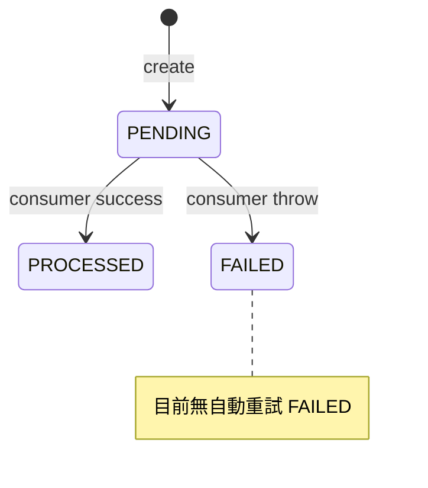
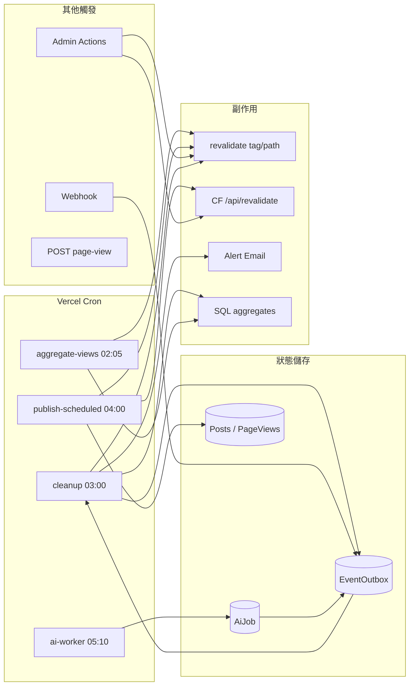
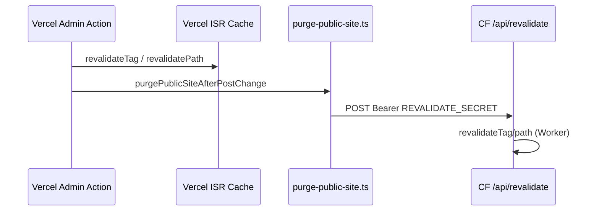
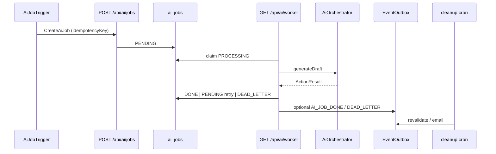

# 批次 F — 整合、Webhook 與工作流

> **產品：** Zenith Mind Master Blueprint（合併版）  
> **說明：** Webhook 契約、外部 API 重試、Cron 自動化  
> **來源檔案：** 14_WEBHOOK_AND_EVENT_CONTRACT.md、15_INTEGRATION_AND_RETRY_STRATEGY.md、16_WORKFLOW_AUTOMATION.md

---

## 本文件目錄

- [WEBHOOK_AND_EVENT_CONTRACT.md](#webhook-and-event-contract-md)
- [INTEGRATION_AND_RETRY_STRATEGY.md](#integration-and-retry-strategy-md)
- [WORKFLOW_AUTOMATION.md](#workflow-automation-md)

---

## WEBHOOK_AND_EVENT_CONTRACT.md

---

### 1. 文件目的

將 **Webhook 觸發機制** 與 **內部事件匯流排（EventOutbox）** 定義為 AI 與整合方可機器讀取的契約（含 `WebhookEnvelopeV1Schema`），並標示 **Frozen Core 不可削弱** 的安全鏈。

---

### 2. 架構原則

| 原則 | 說明 |
|------|------|
| **Fast ACK** | Webhook 僅驗簽 + 寫 Outbox，不在請求內執行 revalidate / 發信 |
| **最終一致** | 副作用由 Cron 或 on-demand revalidate 非同步完成 |
| **At-least-once 寫入** | 外部可重試；Nonce 保證同一 nonce 僅接受一次 |
| **向前相容** | 未知 `event` 仍回 `200`（僅 warn），不寫 Outbox |

---

### 3. Webhook 端點契約

#### 3.1 基本資訊

| 項目 | 值 |
|------|-----|
| **URL** | `POST {origin}/api/webhook` |
| **Runtime** | Node（`force-dynamic`） |
| **部署** | Vercel 與 CF 皆可路由；建議僅對外暴露 **公開站 origin** 或統一入口 |
| **Content-Type** | `application/json` |
| **Body** | 原始 JSON 字串（簽名計算用 **raw body**，不可預先 parse 再 stringify） |

#### 3.2 必要 Headers（Frozen Core）

| Header | 格式 | 說明 |
|--------|------|------|
| `x-webhook-signature` | 小寫 hex | `HMAC-SHA256` 輸出 |
| `x-webhook-timestamp` | Unix 時間 **毫秒** 字串 | `Date.now()` 同單位 |
| `x-webhook-nonce` | 唯一字串 | 建議 UUID v4；長度建議 16–128 |

**缺任一 Header → `401 MISSING_HEADERS`**

#### 3.3 簽名演算法（實作對照）

```
message = "${timestamp}.${rawBody}"
expected = HMAC_SHA256_hex(WEBHOOK_SECRET, message)
```

| 步驟 | 要求 |
|------|------|
| 比對 | `crypto.timingSafeEqual`（hex buffer 長度須相等） |
| Secret | `process.env.WEBHOOK_SECRET`，min 32 字元（`env.ts`） |
| 時間窗 | `|now - timestamp| <= 300_000` ms（±5 分鐘） |

**逾時 → `401 TIMESTAMP_EXPIRED`**  
**簽名錯誤 → `401 INVALID_SIGNATURE`**

#### 3.4 Nonce 防重放

| 項目 | 值 |
|------|-----|
| **實作** | `infrastructure/redis/webhook-nonce.ts` |
| **Redis** | `SET nonce:{nonce} 1 NX EX 300` |
| **成功** | key 不存在 → 接受 |
| **重放** | key 已存在 → `401 NONCE_REPLAYED` |

#### 3.5 HTTP 回應

| Status | Body | 情境 |
|--------|------|------|
| `200` | `{ "success": true }` | 驗簽通過（含未知 event） |
| `401` | `{ "error": "<CODE>" }` | 見上表 |
| `500` | `{ "error": "INTERNAL_ERROR" }` | 未預期例外 |

**整合方重試策略：** 僅對 `5xx` 或網路錯誤重試；`401` 勿重試同一 nonce（須換新 nonce + 新 timestamp + 重簽）。

---

### 4. Payload 規範（現行 + 目標）

#### 4.1 現行（程式實際行為）

```typescript
// 未驗證 — 僅 JSON.parse
interface WebhookBodyLoose {
  event?: string;
  data?: unknown;
}
```

| 欄位 | 必填 | 說明 |
|------|:----:|------|
| `event` | 建議 | 事件名稱；空字串視為未知 |
| `data` | 否 | 任意 JSON，寫入 Outbox `payload` |

#### 4.2 目標契約（母版 v1 — 建議實作時採用）

```typescript
// 已實作：domain/events/webhook.schema.ts
import { z } from "zod";

export const WebhookEnvelopeV1 = z.object({
  version: z.literal(1),
  event: z.enum([
    "POST_PUBLISHED",
    "AI_JOB_DONE",
    // 擴充須遞增 version 或 registry
  ]),
  data: z.record(z.unknown()).default({}),
  emittedAt: z.string().datetime().optional(), // ISO8601，稽核用
});

export type WebhookEnvelopeV1 = z.infer<typeof WebhookEnvelopeV1>;
```

**過渡期：** 接收端同時接受 `{ event, data }`（無 version）與 `version: 1`；發送端應盡快升級。

#### 4.3 事件 × Outbox 對照

| Webhook `event` | `EventOutbox.eventType` | 寫入時機 | 建議 `data` 形狀 |
|-----------------|-------------------------|----------|------------------|
| `POST_PUBLISHED` | `POST_PUBLISHED` | Webhook handler | `{ postId?, slug? }` |
| `AI_JOB_DONE` | `AI_JOB_DONE` | Webhook 或 `aiJobManager.markDone` | `{ jobId: string }` |

**內部產生（非 Webhook）：**

| 來源 | `eventType` | `data` |
|------|-------------|--------|
| `AiJobManager.markDone` | `AI_JOB_DONE` | `{ jobId }` |
| `AiJobManager.markFailed` (dead letter) | `AI_JOB_DEAD_LETTER` | `{ jobId, reason, retryCount }` |

---

### 5. EventOutbox 資料契約

#### 5.1 Prisma 模型

```prisma
model EventOutbox {
  id          String       @id @default(cuid())
  eventType   String
  payload     Json
  status      OutboxStatus @default(PENDING)  // PENDING | PROCESSED | FAILED
  error       String?
  processedAt DateTime?
  createdAt   DateTime     @default(now())
}
```

#### 5.2 狀態機



#### 5.3 消費者（現行）

| 項目 | 值 |
|------|-----|
| **Consumer** | `GET /api/cron/cleanup`（與清理任務共用） |
| **排程** | `0 3 * * *` UTC（`vercel.json`） |
| **批次** | `take: 50`, `orderBy: { createdAt: "asc" }` |

| `eventType` | 副作用 |
|-------------|--------|
| `POST_PUBLISHED` | `revalidateTag("posts")`, `revalidatePath("/blog", "layout")` |
| `AI_JOB_DONE` | 同上 |
| `AI_JOB_DEAD_LETTER` | `sendAlertEmail` + `logger.error` |

**重要延遲：** Webhook 200 後，ISR 失效可能延遲至 **下次 outbox cron**（`15 3 * * *` UTC，最長 ~24h on Hobby），除非同時觸發 `purgePublicSiteAfterPostChange` 或 `POST /api/revalidate`。

#### 5.4 目標：獨立 Outbox Consumer（P1 抽象 EventBus）

**已實作：** `GET /api/cron/outbox`（`15 3 * * *`，與 cleanup 分離）。Hobby 帳號無法使用 `*/5` 排程；需 Pro 或外部 cron 才能縮短延遲。

---

### 6. 與 On-Demand Revalidate 的關係

| 觸發路徑 | 延遲 | 認證 |
|----------|------|------|
| Admin `post.actions` | 近即時 | `purgePublicSiteAfterPostChange` → `POST /api/revalidate` Bearer |
| Webhook → Outbox → cleanup | 最長 ~24h | 無 Bearer（本機 `revalidateTag`） |
| `publish-scheduled` cron | 排程點 | 同上 + purge per slug |

**雙平面：** Vercel 上 `revalidatePath` 只影響 Vercel 快取；公開站 CF 需 **HTTP 打 `/api/revalidate`**。

---

### 7. 發送方實作指南（整合方 / 腳本）

#### 7.1 Node.js 簽名範例

```javascript
import { createHmac, randomUUID } from "crypto";

function signWebhook(secret, bodyObject) {
  const rawBody = JSON.stringify(bodyObject);
  const timestamp = String(Date.now());
  const nonce = randomUUID();
  const signature = createHmac("sha256", secret)
    .update(`${timestamp}.${rawBody}`)
    .digest("hex");
  return { rawBody, timestamp, nonce, signature };
}

// fetch POST with headers:
// x-webhook-signature, x-webhook-timestamp, x-webhook-nonce
```

#### 7.2 建議 Payload（v1）

```json
{
  "version": 1,
  "event": "POST_PUBLISHED",
  "data": {
    "postId": "clxx...",
    "slug": "my-article"
  },
  "emittedAt": "2026-05-23T12:00:00.000Z"
}
```

---

### 8. 安全與合規檢查清單

- [ ] `WEBHOOK_SECRET` ≥ 32 字元，僅 server env
- [ ] 禁止 log rawBody 含 PII
- [ ] Nonce 不可預測重複使用
- [ ] 時鐘同步（NTP）避免 TIMESTAMP_EXPIRED 誤判
- [ ] 生產禁用 `REVALIDATE_SECRET` fallback 與 `WEBHOOK_SECRET` 混用（現行允許 fallback — 建議分離輪替）

---

### 9. 測試契約

| 案例 | 預期 |
|------|------|
| 缺 header | 401 MISSING_HEADERS |
| 過期 timestamp | 401 TIMESTAMP_EXPIRED |
| 錯誤 signature | 401 INVALID_SIGNATURE |
| 重複 nonce | 401 NONCE_REPLAYED |
| 合法 POST_PUBLISHED | 200 + Outbox 一筆 PENDING |
| 未知 event | 200 + 無 Outbox + warn log |

**參考：** `app/api/webhook/__tests__/route.test.ts`

---

### 10. AI 開發規則

| ID | 規則 |
|----|------|
| **AI-WH-01** | 禁止移除 HMAC / timestamp / nonce 任一驗證 |
| **AI-WH-02** | Webhook handler 禁止同步 `revalidatePath`（應寫 Outbox 或調用 purge 封裝） |
| **AI-WH-03** | 新增事件須註冊於本文件 + cleanup consumer switch |
| **AI-WH-04** | 新增事件須考慮 CF 公開站快取（搭配 `/api/revalidate`） |
| **AI-WH-05** | Payload 變更須遞增 `version` |

---

### 11. 機器可讀契約（YAML）

```yaml
webhook:
  endpoint: POST /api/webhook
  security:
    hmac: sha256
    messageFormat: "${timestamp}.${rawBody}"
    timestampWindowMs: 300000
    nonce:
      store: redis
      keyPrefix: "nonce:"
      ttlSeconds: 300
      atomic: SET NX
  events:
    - name: POST_PUBLISHED
      outboxType: POST_PUBLISHED
    - name: AI_JOB_DONE
      outboxType: AI_JOB_DONE
  unknownEventPolicy: warn_and_200
outbox:
  table: event_outbox
  statuses: [PENDING, PROCESSED, FAILED]
  consumer: /api/cron/cleanup
  batchSize: 50
  targetSchemaVersion: 1
gaps:
  - no Zod envelope in production yet
  - FAILED rows not auto-retried
  - consumer coupled to daily cleanup
```

---

### 12. 相關文件

| 文件 | 關係 |
|------|------|
| `02-EVENTS-AND-MODULES.md`（EVENT_FLOW 章） | 全域事件圖 |
| `06-INTEGRATION-AUTOMATION.md`（WORKFLOW 章） | Cron 與擴充端點 |
| `06-INTEGRATION-AUTOMATION.md`（INTEGRATION 章） | 外部 API 重試 |
| `05-API-AUTH-PERMISSIONS.md`（API_CONTRACT 章） | HTTP 狀態碼索引 |

---

*Webhook 安全鏈為 Frozen Core #3；變更須安全審查。*


---

## INTEGRATION_AND_RETRY_STRATEGY.md

---

### 1. 文件目的

統一定義 **外部 API 整合** 的連線方式、憑證儲存、探測流程，以及系統內 **Retry / Timeout / Circuit Breaker** 的現況與目標標準。  
供 Command Center、AI Worker、Webhook 消費方與未來 `RetryPolicy` 抽象實作對照。

---

### 2. 整合提供者 Registry

定義於 `lib/integrations/providers.ts`：

| Provider ID | 名稱 | 主要 envKeys | 儲存 |
|-------------|------|--------------|------|
| `ga4` | Google Analytics 4 | `GA4_CLIENT_EMAIL`, `GA4_PRIVATE_KEY`, `GA4_PROPERTY_ID`, `NEXT_PUBLIC_GA4_MEASUREMENT_ID` | DB 加密 + env |
| `gemini` | Gemini AI | `GEMINI_API_KEY` | DB + env |
| `google_ads` | Google Ads | OAuth client/refresh/developer/customer IDs | DB + env |
| `search_console` | Search Console | 共用 GA4 服務帳號 + `GOOGLE_SEARCH_CONSOLE_SITE_URL` | env + DB |
| `bigquery` | BigQuery | dataset / project 相關 | env |
| `merchant` | Merchant Center | `GOOGLE_MERCHANT_CENTER_ACCOUNT_ID` | env |

#### 2.1 憑證儲存（IntegrationCredential）

| 欄位 | 說明 |
|------|------|
| `provider` | 唯一 |
| `payloadEncrypted` | `encryptSecret(JSON.stringify(values))` |
| `status` | `DISCONNECTED` \| `CONNECTED` \| `ERROR` |
| `lastError` / `lastVerifiedAt` | 探測結果 |

**加密：** `lib/integrations/crypto.ts` — AES-256-CBC，金鑰 `TOTP_ENCRYPTION_KEY`（64 hex）

**寫入路徑：** `features/integrations-hub/actions/integration-actions.ts` + `services/integrations/repository.ts`

**規則：** Seed 腳本僅能寫入 `DISCONNECTED` 草稿（見 `04-SEEDING.md`）；**CONNECTED** 必須經 `probeIntegrationProvider` 成功。

#### 2.2 請求鏈注入（Runtime）

| 函式 | 用途 |
|------|------|
| `applyConnectedIntegrations()` | 將 CONNECTED 憑證覆寫 `process.env`（單次請求） |
| `withIntegrationEnv(fn)` | 執行 fn 前注入、finally 還原 snapshot |
| `withIntegrationValues(values, keys, fn)` | 表單探測用暫時注入 |

**禁止：** 在 Edge Middleware 呼叫上述函式（Prisma + 解密僅 Node）。

---

### 3. 整合分層架構

```mermaid
flowchart TB
  subgraph UI[Integrations Hub UI]
    PROBE_BTN[Probe Button]
  end

  subgraph App[Application]
    ACT[integration-actions]
    CC[server/command-center/load-*]
  end

  subgraph Services[services/]
    GSC[google/search-console]
    BQ[google/bigquery]
    ADS[google/ads]
    GEO[geo/*]
  end

  subgraph Infra[infrastructure/]
    GA4[ga4/reporting.client]
    PROBES[health/probes]
    GEMINI[ai/openai.adapter]
  end

  subgraph External[External APIs]
    GOOGLE[Google APIs]
    SEMRUSH[Semrush / Custom GEO]
  end

  UI --> ACT --> Services
  CC --> Services
  CC --> Infra
  PROBE_BTN --> API[/api/admin/integrations/probe]
  API --> PROBES
  Services --> GOOGLE
  GEO --> SEMRUSH
  Infra --> GOOGLE
```

---

### 4. 各整合行為摘要

#### 4.1 GA4 Reporting API

| 項目 | 值 |
|------|-----|
| **Client** | `@google-analytics/data` `BetaAnalyticsDataClient` |
| **檔案** | `infrastructure/ga4/reporting.client.ts` |
| **Runtime** | Node only（gRPC） |
| **快取** | `fetch(..., { next: { revalidate: 3600 } })` 於部分 REST 包裝 |
| **Singleton** | 依 credential fingerprint 重建（防 dev HMR 舊憑證） |
| **Retry** | ❌ 無統一 retry；錯誤向上 throw |
| **探測** | `probeGa4Reporting` / `fetchGa4DashboardBundle().reportingProbe` |

#### 4.2 Google Search Console

| 項目 | 值 |
|------|-----|
| **檔案** | `services/google/search-console.ts` |
| **Auth** | `services/google/auth.ts`（服務帳號或 OAuth 模式） |
| **Retry** | ❌ 無 |
| **探測** | `fetchSearchConsoleSummary()` — 28 日摘要 |
| **Timeout** | Admin probe 包 `withProbeTimeout(..., 25_000)` |

#### 4.3 Gemini / OpenAI 相容

| 項目 | 值 |
|------|-----|
| **檔案** | `infrastructure/ai/openai.adapter.ts`, `lib/ai/gemini-openai-client.ts` |
| **API** | OpenAI SDK → `generativelanguage.googleapis.com/.../openai/` |
| **探測** | `probeGemini()` — 輕量 completion |
| **Retry** | 見 §5.3 AI 專章 |

#### 4.4 Google Ads / BigQuery / Merchant

| Provider | 探測 | 備註 |
|----------|------|------|
| `google_ads` | `probeGoogleAdsOAuth` | OAuth token 有效性 |
| `bigquery` | `fetchBigQueryHealth` | 連線 + dataset |
| `merchant` | 僅檢查 env `GOOGLE_MERCHANT_CENTER_ACCOUNT_ID` | 無 live API call |

#### 4.5 GEO 第三方

| 項目 | 值 |
|------|-----|
| **入口** | `services/geo/index.ts` → `fetchThirdPartyGeo` |
| **優先序** | 自訂 `GEO_API_BASE_URL` → Semrush proxy → Otterly（無公開 API 時提示） |
| **Retry** | ❌ 無 |
| **失敗 UI** | Command Center `isDemo` / `dataSource: unavailable` |

#### 4.6 Supabase（Storage / REST）

| 用途 | 探測 |
|------|------|
| Storage 上傳 | `probeSupabaseStorage` — bucket `site-assets` |
| 公開讀取 REST | `lib/db/supabase-rest.ts`（非整合 Hub，但屬外部依賴） |

#### 4.7 Upstash Redis

| 用途 | 探測 |
|------|------|
| JWT blacklist、Webhook nonce、AI queue（未接 worker） | `probeRedis` — PING |
| **Timeout** | `withProbeTimeout` 預設 15s |

---

### 5. Retry 策略（現況 vs 目標）

#### 5.1 現況總表

| 子系統 | 重試 | 退避 | 冪等 | 熔斷 |
|--------|:----:|:----:|:----:|:----:|
| Webhook 接收 | 整合方負責 | — | Nonce | — |
| EventOutbox FAILED | ❌ | — | — | — |
| AI Job (`AiJobManager`) | ✅ max 3 | 2^n 分鐘（記錄 delayMs，**排程未延遲 dequeue**） | `idempotencyKey` | Token budget |
| AI Orchestrator self-correction | 1 次 | — | — | 日 Token 100% |
| `ActionError.retryable` | Worker 讀取 | — | — | — |
| GA4 / GSC / Google APIs | ❌ | — | — | — |
| `fetchWithAuth` 401 | 1 次 refresh | — | — | — |
| Redis queue adapter | ❌（未接主流程） | ZADD 延遲佇列 | — | — |

#### 5.2 目標：集中 RetryPolicy（P1 建議）

```typescript
// 建議未來 infrastructure/http/retry-policy.ts
interface RetryPolicy {
  maxAttempts: number;
  baseDelayMs: number;
  maxDelayMs: number;
  retryableErrors: string[]; // 或 HTTP status 429, 502, 503, 504
  idempotencyKey?: string;
}

async function executeWithRetry<T>(
  policy: RetryPolicy,
  fn: () => Promise<T>
): Promise<T>;
```

**適用優先序：** GA4 batch report → GSC → GEO HTTP → 通用 webhook 發送方 SDK。

#### 5.3 AI 重試專章（現行實作）

**狀態機：** `domain/ai/ai.job-manager.ts`

| 狀態 | 轉換 |
|------|------|
| `PENDING` | Worker `claimNextJob` → `PROCESSING` |
| `PROCESSING` | 成功 → `DONE`；失敗 → `FAILED` 或重試 |
| `FAILED` | `retryable` + count≤3 → 回 `PENDING` |
| `DEAD_LETTER` | 不可重試或超過 3 次 → Outbox 告警 |

**退避公式（記錄用）：** `delayMs = 2^retryCount * 60_000`（1m, 2m, 4m）

**⚠ 缺口：** `scheduledAt` 欄位存在於 schema 但 **Worker 未依 delay 延遲 claim**；Cron `ai/worker` 為 `10 5 * * *`（每日一次），非每分鐘。

**Orchestrator 熔斷：** `domain/ai/ai.orchestrator.ts`

| 閾值 | 行為 |
|------|------|
| 80% 日限 | warn log |
| 90% 日限 | 降級模型 `gpt-4o-mini` |
| 100% 日限 | `Errors.aiRateLimit()`，`retryable: true` |

**Self-correction：** 格式錯誤 → 再呼叫 LLM 一次（temperature 0.3）→ 仍失敗 → `AI_FORMAT_ERROR`，`retryable: false`

#### 5.4 ActionError.retryable 對照

| Code | retryable | 消費者 |
|------|:---------:|--------|
| `AI_RATE_LIMIT` | true | AiJobManager |
| `AI_TIMEOUT` | true | AiJobManager |
| `RATE_LIMIT` | true | 通用（預留） |
| `AI_FORMAT_ERROR` | false | dead letter |
| `AUTH_FAILED` | false | — |

定義：`domain/shared/core.types.ts` → `Errors.*`

---

### 6. Timeout 標準

| 層級 | 預設 | 位置 |
|------|------|------|
| Admin integration probe | 15s | `infrastructure/health/probes.ts` `PROBE_TIMEOUT_MS` |
| GSC live probe | 25s | `app/api/admin/integrations/probe/route.ts` |
| AI Worker route | 60s | `export const maxDuration = 60` |
| AI Job lock SLA | 120s | `LOCK_TIMEOUT_S` → Watchdog `recoverTimedOutJobs` |

---

### 7. 探測（Probe）流程

#### 7.1 手動探測 API

`POST /api/admin/integrations/probe` — body `{ id?: string }`

| id | 函式 |
|----|------|
| `postgres` | `probeDatabase` |
| `redis` | `probeRedis` |
| `supabase-admin` | `probeSupabaseStorage` |
| `gemini` | `probeGemini` |
| `ga4-reporting` | `fetchGa4DashboardBundle` |
| `google-ads-oauth` | `probeGoogleAdsOAuth` |
| `search-console-live` | `fetchSearchConsoleSummary` |

**Auth：** `gateAdminRead()`

#### 7.2 整合 Hub 探測

`services/integrations/probe-provider.ts` — 依 `IntegrationProviderId` 對應上表子集。

#### 7.3 健康快取

`POST /api/admin/integrations/refresh-health` — 清除快取並重跑（JWT only，見 `05-API-AUTH-PERMISSIONS.md`（PERMISSION_MATRIX 章） PM-03）。

---

### 8. 錯誤處理與使用者可見訊息

| 層級 | 策略 |
|------|------|
| Probe UI | `formatApiError` — 不洩漏 stack |
| Command Center | `format-api-error` + Demo Banner |
| Server Action | `ActionResult.error.message` 給開發者；前端顯示通用文案 |
| Cron | `logger` 結構化 + JSON response |

---

### 9. 環境變數與部署同步

| 平面 | 整合相關 |
|------|----------|
| Vercel | 完整 `env.ts` server keys |
| CF Worker | `SKIP_ENV_VALIDATION`；GA4 private key **不在** Worker；公開站不依賴 gRPC |
| wrangler.toml | 非 secret 的 GA4 client email、property id 等 |

**單租戶母版：** 每客戶一份 env + 可選 DB `integration_credentials` 覆寫。

---

### 10. 技術債與風險

| ID | 項目 | 建議 |
|----|------|------|
| INT-01 | `RedisQueueAdapter` 未接入 Worker | 統一 DB 或 Redis 其一 |
| INT-02 | GA4/GSC 無 retry | 套用 RetryPolicy |
| INT-03 | AI retry delay 未 enforced | `scheduledAt` 或 Cron 頻率提高 |
| INT-04 | Token 用量借用 `stepIndex` | 獨立 `tokensUsed` 欄位 |
| INT-05 | Outbox FAILED 無重試 | 指數退避 consumer |
| INT-06 | `process.env` 注入憑證 | 長期改顯式 `IntegrationContext` |

---

### 11. AI 開發規則

| ID | 規則 |
|----|------|
| **AI-INT-01** | 禁止 Edge 呼叫 GA4 gRPC / googleapis |
| **AI-INT-02** | 新整合必須註冊 `INTEGRATION_PROVIDERS` + probe |
| **AI-INT-03** | 秘密僅存加密 payload 或 server env |
| **AI-INT-04** | 429/503 應映射 `retryable: true`（若走 ActionResult） |
| **AI-INT-05** | 探測必須 `withProbeTimeout` |

---

### 12. 機器可讀摘要（YAML）

```yaml
integrations:
  registry: lib/integrations/providers.ts
  credentialStore:
    table: integration_credentials
    encryption: aes-256-cbc
    statuses: [DISCONNECTED, CONNECTED, ERROR]
  runtimeInjection:
    - applyConnectedIntegrations
    - withIntegrationEnv
  probes:
    defaultTimeoutMs: 15000
    api: POST /api/admin/integrations/probe
retry:
  aiJob:
    maxRetry: 3
    backoff: exponential_minutes
    lockTimeoutSec: 120
    workerCron: "10 5 * * *"
    queueImplementation: prisma_ai_jobs  # not redis list in worker
  actionErrorRetryable: domain/shared/core.types.ts
  targetCentralPolicy: infrastructure/http/retry-policy.ts
externalApis:
  - ga4_reporting
  - google_search_console
  - gemini_openai_compat
  - google_ads
  - bigquery
  - geo_third_party
  - supabase_storage
  - upstash_redis
```

---

### 13. 相關文件

| 文件 | 關係 |
|------|------|
| `06-INTEGRATION-AUTOMATION.md`（WEBHOOK 章） | 入站 Webhook |
| `06-INTEGRATION-AUTOMATION.md`（WORKFLOW 章） | Cron 編排 |
| `04-SEEDING.md` | 憑證草稿 seed |
| `09-OPERATIONS.md`（OBSERVABILITY 章） | 探針與告警 |

---

*整合變更需更新本文件與 Integration Hub UI 文案。*


---

## WORKFLOW_AUTOMATION.md

---

### 1. 文件目的

描述系統 **自動化工作流（Workflow Automation）** 的現行編排、觸發源、副作用與擴充方式。  
目標：讓 AI 新增「發布後通知」「每 N 分鐘同步」等功能時，知道應掛在 **Cron**、**Outbox**、**Server Action 同步** 或 **未來 Workflow DSL** 哪一層。

---

### 2. 自動化全景



---

### 3. Vercel Cron 工作流（權威排程）

定義於 `vercel.json`（**僅 Vercel 部署執行**；CF build stash cron routes）。

| 工作流 ID | Path | Cron (UTC) | 主要職責 | 認證 |
|-----------|------|------------|----------|------|
| **WF-CLEANUP** | `/api/cron/cleanup` | `0 3 * * *` | PageView 180d 刪、Audit 90d 刪 | Bearer `CRON_SECRET` |
| **WF-OUTBOX** | `/api/cron/outbox` | `15 3 * * *` | EventOutbox 消費、revalidate | Bearer `CRON_SECRET` |
| **WF-AGGREGATE** | `/api/cron/aggregate-views` | `5 2 * * *` | `refresh_page_view_daily_aggregates()` | Bearer |
| **WF-PUBLISH** | `/api/cron/publish-scheduled` | `0 4 * * *` | SCHEDULED → PUBLISHED | Bearer |
| **WF-AI** | `/api/ai/worker` | `10 5 * * *` | 處理 1 筆 `AiJob`（FIFO claim） | Bearer |

**⚠ 文件與註解落差：** `app/api/ai/worker/route.ts` 註解寫「每分鐘」；**實際為每日 05:10 UTC**。以 `vercel.json` 為準。

#### 3.1 WF-CLEANUP 詳細步驟

```
1. 驗證 CRON_SECRET (timingSafeEqual)
2. cleanupPageViews()     → 刪除 180 天前 page_views
3. cleanupAuditLogs()     → 刪除 90 天前 audit_logs
4. eventOutbox.findMany({ status: PENDING, take: 50 })
5. foreach event:
     switch eventType:
       POST_PUBLISHED | AI_JOB_DONE → revalidateTag/posts, revalidatePath/blog layout
       AI_JOB_DEAD_LETTER → sendAlertEmail + log
     update PROCESSED | FAILED
6. return JSON 統計
```

**檔案：** `app/api/cron/cleanup/route.ts`, `infrastructure/db/adapters/audit.prisma-adapter.ts`

#### 3.2 WF-AGGREGATE

```
1. 驗證 CRON_SECRET
2. prisma.$executeRaw`SELECT public.refresh_page_view_daily_aggregates()`
3. revalidateTag("page-view-stats"), revalidateTag("homepage-stats")
```

**依賴：** Supabase migration / SQL function（見 `supabase/migrations/*page_view*`）

#### 3.3 WF-PUBLISH

```
1. 驗證 CRON_SECRET
2. find posts: status=SCHEDULED, scheduledAt <= now
3. foreach: update PUBLISHED, publishedAt, clear scheduledAt
4. per slug: revalidatePath zh/en blog slug
5. purgePublicSiteAfterPostChange(slug)
6. revalidateTag posts + blog list paths
```

**與 Admin 手動發布差異：** 同樣需 **purge 公開站**；無 Webhook、無 Outbox。

#### 3.4 WF-AI

```
1. 驗證 CRON_SECRET
2. aiJobManager.claimNextJob()  // 含 timeout recovery
3. if no job → { processed: 0 }
4. switch type:
     GENERATE_DRAFT → AiOrchestrator.generateDraft(jobId, payload, stepIndex)
5. markDone | markFailed(retryable)
6. markDone → EventOutbox AI_JOB_DONE
7. markFailed dead letter → EventOutbox AI_JOB_DEAD_LETTER
```

**併發：** 單次 Cron  invocation 處理 **最多 1 筆** job；無平行 worker 池。

---

### 4. EventOutbox 工作流（Transactional Outbox）

#### 4.1 何時寫 Outbox

| 生產者 | eventType | 不寫 Outbox 的替代 |
|--------|-----------|-------------------|
| `POST /api/webhook` | `POST_PUBLISHED`, `AI_JOB_DONE` | — |
| `AiJobManager.markDone` | `AI_JOB_DONE` | Admin 已直接 purge |
| `AiJobManager` dead letter | `AI_JOB_DEAD_LETTER` | — |
| Admin `post.actions` | — | 直接 `revalidate` + `purgePublicSite` |

#### 4.2 消費延遲特性

| 指標 | 現況 |
|------|------|
| **最壞延遲** | ~24h（至下次 outbox cron；Hobby 每日一次） |
| **批次** | 50 筆/天 |
| **失敗** | `FAILED` 無自動重試 |

#### 4.3 WF-OUTBOX（已實作）

```
WF-OUTBOX:
  排程: 15 3 * * *  (vercel.json；Hobby 僅支援每日)
  Path: GET /api/cron/outbox
  實作: lib/events/process-event-outbox.ts
  職責: 消費 EventOutbox（revalidate / alert）
```

**母版原則：** Cleanup 只管 **資料刪除**；Outbox 只管 **副作用**。Pro 帳號可改高頻排程。

**未實作（仍為 P2）：** FAILED 自動重試回到 PENDING。

---

### 5. 即時自動化（非 Cron）

#### 5.1 跨站快取失效鏈



**檔案：** `lib/revalidate/purge-public-site.ts`  
**目標 URL：** `NEXT_PUBLIC_SITE_URL`, `PUBLIC_SITE_URL`, fallback `https://www.getzenithmind.com`

#### 5.2 分析事件（近即時）

| 觸發 | 路徑 | 持久化 |
|------|------|--------|
| 瀏覽器 | `POST /api/public/page-view` | `page_views` |
| （可選） | `recordPageViewAction` | 同上 |

**聚合：** 僅 WF-AGGREGATE（日級）。

#### 5.3 聯盟點擊

`GET /go/[slug]` → async `recordAffiliateClick`（不阻塞 301）。

---

### 6. AI 工作流（端到端）



**Redis 佇列：** `infrastructure/redis/ai-queue.redis-adapter.ts` 已實作 `QueuePort`，**Worker 未使用** — 勿假設雙寫。

---

### 7. 工作流擴充端點（Extension Points）

新增自動化時，依 **延遲與可靠性** 選擇掛點：

| 擴充點 | 適用場景 | 契約 |
|--------|----------|------|
| **EP-01 Server Action 尾端** | 使用者操作後立即失效快取 | 既有 `revalidate*` + `purgePublicSite` |
| **EP-02 EventOutbox 新增 eventType** | 可延遲、需可靠投遞 | 更新 webhook schema + cleanup switch |
| **EP-03 新 Cron Route** | 定時批次（發布、清理、同步） | `vercel.json` + `CRON_SECRET` |
| **EP-04 Webhook 入站** | 外部系統推送 | `06-INTEGRATION-AUTOMATION.md`（WEBHOOK 章） |
| **EP-05 AiJob 新 type** | 長時間 AI 任務 | `CreateAiJobSchema` + worker switch |
| **EP-06 Supabase DB Webhook** | DB 變更觸發（未實作） | 可 POST 至 `/api/webhook` 轉 Outbox |
| **EP-07 GitHub Actions** | 部署後 seed / migrate | 手動 `workflow_dispatch` |

#### 7.1 新增 EventOutbox 事件檢查清單

- [ ] 在 `06-INTEGRATION-AUTOMATION.md`（WEBHOOK 章） 註冊事件名
- [ ] 定義 Zod `data` schema
- [ ] 在 consumer（cleanup 或未來 outbox cron）實作 `switch`
- [ ] 決定是否需 `purgePublicSite` / 僅 Vercel revalidate
- [ ] 失敗是否發信（參考 `AI_JOB_DEAD_LETTER`）
- [ ] 更新 `02-EVENTS-AND-MODULES.md`（EVENT_FLOW 章） 圖

#### 7.2 新增 Cron 檢查清單

- [ ] `export const dynamic = "force-dynamic"`
- [ ] `CRON_SECRET` timing-safe 驗證
- [ ] 註冊 `vercel.json` `crons[]`
- [ ] 確認 **不在 CF-only build** 依賴此路由
- [ ] 日誌 `logger.info` 含統計
- [ ] 執行時間 < `maxDuration`（AI worker 60s）

---

### 8. 未來 Workflow DSL（SaaS 母版預留）

現行 **無** 可視化工作流引擎。建議 P3 前保持 **Cron + Outbox** 二元模型。

| 階段 | 能力 |
|------|------|
| **現行** | 硬編碼 switch + vercel cron |
| **P1** | 獨立 Outbox consumer + RetryPolicy |
| **P2** | `workflows` 表：trigger → steps JSON |
| **P3** | 多租戶 per-tenant workflow + 配額 |

**DSL 草圖（非實作）：**

```yaml
workflowId: post-published-v1
trigger:
  type: outbox
  eventType: POST_PUBLISHED
steps:
  - id: revalidate
    action: revalidate
    params: { tags: [posts] }
  - id: notify
    action: webhook_outbound
    params: { url: "${TENANT_WEBHOOK_URL}" }
    retry: { max: 3, backoff: exponential }
```

---

### 9. 觀測與維運

| 工作流 | 成功指標 | 失敗發現 |
|--------|----------|----------|
| WF-CLEANUP | JSON `success: true` | Vercel Cron log / `processedEvents` |
| WF-AGGREGATE | `{ success: true }` | 500 `AGGREGATE_FAILED` |
| WF-PUBLISH | `{ published: N }` | slugs 空陣列但 DB 有 due |
| WF-AI | `{ processed: 1 }` | DEAD_LETTER + Email |
| Outbox 堆積 | PENDING count | DB 查詢 `event_outbox` |

**建議監控（待 OBSERVABILITY_GUIDE）：** PENDING Outbox > 100 告警；Cron 連續 2 次 401 告警。

---

### 10. 與單租戶母版複製

複製新客戶部署時：

1. 在 Vercel 設定相同 **四支 Cron**（或依流量調整 AI worker 頻率）
2. 設定 `CRON_SECRET`、`REVALIDATE_SECRET`、`WEBHOOK_SECRET`
3. 若使用外部 CMS 推送 → 配置 Webhook 指向新 origin
4. 勿依賴 EventOutbox 做 **即時** 發布（用手動 purge 或提高 outbox cron 頻率）

---

### 11. AI 開發規則

| ID | 規則 |
|----|------|
| **AI-WF-01** | 長時間任務禁止放在 Middleware |
| **AI-WF-02** | 新副作用優先 Outbox；即時才用 Action 直接 revalidate |
| **AI-WF-03** | Cron 必須 `CRON_SECRET` 驗證 |
| **AI-WF-04** | 修改 `vercel.json` cron 須更新本文件 |
| **AI-WF-05** | CF 公開站內容變更必須經 `purgePublicSite` 或 `/api/revalidate` |

---

### 12. 機器可讀工作流表（YAML）

```yaml
workflows:
  cron:
    - id: WF-CLEANUP
      path: /api/cron/cleanup
      schedule: "0 3 * * *"
      tasks: [purge_page_views, purge_audit_logs, consume_event_outbox]
    - id: WF-AGGREGATE
      path: /api/cron/aggregate-views
      schedule: "5 2 * * *"
      tasks: [sql_refresh_daily_aggregates, revalidate_stats_tags]
    - id: WF-PUBLISH
      path: /api/cron/publish-scheduled
      schedule: "0 4 * * *"
      tasks: [publish_scheduled_posts, purge_and_revalidate]
    - id: WF-AI
      path: /api/ai/worker
      schedule: "10 5 * * *"
      tasks: [process_one_ai_job]
  realtime:
    - id: PURGE_PUBLIC
      trigger: admin_post_mutation
      handler: lib/revalidate/purge-public-site.ts
  outbox:
    consumer: WF-CLEANUP
    batchSize: 50
    recommendedSplit: WF-OUTBOX_every_5min
extensionPoints: [EP-01, EP-02, EP-03, EP-04, EP-05, EP-06, EP-07]
```

---

### 13. 相關文件

| 文件 | 關係 |
|------|------|
| `02-EVENTS-AND-MODULES.md`（EVENT_FLOW 章） | 事件總覽圖 |
| `06-INTEGRATION-AUTOMATION.md`（WEBHOOK 章） | 入站契約 |
| `06-INTEGRATION-AUTOMATION.md`（INTEGRATION 章） | 重試與探測 |
| `09-OPERATIONS.md`（DEPLOYMENT 章） | Cron 與 env |

---

*工作流變更須同步 `vercel.json` 與 Cron 監控；禁止削弱 CRON_SECRET 驗證（Frozen Core #4）。*

