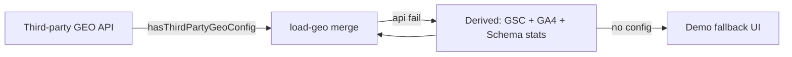
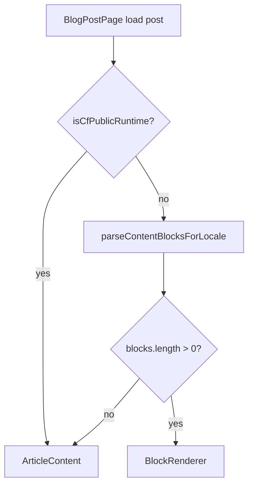

# 批次 G — SEO / GEO / AEO 與內容渲染

> **產品：** Zenith Mind Master Blueprint（合併版）  
> **說明：** 搜尋優化規格、公開站內容呈現  
> **來源檔案：** 17_SEO_GEO_AEO_SPEC.md、18_CONTENT_RENDERING_STRATEGY.md

---

## 本文件目錄

- [SEO_GEO_AEO_SPEC.md](#seo-geo-aeo-spec-md)
- [CONTENT_RENDERING_STRATEGY.md](#content-rendering-strategy-md)

---

## SEO_GEO_AEO_SPEC.md

---

### 1. 文件目的

定義 **公開站** 與 **作戰中心情報模組** 的 SEO / GEO / AEO 標準，使 AI 與工程師在擴充內容、模板或 pSEO 時 **不破壞索引、結構化資料與雙語 URL 契約**。

**三層定義（本專案用法）：**

| 層級 | 全名 | 目標 |
|------|------|------|
| **SEO** | Search Engine Optimization | Google/Bing 傳統搜尋排名與點擊 |
| **AEO** | Answer Engine Optimization | 摘要、FAQ、Featured Snippet、SGE 答案區塊 |
| **GEO** | Generative Engine Optimization | ChatGPT / Perplexity / Gemini 等引用品牌與網址的可見度 |

---

### 2. SEO 架構總覽

#### 2.1 技術 SEO 基線（Frozen Core #8）

| 項目 | 實作 | 檔案 |
|------|------|------|
| **語系 URL** | 永遠前綴 `/zh-TW`、`/en` | `lib/i18n/routing.ts` |
| **根導向** | `/` → `/zh-TW` | `middleware.ts` |
| **Canonical** | 每頁 `alternates.canonical` | 各 `generateMetadata` |
| **hreflang** | `alternates.languages` zh-TW / en | 同上 |
| **Sitemap** | 動態 `app/sitemap.ts`，`revalidate: 3600` | 含靜態路徑 + 已發布文章 |
| **robots** | 動態 `app/robots.ts` | 生產 allow `/`、disallow `/api/`；預覽 disallow 全站 |
| **Canonical host** | `*.vercel.app` / `*.workers.dev` → www | `canonical-host-redirect` |
| **GSC 驗證** | `metadata.verification.google` | `app/layout.tsx` |
| **metadataBase** | `getPublicSiteUrl()` | 根 layout |

**禁止：** 在 `robots.txt` 寫 `Disallow: /admin/`（等同公告後台路徑）。

#### 2.2 渲染與索引策略

| 頁面類型 | 策略 | revalidate |
|----------|------|------------|
| 首頁 | SSR + ISR | 3600 |
| 部落格列表 | SSR + ISR；`generateStaticParams` 無 DB 時 `[]` | 3600 |
| 文章詳情 | ISR + `generateStaticParams`（最近 100 slug × 2 locale） | 3600 |
| 密碼保護文 | 內容空 + Password Gate；仍可有 metadata | 條件 dynamic |
| 資料降級 | `robots: noindex` + 爬蟲 redirect 503 | `public-data-health` |

#### 2.3 Metadata 契約（Next.js Metadata API）

**根模板：** `app/layout.tsx`

```typescript
title.template: "%s | 巔峰思維 Zenith Mind"
metadataBase: NEXT_PUBLIC_SITE_URL
```

**文章詳頁**（`app/(public)/[locale]/blog/[slug]/page.tsx`）：

| 欄位 | 來源優先序 |
|------|------------|
| `title` | `seoMetadata.metaTitle` / `metaTitleEn` → 文章 title |
| `description` | `seoMetadata.metaDescription` / excerpt |
| `canonical` | `{siteUrl}/{locale}/blog/{slug}` |
| `openGraph` | ogTitle/ogDescription、article type、published/modified、cover 寬高 |
| `twitter` | `summary_large_image` |
| `robots` | `seoMetadata.noIndex` → `{ index: false, follow: false }` |

**後台 SEO 面板：** `components/admin/Editor/SeoPanel.tsx` → `updateSeoAction`

#### 2.4 Open Graph 與社群

| 資產 | 路徑 | 尺寸 |
|------|------|------|
| 首頁 OG | `/og-home.png` | 1200×630 |
| 文章 OG | `Post.coverImage` + width/height | DB 欄位防 CLS |
| 站名 | `Zenith Mind` / `巔峰思維` | OG `siteName` |

#### 2.5 效能與 SEO（CWV 相關）

| 機制 | 說明 |
|------|------|
| LCP | `HeroLcpPreload`、封面 `priority`、Supabase render 寬度 |
| CLS | 圖片 width/height、blurHash、廣告 `aspectRatio` |
| 同意制分析 | GA4/GTM **同意後**載入（不影響首屏 HTML 語意） |
| DNS | `PerformanceResourceHints` — Supabase preconnect |

**作戰中心 CWV：** `loadSeoPayload` 含示範值 `{ lcp: 2.1, inp: 180, cls: 0.08 }`（非 RUM 自動上報）。

---

### 3. JSON-LD / Schema.org（AEO 核心）

#### 3.1 統一產生器

**檔案：** `lib/seo/schemas/article.schema.ts`  
**注入：** `components/seo/JsonLd.tsx` + CSP `nonce`  
**序列化：** `serializeJsonLd` — 跳脫 `<` 防 `</script>` 截斷

#### 3.2 全站已部署類型

| @type | 頁面 | 函式 |
|-------|------|------|
| **Organization** + **WebSite** | 公開 layout / 首頁 | `buildOrganizationSchema` |
| **WebPage** | 首頁 | `buildHomeWebPageSchema` |
| **CollectionPage** + **ItemList** | 部落格列表 | `buildBlogCollectionSchema` |
| **Article** | 文章詳情 | `buildArticleSchema` |
| **FAQPage** | 文章有 `Post.faq` JSON | `buildFaqSchema` |
| **BreadcrumbList** | 文章詳情 | `buildBreadcrumbSchema` |
| **SearchAction** | WebSite `potentialAction` | 指向 `/zh-TW/blog?q={search_term_string}` |

**覆蓋率統計：** `lib/seo/schema-coverage.ts` + `lib/aeo/post-faq-stats.ts`

#### 3.3 FAQ 資料契約（AEO）

**儲存：** `Post.faq` JSON 陣列

```typescript
interface FaqItem {
  question: string;
  answer: string;
  questionEn?: string;
  answerEn?: string;
}
```

**有效 FAQ：** 至少一組 question/answer 非空（`hasValidFaq`）

**渲染：** 文章頁 FAQ 區塊 + 條件輸出 `FAQPage` JSON-LD（locale 選 zh/en 欄位）

**AI 生成：** `AiJobType.EXTRACT_FAQ`（後台）

#### 3.4 Breadcrumb 語意 HTML

`components/seo/Breadcrumb.tsx` — 與 JSON-LD `BreadcrumbList` 並存（雙軌有利 AEO/無障礙）

---

### 4. AEO 營運與量測

#### 4.1 站內指標

| 指標 | 來源 |
|------|------|
| FAQ 覆蓋率 | `getPublishedPostFaqStats().faqCoveragePct` |
| SEO Metadata 覆蓋率 | `withSeoMetadataCount` |
| Schema 準備度 | `getSchemaCoverageStats().readinessPct` |

**作戰中心：** `/admin/dashboard/aeo` — `loadAeoPayload()`（`server/command-center/load-aeo.ts`）

#### 4.2 外部訊號（GSC）

| 資料 | API |
|------|-----|
| Search Appearance | `fetchGscAeoAppearanceTotals` |
| Featured snippet / rich results | `appearances` 陣列於 AEO payload |

**環境：** `GOOGLE_SEARCH_CONSOLE_SITE_URL`（尾斜線 URL 格式）

#### 4.3 AEO 內容規範

| 規則 ID | 內容 |
|---------|------|
| **AEO-01** | 每篇支柱文建議 ≥3 組 FAQ，答案 40–300 字、可獨立理解 |
| **AEO-02** | FAQ 答案避免僅「見上文」；需自包含 |
| **AEO-03** | 使用 H2/H3 對應 TOC（`TableOfContents` 解析清洗後 HTML） |
| **AEO-04** | `metaDescription` 120–160 字元，含焦點關鍵字 |
| **AEO-05** | 發布後確認 `FAQPage` + `Article` 同頁輸出（檢視原始碼） |

---

### 5. GEO 架構

#### 5.1 資料來源優先序



**檔案：** `server/command-center/load-geo.ts`, `services/geo/index.ts`

#### 5.2 第三方 GEO

| 來源 | 環境變數 | 說明 |
|------|----------|------|
| 自訂 API | `GEO_API_BASE_URL`, `GEO_API_KEY` | 優先 |
| Semrush proxy | Semrush 相關 env | `fetchSemrushGeoProxy` |
| Otterly | `OTTERLY_API_KEY` | 無公開 REST 時提示改自建 proxy |

**Payload 欄位：** `citedPages`, `brandMentions`, `aiEngineSov`, `citationQueries`, `engines`

#### 5.3 衍生 GEO（無第三方時）

合併：

- Search Console 查詢/落地頁
- GA4 流量
- FAQ / Schema 覆蓋率
- 站內結構化指標

`GeoPayload.isDemo` / `dataSource: "derived" | "third_party" | "unavailable"`

#### 5.4 GEO 內容策略（公開站）

| 策略 | 實作 |
|------|------|
| **E-E-A-T** | 作者語意、Organization publisher、更新日期 |
| **可引用段落** | 清晰 H2、數據列表、FAQ 自包含答案 |
| **品牌實體** | Organization JSON-LD `alternateName` |
| **雙語** | 獨立 URL，避免機器翻譯單 URL |
| **pSEO 預留** | `Post.isProgrammatic`, `pSeoTemplate`；首頁 `ProgrammaticSeoSection` 導流 |

**首頁 pSEO 區塊：** CMS `homepageCopy.programmaticSeo` — 靜態策略卡片 + 連至 `/blog`（非動態萬頁生成）

---

### 6. 傳統 SEO 內容與關鍵字

#### 6.1 焦點關鍵字

**DB：** `SeoMetadata.focusKeyword` / `focusKeywordEn`  
**用途：** 後台編輯、AI 草稿 prompt、未來報表

#### 6.2 程式化 SEO（pSEO）

| 欄位 | 用途 |
|------|------|
| `Post.isProgrammatic` | 標記模板生成文 |
| `Post.pSeoTemplate` | 模板 ID（字串） |
| `slug` | 發布後不可改（應用層） |

**母版規則：** 大量 pSEO 須：

- 唯一 `canonical`
- 實質內容差異（非純替換城市名）
- Sitemap 收錄
- 監控 GSC 索引覆蓋

#### 6.3 內部連結

| 機制 | 說明 |
|------|------|
| 主題群集 | `TopicClusterSection` → category 篩選 `/blog?category=` |
| 相關文章 | `RecommendedPostsSection` 同分類 |
| 聯盟 `/go/` | 301 出站；不當內容頁索引（無 HTML 內容） |
| 快速導覽 | 首頁錨點 `#topics` 等 |

#### 6.4 轉址與 SEO

- 封存文章：`Redirect` 301 + middleware `redirectGuard`
- **禁止** 軟刪除後留 200 空頁（應 301 或 404+redirect）

---

### 7. AI 爬蟲與可讀性

#### 7.1 爬蟲辨識

`lib/seo/crawler.ts` — `isSearchEngineCrawler(userAgent)`

用於：資料降級時將 **搜尋引擎** 導向 `/api/health/public-data`（503），避免索引空列表。

#### 7.2 HTML 語意要求

| 元素 | 要求 |
|------|------|
| `<main id="main-content">` | layout 提供 |
| 單一 H1 | 文章頁標題區 |
| 文章容器 | `data-article-content` 或 `data-article-blocks` |
| 語言 | `html lang` 根為 zh-TW；內容 locale 由 URL 決定 |

#### 7.3 JavaScript 依賴

公開內容以 **RSC/SSR HTML** 為主；關鍵正文不依賴 client-only 載入。  
TOC、搜尋篩選為增強功能，非唯一內容來源。

---

### 8. 分析與隱私（SEO 相關）

| 服務 | 載入 | SEO 影響 |
|------|------|----------|
| GA4 | 同意後 `ConsentGatedAnalytics` | 不阻塞渲染 |
| GTM | 同上 | 可選 |
| 站內 PV | `/api/public/page-view` | 不存 PII |

**Page View** 不影響排名；用於 Social Proof 與營運。

---

### 9. 作戰中心情報模組對照

| 路由 | 模組 | 主要資料源 |
|------|------|------------|
| `/admin/dashboard/seo` | SEO Intelligence | GA4 + GSC |
| `/admin/dashboard/aeo` | AEO Intelligence | FAQ stats + GSC appearances |
| `/admin/dashboard/geo` | GEO Intelligence | 第三方 GEO 或衍生 |

**皆為後台 only；** `robots` 與 middleware 保護，不進 sitemap。

---

### 10. AI 開發規則（SEO / GEO / AEO）

| ID | 規則 |
|----|------|
| **AI-SEO-01** | 新增公開頁必須 `generateMetadata` + canonical + hreflang |
| **AI-SEO-02** | 禁止移除 JSON-LD nonce 或 `serializeJsonLd` |
| **AI-SEO-03** | FAQ 變更須同步 `buildFaqSchema` 條件 |
| **AI-SEO-04** | `noIndex` 文章不得進 sitemap（`loadSitemapPosts` 僅 PUBLISHED） |
| **AI-SEO-05** | 公開站 HTML 必須經 sanitize（見 `07-SEO-CONTENT.md`（CONTENT_RENDERING 章）） |
| **AI-SEO-06** | pSEO 批量頁須登記模板與監控索引 |

---

### 11. 機器可讀摘要（YAML）

```yaml
seo:
  locales: [zh-TW, en]
  localePrefix: always
  metadata:
    root: app/layout.tsx
    post: app/(public)/[locale]/blog/[slug]/page.tsx
  discovery:
    sitemap: app/sitemap.ts
    robots: app/robots.ts
    canonicalHostRedirect: true
  structuredData:
    module: lib/seo/schemas/article.schema.ts
    types: [Organization, WebSite, WebPage, CollectionPage, Article, FAQPage, BreadcrumbList, SearchAction]
  aeo:
    faqField: Post.faq
    stats: lib/aeo/post-faq-stats.ts
    dashboard: load-aeo.ts
  geo:
    thirdParty: services/geo/index.ts
    dashboard: load-geo.ts
    derivedSources: [gsc, ga4, schema_coverage]
  isrRevalidate: 3600
```

---

### 12. 相關文件

| 文件 | 關係 |
|------|------|
| `07-SEO-CONTENT.md`（CONTENT_RENDERING 章） | HTML/Markdown/Blocks 渲染 |
| `02-EVENTS-AND-MODULES.md`（EVENT_FLOW 章） | 發布後 revalidate 流 |
| `01-ARCHITECTURE.md`（DOMAIN_ARCHITECTURE 章） | Post / SeoMetadata 領域 |

---

*SEO 基線為 Frozen Core；變更索引或 Schema 策略須產品與 SEO 負責人確認。*


---

## CONTENT_RENDERING_STRATEGY.md

---

### 1. 文件目的

定義 **內容從儲存到瀏覽器** 的完整渲染管線：Markdown / Tiptap HTML / Content Blocks、消毒策略、Edge vs Node 差異、密碼文與 ISR 行為。

確保 AI 新增內容類型時 **不引入 XSS、不破壞 SEO 語意、不在 CF Worker bundle 全量 sanitize-html**。

---

### 2. 內容儲存模型

#### 2.1 Post 欄位（Prisma）

| 欄位 | 格式 | 用途 |
|------|------|------|
| `content` / `contentEn` | Markdown 或 HTML 字串 | 主正文（語系） |
| `contentType` | `"markdown"` \| `"tiptap"` | 渲染提示 |
| `contentBlocks` | JSON | 語意化區塊（優先渲染） |
| `contentDoc` | JSON | Tiptap 快照（防腐／遷移） |
| `faq` | JSON | FAQ 列表（非正文，獨立區塊 + JSON-LD） |
| `coverImage*` | URL + 寬高 + blurHash | LCP / OG |

#### 2.2 寫入時消毒（Node / 後台）

| 階段 | 函式 | 時機 |
|------|------|------|
| **寫入** | `sanitizeRichText` | `post.actions` 儲存前 |
| **純文字** | `sanitizeText` | excerpt 等 |
| **圖片 URL** | `optionalTrustedMediaUrl` | 封面、外連圖 |

**檔案：** `lib/sanitize/html.ts`（**sanitize-html** 完整白名單）

**原則：** 公開站 CF 渲染假設 **DB 內容已受信任**（後台寫入消毒）；Edge 僅做 **第二道輕量清洗**。

---

### 3. 渲染決策樹（文章正文）



**檔案：** `components/blog/PostArticleBody.tsx`

| 環境 | 行為 |
|------|------|
| **Cloudflare Worker** | **永遠** `ArticleContent`（略過 contentBlocks） |
| **Vercel / 本機** | 有有效 blocks → `BlockRenderer`；否則 `ArticleContent` |

**⚠ 缺口：** CF 上無法使用 contentBlocks 語意渲染（P2：Edge-safe block renderer 或 SSR 僅 Vercel）。

---

### 4. ArticleContent 管線（HTML / Markdown）

#### 4.1 流程

```
raw content string
  → (CF && starts with "<") ? use trimmed HTML
  → else convertMarkdownImagesToHtml (lib/markdown/images)
  → sanitizeRichTextForDisplay
  → dangerouslySetInnerHTML on <article data-article-content>
```

**檔案：** `components/blog/ArticleContent.tsx`

#### 4.2 雙軌消毒

| 環境 | 實作 | 檔案 |
|------|------|------|
| **Node** | 可選完整 `sanitize-html`（display 目前 re-export edge） | `lib/sanitize/html-display.ts` |
| **CF Worker** | `sanitizeRichTextEdge` — strip script/iframe/on*/javascript: | `lib/sanitize/html-edge.ts` |

**現行 `html-display.ts`：** 統一 re-export **edge** 版本（減少 bundle）；後台寫入仍用完整 `html.ts`。

#### 4.3 Markdown 圖片

`convertMarkdownImagesToHtml` — 將 `` 轉 ``（須 HTTPS 可信 URL）

#### 4.4 語意與樣式

- 外層 `article` + Tailwind `prose`（`@tailwindcss/typography`）
- `aria-label="文章內容"`
- 標題層級由內容自帶 H2/H3（TOC 依此生成）

---

### 5. BlockRenderer 管線（Content Blocks）

#### 5.1 Schema

**檔案：** `lib/content-blocks/schema.ts`（Zod discriminated union）

| type | data | 渲染 |
|------|------|------|
| `paragraph` | `{ html }` | sanitized HTML 片段 |
| `image` | `{ url, width, height, alt, blurHash? }` | `ResponsiveImage` + figure |
| `code` | `{ code, language? }` | `<pre><code>` 純文字 |
| `quote` | `{ text, cite? }` | blockquote |

**多語：** `contentBlocks` 為 `{ "zh-TW": [...], "en": [...] }` 或舊版純陣列（視為 zh-TW）

#### 5.2 與 SEO / CLS

- 圖片區塊 **強制** width/height（Zod positive int）
- 與 `next/image` / Supabase render 整合（`ResponsiveImage`）；`next.config.ts` `images.qualities` 須含 `[52, 54, 72, 75]`
- CMS 外部圖 URL：`lib/validation/external-image-url.ts`（不可靠圖床如 `duk.tw` 僅 UI 警告，不阻擋儲存）

#### 5.3 後台產出

Tiptap 編輯器（`RichTextEditor`）→ 儲存時可同步產生 `contentBlocks`（依 post.actions 邏輯）

---

### 6. 輔助 UI 元件

| 元件 | 類型 | 說明 |
|------|------|------|
| `TableOfContents` | Client | 解析 `data-article-content` 內 H2/H3 |
| `PostPasswordGate` | Client | 密碼解鎖（dynamic import on CF） |
| `RecommendedPostsSection` | Server + Suspense | 同分類推薦 |
| `PageViewTracker` | Client | 分析，非內容 |
| `Breadcrumb` | Server | 導覽 |

#### 6.1 密碼保護文

```
isPasswordProtected && !hasPostAccess
  → safeContent = ""  // 不輸出正文 HTML
  → PostPasswordGate 顯示表單
  → metadata 仍可索引（依 SEO 設定）；正文不可見
```

**Cookie：** `lib/blog/post-access-cookie.ts` — HMAC 簽名

---

### 7. 首頁與 CMS 區塊渲染

#### 7.1 資料載入

`loadHomepageData` → hero、carousel、featured、affiliate、siteSettings

**快取：** `unstable_cache` + tags（`site-settings`, `hero-slides` 等）

#### 7.2 元件策略

| 區塊 | 渲染 | 效能 |
|------|------|------|
| Hero | `HeroSection` / `HeroSlider` | LCP preload 第一張 |
| 下方區塊 | `home-deferred-sections` dynamic import | 降低 TBT |
| 廣告 | `AdSlotBanner` — Server 讀 DB | aspect-ratio 防 CLS |
| 首頁文案 | CMS JSON `homepageCopy` | 純文字/React，無 raw HTML |

**禁止：** 首頁 CMS 直接注入未消毒 HTML 字串（目前為結構化 copy 物件）。

---

### 8. 圖片交付（與內容耦合）

**策略：** `lib/images/delivery.ts`

| 模式 | 條件 | 行為 |
|------|------|------|
| `next` | 預設 Vercel | `next/image` optimizer |
| `supabase-render` | `CF_WORKER_RUNTIME=1` 或 env | Supabase Storage transform URL + srcSet |

**原因：** CF 上 `/_next/image` 延遲與快取限制；公開站預設 Supabase render。

**契約：** 內容圖片 URL 應為 Supabase Storage 或允許的 remote pattern（`next.config.ts`）。

---

### 9. 國際化與內容選擇

| 頁面 | 規則 |
|------|------|
| 文章 title/body | `locale === "en"` → `titleEn` / `contentEn` fallback 主欄位 |
| FAQ | `questionEn` / `answerEn` |
| Blocks | `parseContentBlocksForLocale(doc, locale)` |

**URL 為語系真實來源；** 勿僅依賴 cookie 切換正文。

---

### 10. 快取與內容新鮮度

| 機制 | 觸發 |
|------|------|
| ISR `revalidate=3600` | 文章/列表/首頁 segment |
| `revalidateTag("posts")` | 發布、更新、刪除、cron |
| `purgePublicSiteAfterPostChange` | 跨 CF 失效 |
| 密碼文 / 解鎖 | 依 cookie，可能需 `dynamic` 行為 |

**編輯後最壞：** 公開站 CF 快取 1h + 未 purge 時延遲 — 發布流程務必呼叫 purge。

---

### 11. 執行環境對照表

| 能力 | Vercel Node | CF Worker |
|------|:-----------:|:---------:|
| contentBlocks | ✅ | ❌（回退 HTML） |
| sanitize-html 完整版 | ✅ 寫入 | ❌ |
| sanitizeRichTextEdge | ✅ | ✅ |
| BlockRenderer | ✅ | ❌ |
| Prisma 讀文 | ✅ | Supabase REST |
| RecommendedPosts | ✅ | dynamic 可選 |

詳見 `03-DATA.md`（DATA_ACCESS_EDGE_RULES 章）。

---

### 12. 安全規範（Frozen Core 延伸）

| 規則 ID | 內容 |
|---------|------|
| **CR-01** | 禁止公開站 `dangerouslySetInnerHTML` 無清洗 |
| **CR-02** | 禁止 CF bundle 引入完整 `sanitize-html` |
| **CR-03** | 寫入時必須 `sanitizeRichText`（後台） |
| **CR-04** | 外連 `href` 須 `rel=noopener noreferrer`（寫入 transform） |
| **CR-05** | `contentDoc` 不直接渲染前台（僅防腐） |

---

### 13. 擴充新內容類型檢查清單

- [ ] Zod block schema + `BlockRenderer` case
- [ ] 寫入 path 消毒規則
- [ ] CF 是否需 Edge-safe 子集
- [ ] 是否影響 TOC / JSON-LD
- [ ] 圖片是否含 width/height
- [ ] 是否需更新 `07-SEO-CONTENT.md`（SEO 章）

---

### 14. AI 開發規則

| ID | 規則 |
|----|------|
| **AI-CR-01** | 新正文格式須經後台消毒 + 公開 display 清洗 |
| **AI-CR-02** | CF 路徑禁止依賴 contentBlocks 除非實作 Edge 支援 |
| **AI-CR-03** | 圖片區塊必須含 alt 與尺寸 |
| **AI-CR-04** | 勿在 RSC 引入 Client-only 大型編輯器 bundle |

---

### 15. 機器可讀摘要（YAML）

```yaml
contentRendering:
  postFields: [content, contentEn, contentType, contentBlocks, contentDoc, faq]
  writeSanitize: lib/sanitize/html.ts
  displaySanitize:
    edge: lib/sanitize/html-edge.ts
    entry: lib/sanitize/html-display.ts
  components:
    router: components/blog/PostArticleBody.tsx
    html: components/blog/ArticleContent.tsx
    blocks: components/blog/BlockRenderer.tsx
  decision:
    cfPublic: ArticleContent_only
    vercel: blocks_first_else_html
  images:
    delivery: lib/images/delivery.ts
    modes: [next, supabase-render]
  passwordGate: lib/blog/post-access-cookie.ts
  isrSeconds: 3600
```

---

### 16. 相關文件

| 文件 | 關係 |
|------|------|
| `07-SEO-CONTENT.md`（SEO 章） | Metadata、JSON-LD、FAQ |
| `05-API-AUTH-PERMISSIONS.md`（API_CONTRACT 章） | page-view、search |
| `05-API-AUTH-PERMISSIONS.md`（AUTH_FLOW 章） | post-access cookie |

---

*內容渲染變更須同時評估 XSS 與 CF/Vercel 雙平面行為。*

