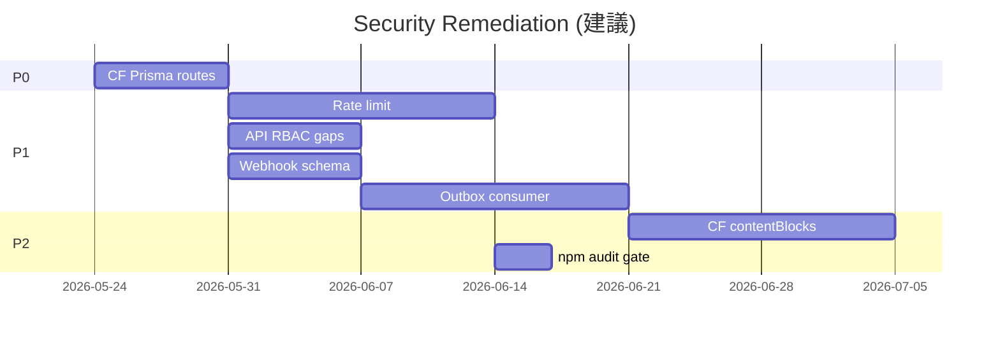
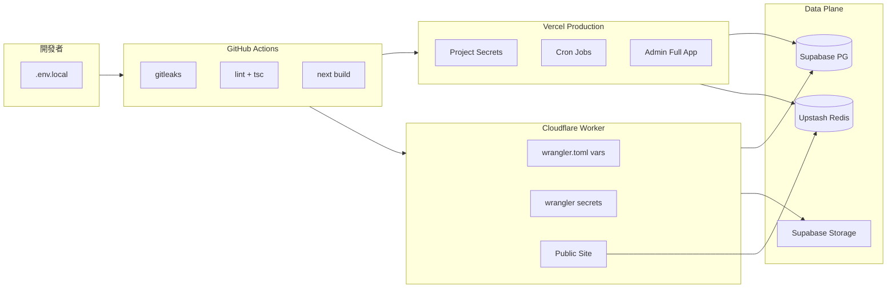

# 批次 H — 資安與 DevSecOps

> **產品：** Zenith Mind Master Blueprint（合併版）  
> **說明：** 安全標準、風險登錄、CI/CD 與事件應變  
> **來源檔案：** 19_SECURITY_STANDARD.md、20_SECURITY_RISK_REPORT.md、21_DEVSECOPS_GUIDE.md

---

## 本文件目錄

- [SECURITY_STANDARD.md](#security-standard-md)
- [SECURITY_RISK_REPORT.md](#security-risk-report-md)
- [DEVSECOPS_GUIDE.md](#devsecops-guide-md)

---

## SECURITY_STANDARD.md

---

### 1. 文件目的

建立 **可執行、可審計** 的資安標準，涵蓋認證、授權、輸入輸出、傳輸、秘密管理、隱私與維運。  
違反本文件 **Frozen Core** 條款者，不得合併至 main。

---

### 2. 安全目標與威脅模型

#### 2.1 目標

| 目標 | 說明 |
|------|------|
| **機密性** | Secret 不進 Git、不進 `NEXT_PUBLIC_*`、不進 client bundle |
| **完整性** | 管理操作須 RBAC；Webhook/Cron 須密鑰驗證 |
| **可用性** | 源站 IP Guard、分析降級不拖垮全站 |
| **可歸責** | AuditLog、requestId、結構化日誌 |
| **隱私** | 訪客 analytics 用 hash；最小化 PII 儲存 |

#### 2.2 威脅模型（簡表）

| 威脅 | 緩解層 |
|------|--------|
| 帳密暴力破解 | bcrypt、統一 AUTH_FAILED、**建議** rate limit |
| Session 竊取 / 重放 | httpOnly cookie、短 Access TTL、Refresh rotation + blacklist |
| Webhook 偽造 / 重放 | HMAC + timestamp + Redis nonce |
| XSS | CSP nonce、sanitize 寫入/顯示雙層 |
| CSRF（Server Action） | SameSite cookie（strict/lax） |
| 源站直連繞過 CF | IP Guard + CF-Ray 檢查（生產） |
| 權限提升（GUEST） | `gateAdminWrite` on mutations |
| Secret 洩漏 | gitleaks CI、scan-secrets、env.ts |
| SSRF（媒體 URL） | `lib/validation/external-image-url.ts`；不可靠圖床僅警告（`blocked-image-hosts.ts`） |
| 快取中毒 | `assertRevalidateTarget` |

---

### 3. Frozen Core 安全條款（不可削弱）

引用自 `00-OVERVIEW.md` §11，以下為 **強制**：

| # | 條款 |
|---|------|
| FC-1 | 分裂部署：CF 公開 + Vercel 後台 + `ADMIN_DEPLOYMENT_URL` |
| FC-2 | JWT 雙 token + Refresh 輪替 + Redis blacklist + TOTP 流程 |
| FC-3 | Webhook：HMAC + ±5min timestamp + Redis nonce |
| FC-4 | Cron：`CRON_SECRET` Bearer + `timingSafeEqual` |
| FC-5 | Middleware 順序不變（canonical → admin proxy → redirect → IP → auth → CSP） |
| FC-6 | 所有 mutation 經 `gateAdminWrite` |
| FC-7 | PageView 僅 `visitorHash`，不存 raw IP |
| FC-8 | SEO 基線（locale、sitemap、canonical）— 見 `07-SEO-CONTENT.md`（SEO 章） |
| FC-9 | Schema 變更僅 `prisma migrate` |
| FC-10 | Secret：禁止 hardcode；`env.ts` + platform secrets |

---

### 4. 認證與 Session（AuthN）

#### 4.1 標準

| 項目 | 標準 | 實作 |
|------|------|------|
| 密碼儲存 | bcrypt cost 12 | `lib/auth/password.ts` |
| 登入防枚舉 | 假使用者仍 bcrypt | `auth.service.ts` |
| Access JWT | HS256，1h，`jose` only | `lib/auth/jwt.ts` |
| Refresh JWT | 獨立 secret，7d，含 `tokenId` | 同上 |
| Refresh 輪替 | 舊 tokenId 進 blacklist | `token-blacklist.ts` |
| TOTP secret | AES-256-CBC at rest | `lib/integrations/crypto.ts` key from `TOTP_ENCRYPTION_KEY` |
| Cookie | `httpOnly`, prod `secure`, `sameSite` strict/lax | `auth.actions.ts`, refresh route |
| Bootstrap | 一次性 env，用後刪除 | `04-SEEDING.md` |

#### 4.2 禁止

- 使用 `jsonwebtoken` 於 Edge
- 將 JWT secret 放入 `NEXT_PUBLIC_*`
- 在 log 輸出 token 全文
- 生產環境保留預設 `guest001` 未輪替

---

### 5. 授權（AuthZ）

#### 5.1 標準

| 層級 | 職責 |
|------|------|
| **Middleware** | 僅驗證 access JWT **存在且有效** |
| **Server Action / 寫入 API** | **權威：** `gateAdminWrite(entity)` |
| **讀取 API** | `gateAdminRead()` 或等價 session |

完整矩陣見 `05-API-AUTH-PERMISSIONS.md`（PERMISSION_MATRIX 章）。

#### 5.2 禁止

- 僅依賴 Middleware 阻擋 GUEST 寫入
- 在 API Route 僅驗 JWT 不驗 `role === ADMIN`（已知缺口，新程式必須補上）

---

### 6. 輸入驗證與輸出編碼

#### 6.1 Server Actions / API

| 規則 | 實作 |
|------|------|
| 所有外部輸入 Zod parse | `actions/*`, `CreateAiJobSchema` 等 |
| 錯誤不洩漏 stack 給終端使用者 | `ActionResult`, `formatApiError` |
| Admin 富文本寫入消毒 | `sanitizeRichText` |
| 公開顯示消毒 | `sanitizeRichTextEdge` / display 入口 |

#### 6.2 HTML / XSS

| 環境 | 要求 |
|------|------|
| 後台寫入 | `sanitize-html` 白名單標籤/屬性 |
| 公開顯示 | 禁止未清洗的 `dangerouslySetInnerHTML` |
| CSP 生產 | nonce + strict-dynamic script；`style-src-attr` 允許 inline（CMS 定位） |

#### 6.3 路徑與快取注入

| 端點 | 防護 |
|------|------|
| `POST /api/revalidate` | Bearer secret + `assertRevalidateTarget` |
| Redirect 寫入 | `redirect-write-guard` 防 cycle/self |

#### 6.4 媒體與 SSRF

| 規則 | 實作 |
|------|------|
| 外連圖片 URL 驗證 | `lib/validation/external-image-url.ts`（`checkExternalImageUrl`） |
| 不可靠 hotlink 圖床 | `lib/validation/blocked-image-hosts.ts` — **警告不阻擋**（如 `duk.tw`） |
| `allowed-media-url.ts` | 薄包裝，委派 `optionalExternalImageUrlSchema` |

---

### 7. 傳輸與 HTTP 安全標頭

#### 7.1 Middleware 標頭（生產）

| Header | 值 |
|--------|-----|
| `Content-Security-Policy` | 見 `buildCsp` |
| `Strict-Transport-Security` | max-age=31536000; includeSubDomains; preload |
| `X-Frame-Options` | DENY |
| `X-Content-Type-Options` | nosniff |
| `Referrer-Policy` | strict-origin-when-cross-origin |
| `Permissions-Policy` | camera/mic/geo 關閉 |
| `Cross-Origin-Opener-Policy` | same-origin |

**單一來源：** `apply-baseline-security-headers.ts`（避免與 `next.config` 重複）

#### 7.2 Cloudflare 靜態標頭

`public/_headers` — 靜態資產 HSTS / nosniff / DENY

#### 7.3 源站保護

| 條件 | 行為 |
|------|------|
| 生產 + 非 Vercel + 非 CF 代理 | `403`（`ip-guard`） |
| 有 `CF-Ray` | 視為經 CF 代理 |

**維護：** 每季更新 `CF_CIDRS`（`ip-guard.ts`）

---

### 8. 秘密管理（Secrets）

#### 8.1 分類

| 類別 | 範例 | 儲存位置 |
|------|------|----------|
| **公開可配置** | `NEXT_PUBLIC_SITE_URL`, GA4 Measurement ID | env / wrangler `[vars]` |
| **伺服器秘密** | JWT_*, DATABASE_URL, WEBHOOK_SECRET | Vercel Secret / `wrangler secret` |
| **整合憑證** | GA4 私鑰、Gemini key | DB 加密 + env |
| **一次性** | `ADMIN_BOOTSTRAP_*` | 僅 onboarding，用後刪 |

#### 8.2 規則（env.ts）

- `JWT_*` min 64 字元
- `WEBHOOK_SECRET`, `CRON_SECRET`, `REVALIDATE_SECRET` min 32
- `GEMINI_API_KEY` 須 `AIza` 前綴驗證格式
- **禁止** secret 的 `NEXT_PUBLIC_` 前綴（註解於 `env.ts`）

#### 8.3 輪替 Runbook（摘要）

| Secret | 建議頻率 | 注意 |
|--------|----------|------|
| JWT_ACCESS/REFRESH | 每年或洩漏時 | 全員重新登入 |
| WEBHOOK_SECRET | 與整合方同步 | 雙寫過渡期 |
| CRON_SECRET | 與 Vercel Cron 同步 | 更新後立即測 cron |
| TOTP_ENCRYPTION_KEY | **極難輪替** | 需重加密所有 `totpSecret` |
| DATABASE_URL | 依 Supabase 政策 | 使用 pooler URL |

詳見 `08-SECURITY.md`（DEVSECOPS 章）。

---

### 9. Webhook 與 Cron 標準

#### 9.1 Webhook

完整契約：`06-INTEGRATION-AUTOMATION.md`（WEBHOOK 章）

| 檢查項 | 必須 |
|--------|------|
| 三 Header 齊全 | ✓ |
| timingSafeEqual 簽名 | ✓ |
| Nonce NX 300s | ✓ |
| _handler 內禁止長時間阻塞 | ✓ |

#### 9.2 Cron / 內部 API

| 端點 | Auth |
|------|------|
| `/api/cron/*` | `Authorization: Bearer ${CRON_SECRET}` |
| `/api/redirect` | `x-redirect-internal: ${REDIRECT_LOOKUP_SECRET}` |
| `/api/revalidate` | Bearer `REVALIDATE_SECRET` |

---

### 10. 資料與隱私

#### 10.1 儲存最小化

| 資料 | 政策 |
|------|------|
| `PageView` | 僅 `visitorHash`，無 raw IP |
| `AuditLog` | 可存完整 IP（後台追蹤）；90 天刪除 |
| `User.password` | bcrypt only |
| `Post.accessPasswordHash` | bcrypt |
| `IntegrationCredential` | AES 加密 JSON |

#### 10.2 GDPR 對照（摘要）

| 權利 | 現況 |
|------|------|
| 存取/刪除 | 無自助流程；需人工 |
| 最小化 | PageView 已實踐 |
| 日誌 | AuditLog 有 retention |

---

### 11. 稽核與日誌

#### 11.1 AuditLog

| 項目 | 標準 |
|------|------|
| 寫入方式 | `void writeAuditLog` 非阻塞 |
| 動作 | LOGIN, LOGOUT, TOTP_*, CRUD, PUBLISH, AI_GENERATE |
| 保留 | 90 天（cron cleanup） |
| 匯出 | 應限 ADMIN（見 PERMISSION_MATRIX PM-02） |

#### 11.2 應用日誌

`lib/logger` — 結構化 JSON；含 `requestId` / `jobId`  
**禁止：** log 密碼、token、私鑰、完整 webhook body。

---

### 12. 依賴與供應鏈

| 控制 | 實作 |
|------|------|
| CI gitleaks | `.github/workflows/ci.yml` |
| 本地 scan | `scripts/scan-secrets.mjs` |
| npm audit | `npm run security:audit`（audit-ci moderate+） |
| CI npm audit high+ | continue-on-error |

---

### 13. 管理後台隔離

| 項目 | 標準 |
|------|------|
| `robots` | `admin/layout.tsx` noindex |
| 部署 | 建議獨立 Vercel 專案 URL |
| 公開 middleware | `/admin` 302 至 `ADMIN_DEPLOYMENT_URL` |
| Sentry | 可經 `/monitoring` tunnel（Vercel 建置） |

---

### 14. AI 不可違反規則（Security）

| ID | 規則 |
|----|------|
| **AI-SEC-01** | 禁止削弱 FC-1～FC-10 |
| **AI-SEC-02** | 禁止新增無認證的 mutation 端點 |
| **AI-SEC-03** | 禁止 `NEXT_PUBLIC_` 承載 API key / JWT secret |
| **AI-SEC-04** | 禁止 Middleware 新增 Prisma/GA4 gRPC |
| **AI-SEC-05** | 禁止移除 sanitize 或 CSP nonce 路徑 |
| **AI-SEC-06** | 新 secret 必須進 `env.ts` schema |
| **AI-SEC-07** | Webhook/Cron 必須 timing-safe 比對 |

---

### 15. 合規檢查清單（新功能上線前）

- [ ] 是否新增外部輸入？→ Zod
- [ ] 是否新增寫入？→ `gateAdminWrite`
- [ ] 是否新增 secret？→ 非 NEXT_PUBLIC + 文件化
- [ ] 是否影響 CSP connect-src？
- [ ] 是否需 AuditLog？
- [ ] CF 路徑是否 Edge-safe？
- [ ] 是否更新 `08-SECURITY.md`（SECURITY_RISK 章） 缺口表

---

### 16. 相關文件

| 文件 | 關係 |
|------|------|
| `08-SECURITY.md`（SECURITY_RISK 章） | 風險登錄與修復優先級 |
| `08-SECURITY.md`（DEVSECOPS 章） | CI/CD、部署、事件應變 |
| `05-API-AUTH-PERMISSIONS.md`（AUTH_FLOW 章） | 認證細節 |
| `03-DATA.md`（DATA_LIFECYCLE 章） | 資料保留 |

---

*本標準為母版產品安全基線；客戶克隆部署時須複製並調整威脅模型章節。*


---

## SECURITY_RISK_REPORT.md

---

### 1. 文件目的

彙總 **已知安全風險、缺口與技術債**，提供嚴重度、影響、現況緩解與修復優先級。  
供產品負責人排程與 AI 避免重複引入相同風險。

**評分模型：**

| 等級 | 定義 |
|------|------|
| **Critical** | 可被未授權遠端利用或大量資料外洩，需立即處理 |
| **High** | 實質風險，短期內修復 |
| **Medium** | 需條件利用或影響範圍有限 |
| **Low** | 防禦縱深不足、合規缺口 |
| **Info** | 文件/維運改進 |

---

### 2. 執行摘要

| 等級 | 數量 | 代表議題 |
|------|------|----------|
| Critical | 0 | 無已確認遠程 RCE；P0 為可用性/架構 |
| High | 4 | CF+Prisma、無 rate limit、API RBAC 缺口、Outbox 延遲 |
| Medium | 8 | env 驗證跳過、GUEST UI、整合輪替、CSRF 深度防禦等 |
| Low | 6 | CWV 假資料、文檔分散、cron 頻率等 |

**整體結論：** 核心 **認證、Webhook、Cron、CSP、寫入 RBAC** 已達企業部落格/CMS 良好水準；主要缺口在 **Edge 資料平面一致性**、**API 層角色檢查**、**全域限流** 與 **維運自動化**。

---

### 3. 風險登錄表

#### 3.1 High

| ID | 風險 | 影響 | 現況緩解 | 建議修復 | 優先 |
|----|------|------|----------|----------|------|
| **R-H01** | ~~CF `/search`、`/go` Prisma~~ | — | `getPublicContentRepository()` | 維護 Supabase env/RLS | **已緩解** |
| **R-H02** | **HTTP Rate Limit 不完整** | 暴力嘗試、webhook 濫用 | Webhook nonce；middleware 30/min（auth/webhook） | 擴充路由或 Pro WAF | **P1** |
| **R-H03** | ~~GUEST 寫入 AI/audit export~~ | — | `gateAdminOnly()` | — | **已緩解** |
| **R-H04** | **Outbox 僅每日 cron（Hobby）** | Webhook 後 ISR 最壞延遲 ~24h | Admin 發布走 `purgePublicSite` 即時 | Vercel Pro 高頻 cron 或外部排程 | **P1** |

#### 3.2 Medium

| ID | 風險 | 影響 | 現況緩解 | 建議修復 | 優先 |
|----|------|------|----------|----------|------|
| **R-M01** | **`SKIP_ENV_VALIDATION` on CF** | 錯配 env 執行期才失敗 | wrangler 僅公開變數 | 關鍵路徑顯式檢查 + 啟動探針 | P1 |
| **R-M02** | **Middleware 不檢查 write 權限** | GUEST 可瀏覽敏感後台頁 | `gateAdminWrite` on mutations | 敏感頁 server-side role check | P2 |
| **R-M03** | ~~Webhook payload 無 Zod~~ | — | `WebhookEnvelopeV1Schema` | — | **已緩解** |
| **R-M04** | **`REVALIDATE_SECRET` fallback `WEBHOOK_SECRET`** | 輪替 webhook 連帶影響 revalidate | 文件化 | 分離 secret、禁止 fallback | P2 |
| **R-M05** | **CF 不渲染 contentBlocks** | 與 Vercel 呈現不一致 | 回退 HTML | Edge-safe BlockRenderer 子集 | P2 |
| **R-M06** | **Audit log 存完整 IP** | GDPR 稽核壓力 | 90 天刪除；後台限權 | 政策文件化或恢復遮罩選項 | P2 |
| **R-M07** | **POST_ACCESS_SECRET 可 fallback JWT_ACCESS** | 金鑰耦合擴大洩漏影響 | 可設獨立 secret | 強制獨立 `POST_ACCESS_SECRET` | P2 |
| **R-M08** | **無 CSRF token（僅 SameSite）** | 跨站請求邊界案例 | strict/lax cookie | 評估 Server Action origin 檢查 | P3 |

#### 3.3 Low

| ID | 風險 | 影響 | 建議 | 優先 |
|----|------|------|------|------|
| **R-L01** | dev 環境 `PAGEVIEW_HASH_SALT` 預設值 | 本地 hash 可預測 | 強制 .env.local 覆蓋 | P3 |
| **R-L02** | `redirect` API dev 允許無 secret | 本機誤用 | 文件註明僅 dev | P3 |
| **R-L03** | CF CIDRS 靜態清單過期 | 極端情況 IP 判斷錯誤 | 每季更新 CF IP 清單 | P3 |
| **R-L04** | AI Worker cron 每日一次 | 任務堆積 | 提高頻率或 queue 驅動 | P2 |
| **R-L05** | `RedisQueueAdapter` 未使用 | 架構混淆 | 移除或接入 worker | P3 |
| **R-L06** | npm audit CI `continue-on-error` | 高危漏洞可能漏報 | 改為阻擋 main 合併 | P2 |

#### 3.4 Info

| ID | 說明 |
|----|------|
| **R-I01** | 作戰中心 GEO/AEO 含 demo/衍生資料，需 UI 標示（已有 Demo Banner 模式） |
| **R-I02** | 分裂部署 env 三處同步（Vercel / wrangler / 本機）— 見 `08-SECURITY.md`（DEVSECOPS 章） |
| **R-I03** | `robots.txt` 不 disallow admin（刻意，避免暴露路徑） |

---

### 4. 控制項對照（已實作優勢）

| 控制域 | 狀態 | 證據 |
|--------|------|------|
| 密碼雜湊 | ✅ | bcrypt |
| JWT + 黑名單 | ✅ | jose + Redis |
| TOTP | ✅ | AES at rest |
| Webhook 防偽 | ✅ | HMAC+ts+nonce |
| Cron 保護 | ✅ | CRON_SECRET |
| CSP（prod） | ✅ | nonce |
| HSTS / XFO / nosniff | ✅ | middleware + `_headers` |
| 寫入 RBAC | ✅ | gateAdminWrite |
| XSS 清洗 | ✅ | sanitize 雙層 |
| 訪客隱私 PV | ✅ | visitorHash |
| Secret CI | ✅ | gitleaks |
| Admin noindex | ✅ | layout metadata |
| 源站 CF 檢查 | ✅ | CF-Ray / CIDR |

---

### 5. 威脅場景演練（Tabletop）

#### 5.1 場景：Refresh Token 洩漏

| 步驟 | 系統行為 |
|------|----------|
| 攻擊者取得 refresh cookie | 可 refresh 直到輪替 |
| 使用者登出 | tokenId 黑名單 → 失效 |
| 緩解缺口 | Access 仍 1h 有效（竊取 access 窗口） |

**建議：** 敏感操作可要求 re-auth 或縮短 access TTL。

#### 5.2 場景：Webhook secret 洩漏

| 步驟 | 系統行為 |
|------|----------|
| 攻擊者偽造 POST | 需有效 nonce+timestamp |
| 重放同一 nonce | Redis 阻擋 |
| 大量唯一 nonce | 無 rate limit → **風險 R-H02** |

#### 5.3 場景：GUEST 帳號洩漏

| 步驟 | 系統行為 |
|------|----------|
| 登入後台 | Middleware 允許 |
| 改文章 | Action FORBIDDEN |
| 呼叫 AI Jobs API | **可能成功（R-H03）** |
| 匯出 audit | **可能成功（R-H03）** |

---

### 6. 修復路線圖（建議）



---

### 7. 殘留風險接受（Risk Acceptance）模板

若商業時程不允許修復，須 **書面接受**：

| 欄位 | 內容 |
|------|------|
| 風險 ID | |
| 接受理由 | |
| 補償控制 | |
| 複審日期 | |

---

### 8. AI 使用本報告方式

- 新增功能前：檢查是否落入 R-H/R-M 同類
- 修復後：更新狀態為 Mitigated + PR 連結
- **禁止** 為關閉風險而移除安全控制（違反 `08-SECURITY.md`（SECURITY_STANDARD 章））

---

### 9. 機器可讀風險索引（YAML）

```yaml
riskReport:
  version: "1.0"
  date: "2026-05-23"
  summary: { critical: 0, high: 4, medium: 8, low: 6 }
  topPriority: [R-H02, R-H04]
  frozenCoreRef: SECURITY_STANDARD.md#3
```

---

### 10. 相關文件

| 文件 | 關係 |
|------|------|
| `08-SECURITY.md`（SECURITY_STANDARD 章） | 應達標準 |
| `08-SECURITY.md`（DEVSECOPS 章） | 預防與偵測 |
| `05-API-AUTH-PERMISSIONS.md`（PERMISSION_MATRIX 章） | PM-01/02/03 |

---

*本報告應隨重大架構變更更新；滲透測試結果應另附獨立報告附錄。*


---

## DEVSECOPS_GUIDE.md

---

### 1. 文件目的

為 **單租戶母版** 提供 DevSecOps 可複製手冊：從開發者提交到 Vercel + Cloudflare 生產的 **安全閘門、秘密同步、部署檢查與事故最小化流程**。

---

### 2. 環境拓撲與秘密平面



| 平面 | 承載 | 秘密密度 |
|------|------|----------|
| **本機** | `npm run dev` | `.env.local`（gitignore） |
| **CI** | 假 env + `SKIP_ENV_VALIDATION` | 無真實 secret |
| **Vercel** | 後台、Cron、AI、Prisma 全功能 | 高 |
| **CF Worker** | 公開站 + 部分 API | 中（私鑰應在 secrets） |

---

### 3. CI/CD 安全管線

**檔案：** `.github/workflows/ci.yml`

#### 3.1 階段與閘門

| Job | 目的 | 阻擋合併？ |
|-----|------|------------|
| **secret-scan** | gitleaks 全歷史 | 是（job 失敗） |
| **quality** | ESLint max-warnings 0 + `tsc --noEmit` | 是 |
| **build** | `prisma generate` + `next build`（SKIP_ENV_VALIDATION） | 是 |
| **audit** | `npm audit --audit-level=high` | **否**（continue-on-error） |

#### 3.2 建議強化（不影響現程式，流程建議）

| 強化 | 作法 |
|------|------|
| 阻擋高危 CVE | `audit` job 改 `continue-on-error: false` 或 OpenSSF Scorecard |
| 本機 secret | PR 前跑 `node scripts/scan-secrets.mjs` |
| CF build | 另 job `npm run build:cf`（需 secret mock） |
| Playwright a11y | 已有 `test:a11y`，可選入 nightly |

#### 3.3 本地腳本

| 腳本 | 用途 |
|------|------|
| `scripts/scan-secrets.mjs` | 比對 postgres URL、sk-、AIza、JWT 模式 |
| `npm run security:audit` | audit-ci moderate+ |
| `scripts/check-deployment-readiness.mjs` | 部署前檢查（若存在） |
| `scripts/push-wrangler-secrets.mjs` | CF secrets 推送輔助 |

---

### 4. 秘密管理實務

#### 4.1 禁止清單

- 提交 `.env`, `.env.local`, `.dev.vars`（含真值）
- 在 `wrangler.toml` 寫入 private key / JWT / DB password
- 在 issue、PR 評論貼 secret
- 在日誌 `console.log` 印出 `process.env`

#### 4.2 Vercel 設定清單（後台平面）

**必須（生產）：**

```
DATABASE_URL, DIRECT_URL
JWT_ACCESS_SECRET, JWT_REFRESH_SECRET
TOTP_ENCRYPTION_KEY
UPSTASH_REDIS_REST_URL, UPSTASH_REDIS_REST_TOKEN
SUPABASE_SERVICE_ROLE_KEY
WEBHOOK_SECRET, CRON_SECRET, REVALIDATE_SECRET
REDIRECT_LOOKUP_SECRET, PAGEVIEW_HASH_SALT
GEMINI_API_KEY
GA4_CLIENT_EMAIL, GA4_PRIVATE_KEY, GA4_PROPERTY_ID
```

**公開（可 UI 顯示）：**

```
NEXT_PUBLIC_SITE_URL, NEXT_PUBLIC_SUPABASE_URL, NEXT_PUBLIC_SUPABASE_ANON_KEY
NEXT_PUBLIC_GA4_MEASUREMENT_ID (optional)
ADMIN_DEPLOYMENT_URL
```

#### 4.3 Cloudflare Worker

| 類型 | 位置 |
|------|------|
| 非敏感 | `wrangler.toml` `[vars]` |
| 敏感 | `npx wrangler secret put <NAME>` |

**現行 vars 含：** `NEXT_PUBLIC_*`, GA4 client email, property id — **不可** 放 private key。

**執行期：** `SKIP_ENV_VALIDATION=true` — 見 `08-SECURITY.md`（SECURITY_RISK 章） R-M01。

#### 4.4 整合憑證（DB 加密）

流程：

1. 後台 Integrations Hub 輸入
2. `saveIntegrationDraft` → `encryptSecret`
3. Probe 成功 → `CONNECTED`
4. `withIntegrationEnv` 注入請求鏈

**DevOps：** 亦可腳本 `import-integration-drafts`（待實作）從 1Password 匯入。

---

### 5. 部署安全檢查表

#### 5.1 首次上線（單租戶）

- [ ] `prisma migrate deploy` on production DB
- [ ] Vercel env 與 `env.ts` 對照完整
- [ ] CF secrets 已 set（對照 `.dev.vars.example`）
- [ ] `ADMIN_DEPLOYMENT_URL` 指向正確 Vercel 網域
- [ ] `NEXT_PUBLIC_SITE_URL` = 正式 www 網域
- [ ] 刪除 `ADMIN_BOOTSTRAP_*` after admin created
- [ ] Cron 手動打一次 verify（Bearer CRON_SECRET）
- [ ] `POST /api/revalidate` 抽樣測試
- [ ] GSC / GA4 服務帳號僅只讀必要 scope
- [ ] gitleaks 綠燈

#### 5.2 每次發布

- [ ] CI 全綠
- [ ] 無新增 secret 進 repo
- [ ] 變更 middleware / auth 時 regression 測登入/logout/refresh
- [ ] 若改 CSP connect-src → 驗證 GA/GTM/Clarity 仍運作

#### 5.3 CF + Vercel 分裂部署注意

| 檢查 | 原因 |
|------|------|
| Admin 變更後測 public purge | Vercel ISR ≠ CF cache |
| 勿僅依賴 Webhook outbox 即時性 | Hobby 下 outbox cron 為每日；發布請同步 purge |
| CF build 後抽樣 `/api/search`、`/go/*` | 確認 Supabase repo 正常（非 Prisma on Edge） |

---

### 6. 監控與偵測

#### 6.1 應用層

| 信號 | 來源 |
|------|------|
| 5xx 尖峰 | Sentry（Vercel 完整建置） |
| AI dead letter | Email alert + Outbox `AI_JOB_DEAD_LETTER` |
| 公開資料降級 | `/api/health/public-data` 503 |
| Audit 異常登入 | 後台 audit log 篩選 LOGIN failed |

#### 6.2 基礎設施

| 信號 | 建議 |
|------|------|
| Supabase 連線數 | Dashboard 監控 |
| Redis 記憶體/命令數 | Upstash 告警 |
| CF WAF | 啟用 OWASP 核心規則集（Dashboard） |
| Vercel 異常 Cron 401 | CRON_SECRET 不一致 |

#### 6.3 安全監控（建議）

- gitleaks 定期 schedule（已有 push/PR）
- 依賴 Dependabot / Renovate
- 季度檢閱 `08-SECURITY.md`（SECURITY_RISK 章）

---

### 7. 事件應變（Incident Response）摘要

#### 7.1 嚴重度分級

| 級別 | 範例 | 初動 |
|------|------|------|
| SEV-1 | DB 洩漏、JWT secret 洩漏、站點被掛馬 | 立即輪替 secret、評估強制登出 |
| SEV-2 | 單一整合 key 洩漏 | 撤銷 key、rotate |
| SEV-3 | 掃描器低危 finding | 排程修復 |

#### 7.2 JWT / Webhook 洩漏 playbook

**JWT secret 洩漏：**

1. 輪替 `JWT_ACCESS_SECRET` + `JWT_REFRESH_SECRET`
2. 部署 Vercel
3. 全員重新登入（舊 refresh 黑名單可選清空 Redis DB）
4. 檢查 AuditLog 異常時段

**WEBHOOK_SECRET 洩漏：**

1. 產生新 secret
2. 同步所有 webhook 發送方
3. 舊 secret 可設過渡期雙簽（若實作）或立即作廢

#### 7.3 資料外洩

1. 確認 Supabase audit / 存取日誌
2. 通知利害關係人（若含 PII）
3. 強制密碼重設（若帳密外洩）

---

### 8. 開發者安全慣例

#### 8.1 PR 檢查清單

- [ ] 無 secret 進 diff
- [ ] mutation 有 `gateAdminWrite`
- [ ] 新 env 變數更新 `env.ts` + `.env.example`
- [ ] 不新增 Edge 對 Prisma 的依賴
- [ ] 第三方 script 更新 CSP 清單（若需要）

#### 8.2 依賴更新

```bash
npm run security:audit
npm audit
```

合併前確認無 breaking auth/crypto 套件。

---

### 9. 合規與稽核證據包

交付客戶時可附：

| 證據 | 路徑 |
|------|------|
| 安全標準 | `08-SECURITY.md`（SECURITY_STANDARD 章） |
| 風險登錄 | `08-SECURITY.md`（SECURITY_RISK 章） |
| CI 設定 | `.github/workflows/ci.yml` |
| 架構分裂說明 | `01-ARCHITECTURE.md`（SYSTEM_ARCHITECTURE 章） |
| 資料保留 | `03-DATA.md`（DATA_LIFECYCLE 章） |

---

### 10. 母版克隆 DevSecOps 最小清單

1. Fork repo → 新 Git remote  
2. 新 Supabase + Upstash + Supabase 專案  
3. 填 Vercel env（§4.2）  
4. 填 wrangler secrets  
5. 跑 `04-SEEDING.md` pipeline  
6. 啟用 CF WAF + Turnstile（可選，`NEXT_PUBLIC_TURNSTILE_SITE_KEY`）  
7. 設定告警信箱 `ALERT_EMAIL_*`  

---

### 11. AI DevSecOps 規則

| ID | 規則 |
|----|------|
| **AI-DO-01** | 禁止修改 CI 使 gitleaks/audit 靜默失敗 |
| **AI-DO-02** | 禁止將 secret 寫入 wrangler.toml `[vars]` |
| **AI-DO-03** | 新增 cron 必須文件化於 `06-INTEGRATION-AUTOMATION.md`（WORKFLOW 章） + CRON_SECRET |
| **AI-DO-04** | 部署相關變更須更新本指南檢查表 |

---

### 12. 機器可讀（YAML）

```yaml
devsecops:
  ci:
    gitleaks: true
    lint: true
    typecheck: true
    build: true
    npmAuditHigh: continue_on_error
  secretScanLocal: scripts/scan-secrets.mjs
  deployments:
    vercel: [admin, cron, ai]
    cloudflare: [public]
  envValidation:
    buildTime: env.ts
    cfRuntime: SKIP_ENV_VALIDATION
  incidentPlaybooks: [jwt_leak, webhook_leak, db_breach]
```

---

### 13. 相關文件

| 文件 | 關係 |
|------|------|
| `09-OPERATIONS.md`（DEPLOYMENT 章） | 部署細步 |
| `09-OPERATIONS.md`（OBSERVABILITY 章） | Sentry/日誌 |
| `09-OPERATIONS.md`（BACKUP 章） | 備援 |
| `系統架構說明書/DEPLOY-CLOUDFLARE.md` | 現行 CF 操作手冊 |

---

*DevSecOps 流程應隨客戶資安要求調整；核心 Frozen Core 不可省略。*

