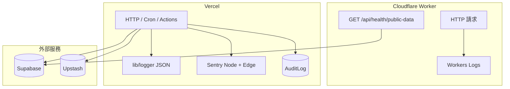
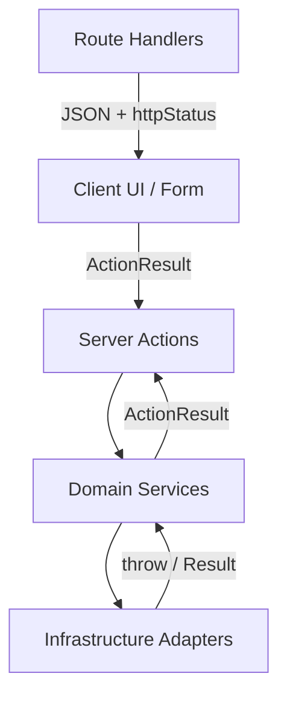
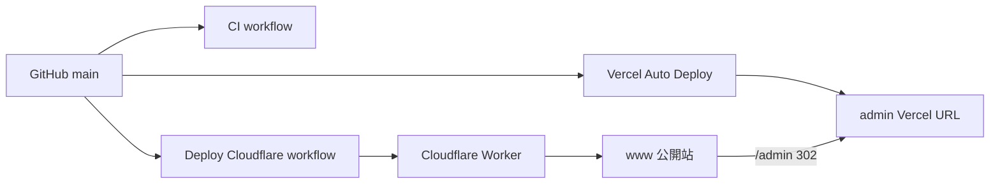

# 批次 I — 維運與部署

> **產品：** Zenith Mind Master Blueprint（合併版）  
> **說明：** 可觀測性、錯誤處理、備援、分裂部署  
> **來源檔案：** 22_OBSERVABILITY_GUIDE.md、23_ERROR_HANDLING_GUIDE.md、24_BACKUP_RECOVERY.md、25_DEPLOYMENT_GUIDE.md

---

## 本文件目錄

- [OBSERVABILITY_GUIDE.md](#observability-guide-md)
- [ERROR_HANDLING_GUIDE.md](#error-handling-guide-md)
- [BACKUP_RECOVERY.md](#backup-recovery-md)
- [DEPLOYMENT_GUIDE.md](#deployment-guide-md)

---

## OBSERVABILITY_GUIDE.md

---

### 1. 文件目的

定義 **可觀測性（Observability）** 在本專案的落地方式：**Logs、Errors、Health Checks、Audit**，以及 AI 與維運人員應如何解讀信號。

**分裂部署提醒：** 公開站（Cloudflare）與後台（Vercel）觀測平面 **不完全相同** — Sentry 瀏覽器 SDK 在 CF 公開建置刻意關閉；Cron 僅在 Vercel 執行。

---

### 2. 觀測架構全景



| 支柱 | 現況 | 缺口 |
|------|------|------|
| **Logs** | Vercel stdout JSON | CF 無結構化 logger |
| **Errors** | Sentry（Vercel）；`global-error.tsx` | CF 無 browser SDK |
| **Traces** | Sentry `tracesSampleRate: 1` | 無 OpenTelemetry 標準 |
| **Metrics** | Command Center、GA4、PageView 聚合 | 無 Prometheus 原生 |
| **Health** | public-data + integration probes | 無 synthetic 套件 |

---

### 3. 結構化日誌（Logging）

#### 3.1 權威實作

**檔案：** `lib/logger/index.ts`（**Node Runtime only**）

```typescript
logger.info("message", { requestId, jobId, action, userId, meta });
logger.warn(...);
logger.error(...);
```

| 欄位 | 用途 |
|------|------|
| `level` | info / warn / error |
| `timestamp` | ISO 8601 |
| `message` | 人類可讀摘要 |
| `requestId` | 單次 HTTP/Action 關聯 |
| `jobId` | AI Worker / AiJob 關聯 |
| `action` | 業務動作名 |
| `userId` | 後台操作者（若有） |
| `meta` | 任意結構化上下文 |

**輸出：** 單行 JSON → Vercel Log Drain / `vercel logs`。

#### 3.2 使用規範

| 規則 ID | 內容 |
|---------|------|
| **OBS-LOG-01** | Cron、AI、整合長流程 **必須** 用 `logger` |
| **OBS-LOG-02** | **禁止** log 密碼、JWT、私鑰、完整 webhook body |
| **OBS-LOG-03** | `requestId` 由 `getRequestMeta()` 產生 |
| **OBS-LOG-04** | Edge 路徑避免 import `lib/logger` |

#### 3.3 主要 log 點

| 區域 | 範例 |
|------|------|
| Auth Actions | `[Auth] login error [requestId]` |
| AI Orchestrator | Token budget、checkpoint |
| Cron cleanup | PV/Audit 保留刪除 |
| Cron outbox | EventOutbox、dead-letter 通知 |
| AI Worker | `workerId`、duration |
| Audit 失敗 | `[AuditLog] Write failed` |

---

### 4. 錯誤追蹤（Sentry）

#### 4.1 啟用條件

**DSN：** `lib/sentry/dsn.ts` — `SENTRY_DSN` 優先，其次 `NEXT_PUBLIC_SENTRY_DSN`。

| 環境 | Browser SDK | Server SDK | Source Maps |
|------|-------------|------------|-------------|
| Vercel 完整建置 | ✅ | ✅ | 需 `SENTRY_AUTH_TOKEN` |
| CF 公開建置 | ❌ | 依 runtime | ❌ 略過 `withSentryConfig` |

**設定檔：** `instrumentation.ts`, `sentry.*.config.ts`, `app/global-error.tsx`

#### 4.2 Tunnel 與 CSP

- Tunnel：`/monitoring`（`next.config.ts`）
- CSP：`connect-src` 含 `*.ingest.sentry.io`

#### 4.3 驗證

```bash
npm run verify:sentry
```

#### 4.4 AI 規則

| ID | 規則 |
|----|------|
| **OBS-SENTRY-01** | 禁止 CF 公開建置強制注入 browser Sentry |
| **OBS-SENTRY-02** | 未處理 exception 應上報 Sentry 或 `logger.error` |

---

### 5. 健康探針（Health Checks）

#### 5.1 公開資料源 — `GET /api/health/public-data`

**檔案：** `lib/db/public-data-health.ts`

| `health` | 意義 | HTTP |
|----------|------|------|
| `ok` | 至少 1 篇 PUBLISHED | 200 |
| `empty` | REST 正常但無文章 | 200 |
| `forbidden` | 401/403 | **503** |
| `unconfigured` | 缺 Supabase env | **503** |
| `error` | 網路/5xx | **503** |

503 含 `Retry-After: 300`；探針記憶體快取 60s。

**用途：** GHA deploy smoke、uptime 監控、避免 SEO Soft 404。

#### 5.2 整合健康 — Command Center

**檔案：** `lib/admin/integration-health.ts`

探測：Database、Redis、Storage、GA4、Gemini、Ads、GSC、BigQuery 等。  
API：`POST /api/admin/integrations/probe`（`gateAdminRead`）。

#### 5.3 Cron 隱式健康

| 信號 | 解讀 |
|------|------|
| Cron 401 | `CRON_SECRET` 不一致 |
| Outbox 無進展 | 堆積 |
| AI dead-letter email | `AI_JOB_DEAD_LETTER` |

---

### 6. 稽核與業務可觀測

#### 6.1 AuditLog

`void writeAuditLog(...)` — 非阻塞；保留 90 天；含 `requestId`。

#### 6.2 PageView

即時 API + 日聚合 cron；僅 `visitorHash`。

#### 6.3 AI Job

`AiJob.status` + Orchestrator `requestId`/`jobId` + Outbox dead-letter 告警。

---

### 7. 告警（Alerting）

**Email：** `lib/alert/send-alert-email.ts` — 需 `ALERT_EMAIL_*`；AI dead letter 觸發。

**建議外部：** Sentry Alerts、uptime 監控 health endpoint、Vercel Cron 通知。

---

### 8. 全鏈路追蹤（Correlation）

| ID | 產生 | 消費 |
|----|------|------|
| `requestId` | `getRequestMeta()` | Action、Audit、logger |
| `jobId` / `workerId` | AI worker | logger、AiJob |
| Sentry trace | 自動 | Sentry UI |

**缺口：** `ApiResponse.trace` 未在所有 API Route 統一填充。

---

### 9. 分裂部署觀測檢查清單

#### Vercel

- [ ] Sentry 有事件
- [ ] Cron 最後成功
- [ ] Integration health 全綠

#### Cloudflare

- [ ] `GET /api/health/public-data` → `health: ok`
- [ ] 首頁 200（deploy.yml smoke）

---

### 10. AI 可觀測規則

| ID | 規則 |
|----|------|
| **OBS-AI-01** | 新 Cron 必須 log 開始/結束 + duration |
| **OBS-AI-02** | 長 job 必須含 `jobId` |
| **OBS-AI-03** | health 探針 degraded 必須回 503（SEO 防護） |

---

### 11. 機器可讀（YAML）

```yaml
observability:
  logging: { impl: lib/logger/index.ts, format: json, runtime: node }
  errorTracking: { provider: sentry, tunnel: /monitoring, cfPublicBrowserSdk: false }
  health: { public: GET /api/health/public-data, admin: integration-health }
  audit: { table: AuditLog, retentionDays: 90 }
  alerting: { email: ALERT_EMAIL_* }
```

---

### 12. 相關文件

| 文件 | 關係 |
|------|------|
| `09-OPERATIONS.md`（ERROR_HANDLING 章） | 錯誤語意與使用者呈現 |
| `08-SECURITY.md`（DEVSECOPS 章） | CI smoke、Sentry 驗證 |
| `06-INTEGRATION-AUTOMATION.md`（WORKFLOW 章） | Cron 工作流 |

---

*觀測策略應隨流量成長調整 Sentry 取樣率與 log retention。*


---

## ERROR_HANDLING_GUIDE.md

---

### 1. 文件目的

統一 **錯誤如何定義、傳播、記錄、呈現**，避免各層各自 throw string 或洩漏內部細節。  
權威型別：`ActionResult<T>`、`ActionError`、`ApiResponse<T>`（`domain/shared/core.types.ts`）。

---

### 2. 錯誤模型

#### 2.1 ActionError 結構

| 欄位 | 用途 |
|------|------|
| `code` | 機器讀取（如 `AUTH_FAILED`） |
| `message` | 開發者除錯（**預設不直接給終端使用者**） |
| `details` | Zod flatten 等結構化資訊 |
| `httpStatus` | API 層對應 HTTP 碼 |
| `retryable` | Queue/Cron 是否應重試 |
| `severity` | info / warn / fatal |

#### 2.2 預設錯誤工廠 — `Errors.*`

| 方法 | code | http | retryable |
|------|------|------|-----------|
| `validation()` | VALIDATION_ERROR | 400 | false |
| `auth()` | AUTH_FAILED | 401 | false |
| `forbidden()` | FORBIDDEN | 403 | false |
| `notFound()` | NOT_FOUND | 404 | false |
| `rateLimit()` | RATE_LIMIT | 429 | **true** |
| `totpInvalid()` | TOTP_INVALID | 401 | false |
| `totpRequired()` | TOTP_REQUIRED | 401 | false |
| `duplicate()` | DUPLICATE_ERROR | 409 | false |
| `aiRateLimit()` | AI_RATE_LIMIT | 429 | **true** |
| `aiTimeout()` | AI_TIMEOUT | 504 | **true** |
| `aiFormat()` | AI_FORMAT_ERROR | 500 | false |
| `internal()` | INTERNAL_ERROR | 500 | false |

---

### 3. 分層錯誤處理



| 層級 | 規則 |
|------|------|
| **Infrastructure** | 捕捉第三方錯誤 → domain 可理解型別或 `ActionResult` |
| **Domain** | 回傳 `ActionResult`；業務規則用 `Errors.*` |
| **Server Actions** | try/catch → `Errors.internal(requestId)`；Zod → `Errors.validation` |
| **API Routes** | 對應 `httpStatus`；401/403 不洩漏細節 |
| **UI** | 顯示 `code` 對應 i18n 或通用訊息；不顯示 stack |

---

### 4. Server Actions 模式

#### 4.1 標準模板

```typescript
export async function someAction(input: unknown): Promise<ActionResult<T>> {
  const meta = await getRequestMeta();
  try {
    const parsed = Schema.safeParse(input);
    if (!parsed.success) {
      return { success: false, data: null, error: Errors.validation(parsed.error.flatten()) };
    }
    const gate = await gateAdminWrite("entity");
    if (!gate.ok) {
      return { success: false, data: null, error: Errors.forbidden() };
    }
  // ... business logic
    return { success: true, data: result, error: null };
  } catch (e) {
    console.error(`[Module] action error [${meta.requestId}]:`, e);
    return { success: false, data: null, error: Errors.internal(meta.requestId) };
  }
}
```

#### 4.2 認證錯誤

- 登入失敗：**統一** `AUTH_FAILED`（防帳號枚舉）
- TOTP：`TOTP_REQUIRED` → 前端導向 2FA 步驟

---

### 5. API Route 模式

#### 5.1 認證類端點

| 端點 | 錯誤風格 |
|------|----------|
| Webhook | `{ error: "INVALID_SIGNATURE" }` 401 |
| Cron | `{ error: "UNAUTHORIZED" }` 401 |
| Revalidate | 401/400 簡短 JSON |

**原則：** 不返回 secret 提示或 stack trace。

#### 5.2 公開 API

| 端點 | 行為 |
|------|------|
| `/api/health/public-data` | degraded → 503 + health 物件 |
| `/api/public/page-view` | 驗證失敗 → 4xx，不阻塞頁面 |
| `/api/search` | 錯誤時空結果或 500（依實作） |

#### 5.3 Admin API

應使用 `gateAdminRead` / `gateAdminWrite`；缺口見 `08-SECURITY.md`（SECURITY_RISK 章） R-H03。

---

### 6. 第三方 API 錯誤正規化

#### 6.1 formatApiError

**檔案：** `lib/admin/format-api-error.ts`

將 Google gRPC、嵌套 `error.message`、`details` 等轉成 **≤200 字** 可顯示字串，避免 `undefined undefined: undefined`。

**使用處：** Integration probes、GA4 dashboard bundle、Command Center loaders。

#### 6.2 AI Provider

| 狀況 | 映射 |
|------|------|
| HTTP 429 | `Errors.aiRateLimit()` |
| Timeout | `Errors.aiTimeout()` |
| JSON 解析失敗 | Self-correction 一次 → 仍失敗則 `Errors.aiFormat()` |

**Job Manager：** `retryable: true` 的錯誤可排程重試；否則 FAILED / dead-letter。

---

### 7. UI 錯誤邊界

| 元件 | 行為 |
|------|------|
| `app/global-error.tsx` | Root → Sentry + NextError |
| `app/(public)/error.tsx` | 公開 segment；友善文案 + retry；**不上報 Sentry**（console.error） |
| `app/admin/dashboard/geo/error.tsx` | 模組級錯誤 UI |

**公開站原則：** 單頁失敗不拖垮全站；鼓勵 `reset()` 重試。

---

### 8. 公開資料 degraded 模式

當 Supabase REST 403/未設定：

1. `probePublicPostsHealth()` → `forbidden` / `unconfigured` / `error`
2. Health API 回 **503**
3. 公開 loader 可降級空列表（避免 Soft 404 索引錯誤內容）

**healthFromError：** 執行期 catch 403 → 對應 `forbidden`。

---

### 9. 重試語意

| 來源 | 機制 |
|------|------|
| `ActionError.retryable` | AI Worker / 未來 queue |
| Webhook nonce | 重複 nonce → 401（非重試） |
| Cron | Vercel 次日再跑；無內建 exponential backoff |
| 整合 API | 多數 throw；見 `06-INTEGRATION-AUTOMATION.md`（INTEGRATION 章） |

**AI 重試：** `ai.job-manager.ts` — 429/timeout 可重試；format 錯誤不重試。

---

### 10. 使用者可見 vs 內部訊息

| 情境 | 使用者看到 | 內部記錄 |
|------|------------|----------|
| 登入失敗 | 「帳號或密碼錯誤」 | AUTH_FAILED + requestId |
| 500 | 「系統忙碌」或 generic | `Errors.internal(requestId)` + Sentry |
| 驗證 | 欄位級錯誤 | Zod details |
| GUEST 寫入 | FORBIDDEN toast | Audit 可選 |

**禁止：** 將 `error.message` 原樣顯示 DB/Prisma 錯誤。

---

### 11. 常見錯誤碼對照（Admin）

| code | 典型原因 | 建議 UI |
|------|----------|---------|
| VALIDATION_ERROR | Zod 失敗 | 表單高亮 |
| AUTH_FAILED | 登入/refresh 失敗 | 導向 login |
| FORBIDDEN | GUEST 或非 ADMIN | 唯讀提示 |
| TOTP_REQUIRED | 未完成 2FA | 2FA 步驟 |
| AI_RATE_LIMIT | Gemini/OpenAI 限流 | 稍後重試 |
| INTERNAL_ERROR | 未預期 | 通用錯誤 + support ref（requestId 後 8 碼） |

---

### 12. AI 錯誤處理規則

| ID | 規則 |
|----|------|
| **ERR-AI-01** | 新 Action 必須回 `ActionResult`，禁止裸 throw 到 client |
| **ERR-AI-02** | catch 區塊必須含 `requestId` |
| **ERR-AI-03** | 第三方錯誤用 `formatApiError` 或 `Errors.*` 映射 |
| **ERR-AI-04** | `retryable` 須與實際重試邏輯一致 |
| **ERR-AI-05** | Webhook/Cron 錯誤 JSON 保持簡短穩定 |

---

### 13. 機器可讀（YAML）

```yaml
errorHandling:
  coreTypes: domain/shared/core.types.ts
  patterns:
    serverActions: ActionResult
    apiRoutes: httpStatus + shortJson
    thirdParty: formatApiError
  uiBoundaries:
    global: app/global-error.tsx
    public: app/(public)/error.tsx
  retryableCodes: [RATE_LIMIT, AI_RATE_LIMIT, AI_TIMEOUT]
```

---

### 14. 相關文件

| 文件 | 關係 |
|------|------|
| `05-API-AUTH-PERMISSIONS.md`（API_CONTRACT 章） | HTTP 契約 |
| `09-OPERATIONS.md`（OBSERVABILITY 章） | 日誌與 Sentry |
| `06-INTEGRATION-AUTOMATION.md`（INTEGRATION 章） | 外部 API 重試 |

---

*錯誤訊息文案應逐步 i18n 化；code 保持英文穩定供機器讀取。*


---

## BACKUP_RECOVERY.md

---

### 1. 文件目的

定義 **單租戶母版** 的備份責任分界、還原程序與災難演練建議。  
現行應用 **未內建** 自動備份編排 — 主要依賴 **Supabase 平台能力** 與維運 runbook。

---

### 2. 資料資產與責任矩陣

| 資產 | 儲存 | 備份責任 | 現行機制 |
|------|------|----------|----------|
| **關聯式資料** | Supabase PostgreSQL | Supabase + 維運 | 平台自動備份（依方案） |
| **媒體檔** | Supabase Storage | Supabase + 維運 | Bucket 複製/版本（需手動設定） |
| **快取/暫存** | Upstash Redis | 可重建 | **不備份**（JWT blacklist、nonce 可接受遺失） |
| **Secrets** | Vercel / CF / 1Password | 維運 | 平台 secret store |
| **原始碼** | GitHub | Git | 版本控制 |
| **AuditLog** | Postgres | 隨 DB | 90 天應用層刪除 |

---

### 3. RPO / RTO 建議目標（單租戶 CMS）

| 等級 | RPO | RTO | 說明 |
|------|-----|-----|------|
| **Tier-1 內容** | ≤ 24h | ≤ 4h | 文章、SiteSettings |
| **Tier-2 分析** | ≤ 24h | ≤ 24h | PageView 聚合可重算 |
| **Tier-3 整合憑證** | 0（人工保管） | ≤ 2h | 從 1Password 重匯 |

**實際 RPO** 取決於 Supabase 方案（Free vs Pro PITR）。

---

### 4. PostgreSQL 備份

#### 4.1 Supabase 平台

| 能力 | 說明 |
|------|------|
| **Daily backups** | Pro 方案自動 |
| **Point-in-Time Recovery (PITR)** | Pro+；可還原至時間點 |
| **Manual backup** | Dashboard → Database → Backups |

**連線：**

- 應用：`DATABASE_URL`（pooler，port 6543）
- Migrate/還原工具：`DIRECT_URL`（direct，port 5432）

#### 4.2 邏輯備份（維運可選）

```bash
## 需 DIRECT_URL 或 Supabase connection string
pg_dump "$DIRECT_URL" -Fc -f zenith-mind-$(date +%Y%m%d).dump
```

**頻率建議：** 重大發布前 + 每週（若無 PITR）。

#### 4.3 Prisma Migration 作為 Schema 還原

Schema **真相來源：** `prisma/schema.prisma` + `prisma/migrations/`  
Supabase SQL：`supabase/migrations/`（View/RPC）

**空 DB 還原順序：**

1. 建立新 Supabase 專案
2. `prisma migrate deploy`
3. 執行 `supabase/migrations/*.sql`（依時間序）
4. 可選：`04-SEEDING.md` bootstrap

---

### 5. 還原程序（Runbook）

#### 5.1 場景 A — 誤刪資料列（單表/少量）

1. 確認時間點（AuditLog / Supabase logs）
2. 若有 PITR：建立 **分支 DB** 還原至時間點
3. 從分支 `pg_dump` 特定表或 `COPY` 匯出
4. 合併回 production（**維護窗口**）
5. 驗證 + `revalidate` 公開快取

#### 5.2 場景 B — 整庫毀損

1. Supabase PITR 或最新 daily backup 還原
2. 更新 Vercel/CF `DATABASE_URL`（若新 instance）
3. `prisma migrate deploy`（確保 migration 同步）
4. 驗證 integration credentials 是否需重匯
5. 部署 Vercel + CF；跑 health smoke

#### 5.3 場景 C — 僅 Storage 媒體遺失

1. 從 Supabase Storage backup 或 offsite 複本還原
2. DB 中 `Media.url` 若仍有效 → 無需改 schema
3. 清 CDN cache（CF purge）

#### 5.4 場景 D — Region / 平台故障

1. 在新 region 建立 Supabase + Upstash
2. 還原 DB dump
3. 更新所有 env secrets
4. 重跑 `SEEDING` 最小設定（categories、admin 若需）
5. DNS 切換（CF + Vercel 自訂網域）

---

### 6. Redis 與可重建狀態

| Key 前綴 | 遺失影響 | 恢復 |
|----------|----------|------|
| `rt:blacklist:*` | 已登出 refresh 可能短暫可用 | 可接受；或全員重登 |
| Webhook nonce | 無 | 自動過期 |
| Redirect cache | 首次查 DB 較慢 | `npm run redirects:warm` |

**結論：** Redis **不需備份**；災後清空可接受。

---

### 7. 應用層資料保留（與備份交叉）

| 資料 | 保留 | 清理 |
|------|------|------|
| PageView raw | 180 天 | cleanup cron |
| AuditLog | 90 天 | cleanup cron |
| EventOutbox PROCESSED | 依實作刪除 | cleanup |
| AiJob 歷史 | 無自動 purge | 需政策 |

詳見 `03-DATA.md`（DATA_LIFECYCLE 章）。

---

### 8. 環境隔離與備份污染

| 規則 | 原因 |
|------|------|
| Dev/Staging **獨立** Supabase 專案 | 避免 prod dump 覆蓋 dev |
| 禁止 prod dump 還原到 dev 含 PII | GDPR |
| `ALLOW_PRODUCTION_DATABASE=1` 才允許 prod migrate | 腳本防呆 |

---

### 9. 母版克隆（新客戶）vs 災難還原

| 操作 | 目的 | 資料來源 |
|------|------|----------|
| **Clone template** | 新 tenant | Seed + 空 DB |
| **Disaster recovery** | 恢復既有 tenant | PITR / dump |

克隆流程見 `04-SEEDING.md`；**不是**備份還原的替代。

---

### 10. 演練與驗證

#### 10.1 季度演練（建議）

- [ ] 從最新 backup 還原至 **隔離** staging 專案
- [ ] `prisma migrate status` 一致
- [ ] 後台登入 + 公開首頁 200
- [ ] 記錄實際 RTO

#### 10.2 發布前檢查

- [ ] Supabase backup 狀態綠燈
- [ ] 重大 migration 前手動 `pg_dump`
- [ ] 回滾計畫：app revert + migration 是否可逆

---

### 11. Migration 回滾策略

| 變更類型 | 回滾 |
|----------|------|
| 新增 nullable 欄位 | App revert 即可 |
| 新增必填欄位 | 需反向 migration 或資料回填 |
| 刪欄/刪表 | **不可** 僅 revert app；需 DB 還原 |
| Supabase View/RPC | 保留 down SQL 或重新 deploy 舊版 |

詳見 `03-DATA.md`（MIGRATION_STRATEGY 章） §7。

---

### 12. AI 規則

| ID | 規則 |
|----|------|
| **BR-AI-01** | 禁止 migration 無 down 計畫且不可逆 |
| **BR-AI-02** | 禁止腳本 `DROP DATABASE` 無確認旗標 |
| **BR-AI-03** | 備份還原文件變更須更新 RPO/RTO 表 |

---

### 13. 機器可讀（YAML）

```yaml
backupRecovery:
  postgres:
    provider: supabase
    schemaSource: [prisma/migrations, supabase/migrations]
    connection: { app: DATABASE_URL, migrate: DIRECT_URL }
  objectStorage: supabase_storage
  redis: { backup: false, rebuildable: true }
  retention:
    pageViewDays: 180
    auditLogDays: 90
  rpoRto:
    tier1: { rpo: 24h, rto: 4h }
  drills: quarterly_restore_to_staging
```

---

### 14. 相關文件

| 文件 | 關係 |
|------|------|
| `09-OPERATIONS.md`（DEPLOYMENT 章） | 還原後部署 |
| `03-DATA.md`（MIGRATION_STRATEGY 章） | Schema 變更 |
| `08-SECURITY.md`（DEVSECOPS 章） | Secret 輪替 |

---

*Pro 以下方案請明確接受較長 RPO，或購買 PITR / 外部定時 dump。*


---

## DEPLOYMENT_GUIDE.md

---

### 1. 文件目的

提供 **可複製的部署手冊**，讓維運或 AI 依序完成：資料庫 migrate → Vercel 後台 → Cloudflare 公開站 → 煙霧測試。  
**Frozen Core FC-1：** 分裂部署不可合併為單一平台。

---

### 2. 部署拓撲



| 平面 | 平台 | 網域（範例） | 打包 |
|------|------|--------------|------|
| **公開** | Cloudflare Workers | `www.getzenithmind.com` | OpenNext `build:cf` |
| **後台** | Vercel | `zenith-mind.vercel.app` | `next build` 完整 |
| **Cron/AI** | Vercel only | 同後台 | 含 `/api/cron/*` |

---

### 3. 前置需求

#### 3.1 帳號與 CLI

| 項目 | 用途 |
|------|------|
| Node.js ≥ 22 | 與 `package.json engines` 一致 |
| Vercel 專案 | 連 GitHub repo |
| Cloudflare 帳號 | Workers + 自訂網域 |
| `npx wrangler login` | 本機 CF 部署 |
| Supabase 專案 | Postgres + Storage |
| Upstash Redis | REST URL + token |

#### 3.2 GitHub Secrets（CF 自動部署）

`.github/workflows/deploy.yml` 需要：

| Secret | 用途 |
|--------|------|
| `CLOUDFLARE_API_TOKEN` | Workers deploy |
| `CLOUDFLARE_ACCOUNT_ID` | 帳號識別 |

---

### 4. 環境變數配置

#### 4.1 Vercel（完整應用）

**必須：** 見 `08-SECURITY.md`（DEVSECOPS 章） §4.2 清單。

**關鍵分裂變數：**

```
ADMIN_DEPLOYMENT_URL=https://<your-vercel>.vercel.app
NEXT_PUBLIC_SITE_URL=https://www.<customer-domain>.com
```

#### 4.2 Cloudflare Worker

**公開 vars：** `wrangler.toml` `[vars]` — 可提交 Git 的非秘密值。

**Secrets（wrangler secret put）：**

```
DATABASE_URL, DIRECT_URL
JWT_ACCESS_SECRET, JWT_REFRESH_SECRET
UPSTASH_REDIS_*
SUPABASE_SERVICE_ROLE_KEY
WEBHOOK_SECRET, REVALIDATE_SECRET, REDIRECT_LOOKUP_SECRET
GA4_PRIVATE_KEY, GEMINI_API_KEY, TOTP_ENCRYPTION_KEY
ALERT_EMAIL_*
SENTRY_AUTH_TOKEN（若上傳 source map）
```

**本機 CF 開發：** 複製 `.dev.vars.example` → `.dev.vars`（gitignore）。

#### 4.3 建置期 vs 執行期

| 標記 | 意義 |
|------|------|
| `SKIP_ENV_VALIDATION=true` | CF 略過 `env.ts` 全量驗證 |
| `CF_PUBLIC_ONLY=1` | 公開站建置；Prisma → stub |
| `CF_WORKER_RUNTIME=1` | Worker 執行期標記 |

---

### 5. 首次上線（Greenfield）

#### 5.1 資料庫

```bash
## 1. 確認非 production 誤連
node --env-file=.env.local scripts/db-connection-info.mjs

## 2. 本機開發 migrate（DEV）
npm run db:migrate

## 3. Production deploy migration
ALLOW_PRODUCTION_DATABASE=1 npm run db:deploy

## 4. Supabase SQL（若有 View/RPC）
## Dashboard 或 supabase db push
```

#### 5.2 Bootstrap 管理員

```bash
## 設定 ADMIN_BOOTSTRAP_* env 後
npm run admin:ensure
## 登入後刪除 bootstrap env
```

詳見 `04-SEEDING.md`。

#### 5.3 Vercel

1. Import GitHub repo
2. Framework Preset: Next.js
3. Region: `hnd1`（與 `vercel.json` 一致）
4. 填入 §4.1 secrets
5. Deploy → 驗證 `/admin/login`

#### 5.4 Cloudflare

1. 更新 `wrangler.toml`：`name`, `ADMIN_DEPLOYMENT_URL`, `NEXT_PUBLIC_*`
2. 設定 secrets（§4.2）
3. 綁定自訂網域 `www.*`
4. 本機或 GHA 部署：

```powershell
npm run build:cf
npx wrangler deploy
## 或
npm run deploy:cf
```

#### 5.5 煙霧測試

```bash
curl -fsS "https://www.<domain>/api/health/public-data"
curl -fsS -o /dev/null -w "%{http_code}" "https://www.<domain>/zh-TW"
curl -fsS -o /dev/null -w "%{http_code}" "https://<vercel>/admin/login"
```

**Cron 手動測：**

```bash
curl -H "Authorization: Bearer $CRON_SECRET" \
  "https://<vercel>/api/cron/cleanup"
```

---

### 6. 日常發布流程

#### 6.1 僅後台變更（CMS、Command Center、Cron）

| 步驟 | 動作 |
|------|------|
| 1 | PR → CI 綠 |
| 2 | Merge `main` |
| 3 | Vercel 自動部署 |
| 4 | 驗證 admin + cron（若改動） |

**不需** CF 重部署。

#### 6.2 公開站變更（前台 UI、middleware、公開 API）

| 步驟 | 動作 |
|------|------|
| 1 | PR → CI 綠 |
| 2 | Merge `main` |
| 3 | GHA `Deploy Cloudflare` **或** 本機 `npm run deploy:cf` |
| 4 | Smoke: health + homepage |

**同 PR 若也改後台：** Vercel 與 CF **皆** 需部署。

#### 6.3 Schema 變更

見 `03-DATA.md`（MIGRATION_STRATEGY 章） §5.3：

1. `migrate deploy`
2. Supabase SQL（若需要）
3. 回填資料（若必填欄位）
4. Vercel deploy
5. CF deploy（若公開讀取路徑依賴新 View）

---

### 7. Cloudflare 公開建置機制

**腳本：** `scripts/cf-public-build.mjs`

| 行為 | 目的 |
|------|------|
| Stash `app/admin`, `app/api/admin`, cron, auth, ai | 縮小 Worker bundle |
| 隱藏 `.env.local` | 防 secret 進 bundle |
| `CF_PUBLIC_ONLY=1` | 公開站建置時 Prisma alias → stub |

**保留於 CF 的 API：** webhook、revalidate、search、redirect、health、public page-view 等（見腳本註解）。

**Cron routes：** 被 stash → **僅 Vercel 執行** `vercel.json` crons。

---

### 8. CI/CD 管線

#### 8.1 CI（每 PR / push）

`.github/workflows/ci.yml`：gitleaks → lint → tsc → build

#### 8.2 CF Deploy（main）

`.github/workflows/deploy.yml`：

1. `npm ci`
2. `prisma generate`
3. `npm run build:cf`
4. `node scripts/cf-gha-deploy.mjs`
5. Smoke health + homepage

#### 8.3 Vercel

Git integration 自動；`vercel.json` 定義 crons：

| Path | Schedule (UTC) |
|------|----------------|
| `/api/cron/cleanup` | `0 3 * * *` |
| `/api/cron/outbox` | `15 3 * * *` |
| `/api/cron/aggregate-views` | `5 2 * * *` |
| `/api/cron/publish-scheduled` | `0 4 * * *` |
| `/api/ai/worker` | `10 5 * * *` |

---

### 9. 快取與發布後失效

Admin 發布內容後：

1. Vercel：`revalidateTag` / `revalidatePath`
2. CF：`lib/revalidate/purge-public-site.ts` → `POST /api/revalidate`（Bearer `REVALIDATE_SECRET`）

**注意：** Outbox 由 `/api/cron/outbox` 消費（Hobby 為**每日** `15 3 * * *` UTC）— 重要發布應走 **同步 `purgePublicSite`** 或 `POST /api/revalidate`。

---

### 10. 回滾策略

| 層級 | 作法 |
|------|------|
| **Vercel** | Dashboard → 前一 Deployment Promote |
| **Cloudflare** | Dashboard → Workers → 前一版本 或 Git revert + redeploy |
| **Database** | 見 `09-OPERATIONS.md`（BACKUP 章） — app revert **不能**  undo destructive migration |
| **Secrets** | 還原舊值 + 兩平台同步更新 |

---

### 11. 常見故障排除

| 症狀 | 可能原因 | 處置 |
|------|----------|------|
| 公開 503 health | Supabase key/RLS | 檢查 `SUPABASE_SERVICE_ROLE_KEY`、PostgREST grants |
| `/admin` 404 on www | 正常 | 應 302 至 `ADMIN_DEPLOYMENT_URL` |
| Cron 401 | CRON_SECRET 不符 | 更新 Vercel env |
| CF 上 search/go 失敗 | Supabase env/RLS 或 repo 錯誤 | 檢查 `SUPABASE_*`、`getPublicContentRepository()` 日誌 |
| 後台 OK、前台舊內容 | 未 purge CF | 手動 revalidate API |
| build:cf OOM | Worker 限制 | `NODE_OPTIONS=--max-old-space-size=8192` |

---

### 12. Preview / Staging

| 項目 | 建議 |
|------|------|
| Vercel Preview | 獨立 Preview env vars |
| CF Preview | 可選 staging Worker 名稱 |
| DB | **勿** 共用 production |

---

### 13. 母版克隆檢查清單（新客戶）

- [ ] 新 Supabase + Upstash
- [ ] Fork repo → 更新 `wrangler.toml` 網域
- [ ] 新 Vercel 專案 + env
- [ ] CF Worker + 自訂網域
- [ ] `migrate deploy` + seed
- [ ] 刪除 bootstrap secrets
- [ ] 啟用 GHA secrets
- [ ] Smoke + Sentry + health 監控

---

### 14. AI 部署規則

| ID | 規則 |
|----|------|
| **DEP-AI-01** | 禁止移除 `cf-public-build` stash 邏輯而不評估 bundle 大小 |
| **DEP-AI-02** | 禁止將 cron 路由僅部署到 CF |
| **DEP-AI-03** | 變更 `vercel.json` cron 須同步 `06-INTEGRATION-AUTOMATION.md`（WORKFLOW 章） |
| **DEP-AI-04** | 新 env 必須同時文件化 Vercel + wrangler |

---

### 15. 機器可讀（YAML）

```yaml
deployment:
  split:
    public: { platform: cloudflare, build: npm run build:cf, config: wrangler.toml }
    admin: { platform: vercel, build: npm run build, config: vercel.json }
  ci:
    quality: .github/workflows/ci.yml
    cfDeploy: .github/workflows/deploy.yml
  crons: vercelOnly
  smoke:
    - GET /api/health/public-data
    - GET /zh-TW homepage 200
  adminProxy: ADMIN_DEPLOYMENT_URL
```

---

### 16. 相關文件

| 文件 | 關係 |
|------|------|
| `系統架構說明書/DEPLOY-CLOUDFLARE.md` | CF 快速指令 |
| `08-SECURITY.md`（DEVSECOPS 章） | Secret 與 IR |
| `09-OPERATIONS.md`（BACKUP 章） | 災難還原 |
| `06-INTEGRATION-AUTOMATION.md`（WORKFLOW 章） | Cron 詳細 |

---

*部署變更後請更新本文件中的網域範例為客戶實際值。*

