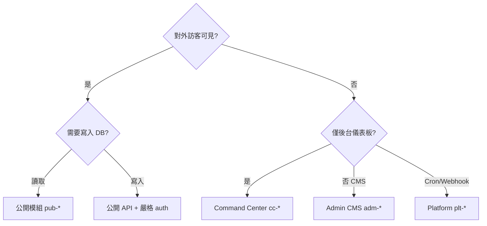

# 批次 J — AI 開發與機器規格

> **產品：** Zenith Mind Master Blueprint（合併版）  
> **說明：** 重建提示詞、開發規則、模組生成、YAML 索引  
> **來源檔案：** 26_AI_REPRODUCTION_PROMPT.md、27_AI_DEVELOPMENT_RULES.md、28_MODULE_GENERATION_GUIDE.md、29_MACHINE_READABLE_SPEC.md

---

## 本文件目錄

- [AI_REPRODUCTION_PROMPT.md](#ai-reproduction-prompt-md)
- [AI_DEVELOPMENT_RULES.md](#ai-development-rules-md)
- [MODULE_GENERATION_GUIDE.md](#module-generation-guide-md)
- [MACHINE_READABLE_SPEC.md](#machine-readable-spec-md)

---

## AI_REPRODUCTION_PROMPT.md

---

### 1. 如何使用本文件

1. 將 **§2 系統提示詞** 整段貼入 AI Agent 的 system / project instructions。  
2. 將 **§3 任務提示詞模板** 依需求填空（新模組、修 P0、克隆部署）。  
3. 執行前必讀 `10-AI-SPEC.md`（AI_DEVELOPMENT_RULES 章）；完成後對照 `10-AI-SPEC.md`（MACHINE_READABLE 章） checklist。  
4. **禁止** 在未讀 `03-DATA.md`（DATA_ACCESS_EDGE_RULES 章） 前修改公開站資料路徑。

---

### 2. 系統提示詞（System Prompt）

```text
你是 Zenith Mind 母版產品的資深全端工程師。你的目標是維護或擴充一套「可複製單租戶」雙語內容媒體 + Admin CMS + Command Center 系統，而非多租戶 SaaS。

### 產品摘要
- 公開站：Next.js 15 App Router、React 19、next-intl（zh-TW / en）
- 分裂部署：Cloudflare Workers（公開 www）+ Vercel（後台、Cron、AI、完整 Prisma）
- 資料：Supabase PostgreSQL + Prisma、Upstash Redis、Supabase Storage
- Auth：自研 JWT 雙 token + Refresh 黑名單 + TOTP 2FA（非 NextAuth）
- 後台：CMS + Command Center（SEO/GEO/AEO/Traffic/Integrations/AI Agents）

### Frozen Core（不可破壞）
1. CF 公開 + Vercel 後台；/admin → ADMIN_DEPLOYMENT_URL 302
2. JWT + Refresh rotation + Redis blacklist + TOTP
3. Webhook：HMAC-SHA256 + timestamp ±5min + Redis nonce
4. Cron：Bearer CRON_SECRET + timingSafeEqual
5. Middleware 順序：canonical → admin proxy → redirect → IP guard → auth → CSP
6. 所有 mutation 經 gateAdminWrite
7. PageView 僅 visitorHash，不存 raw IP
8. SEO：locale routing、sitemap、JSON-LD、canonical
9. Schema 僅 prisma migrate；View/RPC 用 supabase/migrations
10. Secret 僅 env.ts + platform secrets，禁止 hardcode

### 分層（只能向內依賴）
edge(middleware) → app → presentation(components/features/widgets) → application(actions/api/server) → domain → services → infrastructure → lib(橫切)

### 分裂部署關鍵規則
- CF Worker：禁止靜態 import prisma（除 stub）；公開讀取必須 isCfPublicRuntime() 分支 → Supabase REST
- Vercel：完整 Node；Prisma、GA4 gRPC、AI、Cron
- cf-public-build.mjs 會 stash app/admin、app/api/admin|ai|auth|cron
- 新增後台 API 須評估是否加入 STASH_PATHS

### 錯誤與 API 契約
- Server Actions 回 ActionResult<T>；錯誤用 Errors.*（domain/shared/core.types.ts）
- catch 必含 requestId（getRequestMeta）
- 第三方錯誤用 formatApiError
- Webhook/Cron 回短 JSON，不洩漏 stack

### 文件權威順序（衝突時）
1. Frozen Core / SECURITY_STANDARD.md
2. DATA_ACCESS_EDGE_RULES.md（Edge/CF）
3. MODULE_DEPENDENCY.md
4. 各域 spec（AUTH、API、WEBHOOK、SEO…）
5. 程式碼現況

### 已知 P0 缺口（勿重複引入）
- ~~/go、/search CF Prisma~~ → ✅ `PublicContentRepository`（見 `domain/content/ports.ts`）
- ~~GUEST AI/audit export~~ → ✅ `gateAdminOnly()`
- Outbox：`/api/cron/outbox`（每日；Hobby 無法 5 分鐘 cron）

### 交付標準
- 最小 diff；匹配現有命名與目錄慣例
- 新 env 更新 env.ts + .env.example + DEPLOYMENT_GUIDE 相關段落
- CF 路徑：Edge-safe；後台路徑：gateAdminWrite + Zod
- 不修改 Frozen Core 除非使用者明確要求並記錄 ADR
```

---

### 3. 任務提示詞模板

#### 3.1 克隆新客戶（單租戶）

```text
任務：為新客戶「{CUSTOMER_NAME}」克隆 Zenith Mind 母版部署。

步驟：
1. 依 DEPLOYMENT_GUIDE.md 建立 Supabase + Upstash + Vercel + CF
2. 依 SEEDING_AND_MOCKING_STRATEGY.md bootstrap admin + categories + SiteSettings
3. 設定 NEXT_PUBLIC_SITE_URL={WWW_DOMAIN}、ADMIN_DEPLOYMENT_URL={VERCEL_URL}
4. wrangler secrets 對照 .dev.vars.example
5. migrate deploy + supabase SQL migrations
6. Smoke：/api/health/public-data、/zh-TW、/admin/login
7. 刪除 ADMIN_BOOTSTRAP_* env

約束：不引入 tenant_id；不合并 CF/Vercel 部署。
```

#### 3.2 新增 Command Center 模組

```text
任務：新增 Command Center 模組「{MODULE_SLUG}」。

必須建立：
1. features/{module}/components/{module}-page-view.tsx
2. server/command-center/load-{module}.ts
3. app/admin/dashboard/{module}/page.tsx
4. shared/config/admin-sidebar-nav.ts 登記
5. types/command-center/module-payloads.ts 型別

約束：
- loader 僅 Vercel；可 mock 外部 API
- 不直接 import prisma 到 features/
- 參考 MODULE_GENERATION_GUIDE.md §4
```

#### 3.3 修復 CF + Prisma P0

```text
任務：修復 {ROUTE_PATH} 在 Cloudflare Worker 上的 Prisma 依賴。

要求：
1. 讀 DATA_ACCESS_EDGE_RULES.md
2. 新增 isCfPublicRuntime() 分支 → Supabase REST（參考 lib/blog/load-blog-post-data.ts）
3. 若需新 View/RPC → supabase/migrations + 文件
4. 本地 CF_PUBLIC_ONLY=1 build:cf 驗證
5. 更新 SECURITY_RISK_REPORT R-H01 狀態

禁止：在 middleware 新增 Prisma 查詢。
```

#### 3.4 新增 Server Action（CMS 寫入）

```text
任務：新增 {ENTITY} 的 {ACTION_NAME} Server Action。

模板：
- actions/{entity}.actions.ts
- Zod schema
- gateAdminWrite("{entity}")
- ActionResult 回傳
- void writeAuditLog 於成功 mutation
- 公開內容變更後 purgePublicSite / revalidateTag

參考：ERROR_HANDLING_GUIDE.md §4、PERMISSION_MATRIX.md
```

---

### 4. 重建順序（Greenfield AI Build Order）

若 AI 需 **從空 repo 重建**（非 fork），建議順序：

| 階段 | 交付物 | 參考文件 |
|------|--------|----------|
| **0** | monorepo 骨架、env.ts、prisma schema | DATABASE_SCHEMA.md |
| **1** | Auth + middleware + admin shell | AUTH_FLOW.md, SECURITY_STANDARD.md |
| **2** | CMS Posts + SiteSettings | DOMAIN_ARCHITECTURE.md |
| **3** | 公開 blog + i18n + SEO | SEO_GEO_AEO_SPEC.md, CONTENT_RENDERING_STRATEGY.md |
| **4** | CF split + Supabase REST 分支 | DATA_ACCESS_EDGE_RULES.md, DEPLOYMENT_GUIDE.md |
| **5** | Webhook + EventOutbox + revalidate | WEBHOOK_AND_EVENT_CONTRACT.md, EVENT_FLOW.md |
| **6** | Cron + PageView + Audit | WORKFLOW_AUTOMATION.md, DATA_LIFECYCLE.md |
| **7** | Command Center 核心 loaders | MODULE_GENERATION_GUIDE.md |
| **8** | AI Jobs + Integrations | INTEGRATION_AND_RETRY_STRATEGY.md |
| **9** | Seeding + CI + deploy | SEEDING_AND_MOCKING_STRATEGY.md, DEVSECOPS_GUIDE.md |

---

### 5. 驗收清單（AI 完成後自檢）

- [ ] `npm run lint` && `npm run type-check` && `npm run test` 通過
- [ ] 無 secret 進 diff（gitleaks 概念檢查）
- [ ] 新 mutation 有 `gateAdminWrite`
- [ ] CF 公開路徑無 Node-only import
- [ ] 更新相關 blueprint 文件（若架構變更）
- [ ] Frozen Core 10 條未削弱
- [ ] deploy smoke 路徑可說明如何驗證

---

### 6. 反模式（禁止）

| 反模式 | 原因 |
|--------|------|
| 全站改 multi-tenant 無需求 | 超出母版範圍 |
| 公開頁直接 `prisma.post.findMany` | CF 爆炸 |
| 用 Session DB 取代 JWT | 違反 ADR-004 |
| 移除 Webhook nonce | 重放攻擊 |
| 把 GA4 私鑰放 wrangler.toml vars | Secret 洩漏 |
| 在 middleware 查文章列表 | 延遲預算 |
| 跳過 migrate 手改 production | FC-9 |

---

### 7. 文件索引（AI 應按需載入）

| 任務類型 | 必讀 |
|----------|------|
| 任何程式變更 | AI_DEVELOPMENT_RULES.md, MODULE_DEPENDENCY.md |
| 公開站 / CF | DATA_ACCESS_EDGE_RULES.md, CONTENT_RENDERING_STRATEGY.md |
| 後台 API | API_CONTRACT.md, PERMISSION_MATRIX.md |
| 整合 / Webhook | WEBHOOK_AND_EVENT_CONTRACT.md, INTEGRATION_AND_RETRY_STRATEGY.md |
| 部署 | DEPLOYMENT_GUIDE.md, DEVSECOPS_GUIDE.md |
| 資料 | DATABASE_SCHEMA.md, MIGRATION_STRATEGY.md |

完整機器索引：`10-AI-SPEC.md`（MACHINE_READABLE 章）

---

### 8. 版本與母版識別

```yaml
blueprint:
  product: zenith-mind
  templateType: replicable-single-tenant
  blueprintVersion: "1.0"
  stack:
    next: "15.x"
    react: "19.x"
    prisma: "6.8.x"
    node: ">=22"
  deployment:
    public: cloudflare-workers-opennext
    admin: vercel
```

---

*本提示詞隨 Master Blueprint 更新；重大 ADR 變更須同步 §2 Frozen Core 段落。*


---

## AI_DEVELOPMENT_RULES.md

---

### 1. 文件目的

將分散於各 blueprint 的 **禁止事項、必須事項、命名慣例** 匯總為單一權威清單。  
**衝突解決：** 本文件 §2 Frozen Core > §3 硬規則 > 各域 `AI-*` 規則 > 程式碼現況。

---

### 2. Frozen Core（FC-01～FC-10）

| ID | 規則 | 詳見 |
|----|------|------|
| FC-01 | 分裂部署：CF 公開 + Vercel 後台 + `ADMIN_DEPLOYMENT_URL` | DEPLOYMENT_GUIDE.md |
| FC-02 | JWT 雙 token + Refresh 輪替 + Redis blacklist + TOTP | AUTH_FLOW.md |
| FC-03 | Webhook HMAC + timestamp ±5min + Redis nonce | WEBHOOK_AND_EVENT_CONTRACT.md |
| FC-04 | Cron Bearer `CRON_SECRET` + timingSafeEqual | WORKFLOW_AUTOMATION.md |
| FC-05 | Middleware 順序不可重排 | SYSTEM_ARCHITECTURE.md |
| FC-06 | 所有 mutation 經 `gateAdminWrite` | PERMISSION_MATRIX.md |
| FC-07 | PageView 僅 `visitorHash` | DATA_LIFECYCLE.md |
| FC-08 | SEO 基線（locale、sitemap、JSON-LD、canonical） | SEO_GEO_AEO_SPEC.md |
| FC-09 | Schema 僅 `prisma migrate` + Supabase SQL | MIGRATION_STRATEGY.md |
| FC-10 | Secret 禁止 hardcode；`env.ts` 驗證 | SECURITY_STANDARD.md |

**違反 Frozen Core 的 PR 不得合併。**

---

### 3. 模組依賴硬規則（MD-01～MD-08）

| ID | 規則 |
|----|------|
| MD-01 | `domain/` 不得 import `app/`, `components/`, `features/` |
| MD-02 | Edge/middleware 禁止靜態 import `infrastructure/db/prisma` |
| MD-03 | Edge bundle 禁止 `lib/auth/totp.ts`、bcrypt |
| MD-04 | `features/` 禁止直接 `prisma` 查詢 |
| MD-05 | 公開 `components/` 禁止呼叫 admin mutations |
| MD-06 | 公開新路徑若用 DB，必須 `isCfPublicRuntime()` 分支 |
| MD-07 | `services/` 禁止 import UI |
| MD-08 | 禁止繞過 `gateAdminWrite` 的寫入 |

詳見 `02-EVENTS-AND-MODULES.md`（MODULE_DEPENDENCY 章）。

---

### 4. Edge / CF 規則（EDGE-*）

| ID | 規則 |
|----|------|
| EDGE-01 | CF 公開讀取優先 Supabase REST（`lib/db/supabase-rest.ts`） |
| EDGE-02 | `CF_WORKER_RUNTIME=1` 時 Prisma alias 指向 stub |
| EDGE-03 | Middleware 禁止新增耗時 DB 查詢（redirect 除外既有模式） |
| EDGE-04 | 新增 `app/api/admin/*` 須在 `cf-public-build.mjs` STASH_PATHS |
| EDGE-05 | 公開 API 保留清單外的新 admin 路由預設 stash |
| EDGE-06 | TOTP、GA4 gRPC、OpenAI SDK 僅 Vercel Node |

詳見 `03-DATA.md`（DATA_ACCESS_EDGE_RULES 章）。

---

### 5. 安全規則（AI-SEC-*）

| ID | 規則 |
|----|------|
| AI-SEC-01 | 禁止削弱 FC-01～FC-10 |
| AI-SEC-02 | 禁止無認證 mutation 端點 |
| AI-SEC-03 | 禁止 `NEXT_PUBLIC_*` 承載 secret |
| AI-SEC-04 | 禁止 middleware 新增 Prisma/GA4 gRPC |
| AI-SEC-05 | 禁止移除 sanitize 或 CSP nonce |
| AI-SEC-06 | 新 secret 必須進 `env.ts` |
| AI-SEC-07 | Webhook/Cron 必須 timing-safe 比對 |

詳見 `08-SECURITY.md`（SECURITY_STANDARD 章）、`08-SECURITY.md`（SECURITY_RISK 章）。

---

### 6. 錯誤處理規則（ERR-AI-*）

| ID | 規則 |
|----|------|
| ERR-AI-01 | Server Action 回 `ActionResult`，禁止裸 throw 到 client |
| ERR-AI-02 | catch 必含 `requestId` |
| ERR-AI-03 | 第三方錯誤用 `formatApiError` 或 `Errors.*` |
| ERR-AI-04 | `retryable` 與實際重試邏輯一致 |
| ERR-AI-05 | Webhook/Cron 錯誤 JSON 簡短穩定 |

詳見 `09-OPERATIONS.md`（ERROR_HANDLING 章）。

---

### 7. 可觀測規則（OBS-AI-*）

| ID | 規則 |
|----|------|
| OBS-AI-01 | 新 Cron log 開始/結束 + duration |
| OBS-AI-02 | 長 job 含 `jobId` |
| OBS-AI-03 | health degraded 必須 503 |

詳見 `09-OPERATIONS.md`（OBSERVABILITY 章）。

---

### 8. 部署規則（DEP-AI-*）

| ID | 規則 |
|----|------|
| DEP-AI-01 | 禁止移除 cf-public-build stash 而不評估 bundle |
| DEP-AI-02 | 禁止 Cron 僅部署到 CF |
| DEP-AI-03 | 變更 `vercel.json` cron 須同步 WORKFLOW_AUTOMATION |
| DEP-AI-04 | 新 env 須文件化 Vercel + wrangler |

詳見 `09-OPERATIONS.md`（DEPLOYMENT 章）。

---

### 9. 資料規則（DL-AI-* / DB-*）

| ID | 規則 |
|----|------|
| DL-AI-01 | AI 輸入不得寫 PageView |
| DL-AI-02 | AiJob.result 可能含生成內容 |
| DL-AI-03 | Token 統計勿長期借用 stepIndex |
| DB-01 | 公開寫入 Supabase 須 service role + RLS 意識 |
| DB-02 | migrate dev 禁止指向 production |
| DB-03 | View/RPC 變更必須 supabase/migrations |

詳見 `03-DATA.md`（DATA_LIFECYCLE 章）、`03-DATA.md`（MIGRATION_STRATEGY 章）、`03-DATA.md`（DATABASE_SCHEMA 章）。

---

### 10. SEO / 內容規則（SEO-AI-* / CR-*）

| ID | 規則 |
|----|------|
| SEO-AI-01 | 每 locale 獨立 URL；禁止合併 canonical |
| SEO-AI-02 | 公開 HTML 必須經 sanitize 顯示 |
| SEO-AI-03 | 結構化資料遵循 SEO_GEO_AEO_SPEC |
| CR-AI-01 | CF 公開站 contentBlocks 未支援前勿依賴 |
| CR-AI-02 | 富文本寫入 `sanitizeRichText`、顯示 edge sanitize |

詳見 `07-SEO-CONTENT.md`（SEO 章）、`07-SEO-CONTENT.md`（CONTENT_RENDERING 章）。

---

### 11. 整合 / 事件規則（INT-AI-* / EVT-*）

| ID | 規則 |
|----|------|
| INT-AI-01 | 整合憑證 AES 加密存 DB |
| INT-AI-02 | Probe 超時用 `withProbeTimeout` |
| EVT-AI-01 | 副作用優先 EventOutbox，Webhook 快速 ACK |
| EVT-AI-02 | 發布後同步 `purgePublicSite`（勿僅依賴 cron outbox） |

詳見 `06-INTEGRATION-AUTOMATION.md`（INTEGRATION 章）、`02-EVENTS-AND-MODULES.md`（EVENT_FLOW 章）。

---

### 12. RBAC 規則（AI-RBAC-*）

| ID | 規則 |
|----|------|
| AI-RBAC-01 | Middleware 只驗 JWT 存在；寫入權在 Action |
| AI-RBAC-02 | 新 Admin API 須 `gateAdminRead` 或 `role===ADMIN` |
| AI-RBAC-03 | GUEST 可讀後台 UI 但不可寫（已知 API 缺口需補） |
| AI-RBAC-04 | Audit 匯出限 ADMIN |

詳見 `05-API-AUTH-PERMISSIONS.md`（PERMISSION_MATRIX 章）。

---

### 13. 命名與目錄慣例

| 類型 | 慣例 | 範例 |
|------|------|------|
| Server Action 檔 | `actions/{domain}.actions.ts` | `post.actions.ts` |
| CC loader | `server/command-center/load-{slug}.ts` | `load-seo.ts` |
| CC 頁面 | `app/admin/dashboard/{slug}/page.tsx` | |
| CC UI | `features/{slug}/components/*-page-view.tsx` | |
| 公開 loader | `lib/{area}/load-*.ts` | `load-homepage-data.ts` |
| Domain | `domain/{context}/*.ts` | `domain/ai/` |
| Infra adapter | `infrastructure/{tech}/*.ts` | |
| Zod schema | 同檔或 `*.validator.ts` | `ai.validator.ts` |
| 測試 | `__tests__/` 鄰近模組 | |

---

### 14. 程式碼風格（與 repo 一致）

- TypeScript strict；禁止 `any` 除非既有模式
- ESLint max-warnings 0
- 最小 diff；不 refactor 無關程式
- 註解僅解釋非 obvious 業務/Edge 限制
- 中文 UI 文案 + 英文 code/error code
- import 用 `@/` alias

---

### 15. PR / 交付檢查清單

```
[ ] Frozen Core 未削弱
[ ] MD-01～08 未違反
[ ] CF 路徑 Edge-safe
[ ] mutation 有 gateAdminWrite
[ ] Zod 驗證外部輸入
[ ] env.ts 更新（若新 env）
[ ] blueprint 文件更新（若架構/契約變更）
[ ] lint + type-check + test
[ ] 無 secret 進 diff
```

---

### 16. 規則總表（機器索引）

```yaml
aiDevelopmentRules:
  version: "1.0"
  frozenCore: [FC-01, FC-02, FC-03, FC-04, FC-05, FC-06, FC-07, FC-08, FC-09, FC-10]
  modules: [MD-01, MD-02, MD-03, MD-04, MD-05, MD-06, MD-07, MD-08]
  edge: [EDGE-01, EDGE-02, EDGE-03, EDGE-04, EDGE-05, EDGE-06]
  security: [AI-SEC-01, AI-SEC-02, AI-SEC-03, AI-SEC-04, AI-SEC-05, AI-SEC-06, AI-SEC-07]
  errors: [ERR-AI-01, ERR-AI-02, ERR-AI-03, ERR-AI-04, ERR-AI-05]
  observability: [OBS-AI-01, OBS-AI-02, OBS-AI-03]
  deployment: [DEP-AI-01, DEP-AI-02, DEP-AI-03, DEP-AI-04]
  rbac: [AI-RBAC-01, AI-RBAC-02, AI-RBAC-03, AI-RBAC-04]
  authoritativeDocs: docs/blueprint/
```

---

### 17. 相關文件

| 文件 | 關係 |
|------|------|
| `10-AI-SPEC.md`（AI_REPRODUCTION 章） | 可貼上之 system prompt |
| `10-AI-SPEC.md`（MODULE_GENERATION 章） | 逐步新增模組 |
| `10-AI-SPEC.md`（MACHINE_READABLE 章） | YAML 全索引 |

---

*新增規則時須分配唯一 ID 並更新 §16 YAML。*


---

## MODULE_GENERATION_GUIDE.md

---

### 1. 文件目的

提供 **可複製的模組生成食譜**，讓 AI 或工程師新增功能時知道要建哪些檔案、掛哪些掛點、如何通過 CF/Vercel 分裂部署檢查。

---

### 2. 模組類型決策樹



| 類型 | 前綴 | 部署 | 資料 |
|------|------|------|------|
| 公開 | `pub-*` | CF + Vercel | Supabase 分支 + Prisma |
| CMS | `adm-*` | Vercel | Prisma |
| Command Center | `cc-*` | Vercel | Prisma + 外部 API |
| Platform | `plt-*` | 依路由 | 見 MODULE_DEPENDENCY §4.4 |

---

### 3. 公開模組（pub-*）

#### 3.1 適用

首頁區塊、新公開頁、訪客 API（如搜尋、短鏈）。

#### 3.2 必建檔案

```
app/(public)/[locale]/{route}/page.tsx     # RSC 頁面
lib/{area}/load-{name}-data.ts             # 資料 loader（含 CF 分支）
components/{area}/*                        # UI（可選）
```

#### 3.3 Loader 模板（CF 分支）

```typescript
import { isCfPublicRuntime } from "@/lib/db/cf-public-runtime";
import { prisma } from "@/infrastructure/db/prisma";

export async function loadExampleData() {
  if (isCfPublicRuntime()) {
    return fetchExampleViaSupabase(); // lib/db/supabase-rest.ts
  }
  return fetchExampleViaPrisma();
}
```

#### 3.4 檢查清單

- [ ] `isCfPublicRuntime()` 分支
- [ ] ISR `revalidate` 或 `unstable_cache` tags
- [ ] `generateMetadata` + JSON-LD（若 SEO 頁）
- [ ] 公開讀取高頻路徑須 `getPublicContentRepository()` 或 Supabase loader（`/search`、`/go` 已符合；其餘 `lib/blog/*` 另檢）
- [ ] 不 import admin actions

#### 3.5 公開 API Route

```
app/api/{name}/route.ts
```

- Edge-safe：fetch + Supabase REST
- 若必須 Prisma：**不可** 留在 CF bundle（移 Vercel 或加分支）

---

### 4. Admin CMS 模組（adm-*）

#### 4.1 必建檔案

```
app/admin/{entity}/page.tsx              # 列表/編輯 UI
app/admin/{entity}/[id]/page.tsx         # 可選
actions/{entity}.actions.ts              # Server Actions
components/admin/{entity}/*              # 表單/表格
```

#### 4.2 Action 模板

```typescript
"use server";
import { gateAdminWrite } from "@/lib/auth/resolve-admin-action";
import { getRequestMeta } from "@/lib/request/request-meta";
import { Errors, type ActionResult } from "@/domain/shared/core.types";
import { writeAuditLog } from "@/infrastructure/db/adapters/audit.prisma-adapter";

export async function createEntity(input: unknown): Promise<ActionResult<{ id: string }>> {
  const meta = await getRequestMeta();
  try {
    const gate = await gateAdminWrite("entity");
    if (!gate.ok) return { success: false, data: null, error: Errors.forbidden() };
    // Zod parse → prisma → audit → revalidate/purge
    return { success: true, data: { id: "..." }, error: null };
  } catch (e) {
    console.error(`[Entity] create [${meta.requestId}]:`, e);
    return { success: false, data: null, error: Errors.internal(meta.requestId) };
  }
}
```

#### 4.3 Schema 變更

1. `prisma/schema.prisma`
2. `npm run db:migrate`
3. 若 PostgREST 需讀：``supabase/migrations/*.sql``
4. `03-DATA.md`（DATABASE_SCHEMA 章） 更新（若母版維護）

#### 4.4 掛點

- `shared/config/admin-sidebar-nav.ts` — 側欄
- `lib/auth/permissions.ts` — 若新 entity gate 字串
- 公開內容變更 → `purgePublicSite()`

---

### 5. Command Center 模組（cc-*）

#### 5.1 標準五件套

| # | 路徑 | 職責 |
|---|------|------|
| 1 | `features/{slug}/components/{slug}-page-view.tsx` | Client/Server UI |
| 2 | `server/command-center/load-{slug}.ts` | 聚合資料、快取 |
| 3 | `app/admin/dashboard/{slug}/page.tsx` | 路由入口 |
| 4 | `shared/config/admin-sidebar-nav.ts` | 導航 |
| 5 | `types/command-center/module-payloads.ts` | ViewModel 型別 |

#### 5.2 Loader 模板

```typescript
import { unstable_cache } from "next/cache";
import { gateAdminRead } from "@/lib/auth/resolve-admin-action";

export async function loadMyModulePayload() {
  const gate = await gateAdminRead();
  if (!gate.ok) return { error: "FORBIDDEN" as const };

  return unstable_cache(
    async () => {
      // prisma 聚合 或 services/* 呼叫
      return { metrics: [], generatedAt: new Date().toISOString() };
    },
    ["cc-my-module"],
    { revalidate: 60, tags: ["cc-my-module"] }
  )();
}
```

#### 5.3 頁面模板

```typescript
import { loadMyModulePayload } from "@/server/command-center/load-my-module";
import { MyModulePageView } from "@/features/my-module/components/my-module-page-view";

export const revalidate = 60;

export default async function MyModulePage() {
  const data = await loadMyModulePayload();
  return <MyModulePageView data={data} />;
}
```

#### 5.4 外部 API 整合

- 邏輯放 `services/{vendor}/*` 或 `infrastructure/*`
- 憑證經 `withIntegrationEnv` / `IntegrationCredential`
- 錯誤 → `formatApiError`
- 示範資料須 UI 標示（參考 GEO/AEO Demo Banner）

#### 5.5 可選：即時 SSE

```
app/api/admin/realtime/stream/route.ts  # 參考現有
server/realtime/event-hub.ts
```

---

### 6. Platform 模組（plt-*）

#### 6.1 Cron

```
app/api/cron/{name}/route.ts
vercel.json  # 新增 cron entry
WORKFLOW_AUTOMATION.md  # 文件化 WF-ID
```

**必須：** CRON_SECRET 驗證 + `logger` + idempotent。

#### 6.2 Webhook 消費者

- 接收：`app/api/webhook/route.ts`（已有）
- 新事件：寫 EventOutbox + `06-INTEGRATION-AUTOMATION.md`（WEBHOOK 章） 註冊 event type

#### 6.3 新 Admin API

```
app/api/admin/{path}/route.ts
```

**必須：**

1. 加入 `scripts/cf-public-build.mjs` → `STASH_PATHS`
2. `gateAdminRead` / `gateAdminWrite`
3. 文件化 `05-API-AUTH-PERMISSIONS.md`（API_CONTRACT 章）

---

### 7. Domain 模組（可選但建議）

當業務邏輯 > 50 行或跨 Action/API 重用：

```
domain/{context}/
  {context}.service.ts
  {context}.types.ts
  ports.ts              # 介面
infrastructure/db/adapters/{context}.prisma-adapter.ts
```

**規則：** domain 不 import app/components/features（MD-01）。

---

### 8. 測試掛點

| 層級 | 建議 |
|------|------|
| Domain | Jest 純函式 |
| Action | mock prisma / gate |
| Loader | mock services |
| E2E | Playwright 關鍵路徑 |
| a11y | `npm run test:a11y` 公開頁 |

---

### 9. 模組註冊表（建議維護）

新增模組後更新 `10-AI-SPEC.md`（MACHINE_READABLE 章） → `modules.registry`：

```yaml
- id: cc-my-module
  type: command-center
  paths:
    - features/my-module/
    - server/command-center/load-my-module.ts
    - app/admin/dashboard/my-module/
  cfExposed: false
  gates: [gateAdminRead]
```

---

### 10. 常見錯誤

| 錯誤 | 修正 |
|------|------|
| features 直接 prisma | 移到 loader/action |
| 忘記 sidebar | admin-sidebar-nav.ts |
| CF 500 on new page | 加 Supabase 分支 |
| bundle 過大 | 檢查 STASH_PATHS |
| 快取不更新 | purgePublicSite + tags |

---

### 11. AI 模組生成規則

| ID | 規則 |
|----|------|
| **MOD-AI-01** | 先選 §2 模組類型再建檔 |
| **MOD-AI-02** | cc-* 必須完整五件套 |
| **MOD-AI-03** | pub-* 必須 CF 分支或純 static |
| **MOD-AI-04** | 新 plt-cron 必須 vercel.json + 文件 |
| **MOD-AI-05** | 更新 MACHINE_READABLE_SPEC registry |

---

### 12. 相關文件

| 文件 | 關係 |
|------|------|
| `02-EVENTS-AND-MODULES.md`（MODULE_DEPENDENCY 章） | 依賴矩陣 |
| `01-ARCHITECTURE.md`（DOMAIN_ARCHITECTURE 章） | 領域邊界 |
| `03-DATA.md`（DATA_ACCESS_EDGE_RULES 章） | CF 資料規則 |

---

*母版擴充優先 Command Center 與 CMS；電商/CRM 需新 Bounded Context ADR。*


---

## MACHINE_READABLE_SPEC.md

---

### 1. 文件目的

以 **YAML + JSON Schema 風格** 集中描述產品元資料、文件目錄、Frozen Core、模組註冊、部署拓撲、API 端點索引與已知缺口。  
**單一真相：** 各專題細節仍以對應 `.md` 為準；本檔為 **索引與自動化鉤子**。

---

### 2. 產品元資料

```yaml
product:
  id: zenith-mind
  name: Zenith Mind
  templateType: replicable-single-tenant
  saasMultiTenant: false
  blueprintVersion: "1.0"
  blueprintDate: "2026-05-23"
  locales: [zh-TW, en]
  defaultLocale: zh-TW
  stack:
    runtime: node>=22
    framework: next@15
    react: "19"
    orm: prisma@6.8
    i18n: next-intl@4
    auth: custom-jwt-totp
    cache: [upstash-redis, next-cache-tags]
    database: supabase-postgresql
    objectStorage: supabase-storage
  deployment:
    public:
      platform: cloudflare-workers
      bundler: opennextjs-cloudflare
      buildScript: npm run build:cf
      configFile: wrangler.toml
    admin:
      platform: vercel
      region: hnd1
      buildScript: npm run build
      configFile: vercel.json
    adminProxyEnv: ADMIN_DEPLOYMENT_URL
```

---

### 3. 文件目錄索引（docs/blueprint）

```yaml
documentation:
  root: docs/blueprint
  indexFile: README.md
  mergedFiles: 11
  files:
    - 00-OVERVIEW.md
    - 01-ARCHITECTURE.md
    - 02-EVENTS-AND-MODULES.md
    - 03-DATA.md
    - 04-SEEDING.md
    - 05-API-AUTH-PERMISSIONS.md
    - 06-INTEGRATION-AUTOMATION.md
    - 07-SEO-CONTENT.md
    - 08-SECURITY.md
    - 09-OPERATIONS.md
    - 10-AI-SPEC.md
  aiEntry: 10-AI-SPEC.md
  humanEntry: 00-OVERVIEW.md
  supplementary:
    - path: 系統架構說明書/DEPLOY-CLOUDFLARE.md
      role: cf-quick-commands
    - path: 系統架構說明書/TECHNICAL-HANDBOOK.md
      role: legacy-handbook
```

---

### 4. Frozen Core（機器）

```yaml
frozenCore:
  version: 1
  rules:
    - id: FC-01
      rule: split_deploy_cf_vercel_admin_proxy
    - id: FC-02
      rule: jwt_refresh_blacklist_totp
    - id: FC-03
      rule: webhook_hmac_timestamp_nonce
    - id: FC-04
      rule: cron_bearer_timing_safe
    - id: FC-05
      rule: middleware_order_fixed
    - id: FC-06
      rule: gate_admin_write_all_mutations
    - id: FC-07
      rule: pageview_visitor_hash_only
    - id: FC-08
      rule: seo_baseline_locale_sitemap_jsonld
    - id: FC-09
      rule: prisma_migrate_only
    - id: FC-10
      rule: secrets_env_ts_no_hardcode
  doc: 10-AI-SPEC.md
```

---

### 5. 執行環境矩陣

```yaml
runtimes:
  vercel_node:
    prisma: true
    bcrypt: true
    totp: true
    ga4_grpc: true
    cron: true
    ai_worker: true
    sentry_full: true
  cloudflare_worker:
    flag: CF_WORKER_RUNTIME=1
    prisma: stub
    publicData: supabase_rest
    adminRoutes: redirect_302
    cron: false
    sentry_browser_sdk: false
  edge_middleware:
    jwt_verify: true
    prisma: false
    redirect: supabase_redis
```

---

### 6. 關鍵環境變數（分類）

```yaml
env:
  schemaFile: env.ts
  public:
    - NEXT_PUBLIC_SITE_URL
    - NEXT_PUBLIC_SUPABASE_URL
    - NEXT_PUBLIC_SUPABASE_ANON_KEY
    - NEXT_PUBLIC_GA4_MEASUREMENT_ID
    - NEXT_PUBLIC_IMAGE_DELIVERY
    - ADMIN_DEPLOYMENT_URL
  secrets_vercel:
    - DATABASE_URL
    - DIRECT_URL
    - JWT_ACCESS_SECRET
    - JWT_REFRESH_SECRET
    - TOTP_ENCRYPTION_KEY
    - UPSTASH_REDIS_REST_URL
    - UPSTASH_REDIS_REST_TOKEN
    - SUPABASE_SERVICE_ROLE_KEY
    - WEBHOOK_SECRET
    - CRON_SECRET
    - REVALIDATE_SECRET
    - REDIRECT_LOOKUP_SECRET
    - PAGEVIEW_HASH_SALT
    - GEMINI_API_KEY
    - GA4_PRIVATE_KEY
  cfBuild:
    - SKIP_ENV_VALIDATION
    - CF_PUBLIC_ONLY
    - CF_WORKER_RUNTIME
```

---

### 7. Cron 工作流（權威：vercel.json）

```yaml
cronJobs:
  - id: WF-CLEANUP
    path: /api/cron/cleanup
    schedule: "0 3 * * *"
    auth: CRON_SECRET
  - id: WF-AGGREGATE
    path: /api/cron/aggregate-views
    schedule: "5 2 * * *"
  - id: WF-PUBLISH
    path: /api/cron/publish-scheduled
    schedule: "0 4 * * *"
  - id: WF-AI
    path: /api/ai/worker
    schedule: "10 5 * * *"
    note: not_every_minute_despite_comments
```

---

### 8. API 端點索引（摘要）

```yaml
api:
  public:
    - { method: GET, path: /api/health/public-data, auth: none, cf: true }
    - { method: POST, path: /api/public/page-view, auth: none, cf: true }
    - { method: GET, path: /api/search, auth: none, cf: true, risk: prisma_on_cf }
    - { method: GET, path: /api/redirect, auth: internal_header, cf: true }
    - { method: POST, path: /api/webhook, auth: hmac, cf: true }
    - { method: POST, path: /api/revalidate, auth: bearer, cf: true }
  admin_vercel_only:
    - { method: POST, path: /api/auth/*, stash_cf: true }
    - { method: GET, path: /api/cron/*, stash_cf: true }
    - { method: GET, path: /api/ai/worker, stash_cf: true }
    - { method: POST, path: /api/admin/integrations/probe, stash_cf: true }
  contractDoc: API_CONTRACT.md
```

---

### 9. 模組註冊表（摘要）

```yaml
modules:
  public:
    - { id: pub-home, loader: lib/homepage/load-homepage-data.ts, cfBranch: true }
    - { id: pub-blog, loader: lib/blog/load-blog-*, cfBranch: true }
    - { id: pub-affiliate, path: app/(public)/go/[slug], cfBranch: true, risk: mitigated }
    - { id: pub-search, path: app/api/search, cfBranch: true, risk: mitigated }
    - { id: pub-health, path: /api/health/public-data }
  admin_cms:
    - { id: adm-posts, gate: post }
    - { id: adm-site, gate: site }
    - { id: adm-media, gate: media }
    - { id: adm-affiliate, gate: affiliate }
  command_center:
    - cc-war-room
    - cc-seo
    - cc-geo
    - cc-aeo
    - cc-traffic
    - cc-business
    - cc-content
    - cc-realtime
    - cc-agents
    - cc-integrations
  platform:
    - { id: plt-auth, vercelOnly: true }
    - { id: plt-ai, vercelOnly: true }
    - { id: plt-cron, vercelOnly: true }
    - { id: plt-webhook, consumer: vercel_outbox }
  generationGuide: MODULE_GENERATION_GUIDE.md
```

---

### 10. 資料模型摘要

```yaml
data:
  orm: prisma
  schema: prisma/schema.prisma
  migrations: prisma/migrations/
  supabaseSql: supabase/migrations/
  singletons:
    - SiteSettings.id == site
  retentionDays:
    auditLog: 90
    pageView: 180
  privacy:
    pageView: visitorHash_only
  docs: [DATABASE_SCHEMA.md, DATA_LIFECYCLE.md]
```

---

### 11. 事件與 Webhook

```yaml
events:
  outboxTable: EventOutbox
  consumer: WF-CLEANUP
  consumerDelayRisk: up_to_24h
  webhook:
    path: /api/webhook
    headers: [x-webhook-signature, x-webhook-timestamp, x-webhook-nonce]
    knownEvents: [POST_PUBLISHED, AI_JOB_DONE, AI_JOB_DEAD_LETTER]
    schemaVersion: not_enforced_yet
  doc: WEBHOOK_AND_EVENT_CONTRACT.md
```

---

### 12. 已知風險與 P0（機器）

```yaml
risks:
  topPriority: [R-H02, R-H04]
  p0: []
  mitigated:
    - id: R-H01
      title: cf_public_content_repository
      paths: [/go/[slug], /api/search]
    - id: R-H03
      title: gateAdminOnly_ai_audit
  doc: SECURITY_RISK_REPORT.md
coupling:
  - id: C1
    title: dual_data_plane_isCfPublicRuntime
  - id: C2
    title: cf_public_content_repository
    status: mitigated
```

---

### 13. 建議 Port（母版化）

```yaml
ports:
  - name: PublicContentRepository
    status: partial
    paths: domain/content/ports.ts, infrastructure/content/*, lib/public-content/get-repository.ts
    scope: search + affiliate slug lookup only
    note: full blog loaders remain lib/blog/*
  - name: EventBus
    status: partial
    impl: EventOutbox
  - name: TenantContext
    status: future
    current: SiteSettings singleton
```

---

### 14. CI/CD 鉤子

```yaml
ci:
  workflow: .github/workflows/ci.yml
  jobs: [secret-scan, quality, build, audit]
  cfDeploy: .github/workflows/deploy.yml
  smoke:
    - GET /api/health/public-data
    - GET /zh-TW status 200
  scripts:
    secretScan: scripts/scan-secrets.mjs
    cfBuild: scripts/cf-public-build.mjs
    cfDeploy: scripts/cf-deploy.mjs
```

---

### 15. 規則 ID 命名空間

```yaml
ruleNamespaces:
  - FC    # frozen core
  - MD    # module dependency
  - EDGE  # edge/cf
  - AI-SEC
  - ERR-AI
  - OBS-AI
  - DEP-AI
  - DL-AI
  - AI-RBAC
  - MOD-AI
  - BR-AI # backup
  registry: AI_DEVELOPMENT_RULES.md
```

---

### 16. JSON 精簡版（供工具匯入）

```json
{
  "productId": "zenith-mind",
  "blueprintVersion": "1.0",
  "templateType": "replicable-single-tenant",
  "deploy": { "public": "cloudflare", "admin": "vercel" },
  "frozenCoreCount": 10,
  "docCount": 11,
  "docCountLegacyParts": 29,
  "aiSystemPromptDoc": "10-AI-SPEC.md",
  "rulesDoc": "10-AI-SPEC.md"
}
```

---

### 17. 驗證 Checksum（人工維護）

| 項目 | 預期值 |
|------|--------|
| blueprint markdown 檔數（合併後） | 11 + README |
| 原章節數（合併前） | 29 |
| batches 完成 | 0,A,B,C,D,E,F,G,H,I,J |
| Frozen Core rules | 10 |

*檔數變更時更新本表與 §16 `docCount`。*

---

### 18. 相關文件

| 文件 | 關係 |
|------|------|
| `10-AI-SPEC.md`（AI_REPRODUCTION 章） | 貼上即用 prompt |
| `00-OVERVIEW.md` | 風險與路線圖 |

---

*解析器應以 UTF-8 讀取 YAML 區塊；合併前執行 `npm run lint` 驗證程式與文件路徑仍有效。*

